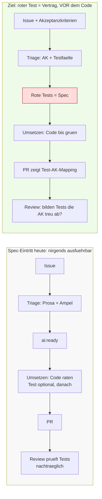

# Strategie: Test-Driven Development für KI-Workflows

> **Status: Stufen 1 + 2 + 3 adoptiert.** Dieses Dokument hält den Plan fest, mit dem die
> KI-Workflows (Triage → Spec → Umsetzung → Review) test-getrieben sind.
> **Stufe 1 (Szenario 1):** Die Triage erzeugt prüfbare Akzeptanzkriterien + Testfälle
> ([ticket-triage.md](ticket-triage.md) Schritt 1/4), die Issue-Templates fragen sie ab.
> **Stufe 2 (Szenario 2):** Die Umsetzung folgt Red-Green, `pnpm test` ist PR-Pflicht, das Review
> macht fehlende/rote Tests zum Gate ([pr-review.md](pr-review.md) Schritt 3/5).
> **Stufe 3 (Szenario 3):** Eigenes Spec-Gate — die Triage setzt `ai:spec-ready` statt `ai:ready`,
> ein eigener Lauf ([ticket-spec.md](ticket-spec.md),
> [spec.yml](../.github/workflows/spec.yml)) schreibt die roten Tests auf einen
> Draft-PR und gibt per `ai:ready` frei; die Umsetzung macht sie grün, ohne sie zu ändern
> (Gewaltenteilung).

## Problem: Die KI „schlingert", weil eine _ausführbare_ Spezifikation fehlt

Die heutige Pipeline erzeugt als Spezifikation **Prosa + Umsetzbarkeits-Ampel** (Triage,
[ticket-triage.md](ticket-triage.md) Schritt 4). Die Umsetzung ([ticket-implementation.md](ticket-implementation.md)
Schritt 3) muss daraus selbst ableiten, was „fertig" bedeutet — und interpretiert das bei jeder
Iteration neu. Es gibt keinen fixen, einklagbaren Vertrag, an dem sich die Umsetzung festhält.

**Leitidee:** Ein **roter Test ist ein einklagbarer Vertrag.** Steht er _vor_ der Implementierung
fest, hat die KI ein binäres Ziel (rot → grün) statt interpretierbarer Prosa — das stoppt das
Schlingern.

## Ausgangslage _vor_ dieser Änderung — zwei Fakten, die zählen

> Dieser Abschnitt beschreibt den Stand **vor** der hier adoptierten TDD-Strategie. Die
> in der Tabelle gelisteten Lücken sind durch die Stufen 1–3 inzwischen geschlossen (siehe
> „Stand jetzt" direkt unter der Tabelle) und dienen nur noch als Begründung/Motivation.

**1. Die Test-Infrastruktur ist für TDD bereits hervorragend geeignet — sie wird nur zu spät genutzt.**

- Server-Logik (`server/src/logics/*.test.ts`, `node:test` + `tsx`, In-Memory-SQLite) und
  Frontend-Lib (`frontend/src/lib/*.test.ts`, Vitest + jsdom) sind **reine, deterministische**
  Funktionen — der ideale TDD-Boden (schnell, isoliert). Beispiele wie `deadlineUrgency` oder
  `buildTaskForest` lesen sich bereits wie test-first geschrieben, nur eben nachträglich.
- Funktionale e2e-Specs (`frontend/e2e/*.spec.ts`, Playwright gegen **echtes** Backend, `:memory:`,
  `workers: 1`) eignen sich als **Akzeptanz**-Spezifikation für Features.
- Schwächer für klassisches Unit-TDD: reines UI/Styling und das generierte `client`-Package
  (keine Tests).
- **Keine Coverage-Messung** konfiguriert (kein c8/nyc, keine Schwelle in `vitest.config.ts` oder
  CI). → Optionaler Hebel, siehe Querschnitts-Politik.

**2. Tests waren bis dahin ein Nachgedanke, kein Ausgangspunkt.**

| Phase          | Datei / Stelle                                                 | Lücke                                                                           |
| -------------- | -------------------------------------------------------------- | ------------------------------------------------------------------------------- |
| Triage         | [ticket-triage.md](ticket-triage.md) Schritt 1 + 4             | Keine **strukturierten** Akzeptanzkriterien / Testfälle als Output.             |
| Issue-Template | `.github/ISSUE_TEMPLATE/*.yml`                                 | Kein Feld „Akzeptanzkriterien / Wie wird verifiziert?".                         |
| Umsetzung      | [ticket-implementation.md](ticket-implementation.md) Schritt 3 | „Umsetzen" erwähnt weder Tests noch test-first; `format`/Lint kommen vor Tests. |
| PR-Template    | `.github/pull_request_template.md`                             | `pnpm test` ist optional („falls zutreffend"), nicht Pflicht.                   |
| Review         | [pr-review.md](pr-review.md) Schritt 3                         | Tests sind ein **Nachprüf**-Punkt, kein Vor-Gate.                               |
| CI             | `.github/workflows/ci.yml`                                     | `pnpm -r test` läuft **nach** Build — kein test-first-Impuls.                   |

**Stand jetzt** (mit dieser Änderung geschlossen — die Tabelle oben ist die Ausgangslage):

- Triage → geschlossen in **Stufe 1** (strukturierte AK + Testfälle).
- Issue-Template → geschlossen in **Stufe 1** (Feld „Akzeptanzkriterien / Wie verifiziert man?").
- Umsetzung → geschlossen in **Stufe 2** (Red-Green: rote Tests zuerst, `format`/Lint danach).
- PR-Template → geschlossen in **Stufe 2** (`pnpm test` ist Pflicht).
- Review → geschlossen in **Stufe 2** (fehlende/rote Tests sind ein Gate, kein bloßer Nachprüf-Punkt).
- CI → weiterhin **offen** (Reihenfolge/Coverage, siehe Querschnitts-Politik und „Offene Entscheidungen").

## Spec-Eintritt: heute vs. Ziel



## Die Szenarien

Drei eskalierende Stufen plus eine Querschnitts-Politik. Es ist eine **Reifeleiter** — jede Stufe
baut auf der vorigen auf, nicht Entweder-oder.

### Szenario 1 — „Akzeptanzkriterien-first" (Spec als strukturierte Prosa) ✅ adoptiert

**Kerngedanke:** Bevor Code angefasst wird, gibt es prüfbare Akzeptanzkriterien (Given/When/Then-Stil),
die 1:1 zu Tests werden können.

**Was sich ändert:**

- [ticket-triage.md](ticket-triage.md) Schritt 1 + 4: Triage formuliert **Akzeptanzkriterien +
  konkrete Testfälle** (welche Datei, welche Assertion) als festen Bestandteil des Analyse-Body-Blocks.
- [ticket-triage.md](ticket-triage.md) Schritt 4: 🟢 setzt zusätzlich voraus, dass die AK **prüfbar**
  formuliert sind (sonst 🟡).
- `.github/ISSUE_TEMPLATE/bug_report.yml` + `feature_request.yml`: Feld „Akzeptanzkriterien / Wie
  verifiziert man die Lösung?".

**Stärke gegen Schlingern:** mittel — klare Zielliste, aber noch Interpretationsspielraum (Prosa).
**Kosten:** niedrig (nur Doku/Templates). **Risiko:** minimal.
**Voraussetzung für alles Weitere** — ohne crisp AK kein sinnvolles test-first.

### Szenario 2 — „Red-Green im Umsetzungs-Schritt" (Spec = Tests, KI schreibt sie zuerst selbst) ✅ adoptiert

**Kerngedanke:** [ticket-implementation.md](ticket-implementation.md) Schritt 3 wird ein echter
Red-Green-Refactor-Loop.

**Was sich ändert:**

- [ticket-implementation.md](ticket-implementation.md) Schritt 3:
  **(a)** rote Tests aus den AK schreiben → als **erster Commit** sichtbar,
  **(b)** Code implementieren, bis Tests grün sind (`pnpm test` als primärer Erfolgsindikator),
  **(c)** erst danach `pnpm format` + Lint.
- `.github/pull_request_template.md`: `pnpm test` wird **Pflicht** (nicht mehr „falls zutreffend"),
  plus Punkt „Tests bilden die Akzeptanzkriterien ab".
- [pr-review.md](pr-review.md) Schritt 3: kein 🟢-Urteil, wenn Tests fehlen oder rot sind.

**Stärke gegen Schlingern:** hoch — binäres Ziel ab Schritt 1.
**Kosten:** mittel (Workflow-Doku + Template). **Risiko:** tautologische Tests (die KI passt Tests
dem Code an statt umgekehrt) — wird durch das Review-Mapping (Test ↔ AK) abgefedert.

### Szenario 3 — „Spec-Gate mit Gewaltenteilung" (Spec = Tests, getrennt erzeugt, _vor_ `ai:ready`) ✅ adoptiert

**Kerngedanke:** Wer die Tests schreibt, schreibt **nicht** den Code. Die roten Tests entstehen in
einem eigenen Schritt vor der Freigabe.

**Was sich ändert:**

- Neues Label **`ai:spec-ready`** zwischen `ai:analyzed` und `ai:ready`: Triage (oder ein
  dedizierter Spec-Lauf) legt **rote Tests mit echten Assertions** an. `ai:ready` erst, wenn die
  roten Tests stehen.
- [ticket-implementation.md](ticket-implementation.md): Die Umsetzung darf die Tests **nicht ändern**,
  nur grün machen (Tests sind der Vertrag).
- Neue/erweiterte GitHub-Action analog `.github/workflows/implement.yml`.

**Stärke gegen Schlingern:** maximal — ausführbarer Vertrag von _anderer_ Instanz als der Code →
keine tautologischen Tests.
**Kosten:** hoch (neuer Workflow + Label + Action). **Risiko:** mehr Pipeline-Komplexität; lohnt vor
allem bei riskanten/logiklastigen Tickets.

### Querschnitts-Politik — „Differenziertes TDD nach Ticket-Typ"

Nicht alles braucht gleich viel Strenge. Diese Politik kombiniert man mit 1–3:

- **Logik/Backend (`server/src/logics`, `frontend/src/lib`):** echtes Red-Green (Sz. 2/3) — billig
  und hochwirksam (reine Funktionen, deterministisch).
- **Feature/UI-Verhalten:** Akzeptanz-**e2e** im Stil von `frontend/e2e/crud.spec.ts` als Spec, kein
  Unit-TDD-Zwang.
- **Reines Styling/Layout:** visuelle Verifikation statt Tests (deckt sich mit dem bestehenden
  e2e-Ansatz).
- **Coverage-Schwelle** nur für `logics`/`lib`, **nicht** repo-weit (Effizienz-Prinzip „gezielt statt
  repo-weit"). **Umgesetzt:** `server/src/logics` via node:test (`test:coverage`, Schwellen 90/85/85,
  CI-Gate). **Vorbereitet:** `frontend/src/lib` in `vitest.config.ts` — Provider
  `@vitest/coverage-v8` installieren, dann `test:coverage`.

## Testumfang — so viel wie nötig, so wenig wie irgend möglich

> **Leitsatz (gilt für Code, Doku und Tests gleichermaßen):** Schreibe nur so viel, wie wirklich
> notwendig ist, und so wenig wie irgend möglich. Jeder Test ist Wartungslast — er muss seinen
> Platz verdienen, nicht bloß Abdeckungs-Statistik erzeugen.

Ein Test darf entstehen, wenn er **mindestens eines** leistet:

1. **Auswertung** — er rechnet etwas aus, das nirgends wörtlich in der Quelle steht: eine Funktion
   gegen echte Eingaben, ein Ausdruck gegen echte Payloads, eine abgeleitete Invariante.
2. **Spiegel** — dieselbe Information steht an mehreren Orten und darf nicht auseinanderdriften.
   Der Sollwert wird dabei **aus der führenden Quelle gelesen**, nie als Literal in den Test
   geschrieben — sonst prüft der Test nur sich selbst.
3. **Schutz** — das Versagen ist nicht rückholbar (Datenverlust, Secret-Leak) oder es fällt nicht
   von selbst auf (grüner Lauf, aber Endlosschleife, verfrühte Freigabe, still übersprungene Suite).

Alles andere bekommt **keinen** Test. Insbesondere nicht der Typ „Datei enthält den String, den ich
hineingeschrieben habe" — er kann per Konstruktion keinen Fehler finden, weil er nichts prüft, was
nicht schon dasteht. Er ist ein Change-Detector: rot, wenn sich etwas ändert, nicht wenn etwas kaputt
ist. Ebenso wenig braucht es einen Test für Fehler, die beim nächsten Lauf ohnehin sofort und laut
krachen (fehlender Build-Step, falscher Host, vergessenes Secret) — dafür ist der Lauf selbst da.

**Zwei Gegenproben, bevor ein Test bleibt:**

- **Mutations-Probe:** Das bewachte Verhalten absichtlich brechen und den Test laufen lassen. Wird er
  nicht rot, ist er wertlos — unabhängig davon, wie plausibel er aussieht.
- **Leerlauf-Probe:** Prüft der Test „für alle X", muss sichergestellt sein, dass überhaupt X
  gefunden werden. Eine kaputte Extraktion ergibt sonst einen dauerhaft grünen Test über eine leere
  Menge. Deshalb gehört zu jedem All-Quantor eine Assertion, dass die Menge nicht leer ist.

**Kanonisches Beispiel im Repo:** `.github/scripts/*.test.ts` (z. B. `analyze-test-suite.test.ts`,
`cost-record.test.ts`) — Contract-Tests für reine, exportierte Funktionen. Jede Assertion fixiert
einen konkreten Anti-Pattern-Fall, sodass Regressionen sofort rot laufen. Die früheren
`.github/workflows/*.test.ts` wurden bewusst entfernt: statische YAML-/Prompt-String-Tests brechen
nicht, wenn das Verhalten kaputtgeht, sondern nur wenn sich der String ändert — sie bestehen die
Mutations-Probe nicht und lieferten keinen echten Schutz.

## Wie konkret das aussieht (an bestehendem Code)

Akzeptanzkriterium aus einem Ticket → roter Test, bevor `buildTaskForest` angefasst wird — exakt im
bestehenden Stil (`server/src/logics/tree.test.ts`):

```typescript
// AK: "Tasks mit Status 'Done' erscheinen nicht im Forest."  → erst rot, dann gruen
it('schließt Done-Tasks aus dem Forest aus', async () => {
	await Task.create({ title: 'Done', priority: 5, estimatedEffort: 1, status: 'Done' });
	const open = await Task.create({ title: 'Open', priority: 3, estimatedEffort: 1 });
	const forest = await buildTaskForest();
	assert.equal(forest.length, 1);
	assert.equal(forest[0].id, open.id);
});
```

Die KI hat damit kein „ungefähr so", sondern ein binäres Ziel — genau das stoppt das Schlingern.

## Vergleich

|           | Spec liegt vor als | Wer schreibt den Test | Anti-Schlinger | Umbau-Kosten |
| --------- | ------------------ | --------------------- | -------------- | ------------ |
| **Sz. 1** | Prosa-AK           | Triage                | mittel         | niedrig      |
| **Sz. 2** | Tests              | Umsetzer (selbst)     | hoch           | mittel       |
| **Sz. 3** | Tests              | getrennte Instanz     | maximal        | hoch         |

## Empfehlung

**Stufenweise einführen, nicht alles auf einmal:**

1. **Jetzt:** Szenario 1 umsetzen (Fundament — billig, niedriges Risiko, schaltet 2 + 3 erst frei).
2. **Danach als Default-Dev-Loop:** Szenario 2.
3. **Selektiv für logiklastige/riskante Tickets:** Szenario 3.
4. **Quer drüber:** die differenzierte Politik, damit UI/Styling nicht unter unnötigem Unit-TDD-Zwang
   leidet.

So entsteht der größte Anti-Schlinger-Effekt früh, ohne die Pipeline auf einen Schlag schwer zu
machen.

## Offene Entscheidungen

- ~~Wie weit gehen (Sz. 1 / 1+2 / 1+2+3)~~ — **alle drei Stufen adoptiert**.
- ~~Coverage-Schwelle einführen — nur für `logics`/`lib`?~~ — umgesetzt: Server-`logics` als CI-Gate;
  Frontend-`lib` vorbereitet (Provider-Install ausstehend).
- ~~Soll Szenario 3 ein eigenes Label (`ai:spec-ready`) + eigene GitHub-Action bekommen, oder reicht
  die Gewaltenteilung innerhalb von `/team*`?~~ — entschieden: **eigenes Label `ai:spec-ready` +
  eigener Workflow `spec.yml`** (separater headless Lauf = Gewaltenteilung auch in der Automatik).
- ~~Verknüpfung in [AGENTS.md](../AGENTS.md) (Wissensbasis-Liste)~~ — mit Stufe 1 erledigt.

## Betroffene Dateien (bei späterer Umsetzung)

| Datei                                                                          | Szenario            |
| ------------------------------------------------------------------------------ | ------------------- |
| `.ai-knowledge/ticket-triage.md` (Schritt 1, 4)                                | 1, 3                |
| `.github/ISSUE_TEMPLATE/bug_report.yml`, `feature_request.yml`                 | 1                   |
| `.ai-knowledge/ticket-implementation.md` (Schritt 3)                           | 2, 3                |
| `.github/pull_request_template.md`                                             | 2                   |
| `.ai-knowledge/pr-review.md` (Schritt 3)                                       | 2                   |
| `.github/workflows/implement.yml` (+ neue Spec-Action)                         | 3                   |
| `frontend/vitest.config.ts`, `server/package.json`, `.github/workflows/ci.yml` | Coverage (optional) |
