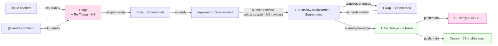

# Workflow-Optimierungsplan (Token & Laufzeit)

> **Ziel:** Token-Verbrauch senken und CI-Laufzeiten kürzen, **ohne** Effektivität/Lösungsstärke
> der KI-Pipeline zu verlieren. Lebendes Dokument — Maßnahmen werden gemessen, umgesetzt und hier
> abgehakt. Später weiter optimieren.
>
> **Herkunft:** Kreuzverhör (Ankläger vs. Verteidiger) über alle `.github/workflows/**` +
> `.ai-knowledge/**`-Prompt-Quellen, adjudiziert per Architect-Cross-Check am 2026-07-07.
>
> **Hinweis:** Abgeschlossene Maßnahmen (✅) sind hier bewusst knapp gehalten — die volle
> Umsetzungs-/Kreuzverhör-Historie steht in den jeweiligen Commits/PRs (`git log`).

## Leitplanken (nicht verhandelbar)

- **Erst messen, dann kürzen.** Ohne Run-Logs sind alle Prozentangaben Größenordnungen. Kalibrier-
  Maßnahmen (Effort, Shard-Zahl) brauchen ein A/B, keinen Blind-Change.
- **Contract-Tests respektieren.** Änderungen an Modell/Effort/Trigger drehen bewusst
  `model-delegation.test.ts` bzw. `pipeline-hardening.test.ts` rot — das ist ein Feature, kein Bug.
  Jede solche Änderung enthält das Test-Update **im selben Schritt** (nie still zurückdrehen).
- **Downstream-Kosten mitrechnen.** Ein gesparter Token an der Wurzel (Triage) kann sich als 4×
  Sonnet-Re-Run downstream rächen. Lokale Ersparnis ≠ Gesamtersparnis.
- **Load-bearing nicht anfassen** (siehe Abschnitt „Tabu-Zone").

## Kostenlandkarte

Zwei echte Hebel: **`max-turns`-Backstop** (Ausreißer-Kappung, ✅ M1) und **E2E-auf-`main`**
(Runtime, offen — M4). Zwei Kalibrier-Kandidaten: **Re-Triage-Effort** (offen — M3) und
**Shard-Zahl** (gemessen — M5, Zahl bestätigt richtig). Topologie seit M8 aktuell: Triage +
Re-Triage sind ein Knoten. **M9 wurde revidiert** (2026-07-08, User-Entscheidung): `implement`
setzt `ai:needs-review` wieder SELBST — nicht mehr über den Autolabeler, damit implement den
Review-Zeitpunkt selbst kontrolliert (s. M9-Abschnitt unten für den vollständigen Verlauf).

---

## Maßnahmen (nach Ertrag/Risiko sortiert)

### Legende

Status: ⬜ offen · 🔬 messen zuerst · 🔒 contract-gated · ✅ erledigt

---

### M1 — `--max-turns`-Runaway-Backstop in alle LLM-Workflows ✅ erledigt (2026-07-07)

Großzügiges `--max-turns` als Backstop gegen entgleiste Läufe (Implement/Fixup: 60, Triage/Spec/
Review: 30) in allen `claude_args`-Blöcken. Additiv, kein Contract-Impact. Werte anhand realer
Turn-Zahlen aus Run-Logs nachschärfen bleibt offen (Optimierungsrunde 2).

---

### M2 — Review-Prompt auf Diff-Scoping seit letztem Review ✅ erledigt (2026-07-07)

Folge-Reviews prüfen nur noch den Diff seit dem letzten eigenen Review-Kommentar (über den
`updatedAt`-Zeitstempel des Sammelkommentars, `git diff` gefiltert) statt jedes Mal den vollen PR.
Erstreview bleibt voll. Marker `<!-- ai-review -->` bewusst unverändert gelassen (Contract in
`ai-review-comment-consolidation.test.ts`).

---

### M3 — Re-Triage `--effort max` → `high` ✅ erledigt (2026-07-08, ohne Live-A/B — User-Freigabe)

**Problem:** Re-Triage läuft (anders als die kontextlose Erst-Triage) immer mit einem Menschen im
Korrektur-Kontext → Grenznutzen von `max` gegenüber `high` plausibel gering. Kein Live-A/B möglich
(User hat den Mess-Gate bewusst übersprungen, gestützt auf die plausible Begründung).

**Umsetzung:** `--effort` verzweigt jetzt per GitHub-Actions-Bedingung im selben `claude_args`-Block
(seit M8 teilen sich Triage/Re-Triage einen Workflow): `--effort ${{ github.event_name ==
'issue_comment' && 'high' || 'max' }}` — Erst-Triage (`issues`) bleibt `max`, Re-Triage
(`issue_comment`) läuft auf `high`. `model-delegation.test.ts` entsprechend umgebaut.

**Ehrlicher Vorbehalt:** Ertrag (~30–40 % Output-Token je Re-Triage) ist eine Schätzung, keine
gemessene Zahl. Rollback trivial (Bedingung durch `'max'` ersetzen), falls Analysequalität leidet.

---

### M4 — E2E-Shards auf `push:main` überspringen 🔬🔒 (Topologie-Weiche — User-Entscheidung, OFFEN)

**Befund:** Deploy gatet NICHT auf main-CI (`deploy.yml` triggert nackt auf `push:main`) → der
4-Shard-E2E auf `main` hat keinen Gate-Wert, nur Kanarienvogel-Wert für die nächste PR-Basis
(~58 % der Pipeline-Laufzeit). Option: auf `push:main` nur `verify` laufen lassen, E2E-Matrix
überspringen — Integrations-Breakage würde erst beim nächsten PR sichtbar.

**Vorher zu klären:** Wie oft läuft main zwischen PR-Branch und Merge auseinander? Soll Deploy
künftig auf grünes main-CI gaten (statt entkoppelt)?

**Contract-Impact:** 🔒 `pipeline-hardening.test.ts` E1 (Shard-Nenner) / E2 (`ready_for_review`).
**→ Separater Reviewer Pflicht (Trigger-Topologie-Änderung).** Einzige noch offene Maßnahme im Plan.

---

### M5 — Shard-Zahl & `--with-deps` kalibrieren ✅ gemessen (2026-07-07), Empfehlung: Zahl behalten

**Messung (4 echte CI-Läufe):** 4 Shards sind klar richtig — 1-Shard-Serialisierung wäre ~2,5×
langsamer (331 s reine Testzeit vs. ~156 s Wall-Clock heute). Entsharden wäre ein Fehltrade.

**Neuer Befund — Shard-Unwucht:** Shard 4 ist in allen Stichproben ~50 s schneller als Shard 2/3
(Playwright verteilt nach Spec-Anzahl, nicht historischer Laufzeit) — das ist die eigentliche
Wall-Clock-Bremse, nicht die Shard-Zahl.

**Noch offen (nicht umgesetzt):**

1. Spec-Dateien nach historischer Laufzeit über die Shards rebalancieren (würde die
   Shard-4-Unwucht kostenlos eliminieren) — Playwright-Sharding-Mechanik muss erst gegen Contract
   E1 geprüft werden.
2. `--with-deps` probeweise entfernen und beobachten, ob `playwright install chromium` auf
   `ubuntu-latest` weiterhin grün bleibt (~60–90 s Compute-Minuten/Lauf Einsparpotenzial).

---

### M6 — `claude-pr-review.yml` `types` → `[labeled]` ✅ erledigt (2026-07-07)

`opened`/`ready_for_review` erzeugten nur übersprungene Jobs (Label noch nicht gesetzt) → Trigger
auf `types: [labeled]` reduziert. Kein Contract fixierte die alten Typen; Übergabekette unverändert
(deckt sich bereits ab über `pr-needs-review-label.yml`).

---

### M7 — Prompt↔`append-system-prompt`-Dopplung & AGENTS.md-Bloat ⚠️ teilweise erledigt (2026-07-08)

Zwei echte, sicherheitsunkritische Dopplungen zwischen `prompt:` und `append-system-prompt`
entfernt (`claude-spec.yml`/`claude-implement.yml`: Freigabe-Floskel; `claude-pr-review.yml`:
Modell-Strategie-Erklärung auf Kurzverweis reduziert). Label-Reihenfolge-/Timeout-Direktiven
(Defense-in-Depth mit dokumentierter Vorfall-Historie) bewusst **unangetastet** gelassen.

**Bewusst NICHT angefasst:** AGENTS.md-Bloat (würde AGENTS.md selbst umstrukturieren — größerer,
riskanterer Eingriff, nicht in dieser Runde) und `claude-pr-fixup.yml` (bereits knappste Fassung).

**Noch offen:** M1/M5-Werte anhand realer Run-Logs nachschärfen (Optimierungsrunde 2, braucht
Produktions-Historie).

---

### M8 — `claude-triage.yml` + `claude-retriage.yml` zu EINEM Workflow zusammengeführt ✅ erledigt (2026-07-08, Kreuzverhör bestanden)

Beide Workflows waren ~95 % identisch (gleiches Modell, Prompt-Kern) — zu einem Workflow mit zwei
`on:`-Triggern (`issues` + `issue_comment: created`) gemerged, `claude-retriage.yml` gelöscht.
Spart weder Tokens noch Laufzeit, aber eliminiert Prompt-Drift zwischen zwei Dateien und macht
M1/M3/M7 an einer statt zwei Stellen umsetzbar. Alle Auth-/Anti-Spam-/Concurrency-Invarianten 1:1
übernommen. Pflicht-Kreuzverhör bestanden (Ankläger-Fund zu App-Token-Scope als adjudizierter,
akzeptierter Trade-off eingestuft — reale Handlungsfähigkeit des LLM unverändert).

---

### M9 — `implement → review` nur noch über `pr-needs-review-label.yml` ⚠️ REVIDIERT (s. M9-Revert)

Ursprünglich umgesetzt (implement setzt `ai:needs-review` nicht mehr selbst, nur noch über den
Autolabeler) und mit Pflicht-Kreuzverhör bestanden — aber vom User direkt widerrufen (s. u.).

#### M9-Revert — `implement` setzt `ai:needs-review` wieder SELBST ✅ erledigt (2026-07-08, Kreuzverhör bestanden)

**Auslöser (User):** `implement` soll den Review-Zeitpunkt selbst kontrollieren, statt dass der
Autolabeler sofort bei `gh pr ready` (potenziell vor vollständiger Beschreibung) auslöst.

**Umsetzung (zwei Dateien, symmetrisch):** `pr-needs-review-label.yml` ignoriert jetzt bot-erzeugte
Ready-Events (Bot-Filter gilt für alle 3 Event-Typen, nicht mehr nur `synchronize`) —
`claude-implement.yml` setzt das Label wieder selbst als allerletzten Schritt. Menschliche
PR-Erstellung/-Freigabe bleibt unverändert sofort gelabelt. Alle Contract-Tests inkl.
Negativkontrolle per Mutationsprobe verifiziert; der ursprüngliche M9-Befund „Single Point of
Failure" ist durch den Revert gegenstandslos (wieder ein expliziter Owner pro Pfad).

---

### M10 — Claude/GLM-Prompt-Dopplung per YAML-Anchor/Alias entfernt ✅ erledigt (2026-07-08, Kreuzverhör bestanden) — **von M11 überholt**

`prompt:`/`claude_args:` waren zwischen Claude- und GLM-Schritt byte-identisch dupliziert (bis
~250 Zeilen/Datei) — durch YAML-Anchor/Alias ersetzt, JSON-Roundtrip-Diff bewies
Verhaltensgleichheit. ~110 Netto-Zeilen gespart. Mit der GLM/Mistral-Entfernung (M11) wieder
zurückgebaut, da nur noch ein Konsument je Feld übrig war.

---

### M11 — GLM- und Mistral-Agentenpfade ersatzlos entfernt ✅ erledigt (2026-07-08, kein Kreuzverhör-Befund — direkte User-Entscheidung)

Direkte User-Anweisung nach M10: GLM/Mistral als CI-Agentenwahl (`AI_AGENT`) ersatzlos entfernt,
Claude Code ist seither der einzige Pfad. **Scope-Abgrenzung wichtig:** betrifft nur die
CI-Agentenwahl, nicht die echte Produktfunktion `server/src/llm/mistral.ts` (Pillar-Advisor/
Task-Klassifikation) — die blieb unangetastet (per Grep-Sweep verifiziert). ~1.000 Netto-Zeilen
über 10 Dateien entfernt, 177 → 158 Contract-Tests (nur GLM-/Mistral-spezifische Tests entfallen).

---

## Tabu-Zone — lösungstragend, NICHT anfassen

- **Opus-max bei der Erst-Triage** — Wurzel des ausführbaren Vertrags (AK+Testfälle), speist Spec →
  Implement → Review → Fixup. Degradation multipliziert sich downstream. Contract-locked
  (`model-delegation.test.ts:35-39, 88-118`).
- **4-Shard-E2E-_Struktur_** (Install/Checkout je Shard) — VM-isoliert wegen `workers:1` + feste
  Ports 3000/4173; Browser-Cache bereits geteilt. Nur die _Zahl_ ist tunable (M5), nicht die Struktur.
- **Sonnet-medium für Spec/Implement/Review/Fixup** mit elastischer `light`(Haiku)/`heavy`(Opus)-
  Delegation — feinkörniger/sparsamer als feste Stufe; Haiku als Startmodell zu schwach fürs
  Kreuzverhör-Gate.
- **Trigger-Breite** (`synchronize`/`labeled`/`ready_for_review`/`workflow_run`) — jeder Typ schließt
  eine als Contract-Test einklagbare Lücke. Doppelläufe bereits abgesichert (`concurrency:
cancel-in-progress`, Draft-Skips, Label-Gating, Stop-Guards).
- **Deterministische gh/Script-Jobs** (Gate-Merge, Conflict-Scan, Issue-Unblock, PR-Cancel,
  needs-review-Label) — 0 Token.

## Vorbehalte / Datenlücken

- Keine Run-Logs eingesehen → alle %-Angaben sind Größenordnungen, keine Messung.
- M3 und M5 sind **Kalibrier**-Maßnahmen: A/B bzw. Job-Zeit-Messung **vor** der Änderung.
- M4 ist eine **Trigger-Topologie**-Änderung → separater Reviewer Pflicht (Hochrisiko-Gate),
  Trennung push-vs-PR-Trigger sauber halten.
- M8 und M9 dienen primär **Wartbarkeit/Robustheit, nicht** direkt dem Token-/Laufzeit-Ziel — senken
  aber Drift.
- **M9 wurde revidiert** (2026-07-08, User-Entscheidung): `implement` setzt `ai:needs-review` wieder
  SELBST (Timing-Kontrolle wichtiger als DRY); `pr-needs-review-label.yml` schließt bot-erzeugte
  Draft→ready-Übergänge jetzt aus (Bot-Filter gilt für alle 3 Event-Typen, nicht mehr nur
  `synchronize`). S. „M9-Revert"-Unterabschnitt für den vollständigen Verlauf.
- **fixup→review** bleibt bewusst am direkten Label (Autolabeler ignoriert Bot-`synchronize`) —
  strukturell jetzt konsistent mit `implement→review` (beide bot-erzeugten Pfade setzen ihr Label
  direkt selbst; der Autolabeler bedient nur noch echte menschliche PR-Events).

## Reihenfolge-Empfehlung

1. ~~**Sofort ohne Risiko:** M1, M2~~ ✅ erledigt.
2. ~~**Messrunde:** M5-Job-Zeiten~~ ✅ gemessen (Zahl bestätigt richtig). ~~M3~~ ✅ erledigt
   (ohne Live-A/B — User hat den Mess-Gate bewusst übersprungen).
3. **Topologie-Weichen (User-Freigabe + separater Reviewer, offen):** M4 — einzige offene
   Maßnahme. ~~M6~~, ~~M8~~, ~~M9~~ ✅ erledigt.
4. ~~**Wartbarkeit:** M10~~ ✅ erledigt; **von M11 überholt** (Anchors zurückgebaut, da GLM/Mistral
   als Alias-Konsument entfallen).
5. ~~**Vereinfachung:** M11~~ ✅ erledigt (User-Entscheidung — GLM/Mistral ersatzlos entfernt,
   ~1.000 Netto-Zeilen über 10 Dateien).
6. ~~**Feinschliff:** M7~~ ⚠️ teilweise erledigt (nur risikoarmer Prompt-Teil; AGENTS.md-Bloat
   bewusst nicht angefasst). M1/M5-Werte anhand realer Logs nachschärfen bleibt offen
   (Optimierungsrunde 2, braucht Produktions-Run-Historie).
