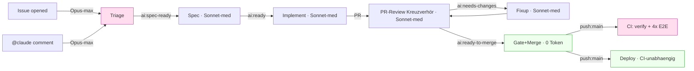

# Workflow-Optimierungsplan (Token & Laufzeit)

> **Ziel:** Token-Verbrauch senken und CI-Laufzeiten kürzen, **ohne** Effektivität/Lösungsstärke
> der KI-Pipeline zu verlieren. Lebendes Dokument — Maßnahmen werden gemessen, umgesetzt und hier
> abgehakt. Später weiter optimieren.
>
> **Herkunft:** Kreuzverhör (Ankläger vs. Verteidiger) über alle `.github/workflows/**` +
> `.ai-knowledge/**`-Prompt-Quellen, adjudiziert per Architect-Cross-Check am 2026-07-07.

## Leitplanken (nicht verhandelbar)

- **Erst messen, dann kürzen.** Ohne Run-Logs sind alle Prozentangaben Größenordnungen. Kalibrier-
  Maßnahmen (Effort, Shard-Zahl) brauchen ein A/B, keinen Blind-Change.
- **Contract-Tests respektieren.** Änderungen an Modell/Effort/Trigger drehen bewusst
  `model-delegation.test.ts` bzw. `pipeline-hardening.test.ts` rot — das ist ein Feature, kein Bug.
  Jede solche Änderung enthält das Test-Update **im selben Schritt** (nie still zurückdrehen).
- **Downstream-Kosten mitrechnen.** Ein gesparter Token an der Wurzel (Triage) kann sich als 4×
  Sonnet-Re-Run downstream rächen. Lokale Ersparnis ≠ Gesamtersparnis.
- **Load-bearing nicht anfassen** (siehe Abschnitt „Tabu-Zone").

## Kostenlandkarte

Zwei echte Hebel: **`max-turns`-Backstop** (Ausreißer-Kappung) und **E2E-auf-`main`** (Runtime).
Zwei Kalibrier-Kandidaten: **Re-Triage-Effort** und **Shard-Zahl** — beide brauchen Messung.

---

## Maßnahmen (nach Ertrag/Risiko sortiert)

### Legende

Status: ⬜ offen · 🔬 messen zuerst · 🔒 contract-gated · ✅ erledigt

---

### M1 — `--max-turns`-Runaway-Backstop in alle LLM-Workflows ⬜ (Sofort, sicher)

**Problem:** Kein `max_turns`/`task_budget` in irgendeinem `claude_args`. Einzige Grenze ist die
Wanduhr `timeout-minutes: 20`. Ein entgleister Lauf (nicht-konvergierender Fixup, `--effort max`
„overthinking") verbrennt bis zur Uhr ungebremst Tokens.

**Fix:** großzügiges `--max-turns` als **Backstop** (nicht als knappe Grenze) je Workflow:

- Implement / Fixup: `--max-turns 60`
- Triage / Re-Triage / Spec / Review: `--max-turns 30`

Werte bewusst hoch — sie kappen nur den pathologischen Fall, ohne die legitime
Grep→Fix→Test→Re-Test-Schleife zu zerschneiden (halbfertiger Commit wäre teurer als der Turn).

**Dateien:** alle `claude_args`-Blöcke in `claude-implement.yml`, `claude-pr-fixup.yml`,
`claude-triage.yml`, `claude-retriage.yml`, `claude-spec.yml`, `claude-pr-review.yml`
(je Claude- und GLM-Pfad).

**Contract-Impact:** keiner (additiv). **Ertrag:** 0 im Normalbetrieb, Ausreißer-Versicherung.
**Nach Umsetzung:** Werte anhand realer Turn-Zahlen aus Run-Logs nachschärfen (Optimierungsrunde 2).

---

### M2 — Review-Prompt auf Diff-Scoping seit letztem Review ⬜ (Sofort, sicher)

**Problem:** `pr-needs-review-label.yml` (`synchronize`) setzt bei **jedem** menschlichen Push die
Review-Labels neu → voller Kreuzverhör-Review (Sonnet) des **gesamten** PR, kein inkrementelles
Scoping. Das ist der wiederkehrende Sonnet-Dauerposten.

**Fix:** Review-Prompt anweisen, bei Folge-Reviews nur den **Diff seit dem letzten eigenen
Review-Kommentar** zu prüfen (Muster analog zu `claude-triage.yml`, das beim Delta-Kommentar
explizit „NICHT den ganzen Thread" liest — beim Review fehlt das Äquivalent). Erstreview bleibt voll.

**Dateien:** `prompt:`-Blöcke in `claude-pr-review.yml`; ggf. Notiz in `.ai-knowledge/pr-review.md`.

**Contract-Impact:** keiner (Prompt-Text). **Ertrag:** Input+Reasoning je Fixup-Push.
**Risiko:** niedrig — Regression-Guard: erster Review muss weiterhin den vollen Diff sehen.

---

### M3 — Re-Triage `--effort max` → `high` 🔬🔒 (Messen, dann mit Test-Update)

**Problem:** Re-Triage (`claude-retriage.yml:183,325`) läuft auf `--effort max`. Anders als die
Erst-Triage ist beim Re-Triage-Auslöser (`@claude`-Kommentar) bereits ein **Mensch mit
Korrektur-Kontext** aktiv → Grenznutzen von `max` gegenüber `high` plausibel gering.

**Erst-Triage bleibt `max`** — sie ist die kontextlose Wurzel, die vier Sonnet-Stufen speist.

**Vorgehen (kein Blind-Change):**

1. A/B an einem Scratch-Issue: Re-Triage-Analyse `max` vs. `high` — Qualität (Ampel, AK-Schärfe)
   und Output-Token vergleichen.
2. Nur bei belegtem Break-even: `--effort high` setzen **und** `model-delegation.test.ts:96`
   (verlangt `/--effort\s+max/`) auf den Re-Triage-Fall anpassen.

**Contract-Impact:** 🔒 `model-delegation.test.ts` (Zeile ~96 `--effort max`; ~112-116 Opus-max in
allen Pfaden). **Ertrag:** ~30-40 % Output-Token je Re-Triage — nur falls A/B es bestätigt.

---

### M4 — E2E-Shards auf `push:main` überspringen 🔬🔒 (Topologie-Weiche — User-Entscheidung)

**Befund (nuanciert):** Gemergt wird per **Merge-Commit** (`claude-pr-gate-merge.yml:338`
`gh pr merge --merge`) → der post-merge-Tree ist **neu** (PR-Head + main-Stand), also kein
identischer Re-Run. ABER:

- Bei weitgehend linearer Historie ist der Tree oft **effektiv identisch**.
- **Deploy gatet NICHT auf main-CI** (`deploy.yml` triggert nackt auf `push:main`, kein
  `needs`/`workflow_run`) → der 4-Shard-E2E auf `main` hat **keinen Gate-Wert**, nur
  Kanarienvogel-Wert für die nächste PR-Basis.

**Option:** auf `push:main` nur `verify` laufen lassen, die E2E-Matrix überspringen (E2E ist lt.
`ci.yml`-Kommentar ~58 % der Pipeline). Integrations-Breakage würde dann erst beim nächsten PR
sichtbar — bewusst zu akzeptierender Trade.

**Vorher zu klären (Entscheidungsvorlage):**

- Wie oft läuft main zwischen PR-Branch und Merge auseinander? (Häufigkeit paralleler PRs)
- Soll Deploy künftig auf grünes main-CI gaten (statt entkoppelt)? — verschiebt den Trade.

**Contract-Impact:** 🔒 `pipeline-hardening.test.ts` E1 (Shard-Nenner) / E2 (`ready_for_review`).
Trennung push-vs-PR-Trigger sauber halten. **Ertrag:** eine volle E2E-Matrix je Merge.
**→ Separater Reviewer Pflicht (Trigger-Topologie-Änderung).**

---

### M5 — Shard-Zahl & `--with-deps` kalibrieren 🔬 (Erst messen)

**Problem:** `shard: [1,2,3,4]` ist nirgends empirisch hergeleitet. Jeder Shard trägt Fixkosten
(Checkout + `pnpm install` + `playwright install --with-deps chromium`). Bei kleiner Netto-Testzeit
übersteigt 4× Fixkosten irgendwann den Parallelitätsgewinn.

**Vorgehen:**

1. Reale Job-Zeiten aus den letzten CI-Läufen ziehen (Netto-Testzeit vs. Setup-Overhead je Shard).
2. Shard-Zahl am Optimum ausrichten (oft 2). **Nenner `--shard=…/N` mitziehen** (`ci.yml:126` +
   `pipeline-hardening.test.ts` E1).
3. Prüfen, ob `--with-deps` auf `ubuntu-latest` nötig ist (Playwright-System-Libs teils vorinstalliert)
   — Weglassen spart den `apt`-Schritt je Shard.

**Contract-Impact:** 🔒 E1 (Matrix-Größe == Nenner). **Ertrag:** weniger Fix-Overhead — ungemessen.

---

### M6 — `claude-pr-review.yml` `types` → `[labeled]` ⬜ (Aufräumen, Topologie-nah)

**Problem:** Trigger `[opened, ready_for_review, labeled]`, aber das Job-`if` verlangt
`ai:needs-review`. Beim `opened`/`ready_for_review`-Event ist das Label noch nicht gesetzt (es setzt
es erst `pr-needs-review-label.yml` → separates `labeled`-Event) → `opened`/`ready_for_review`
erzeugen nur übersprungene Jobs.

**Fix:** `types: [labeled]`. **Vorher:** `pipeline-hardening.test.ts` prüfen, ob es diese Typen
festschreibt. **Contract-Impact:** möglich (Trigger-Topologie). **Ertrag:** 0 Token, weniger
Skip-Jobs/Rauschen.

---

### M7 — Prompt↔`append-system-prompt`-Dopplung & AGENTS.md-Bloat ⬜ (Optional, modest)

**Problem:** Der ~1,9 KB `append-system-prompt` dupliziert großflächig den `prompt:`-Block
(20-Min-Handling, „Labels als ALLERLETZTER Schritt", Modell-Strategie stehen in beiden). AGENTS.md
(~5-6k Token) wird bei jedem Claude-Lauf als Projektkontext injiziert; Analyse-Läufe (Triage) lesen
zusätzlich die volle `.ai-knowledge/*.md`.

**Fix:** Redundanz Prompt↔System-Prompt entschlacken (eine kanonische Stelle); prüfen, ob AGENTS.md
für reine Analyse-Läufe schlanker referenziert werden kann. **Contract-Impact:** Prompt-Text.
**Ertrag:** modest — Prompt-Caching mildert (grob 1× je Lauf, nicht je Turn).

---

## Tabu-Zone — lösungstragend, NICHT anfassen

- **Opus-max bei der Erst-Triage** — Wurzel des ausführbaren Vertrags (AK+Testfälle), speist Spec →
  Implement → Review → Fixup. Degradation multipliziert sich downstream. Contract-locked
  (`model-delegation.test.ts:35-39, 88-118`).
- **4-Shard-E2E-_Struktur_** (Install/Checkout je Shard) — VM-isoliert wegen `workers:1` + feste
  Ports 3000/4173; Browser-Cache bereits geteilt. Nur die _Zahl_ ist tunable (M5), nicht die Struktur.
- **Sonnet-medium für Spec/Implement/Review/Fixup** mit elastischer `light`(Haiku)/`heavy`(Opus)-
  Delegation — feinkörniger/sparsamer als feste Stufe; Haiku als Startmodell zu schwach fürs
  Kreuzverhör-Gate.
- **Trigger-Breite** (`synchronize`/`labeled`/`ready_for_review`/`workflow_run`) — jeder Typ schließt
  eine als Contract-Test einklagbare Lücke. Doppelläufe bereits abgesichert (`concurrency:
cancel-in-progress`, Draft-Skips, Label-Gating, Stop-Guards).
- **Die 3 Agent-Pfade Claude/GLM/Mistral** — nur einer läuft (`if: vars.AI_AGENT`), **kein**
  Laufzeit-Token, nur Wartungs-Bloat (deshalb Contract-Tests).
- **Deterministische gh/Script-Jobs** (Gate-Merge, Conflict-Scan, Issue-Unblock, PR-Cancel,
  needs-review-Label) — 0 Token.

## Vorbehalte / Datenlücken

- Keine Run-Logs eingesehen → alle %-Angaben sind Größenordnungen, keine Messung.
- M3 und M5 sind **Kalibrier**-Maßnahmen: A/B bzw. Job-Zeit-Messung **vor** der Änderung.
- M4 und M6 sind **Trigger-Topologie**-Änderungen → separater Reviewer Pflicht (Hochrisiko-Gate),
  Trennung push-vs-PR-Trigger sauber halten.

## Reihenfolge-Empfehlung

1. **Sofort ohne Risiko:** M1, M2 (additiv/Prompt, kein Contract-Break).
2. **Messrunde:** M3-A/B, M5-Job-Zeiten — Daten sammeln.
3. **Topologie-Weichen (User-Freigabe + separater Reviewer):** M4, M6.
4. **Feinschliff:** M7; M1/M5-Werte anhand realer Logs nachschärfen (Optimierungsrunde 2).
