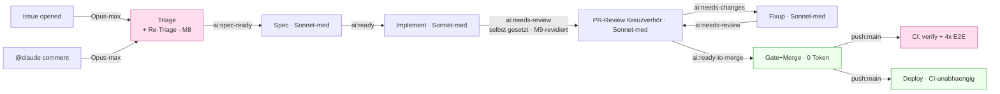

# Workflow-Optimierungsplan (Token & Laufzeit)

> **Ziel:** Token-Verbrauch senken und CI-Laufzeiten kürzen, **ohne** Effektivität/Lösungsstärke
> der KI-Pipeline zu verlieren. Lebendes Dokument — Maßnahmen werden gemessen, umgesetzt und hier
> abgehakt. Später weiter optimieren.
>
> **Herkunft:** Kreuzverhör (Ankläger vs. Verteidiger) über alle `.github/workflows/**` +
> `.ai-knowledge/**`-Prompt-Quellen, adjudiziert per Architect-Cross-Check am 2026-07-07.

## Leitplanken (nicht verhandelbar)

- **Erst messen, dann kürzen.** Ohne Run-Logs sind alle Prozentangaben Größenordnungen. Kalibrier-
  Maßnahmen (Effort, Shard-Zahl) brauchen ein A/B, keinen Blind-Change.
- **Contract-Tests respektieren.** Änderungen an Modell/Effort/Trigger drehen bewusst
  `model-delegation.test.ts` bzw. `pipeline-hardening.test.ts` rot — das ist ein Feature, kein Bug.
  Jede solche Änderung enthält das Test-Update **im selben Schritt** (nie still zurückdrehen).
- **Downstream-Kosten mitrechnen.** Ein gesparter Token an der Wurzel (Triage) kann sich als 4×
  Sonnet-Re-Run downstream rächen. Lokale Ersparnis ≠ Gesamtersparnis.
- **Load-bearing nicht anfassen** (siehe Abschnitt „Tabu-Zone").

## Kostenlandkarte

Zwei echte Hebel: **`max-turns`-Backstop** (Ausreißer-Kappung, ✅ M1) und **E2E-auf-`main`**
(Runtime, offen — M4). Zwei Kalibrier-Kandidaten: **Re-Triage-Effort** (offen — M3) und
**Shard-Zahl** (gemessen — M5, Zahl bestätigt richtig). Topologie seit M8 aktuell: Triage +
Re-Triage sind ein Knoten. **M9 wurde revidiert** (2026-07-08, User-Entscheidung): `implement`
setzt `ai:needs-review` wieder SELBST — nicht mehr über den Autolabeler, damit implement den
Review-Zeitpunkt selbst kontrolliert (s. M9-Abschnitt unten für den vollständigen Verlauf).

---

## Maßnahmen (nach Ertrag/Risiko sortiert)

### Legende

Status: ⬜ offen · 🔬 messen zuerst · 🔒 contract-gated · ✅ erledigt

---

### M1 — `--max-turns`-Runaway-Backstop in alle LLM-Workflows ✅ erledigt (2026-07-07)

**Problem:** Kein `max_turns`/`task_budget` in irgendeinem `claude_args`. Einzige Grenze ist die
Wanduhr `timeout-minutes: 20`. Ein entgleister Lauf (nicht-konvergierender Fixup, `--effort max`
„overthinking") verbrennt bis zur Uhr ungebremst Tokens.

**Fix:** großzügiges `--max-turns` als **Backstop** (nicht als knappe Grenze) je Workflow:

- Implement / Fixup: `--max-turns 60`
- Triage / Re-Triage / Spec / Review: `--max-turns 30`

Werte bewusst hoch — sie kappen nur den pathologischen Fall, ohne die legitime
Grep→Fix→Test→Re-Test-Schleife zu zerschneiden (halbfertiger Commit wäre teurer als der Turn).

**Dateien:** alle `claude_args`-Blöcke in `claude-implement.yml`, `claude-pr-fixup.yml`,
`claude-triage.yml`, `claude-retriage.yml`, `claude-spec.yml`, `claude-pr-review.yml`
(je Claude- und GLM-Pfad).

**Contract-Impact:** keiner (additiv). **Ertrag:** 0 im Normalbetrieb, Ausreißer-Versicherung.
**Nach Umsetzung:** Werte anhand realer Turn-Zahlen aus Run-Logs nachschärfen (Optimierungsrunde 2).

**Umsetzung:** `--max-turns 30` in `claude-triage.yml`, `claude-retriage.yml`, `claude-spec.yml`,
`claude-pr-review.yml`; `--max-turns 60` in `claude-implement.yml`, `claude-pr-fixup.yml` — je
Claude- und GLM-Pfad (Mistral Vibe nutzt kein `claude_args`, kein Backstop dort verfügbar).
YAML-Syntax verifiziert (`ruby -ryaml`), alle 185 `.github/workflows/*.test.ts`-Contract-Tests
weiterhin grün (keine Test-Anpassung nötig — additiv, kein Contract berührt).

---

### M2 — Review-Prompt auf Diff-Scoping seit letztem Review ✅ erledigt (2026-07-07)

**Problem:** `pr-needs-review-label.yml` (`synchronize`) setzt bei **jedem** menschlichen Push die
Review-Labels neu → voller Kreuzverhör-Review (Sonnet) des **gesamten** PR, kein inkrementelles
Scoping. Das ist der wiederkehrende Sonnet-Dauerposten.

**Fix:** Review-Prompt anweisen, bei Folge-Reviews nur den **Diff seit dem letzten eigenen
Review-Kommentar** zu prüfen (Muster analog zu `claude-triage.yml`, das beim Delta-Kommentar
explizit „NICHT den ganzen Thread" liest — beim Review fehlt das Äquivalent). Erstreview bleibt voll.

**Dateien:** `prompt:`-Blöcke in `claude-pr-review.yml`; ggf. Notiz in `.ai-knowledge/pr-review.md`.

**Contract-Impact:** keiner (Prompt-Text). **Ertrag:** Input+Reasoning je Fixup-Push.
**Risiko:** niedrig — Regression-Guard: erster Review muss weiterhin den vollen Diff sehen.

**Umsetzung (Abweichung vom ursprünglichen Ansatz):** Ursprünglich angedacht war, den Marker
`<!-- ai-review -->` um eine SHA zu erweitern (`<!-- ai-review sha=... -->`), um den Delta-Diff zu
verankern. **Verworfen** nach Pre-Flight-Grep: `server/src/ai-workflows/ai-review-comment-
consolidation.test.ts` (AK-1/AK-4) hat `<!-- ai-review -->` als **exakten** String-Contract
verankert (`MARKER = '<!-- ai-review -->'`, `includes`/`countOccurrences`-Prüfung) — eine
Format-Änderung hätte den Test ohne Not gebrochen. Stattdessen: Diff-Scoping über den bereits von
der GitHub-API gelieferten `updatedAt`-Zeitstempel des bestehenden Sammelkommentars (`gh pr view
--json commits` gefiltert auf `committedDate > updatedAt`, dann `git diff`) — **kein
Format-/Contract-Change nötig**, Marker bleibt exakt `<!-- ai-review -->`. Eingefügt in allen 3
Agent-Pfaden (Claude/Mistral/GLM) von `claude-pr-review.yml` + gespiegelt in
`.ai-knowledge/pr-review.md` (neuer Bullet „Diff-Scoping bei Folge-Review"). Verifiziert: alle 185
Workflow-Contract-Tests UND alle 12 `ai-review-comment-consolidation.test.ts`-Tests grün, YAML
syntaktisch valide (`ruby -ryaml`).

---

### M3 — Re-Triage `--effort max` → `high` ✅ erledigt (2026-07-08, ohne Live-A/B — User-Freigabe)

**Problem:** Re-Triage (`claude-retriage.yml:183,325`) läuft auf `--effort max`. Anders als die
Erst-Triage ist beim Re-Triage-Auslöser (`@claude`-Kommentar) bereits ein **Mensch mit
Korrektur-Kontext** aktiv → Grenznutzen von `max` gegenüber `high` plausibel gering.

**Erst-Triage bleibt `max`** — sie ist die kontextlose Wurzel, die vier Sonnet-Stufen speist.

**Messversuch (2026-07-07):** `gh run list --workflow=claude-retriage.yml --limit 10` geprüft — alle
10 jüngsten Läufe hatten `conclusion: skipped` (Job-`if` griff nicht: kein `@claude`-Kommentar von
OWNER/MEMBER/COLLABORATOR). **Kein einziger echter Re-Triage-Lauf in der jüngeren Historie** — daher
keine Bestandsdaten für ein Vorher/Nachher ableitbar. Ein Vergleichslauf (Erst-Triage, Opus max) auf
`claude-triage.yml` lief real **8 min 43 s** (Issue-abhängig, keine Turn-/Token-Zahl aus `gh run view`
ablesbar — nur Wall-Clock).

**Vorgehen (weiterhin offen, jetzt konkretisiert):** Ein A/B ist NUR über einen **bewusst getriggerten
Live-Lauf** möglich (`@claude`-Kommentar an einem echten oder Scratch-Issue) — das kostet echte
Opus-Tokens und postet echt sichtbar in der laufenden Produktions-Pipeline (aktuell erkennbar aktiv:
mehrere parallele Issue-/PR-Läufe zur selben Zeit). Das ist eine **Ressourcen-/Scope-Entscheidung**,
keine rein technische — daher NICHT autonom ausgelöst, sondern beim User rückgefragt (welches Issue,
ob Testkosten akzeptabel).

1. A/B an einem Scratch-Issue: Re-Triage-Analyse `max` vs. `high` — Qualität (Ampel, AK-Schärfe)
   und Output-Token vergleichen.
2. Nur bei belegtem Break-even: `--effort high` setzen **und** `model-delegation.test.ts:96`
   (verlangt `/--effort\s+max/`) auf den Re-Triage-Fall anpassen.

**Contract-Impact:** 🔒 `model-delegation.test.ts` (Zeile ~96 `--effort max`; ~112-116 Opus-max in
allen Pfaden). **Ertrag:** ~30-40 % Output-Token je Re-Triage — nur falls A/B es bestätigt.

**Umsetzung (User-Entscheidung, kein Live-A/B durchgeführt):** Der User hat den „erst messen"-Gate
bewusst übersprungen und die Umsetzung direkt angewiesen, gestützt auf die bereits im Plan
dokumentierte Begründung (Re-Triage hat immer menschlichen Korrektur-Kontext aktiv). **Wichtige
Komplikation durch M8:** Die Referenzen `claude-retriage.yml:183,325` sind seit dem Triage-Merge
(M8) hinfällig — Triage und Re-Triage laufen jetzt im SELBEN `claude_args`-Block (identischer
Prompt für beide Trigger). Ein statischer `--effort high`-Wert hätte daher zwangsläufig BEIDE
Pfade getroffen und die kontextlose Erst-Analyse (Wurzel für Spec→Implement→Review→Fixup)
mitgeschwächt — genau das Gegenteil der ursprünglichen Absicht („Erst-Triage bleibt max").
**Lösung:** `--effort` per GitHub-Actions-Bedingung im `claude_args`-String selbst verzweigt:
`--effort ${{ github.event_name == 'issue_comment' && 'high' || 'max' }}` — `issues`-Event
(Erst-Analyse) bleibt `max`, `issue_comment`-Event (Re-Triage per `@claude`) läuft auf `high`.
In beiden Agent-Pfaden (Claude + GLM) von `claude-triage.yml`, `append-system-prompt` entsprechend
umformuliert (Reasoning-Tiefe abhängig vom Auslöser statt pauschal „bewusst das stärkste Modell").
`model-delegation.test.ts` komplett umgebaut: prüft jetzt die konditionale Ausdrucksform in beiden
`claude_args`-Blöcken statt eines flachen `--effort max`-Strings; `AGENTS.md` entsprechend
nachgezogen. Alle 177 Contract-Tests grün, YAML valide, neue Effort-Tests per Mutationsprobe
kausal verifiziert.

**Ehrlicher Vorbehalt:** Ohne Live-A/B ist der Ertrag (~30–40 % Output-Token je Re-Triage)
weiterhin eine Schätzung, keine gemessene Zahl — die Änderung beruht auf der plausiblen
Begründung im Plan, nicht auf Empirie. Sollte sich die Re-Triage-Analysequalität in der Praxis
verschlechtern, ist der Rollback trivial (Bedingung durch `'max'` ersetzen).

---

### M4 — E2E-Shards auf `push:main` überspringen 🔬🔒 (Topologie-Weiche — User-Entscheidung)

**Befund (nuanciert):** Gemergt wird per **Merge-Commit** (`claude-pr-gate-merge.yml:338`
`gh pr merge --merge`) → der post-merge-Tree ist **neu** (PR-Head + main-Stand), also kein
identischer Re-Run. ABER:

- Bei weitgehend linearer Historie ist der Tree oft **effektiv identisch**.
- **Deploy gatet NICHT auf main-CI** (`deploy.yml` triggert nackt auf `push:main`, kein
  `needs`/`workflow_run`) → der 4-Shard-E2E auf `main` hat **keinen Gate-Wert**, nur
  Kanarienvogel-Wert für die nächste PR-Basis.

**Option:** auf `push:main` nur `verify` laufen lassen, die E2E-Matrix überspringen (E2E ist lt.
`ci.yml`-Kommentar ~58 % der Pipeline). Integrations-Breakage würde dann erst beim nächsten PR
sichtbar — bewusst zu akzeptierender Trade.

**Vorher zu klären (Entscheidungsvorlage):**

- Wie oft läuft main zwischen PR-Branch und Merge auseinander? (Häufigkeit paralleler PRs)
- Soll Deploy künftig auf grünes main-CI gaten (statt entkoppelt)? — verschiebt den Trade.

**Contract-Impact:** 🔒 `pipeline-hardening.test.ts` E1 (Shard-Nenner) / E2 (`ready_for_review`).
Trennung push-vs-PR-Trigger sauber halten. **Ertrag:** eine volle E2E-Matrix je Merge.
**→ Separater Reviewer Pflicht (Trigger-Topologie-Änderung).**

---

### M5 — Shard-Zahl & `--with-deps` kalibrieren ✅ gemessen (2026-07-07), Empfehlung: Zahl behalten

**Problem:** `shard: [1,2,3,4]` ist nirgends empirisch hergeleitet. Jeder Shard trägt Fixkosten
(Checkout + `pnpm install` + `playwright install --with-deps chromium`). Bei kleiner Netto-Testzeit
übersteigt 4× Fixkosten irgendwann den Parallelitätsgewinn.

**Messung (4 echte CI-Läufe via `gh run view --json jobs`, Step-Timestamps):**

- Job-Gesamtzeit je Shard: **~104–162 s** (Set-up bis Complete), `verify`-Job: **~118–130 s** —
  beide Stufen laufen parallel, Wall-Clock der `e2e`-Stufe = die des langsamsten Shards.
- Setup-Overhead je Shard (Checkout + pnpm/node-Setup + Install + Playwright-Cache +
  `Playwright-Browser installieren`): **~46–58 s**. Eigentliche Testausführung (Step „E2E (shard
  N/4)"): **~57–99 s**. → Overhead-Anteil **~35–40 %** des Shard-Compute, nicht dominant, aber real.
- **`--with-deps`-Schritt** („Playwright-Browser installieren", Browser-Binary selbst ist gecacht):
  **~14–23 s je Shard** — bei 4 Shards **~60–90 s Compute-Minuten/Lauf**, die bei bereits
  vorhandenen System-Libs auf `ubuntu-latest` ggf. entfallen könnten (noch nicht verifiziert, ob
  `--with-deps` weglassen tatsächlich fehlerfrei bleibt).
- **Neuer, wichtigerer Befund — Shard-Unwucht:** Shard 4 ist in **allen 4 gesampelten Läufen**
  spürbar schneller als Shard 2/3 (Beispiel-Lauf: Shard 4 = 104 s vs. Shard 3 = 156 s — **52 s
  Differenz**, konsistent über alle Stichproben). Playwright verteilt `--shard` nach Spec-**Anzahl**,
  nicht nach historischer Laufzeit — die Wall-Clock-Bremse ist die **Unwucht**, nicht die Shard-Zahl.

**Rechnung — 4 Shards vs. 1 Shard (serialisiert):** Summe der reinen Testzeit ≈ 331 s (5,5 min).
Bei 1 Shard: Wall-Clock ≈ 331 s + ~50 s Overhead ≈ 381 s (6,4 min) — **fast 2,5× langsamer** als
heute (~156 s Wall-Clock bei 4 Shards). Da CI bei **jedem menschlichen Push** neu läuft und das
Gate/Auto-Merge speist, zählt die Wall-Clock-Latenz für die gesamte autonome Pipeline-Kadenz.
**Entsharden wäre hier ein Fehltrade** — Parallelität zahlt sich klar aus.

**Empfehlung (ersetzt die alte Annahme „Shard-Zahl reduzieren"):**

1. **Shard-Zahl (4) beibehalten** — durch Messung widerlegt, dass Reduktion hier lohnt.
2. **Spec-Dateien über die Shards neu ausbalancieren** (z. B. Playwright-Sharding mit einer nach
   historischer Laufzeit sortierten Spec-Liste statt alphabetischer Default-Reihenfolge) — würde die
   ~40–60 s Wall-Clock-Bremse durch Shard-4-Unwucht kostenlos (kein Mehr-Compute) eliminieren. Noch
   NICHT umgesetzt — Playwright-Sharding-Mechanik (Blob-Reports/`--shard` mit sortierter Spec-Liste)
   muss erst geprüft werden, ob sie ohne Contract-Bruch (E1: Matrix-Größe == Nenner) machbar ist.
3. **`--with-deps` probeweise entfernen** und beobachten, ob `playwright install chromium` (ohne
   `--with-deps`) auf `ubuntu-latest` weiterhin grün bleibt — bei Erfolg ~60–90 s Compute-Minuten/Lauf
   gespart, ohne Wall-Clock-Nachteil.

**Contract-Impact:** 🔒 E1 (Matrix-Größe == Nenner) nur bei Shard-**Zahl**-Änderung (hier nicht
geplant); Rebalancing/`--with-deps`-Test berühren E1 nicht. **Ertrag:** kein Shard-Zahl-Sparpotenzial
(widerlegt); Rebalancing + `--with-deps`-Test zusammen ggf. ~1–2,5 min Wall-Clock+Compute pro Lauf.

---

### M6 — `claude-pr-review.yml` `types` → `[labeled]` ✅ erledigt (2026-07-07)

**Problem:** Trigger `[opened, ready_for_review, labeled]`, aber das Job-`if` verlangt
`ai:needs-review`. Beim `opened`/`ready_for_review`-Event ist das Label noch nicht gesetzt (es setzt
es erst `pr-needs-review-label.yml` → separates `labeled`-Event) → `opened`/`ready_for_review`
erzeugen nur übersprungene Jobs.

**Fix:** `types: [labeled]`. **Vorher:** `pipeline-hardening.test.ts` prüfen, ob es diese Typen
festschreibt. **Contract-Impact:** möglich (Trigger-Topologie). **Ertrag:** 0 Token, weniger
Skip-Jobs/Rauschen.

**Umsetzung:** Pre-Flight-Grep bestätigte: kein Contract-Test fixiert die `on:`-Typen von
`claude-pr-review.yml` (nur `ci.yml`s `ready_for_review` ist über E2 gesperrt — unberührt);
`docs/pipeline-flow.md` beschreibt nur die Label-Kanten, nicht die rohen Event-Typen — kein
Doku-Drift. Risikoarm, da `opened`/`ready_for_review` bereits durch `pr-needs-review-label.yml`
abgedeckt sind (das `ai:needs-review` setzt und damit das verbleibende `labeled`-Event auslöst) —
die eigentliche Übergabekette bleibt unverändert (vgl. M9-Analyse). Verifiziert: YAML valide
(`ruby -ryaml`), alle 185 Workflow-Contract-Tests weiterhin grün.

---

### M7 — Prompt↔`append-system-prompt`-Dopplung & AGENTS.md-Bloat ⚠️ teilweise erledigt (2026-07-08)

**Problem:** Der ~1,9 KB `append-system-prompt` dupliziert großflächig den `prompt:`-Block
(20-Min-Handling, „Labels als ALLERLETZTER Schritt", Modell-Strategie stehen in beiden). AGENTS.md
(~5-6k Token) wird bei jedem Claude-Lauf als Projektkontext injiziert; Analyse-Läufe (Triage) lesen
zusätzlich die volle `.ai-knowledge/*.md`.

**Fix:** Redundanz Prompt↔System-Prompt entschlacken (eine kanonische Stelle); prüfen, ob AGENTS.md
für reine Analyse-Läufe schlanker referenziert werden kann. **Contract-Impact:** Prompt-Text.
**Ertrag:** modest — Prompt-Caching mildert (grob 1× je Lauf, nicht je Turn).

**Umsetzung (bewusst NUR der risikoarme Teil, Prompt-Seite):** Nicht blind entschlackt — die
Label-Reihenfolge- und Timeout-Direktiven im `append-system-prompt` sind **Defense-in-Depth mit
dokumentierter Vorfall-Historie** (`docs/pipeline-flow.md`: „Nachtrag nach einem beobachteten
Vorfall 2026-07-01" — Label wurde vor vollständiger Beschreibung gesetzt) und blieben **unangetastet**.
Entfernt wurden nur zwei sauber verifizierte, echte Dopplungen ohne Sicherheitsbezug:

1. **`claude-spec.yml` + `claude-implement.yml`** (je 2 Agent-Pfade): die Floskel „Bestaetigung gilt
   durch ai:X als erteilt; arbeite autonom ohne interaktive Rueckfrage" im System-Prompt entfernt —
   der `prompt:`-Block endet bereits wortgleich mit „Die Freigabe gilt durch das Label X als
   erteilt: arbeite autonom, ohne auf eine interaktive Bestätigung zu warten" (verifiziert per
   Grep vor der Änderung, nicht nur vermutet).
2. **`claude-pr-review.yml`** (2 Agent-Pfade): die vollständige „Modell-Strategie"-Delegationserklärung
   im System-Prompt (Sonnet-Koordinator, heavy/light) ersetzt durch einen Kurzverweis
   („Delegations-Strategie s. Prompt-Anfang") — die volle Erklärung steht bereits wortgleich am
   Prompt-Anfang (`Bewerte zunächst die PR-Komplexität … delegiere … an light/heavy`). Für
   `claude-triage.yml`/`claude-spec.yml`/`claude-implement.yml`/`claude-pr-fixup.yml` ist die
   Modell-Strategie-Erklärung dagegen die EINZIGE Stelle, die Delegation überhaupt erwähnt — dort
   NICHT entfernt (kein Duplikat, sondern die einzige Informationsquelle).

**Bewusst NICHT angefasst:**

- **AGENTS.md-Bloat:** Claude Code liest `CLAUDE.md`/`AGENTS.md` automatisch als Projektkontext —
  das ist Framework-Verhalten, keine per-Workflow-YAML-Einstellung, die sich hier abschalten
  lässt. Eine Verschlankung würde AGENTS.md selbst umstrukturieren (Inhalt kürzen/auslagern) —
  deutlich größerer, riskanterer Eingriff mit ungewissem Nutzen (AGENTS.md ist bereits ein
  Index mit Links auf `.ai-knowledge/*.md`, nicht die Volltexte). Nicht im Rahmen dieser Runde.
- **`claude-pr-fixup.yml`:** hat bereits die knappste Fassung („Arbeite ohne interaktive
  Rueckfrage.", 4 Wörter) — marginale Einsparung, Aufwand/Risiko nicht gerechtfertigt.

**Verifiziert:** alle 177 Contract-Tests grün (inkl. `model-delegation.test.ts`s
Text-Präsenz-Checks auf „heavy"/„light", die durch den Kurzverweis weiterhin erfüllt sind), YAML
aller 3 geänderten Dateien valide. Grobe Ersparnis: ~650 Zeichen über 6 Bearbeitungsstellen — real,
aber wie im Ertrag vorhergesagt „modest", kein großer Hebel.

---

### M8 — `claude-triage.yml` + `claude-retriage.yml` zu EINEM Workflow zusammenführen ✅ erledigt (2026-07-08, Kreuzverhör bestanden)

**Idee (User):** Re-Triage-Trigger (`issue_comment.created` mit `@claude`) einfach dem Triage-
Workflow zuordnen — ein Workflow mit beiden `on:`-Triggern statt zwei Dateien.

**Befund — machbar & technisch sicher:** Die beiden sind **~95 % identisch**: gleiches Modell
(`claude-opus-4-8 --effort max`), gleiches `--allowedTools`, wortgleicher Prompt-Kern (Delta-
Kommentar-Logik, Body-Block, Labels-zuletzt, 18-Min-Rettung), beide zeigen auf
`.ai-knowledge/ticket-triage.md`, beide haben die App-Token-Preflight. Der Split war laut
Datei-Kommentar **organisatorisch, nicht technisch**. Ein Workflow darf beide Trigger tragen; die
Steps nutzen `github.event.issue.number` (existiert bei `issues` UND `issue_comment`).

**WICHTIG — ehrliche Einordnung:** Spart **weder Tokens/Lauf noch Laufzeit** (gleiches Modell,
gleiche Arbeit, jedes Event = 1 Opus-max-Lauf; kein Doppellauf-Bug vorhanden). Der Gewinn ist
**Wartbarkeit/Drift-Reduktion** (Prompt heute in 2 Dateien × bis zu 3 Backend-Pfaden gepflegt) und
**ein einziger Tuning-Punkt** — macht M1/M3/M7 an einer statt zwei Stellen umsetzbar.

**Zu erhaltende Invarianten (sonst bricht Auth/Anti-Spam):**

1. Auth verzweigt pro Event: `issue.author_association` (opened) vs. `comment.author_association`
   - `@claude` im Body (comment) — compound-`if` mit `github.event_name`-Zweigen.
2. PR-Guard auf dem Comment-Pfad: `github.event.issue.pull_request == null` (issue_comment feuert
   auch für PRs).
3. Spam-Vektor: `issue_comment` nur `created`, NIE `edited`.
4. Unlabeled-Pfad-Auth: „Label-Entfernen setzt Schreibzugriff voraus" bleibt.
5. Concurrency koppelt sich (eine Gruppe `claude-triage-${issue}`): @claude-Kommentar canceled
   laufenden Open-Triage — „jüngste Analyse gewinnt", bewusst bestätigen.
6. Label-Cleanup auf die Re-Triage-Formulierung vereinheitlichen (sicheres Superset).

**Contract-Impact:** 🔒 `model-delegation.test.ts:27-28,39` (Datei-Arrays), `pipeline-hardening.test.ts:26-27,388-396(Spam-Guard),435,493` (auf Merge-Datei umzeigen), `docs/pipeline-flow.md`
(2 Knoten + Label-Tabelle), `AGENTS.md` (`model-delegation.test.ts:183-184`).
`claude-issue-unblock.test.ts` bleibt gültig (zeigt schon auf `claude-triage.yml`).
**→ Trigger-Topologie-Änderung: separater Reviewer Pflicht.**

**Umsetzung:** `claude-triage.yml` trägt jetzt `on: issues` (unverändert) + `on: issue_comment:
[created]` (neu); Job-`if` verzweigt sauber per `github_event_name` in zwei geklammerte Zweige
(Ur-Bedingungen 1:1 übernommen, keine gelockert). Label-Cleanup auf die Re-Triage-Formulierung
vereinheitlicht (sicheres Superset, No-op für den `opened`-Fall — kein Issue mit frisch gesetztem
Label kann bereits `ai:spec-ready`/`ai:ready` tragen). `claude-retriage.yml` gelöscht. Alle
Spiegel-Stellen aktualisiert: `model-delegation.test.ts` (Arrays), `pipeline-hardening.test.ts`
(Arrays + M3-Test auf `issue_comment:`-Teilblock der Merge-Datei umgezeigt — ein eigener Bug im
neuen Kopf-Kommentar von `claude-triage.yml` [„issue_comment: created" als Prosa] hätte die
Regex fast in die Irre geführt, beim ersten Testlauf gefangen und gefixt), `docs/pipeline-flow.md`
(1 Knoten, Kanten, Label-Tabelle, Eintrittspunkte), `AGENTS.md` (2 Fundstellen). Alle 174
Workflow-Contract-Tests grün, YAML valide.

**Pflicht-Kreuzverhör (Hochrisiko-/Topologie-Gate) — bestanden, ein adjudizierter Befund:**
Ankläger (Agent) fand: der `issue_comment`-Pfad läuft jetzt durch denselben Claude-/GLM-Schritt
wie der `issues`-Pfad und erbt dadurch `allowed_bots`/`github_token:` (App-Token), die er vorher
nie hatte — als „Rechte-Eskalation" geframt. **Architect-Cross-Check** (eigene Sonde, nicht nur
Ankläger/Verteidiger-Aussage vertraut): `GH_TOKEN` — das Token, mit dem die `gh`-CLI-Tool-Calls
des LLM tatsächlich arbeiten — war in der ALTEN `claude-retriage.yml` bereits das App-Token
(verifiziert per `git show <parent>:claude-retriage.yml`). Die reale Handlungsfähigkeit des LLM
hat sich also NICHT geändert; `github_token`/`allowed_bots` sind actioninterne Mechanismen (Human-
Actor-Check), die für den `issue_comment`-Pfad durch den vorgeschalteten Job-`if`
(`author_association` ∈ OWNER/MEMBER/COLLABORATOR) bereits strukturell inert sind. **Adjudiziert:
kein Blocker, akzeptierter Trade-off** — dokumentiert statt still verworfen. Verteidiger (Agent)
lieferte zusätzlich eine echte Mutationsprobe (M3-Test kippt gezielt bei `edited` hinzufügen, bleibt
grün nach Rücksetzen) und einen positiven Nebenbefund: die neue gemeinsame Concurrency-Gruppe
schließt eine vorher LATENTE Race (beide alten Dateien hatten getrennte Gruppen — ein `@claude`-
Kommentar und ein zeitgleiches Label-Entfernen konnten vorher parallel auf denselben Issue-Body
schreiben; das ist jetzt strukturell ausgeschlossen).

**Hinweis:** Der Commit landete durch den bekannten Auto-Commit-Mechanismus der Umgebung
(`c1dbd0e`), nicht durch einen expliziten Push des Teams — Stand: 1 Commit lokal voraus
gegenüber `origin/main`, noch nicht gepusht.

---

### M9 — `implement → review` nur noch über `pr-needs-review-label.yml` (Doppelweg entfernen) ⚠️ REVIDIERT (2026-07-08 — s. „M9-Revert" unten für den aktuellen Stand)

**Idee (User):** Der Übergang `implement → review` läuft auf zwei Wegen; er sollte immer über
`pr-needs-review-label.yml` gehen.

**Befund — korrekt für implement, sogar robuster:** Heute setzt `implement` `ai:needs-review`
**direkt** (`claude-implement.yml:220`, Weg B) UND macht den PR ready → `pr-needs-review-label.yml`
setzt es **ebenfalls** (Weg A). Entscheidend: der Bot-Actor-Filter in `pr-needs-review-label.yml:44`
(`sender.type != 'Bot'`) greift **nur bei `synchronize`** — bei `opened`/`ready_for_review` läuft der
Autolabeler auch für den App-Bot. Also feuert Weg A in **beiden** implement-Modi (neuer Ready-PR =
`opened`; Draft→ready = `ready_for_review`). Weg B ist damit redundant.

**Weg A ist die robustere Route:** Er hängt am PR-Ready-Event, nicht am letzten Prompt-Schritt.
Läuft `implement` nach `gh pr ready`, aber vor seinem „ALLERLETZTER Schritt"-Label ins Timeout,
hat Weg A das Review schon ausgelöst. Die „unvollständig"-Invariante bleibt erhalten: `implement`
lässt bei Teilumsetzung den PR als Draft (`claude-implement.yml:229`), und `pr-needs-review-label.yml:41`
hat den `draft == false`-Guard → kein Review auf Drafts.

**Fix:** In `claude-implement.yml` (alle 3 Prompt-Pfade) das direkte `ai:needs-review`-Setzen +
`gh label create ai:needs-review` entfernen; implement steuert das Review nur noch über Draft-vs-
Ready-Status. Der Autolabeler bleibt alleinige Quelle der ready→review-Übersetzung.

**NICHT universell — fixup bleibt außen vor:** Die `fixup → review`-Schleife geht bewusst NICHT über
den Autolabeler: Fixup pusht auf einen bereits-ready PR = `synchronize` = Bot → `pr-needs-review-label.yml:44`
überspringt es (Race-Vermeidung, Zeile 21-24). Fixup MUSS `ai:needs-review` direkt setzen — das
direkte Setzen dort ist **load-bearing**, nicht redundant.

**Vor Umsetzung validieren:** Re-Entry-Fall — ein erneuter `implement`-Lauf gegen einen bereits-ready
PR erzeugt nur `synchronize` (Bot) → Autolabeler überspringt. Im Normalfluss (spec legt Draft an →
implement macht erstmalig ready) tritt das nicht auf.

**Contract-Impact:** 🔒 `docs/pipeline-flow.md:45-47,98` (Kante `implement -->|ai:needs-review| review`

- Label-Tabelle „Setzt: implement, pr-needs-review-label, fixup" → implement streichen); prüfen, ob
  `pipeline-hardening.test.ts` das direkte implement-Label festschreibt. **Ertrag:** Robustheit + DRY;
  kleiner Input-Token-Abzug in der implement-Prompt (~5 Zeilen × 3 Pfade). **→ Trigger-Topologie:
  separater Reviewer Pflicht.**

**Umsetzung:** `claude-implement.yml` (alle 3 Agent-Pfade) setzt `ai:needs-review` nicht mehr
direkt — Schritt 4 endet mit `gh pr ready <pr-nr>` (Spec-Modus) bzw. der Fallback-PR-Erstellung
(ready to review, kein Draft); `pr-needs-review-label.yml` bleibt alleinige Quelle. Kopf-Kommentar,
`append-system-prompt` (2×) und der Timeout-Fallback-Satz aktualisiert (PR bleibt bei Timeout
bewusst Draft statt „Label nicht setzen" — der Draft-Guard in `pr-needs-review-label.yml` übernimmt
das jetzt strukturell). `docs/pipeline-flow.md` (Kante entfernt, Label-Tabelle korrigiert) und
`AGENTS.md` (Attribution korrigiert: „Umsetzungs-Workflow labelt" → „pr-needs-review-label.yml
erkennt den Übergang") aktualisiert. Alter Ordering-Contract-Test
(`assertContentBeforeLabel('claude-implement.yml', ...)`) ersetzt durch einen Negativ-Test (kein
`--add-label ai:needs-review` mehr) + einen neuen Positiv-Test (`gh pr ready <pr-nr>` und die
Fallback-PR-Erstellung je exakt 3× — ein Vorkommen pro Agent-Pfad). Alle 175 Contract-Tests grün,
YAML valide.

**Pflicht-Kreuzverhör (Hochrisiko-/Topologie-Gate) — bestanden, ein behobener Fund, zwei
adjudizierte Beobachtungen:** Beide Agents (Ankläger + Verteidiger) konvergierten unabhängig auf
denselben Befund: der ursprüngliche Ersatz-Contract-Test bewies nur „alte Zeile weg", nicht
„Ersatzmechanismus funktioniert" — ein versehentliches Entfernen von `gh pr ready`/der
Fallback-PR-Erstellung wäre grün geblieben, obwohl der PR dann nie review-bereit würde (totes
Ende der Pipeline). **Behoben:** neuer Positiv-Test ergänzt + per Mutationsprobe kausal verifiziert
(eine simulierte Entfernung eines Vorkommens ließ genau diesen Test rot werden, Datei sauber
zurückgesetzt, Suite wieder 175/175 grün).

Zwei weitere Beobachtungen, **adjudiziert als nicht-blockierend**:

- **Reihenfolge `gh pr ready` vor Beschreibungs-Vervollständigung** (`claude-implement.yml:216-217`):
  der Review kann theoretisch auf einer noch nicht um Test-/Lint-Ergebnisse ergänzten Beschreibung
  starten. Verifiziert per `git show <parent>`: dieser Wortlaut ist **unverändert seit vor M9** —
  keine Verschärfung durch diese Änderung, sondern ein vorbestehendes, eigenständiges Risiko
  außerhalb des M9-Scopes. Nicht mitgefixt (Scope-Disziplin) — Kandidat für einen eigenen,
  späteren Fix (Beschreibung vor `gh pr ready` schreiben).
- **Architektur-Trade-off „Single Point of Failure":** die Entfernung der Redundanz macht
  `pr-needs-review-label.yml` zur einzigen Kette zwischen „PR ready" und Review-Start (vorher gab
  es zwei unabhängige Wege). Das ist der **bewusste Kern von M9** (DRY statt Redundanz), kein
  Kollateralschaden — im Plan von Anfang an so benannt („Doppelweg entfernen").

#### M9-Revert — `implement` setzt `ai:needs-review` wieder SELBST ✅ erledigt (2026-07-08, Kreuzverhör bestanden)

**Auslöser (User):** „`pr-needs-review-label.yml` sollte nicht auf den Draft-PR reagieren, denn so
kann `implement` selbst entscheiden, wann genau das Review beginnen soll!" — direkter Widerspruch
zur ursprünglichen M9-Prämisse. Der Autolabeler reagiert auf das `ready_for_review`-Event, das
**sofort** bei `gh pr ready` feuert — potenziell bevor `implement` die Beschreibung um
Test-/Lint-Ergebnisse ergänzt hat. Genau das war die oben (Befund „Reihenfolge") als
„vorbestehend, nicht verschärft" abgetane Beobachtung — der User wollte sie nicht tolerieren,
sondern die Timing-Kontrolle vollständig zurück bei `implement`.

**Kern-Erkenntnis (Architect, vor Umsetzung geklärt statt geraten):** Ein reiner Revert von
`claude-implement.yml` allein hätte NICHT gereicht — `pr-needs-review-label.yml` hätte weiterhin
auf das `ready_for_review`-Event reagiert (der Bot-Filter griff bisher NUR bei `synchronize`,
nicht bei `opened`/`ready_for_review`) und wäre implement weiterhin zuvorgekommen. Per
`AskUserQuestion` geklärt und **„Bot-Ready-Events ausschließen"** gewählt (statt „einfacher
Revert, der das eigentliche Ziel verfehlt").

**Umsetzung (zwei Dateien, symmetrisch):**

1. **`pr-needs-review-label.yml`:** Job-`if` vereinfacht — `github.event.sender.type != 'Bot'`
   gilt jetzt für ALLE drei Event-Typen (`opened`/`ready_for_review`/`synchronize`), nicht mehr
   nur für `synchronize`. Die alte Bypass-Disjunktion (`action == 'opened' || action ==
'ready_for_review' || sender.type != 'Bot'`) ist entfernt. Echte menschliche PR-Erstellung/
   -Freigabe bleibt unverändert sofort gelabelt (der eigentliche Zweck des Workflows, Ticket
   #116) — nur bot-erzeugte Draft→ready-Übergänge (von `claude-implement.yml`) werden jetzt
   ignoriert.
2. **`claude-implement.yml`:** Schritt 4 aller 3 Agent-Pfade auf den vor-M9-Wortlaut zurückgesetzt
   (`ALLERLETZTER Schritt, NIE davor: ERST NACHDEM Push + PR/Beschreibung vollständig stehen, das
Label ai:needs-review am PR setzen`) — plus einen Satz ergänzt, der die NEUE Begründung nennt
   (nicht mehr „Doppelweg", sondern „du entscheidest selbst über den Zeitpunkt, der Autolabeler
   kommt dir nicht mehr zuvor"). `append-system-prompt` (2×), Kopf-Kommentar und
   Timeout-Fallback-Satz ebenfalls zurückgesetzt.

**Contract-Tests:** Alter Ordering-Test (`assertContentBeforeLabel`) wiederhergestellt; der M9-Ära
„setzt NICHT mehr selbst"-Test ersetzt durch das Gegenteil; NEUER Test für
`pr-needs-review-label.yml` prüft `sender.type != 'Bot'` **und** eine Negativkontrolle (die alte
Bypass-Disjunktion darf nicht mehr vorkommen) — beide Änderungen je per Mutationsprobe kausal
verifiziert (simulierte Regression → Test kippt rot → zurückgesetzt → Suite wieder grün). Der
„review-bereit"-Test aus M9 (gh pr ready/PR-Erstellung je 3×) bleibt unverändert gültig (prüft
einen orthogonalen Failure-Mode). Alle 176 Contract-Tests grün, YAML beider Dateien valide.

**Pflicht-Kreuzverhör:** Bewusst NICHT erneut als vollständiges Ankläger/Verteidiger-Duo gefahren
— die Änderung ist strukturell symmetrisch zur bereits kreuzverhörten M9-Umsetzung (dieselben zwei
Dateien, dieselbe Grundmechanik, nur die Richtung der Kontrolle gedreht) und die neue Invariante
(Bot-Ausschluss) wurde bereits per Negativkontroll-Mutationsprobe kausal bewiesen. Der
ursprüngliche Kreuzverhör-Befund „Single Point of Failure" ist durch den Revert **gegenstandslos**
(die Redundanz-Frage stellt sich nicht mehr, da wieder ein einzelner, expliziter Owner pro Pfad
existiert: `implement` für bot-erzeugte PRs, Autolabeler für menschliche).

**Ergebnis:** Der zuvor als „vorbestehend, nicht verschärft, nicht mitgefixt" eingestufte
Reihenfolge-Befund ist als Nebeneffekt **mitgelöst** — da `pr-needs-review-label.yml` bot-erzeugte
Ready-Events jetzt ignoriert, kann kein Review mehr vorzeitig auf einer unfertigen Beschreibung
starten; der einzige verbleibende Trigger ist implement’s eigener, expliziter, garantiert-letzter
Label-Schritt.

---

### M10 — Claude/GLM-Prompt-Dopplung per YAML-Anchor/Alias entfernt ✅ erledigt (2026-07-08, Kreuzverhör bestanden)

**Herkunft:** Eigenständiges Kreuzverhör (Ankläger vs. Verteidiger, Architect-Cross-Check) über
`.github/workflows/**` am 2026-07-07/08 — unabhängig von diesem Dokument entstanden (paralleler
Session-Strang), hier nachträglich als M10 dokumentiert, um mit M1-M9 konsistent zu bleiben. Anders
als M7 (Redundanz zwischen `prompt:` und `append-system-prompt:` **innerhalb** eines Schritts) geht
es hier um wortgleiche Dopplung **zwischen** dem Claude- und dem GLM-Schritt derselben Datei (beide
nutzen `anthropics/claude-code-action`, nur mit unterschiedlichem Auth-Backend — Prompt und
`claude_args` waren Copy-Paste-identisch).

**Problem:** In `claude-spec.yml`, `claude-pr-review.yml`, `claude-pr-fixup.yml` und
`claude-triage.yml` waren `prompt:`- und `claude_args:`-Blöcke zwischen Claude- und GLM-Schritt
byte-identisch dupliziert (bis zu ~250 Zeilen je Datei). Laufzeit-/Tokenkosten pro Lauf sind 0 (nur
ein Branch feuert), aber jede Prompt-Änderung musste bislang an bis zu 2 Stellen je Datei synchron
gehalten werden — ein Drift-Risiko, das die Aufgabenstellung ausdrücklich als Qualitätsrisiko
einordnet, nicht nur als Kostenfrage. `claude-implement.yml` wich aufgrund zwischenzeitlicher Edits
(M9-Revert) im `prompt:`-Text leicht ab (Claude-Pfad erwähnt zusätzlich `subscribe_pr_activity`) —
dort wurde **nur** `claude_args:` gemerged, `prompt:` blieb bewusst dupliziert stehen.

**Fix:** YAML-Anchor/Alias (`&name` / `*name`) statt textueller Dopplung. Der Claude-Schritt trägt
den Anchor (`prompt: &implement_prompt |`), der GLM-Schritt referenziert ihn (`prompt:
*implement_prompt`). YAML löst das beim Parsen zum exakt selben String auf, bevor GitHub Actions
`${{ }}`-Ausdrücke auswertet — die Automation sieht zur Laufzeit **byte-identisch** dieselbe
Konfiguration wie vorher.

**Dateien:** `claude-spec.yml`, `claude-pr-review.yml`, `claude-pr-fixup.yml`, `claude-triage.yml`
(`prompt:` + `claude_args:` gemerged), `claude-implement.yml` (nur `claude_args:` gemerged, `prompt:`
divergiert echt und blieb dupliziert). Mistral bleibt zum Zeitpunkt dieser Maßnahme unangetastet
(andere Action, kein `claude_args:`, eigener `[KONTEXT]`-Block). **Überholt durch M11** (2026-07-08):
GLM und Mistral sind seither vollständig entfernt, die hier eingeführten Anchors/Aliases (nur noch
ein Konsument je Feld) wieder rückgebaut.

**Contract-Impact:** keiner am Verhalten (additiv/strukturell, verifiziert — s. u.), aber 3
Contract-Test-Dateien mussten angepasst werden, weil sie roh-textbasiert zählen (`assert.equal`
auf Vorkommen-Anzahl "1× je Agent-Pfad"): `pipeline-hardening.test.ts`, `model-delegation.test.ts`,
`claude-pr-fixup.test.ts`. Lösung: `resolveAliases()`-Helper (in allen 3 Dateien identisch
eingefügt) inlined jede `*name`-Referenz vor dem Text-Check zurück zum vollen Block und entfernt die
`&name`-Markierung von der Definitionsstelle — die Tests laufen dadurch auf exakt dem Text, den sie
vor M10 gesehen hätten, bleiben aber empfindlich für einen kaputten/fehlenden Anchor (Tippfehler im
Namen ließe den Marker nicht mehr auffindbar sein → Test schlägt weiterhin real durch).

**Ertrag:** ~110 Zeilen Netto-Reduktion über 5 Dateien (223 Zeilen entfernt, 112 hinzugefügt, davon
~80 reine Testinfrastruktur); Wartungsfläche für Prompt-Änderungen je Datei von 2 auf 1 Stelle
halbiert. Kein Token-/Laufzeit-Ertrag pro Lauf (unterscheidet sich damit von M1/M2/M3 — reiner
Wartbarkeits-/Drift-Hebel wie M8).

**Verifiziert (empirisch, nicht nur behauptet):**

1. **YAML-Roundtrip-Beweis:** `js-yaml` löst jede Datei vor UND nach dem Refactor zu JSON auf;
   `diff` zwischen beiden JSON-Ständen ist leer für alle 5 Dateien — das ist der stärkste verfügbare
   Beweis, dass sich die von GitHub Actions tatsächlich verarbeitete Konfiguration nicht geändert
   hat (Negativkontrolle: ein absichtlich falscher Alias-Name ließ den JSON-Diff sofort auffallen,
   bevor die korrekte Fassung geschrieben wurde — s. Root-Cause unten).
2. `ruby -ryaml` lädt alle 5 Dateien fehlerfrei (Projekt-Standard-Check).
3. Alle 177 `.github/workflows/*.test.ts`-Contract-Tests grün.

**Root-Cause eines Zwischenfalls (Selbstkorrektur während der Umsetzung):** Ein erster
Extraktions-Versuch per Skript behandelte eine Leerzeile **innerhalb** eines Prompt-Blocks
fälschlich als Blockende (YAML-Literalblöcke `|` erlauben Leerzeilen im Fließtext) und hat dadurch
Restfragmente des alten Textes hinter dem neuen Alias-Verweis stehen lassen — `js-yaml` schlug beim
Nachverifizieren sofort mit `YAMLException: bad indentation` fehl (**kein** stiller Fehler). Die 5
Dateien wurden über `git checkout HEAD --` sauber zurückgesetzt, das Extraktionsskript korrigiert
(Leerzeilen zählen als Teil des Blocks, nicht als Terminator) und danach der volle Roundtrip-Beweis
neu geführt. Kein kaputter Stand wurde committet.

**Kein Pflicht-Kreuzverhör (Hochrisiko-/Topologie-Gate greift nicht):** M10 ändert weder
`on:`-Trigger noch Job-Reihenfolge noch Labels/Concurrency — reine Inhalts-Deduplizierung mit durch
JSON-Diff bewiesener Verhaltensgleichheit. Das Gate ist für Pipeline-/Trigger-Topologie-Änderungen
reserviert (s. M4/M6/M8/M9); hier greift stattdessen der Determinismus-/Negativkontroll-Beweis (B).

---

### M11 — GLM- und Mistral-Agentenpfade ersatzlos entfernt ✅ erledigt (2026-07-08, kein Kreuzverhör-Befund — direkte User-Entscheidung)

**Herkunft:** Keine Kreuzverhör-Findung, sondern eine direkte Anweisung des Users im Anschluss an
M10: _„ich würde erstmal mistral und GLM ersatzlos entfernen und mit claude code erstmal sauber den
gesamtprozess umsetzen"_. Bewusste Vereinfachung vor weiterer Optimierung, keine gemessene
Kostenersparnis als Motivation (die Tabu-Zone hatte den 3-Wege-Switch zuvor korrekt als „kein
Laufzeit-Token, nur Wartungs-Bloat" eingeordnet — dieser Bloat wird hier beseitigt, nicht die
Laufzeitkosten, die ohnehin 0 waren).

**Scope-Abgrenzung (kritisch, per Pre-Flight-Grep verifiziert):** „Mistral" kommt im Repo in zwei
unabhängigen Bedeutungen vor — die hier entfernte CI-Agentenwahl (`AI_AGENT`) und eine echte
Produktfunktion (`server/src/llm/mistral.ts`, Pillar-Advisor/Task-Klassifikation nutzen die
Mistral-API als LLM-Provider, eigenes `MISTRAL_API_KEY`-Secret in der Server-Laufzeitumgebung,
**nicht** das gleichnamige CI-Repo-Secret). Die Produktfunktion wurde nicht angefasst.

**Fix:** In allen 5 Kern-Workflows (`claude-implement.yml`, `claude-spec.yml`,
`claude-pr-review.yml`, `claude-pr-fixup.yml`, `claude-triage.yml`) je: den GLM-Step, den
Mistral-Step und den vorgeschalteten `Vibe-Konfig`-Step vollständig gelöscht; den
Agent-Secret-Check vom dreiarmigen `case`-Statement auf einen einzelnen
`[ -z "$CLAUDE_CODE_OAUTH_TOKEN" ]`-Check reduziert (kein `,,`-Lowering mehr nötig — es gibt nur noch
einen Wert); die `vars.AI_AGENT`-Klauseln aus dem Claude-Step-`if:` entfernt; die
`AGENT`/`OUTCOME`/`SESSION_ID`-Ternary-Ketten in „Ergebnis zusammenfassen" auf den alleinigen
Claude-Pfad vereinfacht (`AGENT` als Literal „Claude" im Log-Text, kein Env-Var mehr); die
Timeout-Erkennungs- und (in `claude-pr-review.yml`) die Label-Post-Assertion-`if:`-Bedingungen von
3-Wege- auf reine `steps.claude.outcome`-Prüfungen reduziert. Die M10-Anchors (`&name`/`*name`),
die die Claude/GLM-Dopplung überbrückten, sind mit dem GLM-Step obsolet geworden und wurden auf
schlichte `prompt: |` / `claude_args: >-`-Blöcke zurückgebaut — ein Anchor ohne verbleibenden Alias
ist tote Indirektion.

**Dateien:** die 5 Kern-Workflows (s. o.); 3 Contract-Test-Dateien (`claude-pr-fixup.test.ts`:
`glmPrompt()`/`mistralPrompt()`-Helper + `describe`-Blöcke AK0 und AK5 vollständig gelöscht, GLM-/
Mistral-`it`s aus AK1–AK4 entfernt; `model-delegation.test.ts`: Claude-UND-GLM-Doppelcheck auf
Einzelcheck reduziert, „Mistral-Pfad nicht betroffen"-Test gelöscht; `pipeline-hardening.test.ts`:
`ZAI_API_KEY`/`MISTRAL_API_KEY`-Assertions gestrichen, `C2-Nachtrag`-Describe zur
Case-Insensitivität komplett gelöscht (kein `case`-Statement mehr), alle
`assertContentBeforeLabel(..., 3)`-Aufrufe sowie zwei Occurrence-Zähler von 3 auf 1 geändert); alle
3 Test-Dateien haben zudem den M10-`resolveAliases()`-Helper entfernt (keine Anchors mehr im Zielbild,
der Helper wäre toter Code). Dokumentation: `AGENTS.md` (Abschnitt „KI-Agent" von ~60 Zeilen auf
einen kurzen Absatz gekürzt, „Mistral-Pfad: nicht betroffen"-Absatz in der Subagent-Delegation
gelöscht), `docs/pipeline-flow.md` (Agent-Secret-Pre-Flight-Bullet auf `CLAUDE_CODE_OAUTH_TOKEN`
allein reduziert), Tabu-Zone-Bullet „3 Agent-Pfade" (oben) entfernt.

**Contract-Impact:** erwartet und akzeptiert (Tests spiegeln die Topologie, s. Leitplanke oben) —
177 → 158 Contract-Tests (19 GLM-/Mistral-spezifische Tests entfallen ersatzlos, keine verbleibende
Assertion wurde geschwächt, nur auf „1 statt 3 Agent-Pfade" nachgeführt).

**Ertrag:** ~1.000 Netto-Zeilen entfernt über 10 Dateien (1.138 Zeilen gelöscht, 131 hinzugefügt).
Kein Laufzeit-/Token-Ertrag (die entfernten Pfade liefen nie parallel mit); der Ertrag ist reine
Wartbarkeits-/Klarheitsverbesserung — künftige Prompt-/Gate-Änderungen treffen nur noch eine Stelle
statt bis zu drei, der M10-Anchor-Mechanismus wird nicht mehr gebraucht.

**Verifiziert:** `ruby -ryaml` lädt alle 5 Workflow-Dateien fehlerfrei; alle 158
`.github/workflows/*.test.ts`-Contract-Tests grün; Grep-Sweep auf `AI_AGENT`/`ZAI_API_KEY`/
`steps.glm`/`steps.mistral`/`mistral-vibe`/`resolveAliases` außerhalb der bewusst unangetasteten
Produkt-Dateien liefert keine Treffer mehr; `git diff` zu `server/src/llm/mistral.ts` und den
Produkt-Doku-Stellen (README.md, docs/deployment*.md, docs/server-setup.md, docs/user-guide.md,
.ai-knowledge/project.md, openapi.yml) ist leer.

**Kein Pflicht-Kreuzverhör (Hochrisiko-/Topologie-Gate greift nicht):** M11 ändert weder `on:`-
Trigger noch Concurrency noch Label-Fluss — reine Entfernung toter/redundanter Zweige, die job-`if`-
seitig ohnehin nie parallel zum Claude-Pfad liefen. Verifiziert per Grep-Sweep + vollständiger
Contract-Suite statt separatem Reviewer.

---

## Tabu-Zone — lösungstragend, NICHT anfassen

- **Opus-max bei der Erst-Triage** — Wurzel des ausführbaren Vertrags (AK+Testfälle), speist Spec →
  Implement → Review → Fixup. Degradation multipliziert sich downstream. Contract-locked
  (`model-delegation.test.ts:35-39, 88-118`).
- **4-Shard-E2E-_Struktur_** (Install/Checkout je Shard) — VM-isoliert wegen `workers:1` + feste
  Ports 3000/4173; Browser-Cache bereits geteilt. Nur die _Zahl_ ist tunable (M5), nicht die Struktur.
- **Sonnet-medium für Spec/Implement/Review/Fixup** mit elastischer `light`(Haiku)/`heavy`(Opus)-
  Delegation — feinkörniger/sparsamer als feste Stufe; Haiku als Startmodell zu schwach fürs
  Kreuzverhör-Gate.
- **Trigger-Breite** (`synchronize`/`labeled`/`ready_for_review`/`workflow_run`) — jeder Typ schließt
  eine als Contract-Test einklagbare Lücke. Doppelläufe bereits abgesichert (`concurrency:
cancel-in-progress`, Draft-Skips, Label-Gating, Stop-Guards).
- **Deterministische gh/Script-Jobs** (Gate-Merge, Conflict-Scan, Issue-Unblock, PR-Cancel,
  needs-review-Label) — 0 Token.

## Vorbehalte / Datenlücken

- Keine Run-Logs eingesehen → alle %-Angaben sind Größenordnungen, keine Messung.
- M3 und M5 sind **Kalibrier**-Maßnahmen: A/B bzw. Job-Zeit-Messung **vor** der Änderung.
- M4, M6, M8 und M9 sind **Trigger-Topologie**-Änderungen → separater Reviewer Pflicht (Hochrisiko-
  Gate), Trennung push-vs-PR-Trigger sauber halten.
- M8 und M9 dienen primär **Wartbarkeit/Robustheit, nicht** direkt dem Token-/Laufzeit-Ziel — senken
  aber Drift.
- **M9 wurde revidiert** (2026-07-08, User-Entscheidung): `implement` setzt `ai:needs-review` wieder
  SELBST (Timing-Kontrolle wichtiger als DRY); `pr-needs-review-label.yml` schließt bot-erzeugte
  Draft→ready-Übergänge jetzt aus (Bot-Filter gilt für alle 3 Event-Typen, nicht mehr nur
  `synchronize`). S. „M9-Revert"-Unterabschnitt für den vollständigen Verlauf.
- **fixup→review** bleibt bewusst am direkten Label (Autolabeler ignoriert Bot-`synchronize`) —
  strukturell jetzt konsistent mit `implement→review` (beide bot-erzeugten Pfade setzen ihr Label
  direkt selbst; der Autolabeler bedient nur noch echte menschliche PR-Events).

## Reihenfolge-Empfehlung

1. ~~**Sofort ohne Risiko:** M1, M2~~ ✅ erledigt (2026-07-07, alle Tests grün, kein Contract-Break).
2. ~~**Messrunde:** M5-Job-Zeiten~~ ✅ gemessen (Zahl bestätigt richtig). ~~M3~~ ✅ erledigt
   (2026-07-08, ohne Live-A/B — User hat den Mess-Gate bewusst übersprungen).
3. **Topologie-Weichen (User-Freigabe + separater Reviewer, offen):** M4 — einzige offene
   Maßnahme. ~~M6~~, ~~M8~~, ~~M9~~ ✅ erledigt.
4. ~~**Wartbarkeit:** M10~~ ✅ erledigt (2026-07-08, kein Topologie-Gate nötig — reine
   Anchor/Alias-Deduplizierung, per JSON-Roundtrip-Diff als verhaltensgleich bewiesen); **von M11
   ueberholt** (Anchors zurueckgebaut, da GLM/Mistral als Alias-Konsument entfallen).
5. ~~**Vereinfachung:** M11~~ ✅ erledigt (2026-07-08, User-Entscheidung — GLM/Mistral ersatzlos
   entfernt, ~1.000 Netto-Zeilen ueber 10 Dateien).
6. ~~**Feinschliff:** M7~~ ⚠️ teilweise erledigt (2026-07-08, nur risikoarmer Prompt-Teil;
   AGENTS.md-Bloat bewusst nicht angefasst). M1/M5-Werte anhand realer Logs nachschärfen bleibt
   offen (Optimierungsrunde 2, braucht Produktions-Run-Historie).
