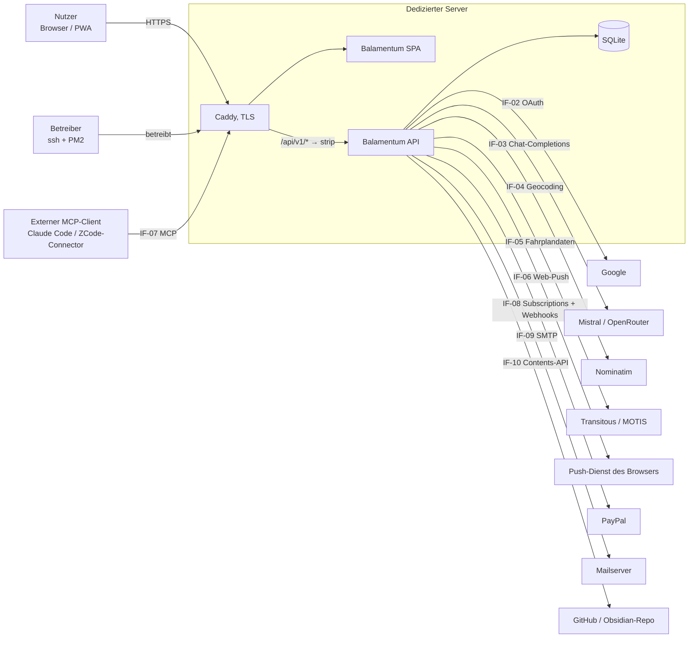
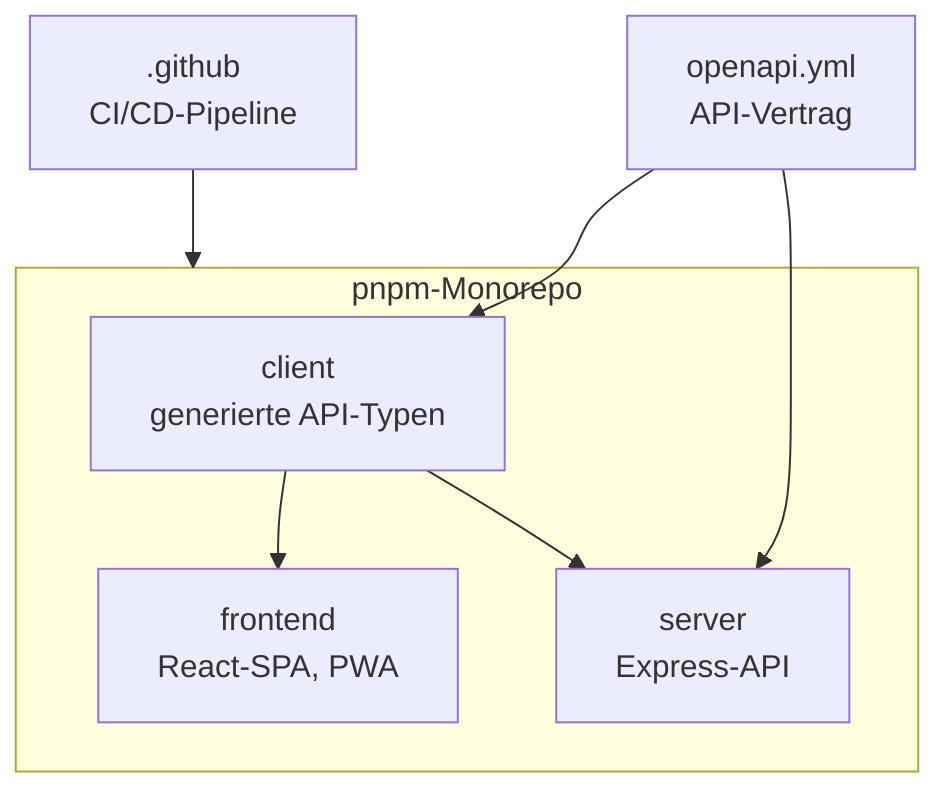
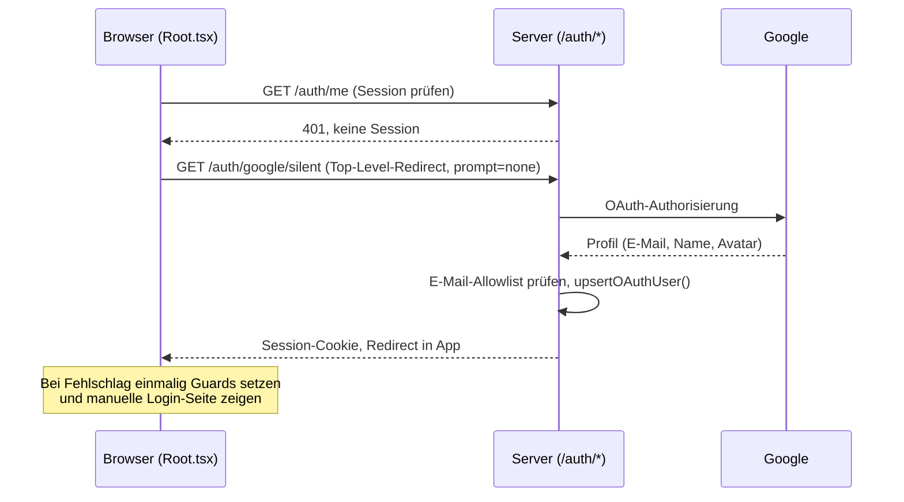
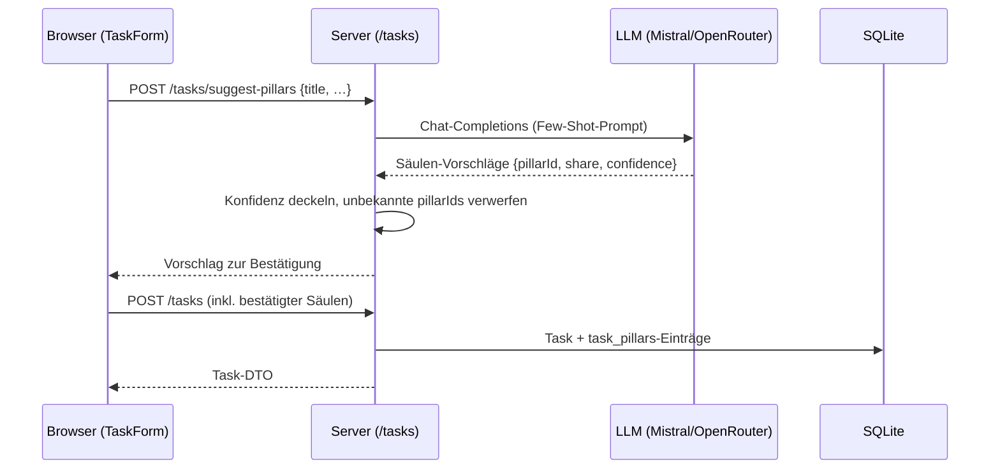
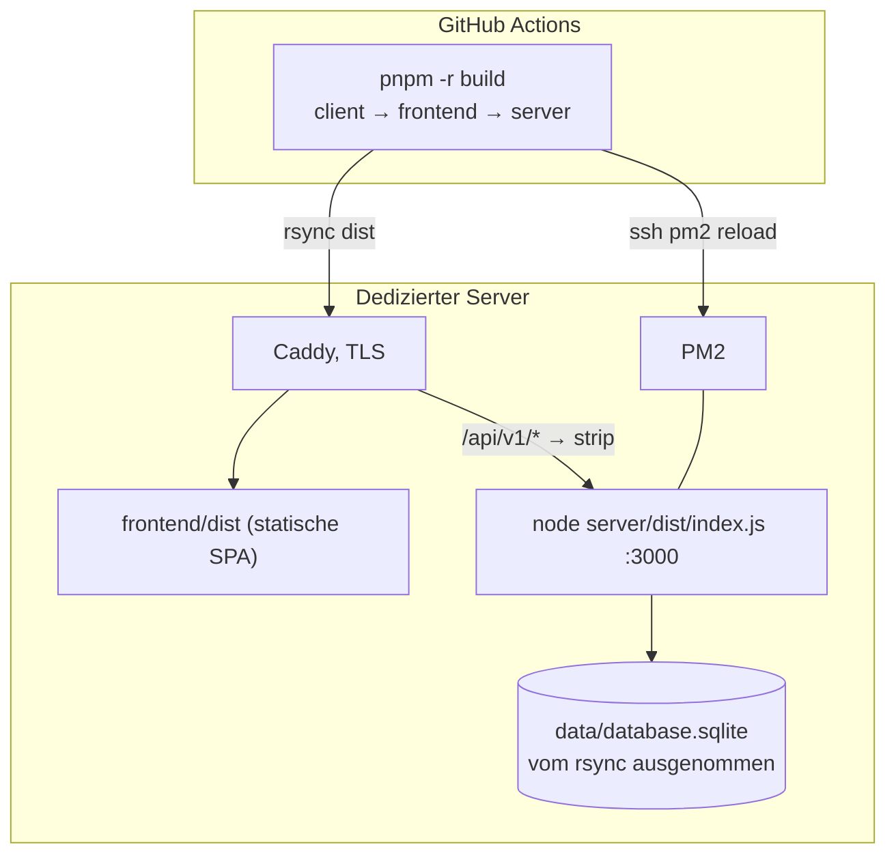

# Balamentum — Architekturübersicht (arc42)

Diese Datei beschreibt den Ist-Zustand des Monorepos aus Entwicklersicht. Operating Details
(Rollout-Abfolge, Server-Setup) bleiben [deployment.md](deployment.md) und
[server-setup.md](server-setup.md) überlassen; Entscheidungen werden in [docs/adr/](adr/) begründet.

## 1. Einführung und Ziele

Balamentum ist eine Web-Anwendung zur persönlichen Aufgabenorganisation: Aufgaben (Tasks)
mit Abhängigkeiten, Deadlines und Prioritäten, Lebensbalance-Säulen mit Gewichtung und
Punkte-Konto (Gamification), wiederkehrende Aufgaben (Serien), Gruppen mit geteilten Tasks und
Serien, ortsbezogene Aufgaben („Nearby"), ÖPNV-Verbindungen (Bahn-Seite), KI-Unterstützung
(Säulen-Klassifikation, Freitext-Parsing, Aktivitäten-Berater, Lektorat) sowie ein
Paketmodell mit PayPal-Abos (Free-/Pro-/Max-/Ultimate-Stufen). Erinnerungen gehen als
Web-Push oder E-Mail raus.

Das Repository ist ein pnpm-Monorepo mit drei Workspaces ([pnpm-workspace.yaml](../pnpm-workspace.yaml)):

- `client/` — aus `openapi.yml` generierte API-Typen, Build-Zeit-Abhängigkeit von Frontend und Server
- `frontend/` — React-SPA als installierbare PWA
- `server/` — Node.js-API-Server (Express) mit SQLite-Persistenz

### 1.1 Aufgabenverteilung (Entwicklung)

Jeder Beitrag läuft als Pull Request über die label-getriebene KI-Pipeline in GitHub Actions
(Triage, UX, Spec, Umsetzung, Review, Documenter; siehe [pipeline-flow.md](pipeline-flow.md)).
Menschliche Autorinnen und Autoren nutzen denselben PR-Weg; `main` ist der einzige langlebige Branch.

### 1.2 Qualitätsziele

| Priorität | Qualitätsziel | Szenario-Motiv                                                                                                                     |
| --------- | ------------- | ---------------------------------------------------------------------------------------------------------------------------------- |
| hoch      | #flexible     | Entkopplung, Wartbarkeit, Änderbarkeit: Bausteine mit klarer Abhängigkeitsrichtung, ein Muster je Problem, jede Zeile Wartungslast |
| hoch      | #secure       | Nur eingeloggte, auf der E-Mail-Allowlist stehende Nutzer erreichen die fachlichen Endpunkte                                       |
| hoch      | #usable       | Bedienung mobil-first über zugängliche KoliBri-Komponenten                                                                         |
| hoch      | #suitable     | Kernfachlichkeit: Tasks, Säulen, Serien, Gruppen bilden die vollständige Domäne ab (Server-Routen + `openapi.yml`)                 |
| mittel    | #efficient    | Skalierbarkeit: Antwortzeiten und Ressourcen wachsen mit Nutzern und Daten kontrolliert, nicht sprunghaft                          |
| mittel    | #reliable     | Server bricht bei unbehebbaren Fehlern kontrolliert ab statt in undefiniertem Zustand weiterzulaufen                               |
| mittel    | #operable     | Release ist ein reproduzierbarer Merge-Build mit `rsync` und `pm2 reload`                                                          |

Diese Tabelle ist der Maßstab, nach dem das tägliche Code-Review-Team
([`code-review-team`](../.claude/skills/code-review-team/SKILL.md)) den Wert seiner Findings gewichtet;
Ziele gleicher Priorität sind gleichrangig.
Messbare Schwellen aus dem Code (Testabdeckung, Rate-Limits) sind in Abschnitt 10 beschrieben; für
`#efficient` fehlt dort noch ein nachprüfbares Szenario.

## 2. Rahmenbedingungen

- **Laufzeit:** Node.js 26 (`.nvmrc`), pnpm als Paketmanager, TypeScript `strict`, ESM überall
  ([AGENTS.md](../AGENTS.md), [project.md](../.ai-knowledge/project.md)).
- **Lizenz:** EUPL-1.2 (Root-`package.json`).
- **UI-Vorgabe:** KoliBri-Web-Components (`@public-ui/*`) bevorzugt; eigenes Styling nur, wenn keine
  KoliBri-Komponente passt (Shadow-DOM-CSS gilt als unpublizierte API).
- **Mobile-First:** Die Bedienung zielt auf das Smartphone; Regeln in
  [mobile-ui-rules.md](mobile-ui-rules.md).
- **Externe Verträge:** Google-OAuth-Credentials (ENV), Nominatim-Nutzungsbedingungen
  (Rate-Limit 1 req/s, geteilter Limiter in `server/src/express/routes/geocodeRateLimit.ts`),
  Transitous/MOTIS-API (CORS erzwingt den Server-Proxy, `server/src/express/routes/transit.ts`),
  Web-Push mit eigenen VAPID-Keys, SMTP-Versand (`SMTP_*`/`MAIL_FROM`), PayPal-API für Abos
  und Webhooks (`PAYPAL_*`), GitHub-Contents-API für Feedback-Ablage
  (`FEEDBACK_GITHUB_TOKEN`, `server/src/logics/obsidianFeedback.ts`).
- **Organisatorisch:** Die KI-Pipeline in `.github/workflows/` orchestriert Ticket-Arbeit; ihre
  Ausgaben leben im Harness-Kommentar des Issues bzw. als Workflow-Artefakt (ADR 0009, ADR 0010).

## 3. Kontextabgrenzung

| ID    | Schnittstelle            | Teilnehmer                    | Bemerkung                                                                                                                                                           |
| ----- | ------------------------ | ----------------------------- | ------------------------------------------------------------------------------------------------------------------------------------------------------------------- |
| IF-01 | REST-API (`openapi.yml`) | Frontend ↔ Server             | Vertrag mit generierten Typen (`client/`, `server/src/api.d.ts`); Caddy bzw. Vite-Proxy streifen `/api/v1` ab                                                       |
| IF-02 | Google OAuth 2.0         | Server ↔ Google               | `passport-google-oauth20`, Login und stiller Login (`/auth/google`, `/auth/google/silent`)                                                                          |
| IF-03 | LLM-Chat-Completions     | Server ↔ Mistral / OpenRouter | `server/src/llm/llm.ts`; Provider in der DB (`llm_providers`, instanzweit oder je Nutzer, Auswahl je User), Fix-Provider Mistral über `MISTRAL_API_KEY`             |
| IF-04 | Geocoding                | Server ↔ Nominatim            | Forward- und Reverse-Geocoding, `server/src/logics/nominatim.ts`                                                                                                    |
| IF-05 | Fahrplandaten            | Server ↔ Transitous           | reiner CORS-Proxy unter `/api/transit/*`, ohne Auth                                                                                                                 |
| IF-06 | Web-Push                 | Server ↔ Browser-Push-Dienst  | `web-push` mit VAPID-Keys, Subscriptions in `push_subscriptions`                                                                                                    |
| IF-07 | MCP (Streamable HTTP)    | Externer Client ↔ Server      | `POST /mcp/v1`, handgerollte Teilmenge ohne SDK (`server/src/mcp/`), Auth per persönlichem API-Token                                                                |
| IF-08 | PayPal-Subscriptions     | Server ↔ PayPal               | Abo-Anlage/-Wechsel/-Storno und Rechnungen (`routes/billingSubscriptions.ts`); signierter Webhook `POST /webhooks/paypal` (`routes/billing.ts`, `logics/paypal.ts`) |
| IF-09 | SMTP                     | Server ↔ Mailserver           | `nodemailer` (`logics/mail.ts`); ohne `SMTP_HOST`/`MAIL_FROM` deaktiviert (503-Gate)                                                                                |
| IF-10 | GitHub-Contents-API      | Server ↔ GitHub               | App-Feedback wird als Markdown im Obsidian-Repo abgelegt (`logics/obsidianFeedback.ts`, PAT aus ENV)                                                                |

## 4. Lösungsstrategie

- **API-first:** `openapi.yml` ist der zentrale API-Vertrag. `pnpm build` generiert daraus Typen
  für `client/` (Frontend) und `server/src/api.d.ts`; das Frontend ruft die API typsicher mit
  `openapi-fetch` auf (`frontend/src/api.ts`). Der Server arbeitet mit denselben `components`-Typen.
- **Getrennte Zuständigkeiten im Server:** HTTP-Schicht (`server/src/express/`), Fachlogik
  (`server/src/logics/`), Persistenz (`server/src/models/`, Sequelize über SQLite), LLM-Anbindung
  (`server/src/llm/`), Hintergrundläufe (`server/src/scheduler/`). Testbare Abhängigkeiten
  (LLM-Aufrufe, Push-Versand, Session-Store) werden über `AppDeps` injiziert
  (`server/src/express/index.ts`).
- **SPA ohne Server-Rendering:** Das Frontend ist eine statische PWA (Vite, `vite-plugin-pwa`,
  Workbox). Auth-Zustand und Navigation laufen clientseitig (`frontend/src/Root.tsx`,
  `react-router-dom` in `frontend/src/App.tsx`); der App-State lebt in React-Hooks, ohne globales
  State-Framework.
- **UI über KoliBri:** `frontend/src/main.tsx` registriert `@public-ui/components` mit den Themes
  Default und KERN-V2. Die öffentliche Bahn-Seite nutzt bewusst native
  HTML-Elemente (`frontend/src/components/BahnPage.tsx`).
- **Sicherheit:** Google-OAuth-Login mit E-Mail-Allowlist, Session-Cookies (`httpOnly`,
  `SameSite=lax`, `Secure` in Produktion), CSRF-Schutz für schreibende Endpunkte in Produktion
  (`server/src/express/csrf.ts`), Rate-Limits für Auth- und Geocode-Routen.
- **Gamification als eigene Fachlogik:** Punktevergabe (`server/src/logics/score.ts`, getrennt vom
  Wertschöpfungs-Beitrag `value.ts`), Balance-Aggregation je Säule über `/scores/by-pillar`.
- **Monetarisierung mit einer Rechte-Zentrale:** Paket-Katalog, Preise, Kontingente und
  Entitlements (`free`/`pro`/`max`/`ultimate`) existieren nur in `server/src/logics/plans.ts`
  (`getPlansCatalog()`, `getEntitlements()`, `shouldBlockFeature()`); Routen deklarieren ihren
  Feature-Bedarf über `planGuard.ts`, LLM-Routen zählen verbrauchende Nutzungen über
  `aiQuotaMeter.ts` — Coverage-Tests erzwingen, dass keine neue Route das Gating vergisst.
  Abos laufen über PayPal (ADR 0013), die Paket-Angebote leben in den Einstellungen (ADR 0014).
  KI-Kontingente je Monat: Pro 60, Max 110, Ultimate 200 Aufrufe, Free keine KI-Assistenz.
  Durchgesetzt wird erst mit dem Env-Schalter `MONETIZATION_ENFORCED` (Default aus, Rückweg ohne
  Deploy). Übergangsregel (#1463): Vor dem Einschalten hebt das CLI-Skript
  `server/src/cli/grandfatherPlans.ts` alle vor einem Stichtag angelegten `free`-Konten einmalig
  auf `ultimate` — bewusst außerhalb von `migrate.ts`, Runbook in `docs/deployment.md`.

## 5. Bausteinsicht

### 5.1 Gesamtsystem (Whitebox gesamt)

| Baustein      | Verantwortung                                 | Wichtige Dateien                                | Schnittstellen |
| ------------- | --------------------------------------------- | ----------------------------------------------- | -------------- |
| `openapi.yml` | API-Vertrag: Pfade, Schemata                  | `openapi.yml`                                   | IF-01          |
| `client`      | generierte Typen (`paths`, `components`)      | `client/src/index.ts`, `client/src/schema.d.ts` | IF-01          |
| `frontend`    | SPA: Auth-Gate, App-Shell, Komponenten, PWA   | `frontend/src/`                                 | IF-01, IF-06   |
| `server`      | Express-API, Fachlogik, Persistenz, Scheduler | `server/src/`                                   | IF-01 … IF-10  |
| `.github`     | CI/CD: Pipeline-Phasen, Verify, Deploy        | `.github/workflows/`                            | —              |

### 5.2 Server (Whitebox `server`)

| Baustein     | Verantwortung                                                                                             | Wichtige Dateien                                                                                                                                              |
| ------------ | --------------------------------------------------------------------------------------------------------- | ------------------------------------------------------------------------------------------------------------------------------------------------------------- |
| `express/`   | Routen, Middleware, Fehlervertrag                                                                         | `index.ts` (App-Zusammenbau), `routes/*.ts`, `requireAuth.ts`, `apiTokenAuth.ts`, `planGuard.ts`, `aiQuotaMeter.ts`, `csrf.ts`, `http-error.ts`, `session.ts` |
| `mcp/`       | MCP-Endpunkt (Streamable HTTP, Werkzeuge auf Basis der bestehenden Routen)                                | `server.ts`, `tools.ts`                                                                                                                                       |
| `logics/`    | Fachlogik: Baum/Wert, Serien, Score, Push/Mail-Trigger, Geo, Pakete, Zahlungen, Migrationen               | `tree.ts`, `value.ts`, `score.ts`, `series.ts`, `push.ts`, `mail.ts`, `nominatim.ts`, `plans.ts`, `paypal.ts`, `invoices.ts`, `migrate.ts`                    |
| `models/`    | Sequelize-Modelle: User, Task, Pillar, Series, Group, ApiToken, Subscription, Invoice, WebhookEvent u. a. | `task.ts`, `pillar.ts`, `series.ts`, `group.ts`, `apiToken.ts`, `llmProvider.ts`, `subscription.ts`, `invoice.ts`, `webhookEvent.ts`                          |
| `llm/`       | Provider-unabhängige LLM-Aufrufe und Prompt-Logik                                                         | `llm.ts`, `llmProviders.ts`                                                                                                                                   |
| `scheduler/` | Intervall-Ticker für Push-Trigger                                                                         | `index.ts`                                                                                                                                                    |
| Start        | Bootstrap: Env, DB, Seed, Exit-Handler                                                                    | `index.ts`, `env.ts`, `database.ts`                                                                                                                           |

Die Route-Mounts stehen in `server/src/express/index.ts`: öffentliche Routen (`/auth/*`, `/health`,
`/api/transit/*`, `/invite-links/{token}`, `/plans`, der PayPal-Webhook `/webhooks/paypal` und
`/billing/return`) liegen vor `requireAuth`, alle fachlichen Endpunkte danach hinter der Session-
oder Bearer-Token-Pflicht. Der globale `apiTokenScopeGuard` hängt hinter `requireAuth`, sperrt die
Token-Verwaltung (`/api-tokens`) für Bearer-Zugriffe komplett und nimmt den MCP-Endpunkt
(`/mcp/v1`) ausdrücklich aus — die Scope-Sperre für MCP-Werkzeuge greift stattdessen eine Ebene
tiefer, am Loopback-Request von `mcp/tools.ts` gegen die Fachroute selbst. Nutzer tragen eine Rolle
`admin`/`member`/`tester`: Nutzerliste und Rollenvergabe unter `/admin/users*` verlangen
`requireRole('admin')`; die Paket-Vergabe (`PATCH /admin/users/:id/plan`) erlaubt zusätzlich
`tester`, serverseitig auf die eigene Id begrenzt (`routes/admin.ts`). Weitere Admin-Routen gibt
es nicht.

### 5.3 Frontend (Whitebox `frontend`)

| Baustein      | Verantwortung                                                                                                                                                                             | Wichtige Dateien                                                                   |
| ------------- | ----------------------------------------------------------------------------------------------------------------------------------------------------------------------------------------- | ---------------------------------------------------------------------------------- |
| Einstieg      | KoliBri-Registrierung, Theme, Auth-Gate mit stillem Google-Login                                                                                                                          | `main.tsx`, `Root.tsx`                                                             |
| `App.tsx`     | App-Shell, Tab- und Routensteuerung (`react-router-dom`)                                                                                                                                  | `App.tsx`                                                                          |
| `components/` | Seiten- und Dialogkomponenten (Dashboard, TaskTable, TaskTree, TaskGraph, Groups, Series, Settings inkl. Paket-/Abo- und LLM-Einstellungen, Admin-/Token-Verwaltung, Nearby, BahnPage, …) | `frontend/src/components/`                                                         |
| `lib/`        | Fachliche Utilities und Hooks (Score, Forest, Balance/Heart, Graph-Layout, Plan/Entitlements, Push, Geolocation, Theme, Voice-Input)                                                      | `frontend/src/lib/`                                                                |
| `api.ts`      | Typsicherer API-Client auf `openapi-fetch`                                                                                                                                                | `frontend/src/api.ts`                                                              |
| PWA           | Service Worker, Install-/Update-Prompts                                                                                                                                                   | `public/push-sw.js`, `components/InstallPrompt.tsx`, `components/UpdatePrompt.tsx` |

## 6. Laufzeitsicht

### 6.1 Login mit stillem Google-OAuth

Die Loop-Guards (`pp_silent_attempted`, `pp_just_logged_out`, `?silent=unavailable`) liegen in
`frontend/src/Root.tsx`. Ohne Google-Credentials zeigt der Server `/auth/test-login` (nicht in
Produktion, `server/src/express/routes/auth.ts`).

### 6.2 Task mit KI-Säulen-Klassifikation anlegen

Fehlt ein konfigurierter Provider oder Key, antworten die LLM-Routen mit HTTP 503
(`server/src/llm/llm.ts`). Der gleiche Weg gilt für `/tasks/parse-text` (Freitext-Parsing) und
`/pillars/advisor` (Aktivitäten-Berater).

### 6.3 Hintergrundläufe

Zwei Scheduler teilen sich das 15-Minuten-Intervall (`server/src/scheduler/index.ts`): Der
Erinnerungs-Ticker feuert jeden Trigger höchstens einmal pro Tag, sobald die konfigurierte
UTC-Stunde erreicht ist — fällige Aufgaben (`dueTaskReminders`), die drei wichtigsten Aufgaben
(`dailyTopTasksPush`) — und läuft nur mit Web-Push-Konfiguration und
`PUSH_REMINDERS_ENABLED=true`. Die Deadline-Auto-Löschung (`autoDeleteAfterDeadline`) läuft
push-unabhängig im zweiten Ticker und ist standardmäßig aktiv; sie lässt sich über
`AUTO_DELETE_AFTER_DEADLINE_ENABLED=false` abschalten. Serien-Instanzen materialisieren über
`POST /series/generate-all` (idempotent) statt über einen Scheduler.

## 7. Verteilungssicht

### 7.1 Entwicklung

`pnpm dev` startet Frontend und Server parallel: der Vite-Dev-Server leitet
(`/api/v1`, `/api/transit`, `/auth` → `http://localhost:3000`, `frontend/vite.config.ts`) an
den Express auf Port 3000 mit SQLite unter `server/database.sqlite` (`DATABASE_STORAGE`).
Die Typen aus `openapi.yml` erzeugt der `prepare`-Schritt bei der Installation und jeder Build.
Tests: `pnpm --filter server test` (node:test, In-Memory-SQLite), `pnpm --filter frontend test`
(Vitest + jsdom), `pnpm --filter frontend test:e2e` (Playwright, nur Chromium, gegen echtes Backend).

### 7.2 Produktion

Jeder Merge auf `main` baut in GitHub Actions und spiegelt die `dist`-Verzeichnisse per `rsync`
auf den Server; danach startet `pm2 reload priority-pilot` das Backend genau einmal neu
([deployment.md](deployment.md)). Der Session-Store ist in Produktion SQLite oder Redis
(`SESSION_STORE`, `server/src/express/session.ts`), der Frontend-Workspace `client` ist nur
Build-Zeit-Bestandteil und wird nicht ausgeliefert. Die Pipeline-Workflows (`.github/workflows/`)
laufen ausschließlich in GitHub Actions und berühren den Betriebshost nicht.

## 8. Querschnittliche Konzepte

- **Typsicherheit über die API-Grenze:** Ein Vertrag, zwei Generierungen (`client/` und
  `server/src/api.d.ts`); Abweichungen zwischen Vertrag und Routen scheitern beim Build
  (`pnpm build:api` in `server` lint und build).
- **Authentifizierung und Autorisierung:** Session-basiert (`express-session` + Passport nur als
  OAuth-Brücke); der User lebt in `req.session.user`, `requireAuth` schützt alle fachlichen Routen.
  Externe Clients (MCP, Skripte) authentifizieren sich alternativ über persönliche API-Tokens
  (`Authorization: Bearer pp_…` oder `api-key`/`x-api-key`, gehasht in `api_tokens`, mit
  Pflicht-Ablaufdatum für Neuanlagen — Altbestand ohne `expiresAt` bleibt unbefristet —, geprüft
  von `apiTokenAuth`); ein Treffer befüllt `req.session.user` im
  selben Shape wie der Login, ohne die Session zu persistieren. Tokens tragen einen Scope
  (`read`/`readwrite`, `apiTokenScopeGuard`). Nutzer-Rollen `admin`/`member`/`tester` schützen
  `/admin/*` (`requireRole`, Nutzerliste und Rollenvergabe nur `admin`, Paket-Vergabe zusätzlich
  `tester` auf die eigene Id). Datenisolation je User prüfen eigene
  Testsuiten (`*-dataisolation.test.ts`); Gruppenrechte folgen der Membership in `group_members`,
  nicht einem Owner-Feld.
- **Paket-Gating und KI-Kontingente:** Feature-Freigaben und Verbrauchszähler entstehen allein in
  `logics/plans.ts` plus `planGuard.ts`/`aiQuotaMeter.ts`; die Tests
  `plan-gating-coverage.test.ts` und `ai-quota-coverage.test.ts` misslingen, wenn eine neue
  Route Gating oder Zähler überspringt.
- **Benachrichtigungen:** Web-Push (`logics/push.ts`, VAPID aus ENV) und E-Mail (`logics/mail.ts`,
  SMTP aus ENV) sind zwei gleichartig injizierbare Kanäle; wiederholte Scheduler-Läufe
  deduplizieren ihre Trigger über Einträge im `notification_log`.
- **Fehlervertrag:** Handler antworten über `sendError` mit `{ message }` (`http-error.ts`);
  der globale Handler übersetzt Serverfehler (`server-error-handler.ts`), unbehandelte Fehler
  beenden den Prozess mit Exit-Code 1 (`server/src/index.ts`).
- **Injizierbare Abhängigkeiten:** `AppDeps` erlaubt Tests, LLM-, Push- und Session-Abhängigkeiten
  zu ersetzen, ohne den Netzwerkpfad zu berühren.
- **Rate-Limiting:** Auth-Routen mit eigenem Limiter, Geocode-Routen teilen sich einen
  1-req/s-Limiter je IP und Session (`geocodeRateLimit.ts`).
- **Datenbestand:** `sequelize.sync()` beim Start, danach idempotente Seeds (fünf feste
  Lebensbalance-Säulen als Stammdaten, Demo-Daten nur in leerer DB, abschaltbar mit `DB_SEED=false`)
  und Datenmigrationen (`server/src/logics/migrate.ts`).
- **Teststrategie:** Server-Tests erzwingen für `src/logics` 90 % Zeilen-, 85 % Branches- und
  85 % Functions-Abdeckung (`pnpm --filter server test:coverage`); E2E prüft Accessibility mit
  axe-core und seedet über die echte API.

## 9. Architekturentscheidungen

Die Begründungen stehen vollständig in [docs/adr/](adr/); hier nur der Verweis.

| ADR                                                        | Titel                                                     | Status                                         |
| ---------------------------------------------------------- | --------------------------------------------------------- | ---------------------------------------------- |
| [0001](adr/0001-github-workflows-bleiben-ungetestet.md)    | GitHub-Workflows bleiben ungetestet                       | Akzeptiert                                     |
| [0002](adr/0002-pipeline-7-phasen-ux-vor-spec.md)          | Pipeline auf 7 sequenzielle Phasen (UX vor Spec)          | Akzeptiert; Phasenzahl überholt durch ADR 0005 |
| [0003](adr/0003-label-schema-ai-needs-und-past.md)         | Label-Schema `ai:needs-*` / `ai:<Vergangenheitsform>`     | Akzeptiert                                     |
| [0004](adr/0004-analyse-getriebenes-routing.md)            | Analyse-getriebenes Routing statt starrer Phasenkette     | Akzeptiert                                     |
| [0005](adr/0005-fixup-und-umsetzung-sind-eine-phase.md)    | Fixup und Umsetzung sind eine Phase                       | Akzeptiert                                     |
| [0006](adr/0006-issue-storage-state-branch.md)             | Issue-Storage: State-Branch pro Issue                     | Ersetzt durch ADR 0007                         |
| [0007](adr/0007-issue-storage-harness-branch.md)           | Issue-Storage im Harness-Branch                           | Akzeptiert; Transport ersetzt durch ADR 0010   |
| [0008](adr/0008-delegation-und-mentor-eskalation.md)       | Delegation nach unten, Mentor nach oben                   | Akzeptiert                                     |
| [0009](adr/0009-issue-storage-harness-kommentar.md)        | Phasen-Ausgaben im Harness-Kommentar                      | Akzeptiert                                     |
| [0010](adr/0010-issue-storage-workflow-artefakt.md)        | Phasen-Notizen als Workflow-Artefakt                      | Akzeptiert                                     |
| [0011](adr/0011-umsetzung-worktree-isolation.md)           | Worktree-Isolation für parallele Ticket-Läufe             | Vorgeschlagen                                  |
| [0012](adr/0012-mcp-endpunkt-ohne-sdk.md)                  | MCP-Endpunkt: Streamable-HTTP-Subset ohne offizielles SDK | Akzeptiert                                     |
| [0013](adr/0013-zahlungsweg-paypal-abos.md)                | Zahlungsweg: PayPal-Abos direkt, Stripe als Zielbild      | Akzeptiert                                     |
| [0014](adr/0014-paket-angebote-ohne-dialog.md)             | Paketgrenzen: Angebote in den Einstellungen               | Akzeptiert; ersetzt #1458 AK5/AK7/AK13         |
| [0015](adr/0015-oeffentliche-website-und-app-unter-app.md) | Öffentliche Website an der Wurzel, App unter /app/        | Akzeptiert                                     |
| [0016](adr/0016-nativer-wrapper-capacitor-remote-modus.md) | Nativer Wrapper: Capacitor im Remote-Modus                | Akzeptiert                                     |

## 10. Qualitätsanforderungen

Jedes Szenario benennt eine im Code nachprüfbare Größe; Ziele ohne Code-Beleg sind nicht
dokumentiert.

| Q42-Eigenschaft | Szenarien          |
| --------------- | ------------------ |
| `#suitable`     | QS-01, QS-02       |
| `#secure`       | QS-03, QS-04       |
| `#reliable`     | QS-05, QS-06       |
| `#usable`       | QS-07              |
| `#operable`     | QS-08              |
| `#flexible`     | QS-09              |
| `#efficient`    | — (Szenario offen) |

### QS-01 — Domäne vollständig über den Vertrag

- **Qualitätseigenschaft:** `#suitable` — Vollständigkeit
- **Szenario:** Jede fachliche Operation (Tasks, Säulen, Kategorien, Serien, Gruppen, Push, Mail,
  Geo, LLM-Funktionen, Pakete, Abos, Rechnungen, Token- und Nutzerverwaltung) ist als Pfad in
  `openapi.yml` erfasst und über generierte Typen ansprechbar. Infrastruktur-Endpunkte ohne
  vertragliche DTOs (Auth-Routen, `/api/transit`, PayPal-Webhook, MCP-Transport) liegen bewusst
  außerhalb.
- **Erfolgsmessung:** `pnpm build` scheitert, sobald Vertrag und generierte Typen auseinanderlaufen.

### QS-02 — fachliche Kernlogik abgedeckt

- **Qualitätseigenschaft:** `#suitable` — Korrektheit
- **Szenario:** Änderungen an der Fachlogik laufen gegen Tests, die die Regeln (Score, Baum, Serien,
  Zyklen) festhalten.
- **Erfolgsmessung:** `pnpm --filter server test:coverage` erzwingt in `src/logics` mindestens
  90 % Zeilen-, 85 % Branches- und 85 % Functions-Abdeckung.

### QS-03 — schreibende Zugriffe geschützt

- **Qualitätseigenschaft:** `#secure` — Zugriffsschutz
- **Szenario:** Ein Angreifer ruft in Produktion eine schreibende Route ohne CSRF-Token auf.
- **Erfolgsmessung:** `csrf.doubleCsrfProtection` lehnt die Anfrage ab; Token gibt nur
  `GET /auth/csrf` (`server/src/express/csrf.ts`).

### QS-04 — Registrierung nur für Bekannte

- **Qualitätseigenschaft:** `#secure` — Zugangsbeschränkung
- **Szenario:** Ein OAuth-Login mit E-Mail außerhalb der Allowlist.
- **Erfolgsmessung:** Die Strategie verwirft das Profil (`isEmailAllowed`); in Produktion ohne
  konfigurierte Allowlist startet der Server nicht (`getConfiguredEmails`).

### QS-05 — kontrollierter Abbruch

- **Qualitätseigenschaft:** `#reliable` — Fehlerverhalten
- **Szenario:** Ein unbehandelter Fehler oder eine unbehandelte Promise-Ablehnung tritt auf.
- **Erfolgsmessung:** Der Prozess loggt den Fehler und endet mit Exit-Code 1, doppelt ausgelöste
  Exits werden vom Guard verhindert (`handleUnhandledRejection`, `server/src/index.ts`).

### QS-06 — Liveness ohne Datenbank

- **Qualitätseigenschaft:** `#reliable` — Beobachtbarkeit
- **Szenario:** Monitoring fragt `GET /health` nach einem Deploy ab.
- **Erfolgsmessung:** Die Route antwortet mit `{ status: "ok" }`, ohne die Datenbank zu berühren
  (`server/src/express/index.ts`).

### QS-07 — zugängliche Bedienoberfläche

- **Qualitätseigenschaft:** `#usable` — Barrierefreiheit
- **Szenario:** Die Oberfläche wird mit Screenreader und Tastatur bedient.
- **Erfolgsmessung:** Interaktion läuft über KoliBri-Komponenten (BITV-orientiert); die E2E-Suite
  prüft die Seiten zusätzlich mit axe-core (`@axe-core/playwright`).

### QS-08 — reproduzierbares Release

- **Qualitätseigenschaft:** `#operable` — Deployment
- **Szenario:** Ein Merge auf `main` wird ausgeliefert.
- **Erfolgsmessung:** Der Ablauf ist ohne manuelle Schritte: Build in GitHub Actions, `rsync` der
  `dist`-Verzeichnisse, `pm2 reload priority-pilot` ([deployment.md](deployment.md)).

### QS-09 — Muster-Treue bei der Änderung

- **Qualitätseigenschaft:** `#flexible` — Änderbarkeit
- **Szenario:** Eine Änderung oder ein Review läuft über eine bestehende Problemklasse
  (Fehlerbehandlung, Rohabfragen, Layout, API-Vertrag).
- **Erfolgsmessung:** Pro Problemklasse gibt es ein etabliertes Muster, das die Änderung übernimmt
  statt ein zweites zu erfinden — geprüft am Code-Review-Protokoll: Abweichungen werden als Finding
  mit Begründung gemeldet oder im PR begründet (z. B. `console.warn`-Protokollierung nach PR-#1480-Muster,
  Cast-Begründungen nach `graph.ts`-Muster, Review #1471 F-10/F-11).

## 11. Risiken und technische Schulden

| Risiko / Schuld                                                                     | Auswirkung                                                                                                                                                                                                                                                                                               | Beleg                                                                                                   |
| ----------------------------------------------------------------------------------- | -------------------------------------------------------------------------------------------------------------------------------------------------------------------------------------------------------------------------------------------------------------------------------------------------------- | ------------------------------------------------------------------------------------------------------- |
| Deployment ohne atomaren Switch: `rsync` spiegelt Dateien, während der Server läuft | Kurzzeitig teilgespiegelte Frontend-/Backend-Stände; kein Ein-Zeilen-Rollback                                                                                                                                                                                                                            | bewusst akzeptiert, [deployment.md](deployment.md)                                                      |
| Passport ist ein Modul-Singleton                                                    | Mehrere `createApp()`-Aufrufe im selben Prozess überschreiben die Google-Strategie; nur eine App-Konfiguration pro Prozess                                                                                                                                                                               | Kommentar in `server/src/express/index.ts`                                                              |
| SQLite als Single-File-Store                                                        | Keine horizontale Skalierung; Betrieb auf genau einem Host ist dem Datenmodell eingeschrieben                                                                                                                                                                                                            | `server/src/database.ts`                                                                                |
| `/api/v1`-Prefix wird an zwei Stellen gestreift                                     | Vite-Dev-Proxy und Caddy-Handle müssen dasselbe Strip-Verhalten nachführen                                                                                                                                                                                                                               | `frontend/vite.config.ts`, [server-setup.md](server-setup.md)                                           |
| Legacy-Spaltenprüfung bei jedem Start                                               | `migrateLegacySinglePillar` liest per `PRAGMA` die `tasks`-Tabelle, solange `task_pillars` leer ist                                                                                                                                                                                                      | `server/src/index.ts`                                                                                   |
| Externe Clients melden sich ausschließlich über einen HTTP-Header an                | Welche Header-Namen zulässig sind, entscheidet der Connector-Anbieter; streicht er die statische Header-Anmeldung, verlangt ein Client zwingend OAuth oder soll ein Connector mehrere Nutzer bedienen, braucht der Endpunkt zusätzlich eine OAuth-Token-Ausgabe (additiv — Leser und `ApiToken` bleiben) | bewusst akzeptiert, `server/src/express/apiTokenAuth.ts`, [ADR 0012](adr/0012-mcp-endpunkt-ohne-sdk.md) |

## 12. Glossar

| Begriff                       | Bedeutung                                                                                                                              |
| ----------------------------- | -------------------------------------------------------------------------------------------------------------------------------------- |
| Säule (Pillar)                | Lebensbereich (fünf feste Stammsäulen oder nutzerdefiniert), auf den Tasks anteilig „einzahlen"; Gewichtung als 100-%-Verteilung       |
| Einzahlung (share/confidence) | Anteil eines Tasks an einer Säule mit Konfidenzwert; n:m über `task_pillars`                                                           |
| Aufgabenwald (Forest)         | Nach Wertschöpfung sortierter Task-Baum inklusive Abhängigkeiten; `GET /forest`, Aufbau in `server/src/logics/tree.ts`                 |
| Serie (Habit)                 | Vorlage für wiederkehrende Aufgaben; fällige Instanzen werden idempotent materialisiert                                                |
| Balance                       | Aggregierte Punkte je Säule über `GET /scores/by-pillar`                                                                               |
| Gamification-Score            | Punkte beim Erledigen eines Tasks; pünktlich volle Punkte, verspätet mit Faktor 0,5 (`server/src/logics/score.ts`)                     |
| Lektorat                      | KI-gestützte Textprüfung über `POST /lektorat` (bezahlte LLM-Kaskade)                                                                  |
| Bahn-Seite                    | Öffentliche Verbindungs-Auskunft unter `/bahn` über den Transitous-Proxy                                                               |
| Harness-Kommentar             | Von der CI-Pipeline geführter Issue-Kommentar, in dem jede Phase ihre Ausgaben ablegt (ADR 0009)                                       |
| Silent Login                  | Stiller Google-OAuth-Versuch mit `prompt=none` beim App-Start (`frontend/src/Root.tsx`)                                                |
| VAPID                         | Schlüsselpaar für Web-Push; öffentlicher Teil über `GET /push/vapid-public-key`                                                        |
| Nearby                        | Ortsbezogene Tasks im Umfeld der gemeldeten Position (`GET /tasks/nearby`)                                                             |
| Paket (Plan)                  | Buchbare Stufe `free`/`pro`/`max`/`ultimate` am User; Katalog und Rechte allein in `server/src/logics/plans.ts`                        |
| Entitlement                   | Feature-Freigabe je Paket (`shouldBlockFeature`), deklariert pro Route über `planGuard.ts`                                             |
| API-Token                     | Persönlicher Bearer-Token für externe Clients (Präfix `pp_`, gehasht gespeichert), mit Scope `read`/`readwrite`                        |
| MCP                           | Model Context Protocol; `POST /mcp/v1` bietet externen Clients (Claude Code, ZCode-Connector) `initialize`, `tools/list`, `tools/call` |
