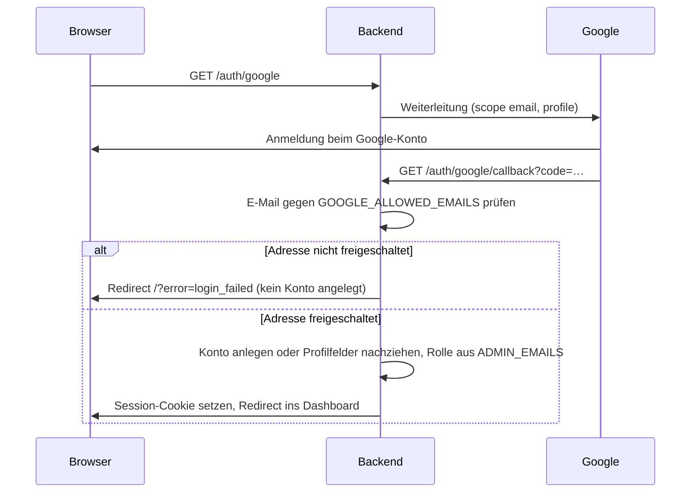

# Anmeldung und Zugang einrichten

Dieses Dokument beschreibt, wie der Zugang zu Priority Pilot funktioniert und welche Einstellungen
der Betreiber dafür setzen muss: Google-Login, Freischaltung von E-Mail-Adressen, Administratoren
und Session. Es ergänzt das Runbook [`server-setup.md`](server-setup.md) (Schritt 5, Env-Datei)
und die Variablen-Referenz in [`deployment.md` §2](deployment.md#2-konfiguration-env-datei).

## Das Wichtigste vorab

Ein Nutzerkonto entsteht erst beim ersten erfolgreichen Google-Login, und zwar nur für
Adressen, die in `GOOGLE_ALLOWED_EMAILS` eingetragen sind. Es gibt keine Registrierungsseite und
keine Selbstfreischaltung. Wer sich mit einem Google-Konto anmeldet, dessen Adresse nicht in der
Liste steht, wird abgewiesen, bevor irgendetwas in die Datenbank geschrieben wird. Die Person
taucht deshalb auch nicht in der Nutzerverwaltung auf.

Wer eine neue Person zulassen will, trägt ihre Adresse in die Env-Datei ein und lädt das
Backend neu. Beim nächsten Login legt die App das Konto automatisch an.

## Zwei Betriebsmodi

Der Server unterscheidet danach, ob überhaupt ein Auth-Kontext konfiguriert ist
(`isAuthActive` in `server/src/express/requireAuth.ts`):

| Modus                | Bedingung                                                                               | Verhalten                                                                                                            |
| -------------------- | --------------------------------------------------------------------------------------- | -------------------------------------------------------------------------------------------------------------------- |
| Offen (Pass-Through) | Weder `GOOGLE_ALLOWED_EMAILS`, noch `GOOGLE_CLIENT_ID`/`_SECRET`, noch `SESSION_SECRET` | Keine Anmeldung. Jeder Request kommt durch, alle Daten gehören einem namenlosen lokalen Nutzer. Nur für Entwicklung. |
| Geschützt            | Mindestens eine der Variablen ist gesetzt                                               | Jede API-Route verlangt eine gültige Session. Login ausschließlich über Google.                                      |

In Produktion (`NODE_ENV=production`) ist der geschützte Modus Pflicht: Der Server startet nicht
ohne `SESSION_SECRET` und nicht ohne mindestens eine Adresse in `GOOGLE_ALLOWED_EMAILS`.

## Variablen

Alle Variablen liegen in der Env-Datei des Servers (`server/.env` lokal, `<APP_DIR>/.env` auf dem
Host). Vorlage mit Kommentaren: [`server/.env.example`](../server/.env.example).

| Variable                | Pflicht in Produktion | Bedeutung                                                                                                                                            |
| ----------------------- | --------------------- | ---------------------------------------------------------------------------------------------------------------------------------------------------- |
| `GOOGLE_CLIENT_ID`      | ja                    | OAuth-Client-ID aus der Google Cloud Console.                                                                                                        |
| `GOOGLE_CLIENT_SECRET`  | ja                    | Zugehöriges Client-Secret. Ohne ID und Secret wird der Google-Login gar nicht registriert; der Login-Button antwortet dann mit HTTP 503.             |
| `GOOGLE_CALLBACK_URL`   | ja                    | Rücksprung-URL nach der Google-Anmeldung, z. B. `https://priority-pilot.example.de/auth/google/callback`. Muss exakt so in der Cloud Console stehen. |
| `GOOGLE_ALLOWED_EMAILS` | ja                    | Freigeschaltete Adressen, Komma-getrennt oder als JSON-Array. Vergleich ohne Groß-/Kleinschreibung. Nur diese Adressen können ein Konto bekommen.    |
| `ADMIN_EMAILS`          | empfohlen             | Adressen, die beim Login automatisch die Rolle `admin` bekommen. Gleiches Format. Muss eine Teilmenge der Allowlist sein, sonst wirkungslos.         |
| `SESSION_SECRET`        | ja                    | Zufällige, lange Zeichenkette zum Signieren des Session-Cookies.                                                                                     |
| `SESSION_TTL`           | nein                  | Lebensdauer der Session in Sekunden. Default 604800 (7 Tage).                                                                                        |

`GOOGLE_ALLOWED_EMAIL` (Singular) wird aus Kompatibilitätsgründen noch gelesen, wenn die
Plural-Variable leer ist. Neue Installationen nutzen nur die Plural-Form.

## Google-OAuth-Client anlegen

1. In der [Google Cloud Console](https://console.cloud.google.com/apis/credentials) ein Projekt
   wählen oder anlegen.
2. Unter „APIs und Dienste → Anmeldedaten“ eine **OAuth-2.0-Client-ID** vom Typ „Webanwendung“
   erstellen.
3. Als **autorisierte Weiterleitungs-URI** genau die Adresse eintragen, die später in
   `GOOGLE_CALLBACK_URL` steht. Schema, Host und Pfad müssen übereinstimmen; ein abweichender
   Wert führt bei Google zu `redirect_uri_mismatch`.
   - Produktion: `https://<deine-domain>/auth/google/callback`
   - Lokale Entwicklung: `http://localhost:3000/auth/google/callback` (Default, wenn die Variable
     fehlt)
4. Beim OAuth-Zustimmungsbildschirm im Status „Testen“ müssen alle Google-Konten zusätzlich als
   Testnutzer eingetragen sein. Sonst lehnt Google den Login mit `access_denied` ab, bevor die
   App die Adresse überhaupt sieht.
5. Client-ID und Secret in die Env-Datei übernehmen.

Der Login fragt bei Google nur die Scopes `email` und `profile` an. Aus dem Profil übernimmt die
App Adresse, Anzeigename und Avatar-URL.

## Ablauf beim Login



Die Prüfung gegen die Allowlist passiert im Passport-Verify-Callback
(`server/src/express/index.ts`), das Anlegen des Kontos danach in
`server/src/logics/oauthUser.ts`. Beim wiederholten Login werden Avatar und Rolle nachgezogen; ein
in der App selbst gesetzter Anzeigename bleibt erhalten.

Zusätzlich prüft `requireAuth` bei jedem API-Request erneut, ob die Adresse der Session noch in
der Allowlist steht. Eine aus der Liste entfernte Adresse verliert den Zugang also sofort, auch mit
laufender Session. Das Konto in der Datenbank bleibt bestehen.

## Neue Person zulassen

1. Adresse an `GOOGLE_ALLOWED_EMAILS` anhängen (Komma, keine Leerzeichen). Soll die Person
   Administrator sein, zusätzlich an `ADMIN_EMAILS`.
2. Backend neu laden, damit die Env-Datei erneut gelesen wird:

   ```bash
   pm2 reload priority-pilot --update-env
   ```

3. Die Person meldet sich über „Login with Google“ an. Das Konto wird dabei angelegt und
   erscheint danach in den Einstellungen unter „Nutzerverwaltung“.

Ohne Neuladen bleibt die alte Liste aktiv, weil der Prozess die Umgebung nur beim Start liest.

## Rollen

Jedes Konto hat die Rolle `admin` oder `member`. Die Rolle wird beim Login aus `ADMIN_EMAILS`
abgeleitet, aber nur in eine Richtung: Eine gelistete Adresse wird befördert, eine aus der Liste
entfernte Adresse bleibt Administrator, bis jemand sie in der Nutzerverwaltung zurückstuft. Der
letzte Administrator kann nicht zurückgestuft werden. Details für Nutzer im
[Nutzerhandbuch](user-guide.md#nutzerverwaltung-nur-für-administratoren), für die Umsetzung in
[`project.md`](../.ai-knowledge/project.md#konfiguration-umgebungsvariablen).

## Lokale Entwicklung

Ohne Auth-Variablen läuft die App im offenen Modus und zeigt keine Login-Seite. Wer den
Google-Login lokal testen will, setzt Client-ID, Secret, `GOOGLE_ALLOWED_EMAILS` und
`SESSION_SECRET` in `server/.env` und trägt `http://localhost:3000/auth/google/callback` als
Weiterleitungs-URI in der Cloud Console ein. Der Callback trifft direkt auf den Backend-Port,
nicht auf den Vite-Dev-Server.

## Fehlerbilder

| Symptom                                                              | Ursache                                                                                   | Prüfen / Fix                                                                         |
| -------------------------------------------------------------------- | ----------------------------------------------------------------------------------------- | ------------------------------------------------------------------------------------ |
| Login-Seite meldet „Ein unbekannter Anmeldefehler ist aufgetreten“   | Adresse nicht in `GOOGLE_ALLOWED_EMAILS`, oder Konto in der Cloud Console kein Testnutzer | Adresse ergänzen, `pm2 reload … --update-env`; Google-Konto als Testnutzer eintragen |
| Person fehlt in der Nutzerverwaltung                                 | Login wurde abgewiesen, das Konto entsteht erst beim ersten erfolgreichen Login           | Wie oben; nach erfolgreichem Login erscheint das Konto                               |
| Google zeigt `redirect_uri_mismatch`                                 | `GOOGLE_CALLBACK_URL` weicht von der in der Cloud Console eingetragenen URI ab            | Beide Werte zeichengenau abgleichen (Schema, Host, Pfad)                             |
| Login-Button antwortet mit 503 „Google-OAuth ist nicht konfiguriert“ | `GOOGLE_CLIENT_ID` oder `GOOGLE_CLIENT_SECRET` fehlt                                      | Beide Variablen setzen, Backend neu laden                                            |
| Backend startet in Produktion nicht                                  | `SESSION_SECRET` fehlt oder `GOOGLE_ALLOWED_EMAILS` ist leer                              | `pm2 logs priority-pilot` zeigt die Fehlermeldung; Variable setzen                   |
| Person ist eingeloggt, bekommt aber überall 401                      | Adresse wurde nachträglich aus der Allowlist entfernt                                     | Gewollt: Zugang ist gesperrt. Sonst Adresse wieder eintragen                         |
| Person soll Administrator sein, ist aber Mitglied                    | Adresse steht nicht in `ADMIN_EMAILS`, oder Login fand vor dem Eintrag statt              | Eintragen und neu anmelden, oder in der Nutzerverwaltung direkt befördern            |
