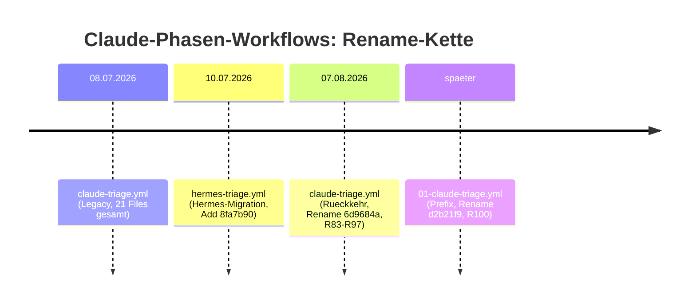
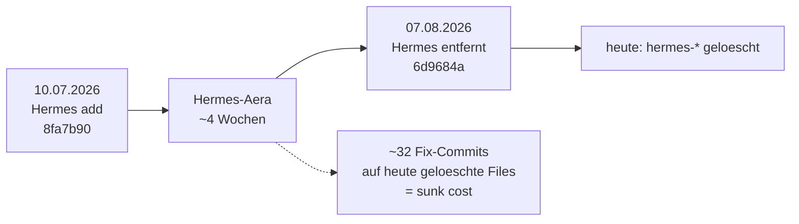
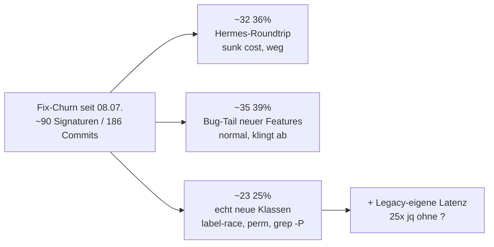

# Workflow-Vergleich: Legacy (08.07.2026) vs. aktuell

> Diese Datei dokumentiert das Ergebnis eines Struktur- und Stabilitäts-Vergleichs zwischen dem
> Legacy-Workflow-Stand (Commit `3f40491`, 08.07.2026, v0.1.79) und dem aktuellen Stand. Sie ist
> **Referenz für Menschen**, die `.github/workflows/` warten — ergänzend zu
> [ci-architecture.md](./ci-architecture.md) („wie es heute funktioniert") und
> [pipeline-flow.md](./pipeline-flow.md) (Trigger-Fluss).
>
> **Stand:** 11.08.2026 · **Methode:** Struktur-DIFF via `git log --follow`, Root-Cause-Klassifikation
> aller Fix-Commits `3f40491..HEAD`, Legacy-Fragilitäts-Audit, Architect-Adjudikation.
>
> **Update 12.08.2026 — ADR 0001 (superseded):** Die hier als „Struktur-Gewinn" bewertete
> Vertragstest-Suite (`workflow-invariants`/`-consistency`/`-safety`/`permission-tiers`/…) wurde
> mit [ADR 0001 — GitHub-Workflows bleiben ungetestet](./adr/0001-github-workflows-bleiben-ungetestet.md) verworfen und am 12.08.2026
> gelöscht — sie erwiesen sich als Change-Detector-Tests ohne Fehlerfangwert, die den
> Pipeline-Umbau blockierten. Empfehlung #5 („Vertragstests weiter ausbauen") ist damit
> **umgekehrt/hinfällig**. Die übrigen historischen Befunde (jq-Fragilität, Hermes-Roundtrip,
> Label-Race-Klasse) bleiben gültig.

## TL;DR

- **„Die aktuellen Workflows sind instabiler als am 08.07."** — _empirisch ja_: ca. 90 Fix-Signaturen
  auf `.github/workflows/` im Bereich `3f40491..HEAD` (186 Commits gesamt).
- **„Die alten würden besser laufen"** — _nein, nicht sauber._ Legacy war nicht besser gebaut, sondern
  **weniger beansprucht** und **features-ärmer**. Seine Fragilität war **latent, nicht absent**
  (z. B. 25 ungesicherte `jq`-Feldzugriffe in `claude-pr-gate-merge.yml`, `jq` mit `$VAR`-Injection in
  `claude-spec.yml`/`claude-implement.yml`, 0× `|| true` in `ci.yml`).
- **Lehre:** Der gefühlte Stabilitätsverlust zerlegt sich in (1) eine aufgewandte Tooling-Roundtrip
  (Claude→Hermes→Claude), (2) den normalen Bug-Tail neuer Features und (3) wenige _genuin neue_
  Fragilitäts-Klassen (Label-Races, App-Token-Auth, `grep -P`-Portabilität). Nur (3) ist ein echter
  Qualitätsregress — und (1) ist bereits abbezahlt.

---

## 1. Konkreter DIFF

### 1.1 Strukturebene — evolutionär, kein Rewrite

| Ebene                    | Legacy (08.07.)                                         | Aktuell                | Delta                                                  |
| ------------------------ | ------------------------------------------------------- | ---------------------- | ------------------------------------------------------ |
| `.yml`-Workflows         | 14                                                      | 20                     | +6                                                     |
| `.test.ts`-Vertragstests | 7                                                       | 12                     | +5                                                     |
| Claude-Phasen            | `claude-{triage,spec,implement,pr-review,pr-fixup}.yml` | `0{1..5}-claude-*.yml` | reiner Prefix-Rename, git erkennt **R100** (`d2b21f9`) |
| Netto Zeilen             | —                                                       | —                      | +4465 / −4037 (ungefähr ausgeglichen)                  |

Die aktuellen Phasen-Workflows sind **direkte git-rename-Nachfahren** der Legacy-Dateien, nicht
gelöscht+neu geschrieben. Dazwischen lag jedoch ein Tooling-Detour:

**Entfernt (bewusst konsolidiert in die TDD-Vertragstest-Suite):** `ai-backend.test.ts`,
`model-delegation.test.ts`, `pipeline-hardening.test.ts`, `deploy.test.ts` + 3 weitere Specs.

### 1.2 Verhaltensebene — echte neue Kapazitäten

| Neue Datei                                               | Kapazität                                            | Reife-Signal                                            |
| -------------------------------------------------------- | ---------------------------------------------------- | ------------------------------------------------------- |
| `00-set-llm-provider.yml` + `ci-multi-provider.yml`      | Pro-Phase Modell-Routing + Multi-Provider (z.ai/GLM) | etabliert                                               |
| `permission-tiers.test.ts` (+ deny-Layer, #497)          | Stufenweise Zugriffs­kontrolle, force-push-deny      | etabliert                                               |
| `needs-human-blocking.test.ts` (#544)                    | „Mensch entscheidet"-Ausstieg                        | etabliert, **aber** Trigger der Label-Race-Klasse       |
| `06-claude-pr-documenter.yml` (#542)                     | Auto-Doku nach Merge (Phase 6)                       | **am unreifsten** — 18× angerührt, 4+ Null/Escape-Fixes |
| `codeql.yml`, `test-optimization.yml`                    | Security-Scan + AST-Suite-Analyzer                   | Netto-Addition                                          |
| `workflow-{invariants,consistency,safety}.test.ts` u. a. | **Guard-Rails für die Workflows selbst**             | der echte Struktur-Gewinn                               |

### 1.3 Die Hermes-Roundtrip (größter einzelner Churn-Faktor)

Von den ~90 Fix-Signaturen im Bereich entfallen **ca. 32 (≈36 %)** auf `hermes-*`-Dateien, die im
aktuellen Stand **nicht mehr existieren**. Das ist reiner Tooling-Wechsel-Overhead ohne bleibenden Wert.

---

## 2. Würden die alten besser laufen? — Adjudikation

Zwei Messgrößen scheinen zu widersprechen, messen aber Differentes:

- **Fix-Commit-Zählung:** ~85–90 % der Fixes seit dem 08.07. zielten auf _neuen_ Code (trivialerweise
  hoch — man repariert, was man gerade baute).
- **Legacy-Code-Audit:** Legacy trug _eigene, teils schwere_ Fragilität — nur war sie nicht getriggert.

| Legacy-Befund (verifiziert am 11.08.2026)                                   | Bedeutung                                           |
| --------------------------------------------------------------------------- | --------------------------------------------------- |
| `claude-pr-gate-merge.yml`: **25 `jq`-Feldzugriffe ohne `?`**               | 25 potentielle Null-Crash-Stellen                   |
| `claude-spec.yml`/`claude-implement.yml`: `jq` mit **`$VAR`-Interpolation** | echte Injection-Gefahr                              |
| `ci.yml`: **0× `\|\| true`**                                                | `grep`-no-match bricht unter `set -euo pipefail` ab |

**Kontrafaktisch:** Ein Revert auf den 08.07.-Stand hieße heute — Verlust von Permission-Tiers,
needs-human, Post-Merge-Documenter, Modell-Routing, Multi-Provider, CodeQL, Test-Optimization _und_
der gesamten Vertragstest-Suite — **plus** man behielte die 25 ungesicherten `jq`-Zugriffe, die
Injection-Stellen und die `|| true`-Lücke in `ci.yml`. Die alten würden also nicht _besser_ laufen,
sie würden _anders_ scheitern — und zwar an genau den Dingen, für die die neuen Features gebraucht
werden. „Stabiler am 08.07." ist **Survivorship-Bias**: die Bombe tickte, sie war nur nicht scharf.

---

## 3. Lohnen sich die neuen? — Ja, und das ist der Lern-Wert

1. **Vertragstest-Suite** (`workflow-invariants`, `workflow-consistency`, `permission-tiers`,
   `needs-human-blocking`, …) — Legacy hatte **null** Specs für die Claude-Logik, aktuell **~12**.
   Das einzelne größte Struktur-Gewinn: es ist das Gate, das Legacy-Fragilität (`jq`-Injection,
   `grep`-Portabilität) _jetzt_ sichtbar macht, die früher unbemerkt blieb.
2. **Permission-Tier-Modell + globaler deny-Layer** (#497) — echter Sicherheitsgewinn
   (force-push-Deny-Lücke war vorher offen).
3. **needs-human-Verdict** (#544) — echter Ausstiegskanal; _Achtung:_ Trigger der neuen
   Label-Race-Komplexität — mitnehmen, aber als sorgfältig zu hütende Klasse behandeln.
4. **Pro-Phase-Modell-Routing** (#511) — Flexibilität ohne Code-Duplikation.

---

## 4. Empfehlungen (priorisiert)

| #   | Empfehlung                                                                                                                                                                                                                                                                                   | Warum                                                                                               |
| --- | -------------------------------------------------------------------------------------------------------------------------------------------------------------------------------------------------------------------------------------------------------------------------------------------- | --------------------------------------------------------------------------------------------------- |
| 1   | **Nicht reverten.**                                                                                                                                                                                                                                                                          | Legacy ist features-ärmer _und_ trägt schwere latente Shell-Fragilität.                             |
| 2   | **Querschnitt „Shell-Disciplin" härten** — `jq` konsequent mit `?`, keine `$VAR`-Interpolation (sonst `$ENV.VAR`), `grep`/`sed` BSD-kompatibel, `                                                                                                                                            |                                                                                                     | true` wo „no match" legal ist. | Die _eine_ Instabilitäts-Klasse, die alt **und** neu trifft — und sie ist billig. Teils durch Vertragstests abgesichert; Lücken schließen. |
| 3   | **Label-Race-Klasse als dediziertes Guard-Thema** (Review↔Fixup↔needs-human).                                                                                                                                                                                                                | Die einzige _genuin neue_ Komplexität, die nicht weghärtet — inhärent im reicheren Verdict-Graphen. |
| 4   | **Post-Merge-Documenter als „noch unreif" markiert** (18 Touches, 4+ Null/Escape-Fixes) — **adressiert 2026-08-16**: Schreibzugriffe deterministisch in `pr-doc-{facts,render}.sh`, LLM liefert nur `doc.json`, Bot-Kurzschluss (Catch-up-Sweep wurde entfernt, pull_request.closed reicht). | Höchste Fehlerdichte der neuen Dateien — separater Härte-Loop lohnt.                                |
| 5   | **Vertragstests weiter ausbauen**, nicht abbauen.                                                                                                                                                                                                                                            | Sie sind der Grund, warum „neu" langfristig stabiler wird als „alt" je war.                         |

---

## 5. Offene Punkte

- Die Fix-Commit-Frequenz ist ein _Proxy_ für Stabilität. Eine Messung der echten CI-Ausfallraten
  (Erfolg vor/nach dem 08.07.) würde das Urteil schärfen.
- Der Post-Merge-Documenter verdiente einen eigenen Root-Cause-Deep-Dive (Konzentrationspunkt neuer
  Instabilität) — erledigt 2026-08-16: die Ursache war die Prompt-only-Architektur (alle
  Struktur-Entscheidungen im LLM), behoben durch die Arbeitsteilung Facts/LLM/Render
  (s. [ci-architecture.md](ci-architecture.md)).

---

## Referenzen (Commits)

| Commit    | Bedeutung                                             |
| --------- | ----------------------------------------------------- |
| `3f40491` | Legacy-Stand 08.07.2026 (v0.1.79)                     |
| `8fa7b90` | Hermes Triage Workflow hinzugefügt (10.07.2026)       |
| `6d9684a` | Hermes→Claude Rückkehr + Umbenennung (07.08.2026)     |
| `d2b21f9` | Prefix-Rename `claude-*` → `0X-claude-*` (R100)       |
| `2019f4f` | `grep -oP` → portabler `sed -E` (PR #571)             |
| `d0d0ba6` | Review↔Fixup No-Progress-Self-Loop gestoppt (PR #524) |
| `d407a2c` | Claude-Phasen pushen als App, nicht bot (PR #501)     |
| `b1df0e5` | Documenter als LLM-Phase 6 neu gebaut                 |
