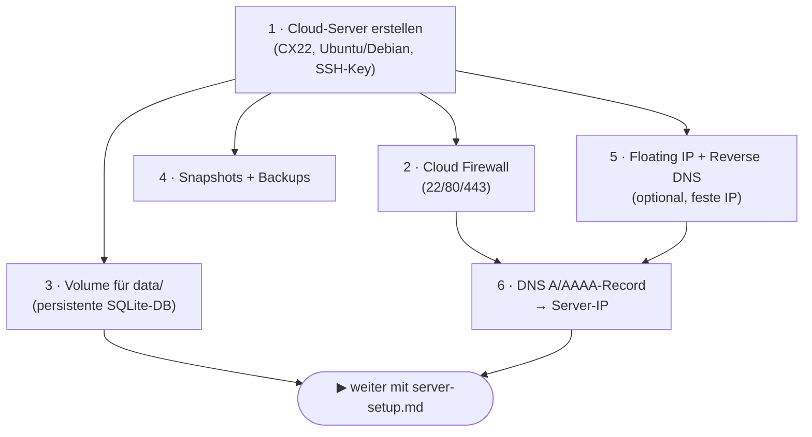

# Hetzner-Deployment: Cloud-Plattform-Checkliste

Diese Anleitung beschreibt die **Hetzner-Cloud-spezifische** Seite des Deployments — also alles,
was in der **Hetzner-Cloud-Console** (bzw. via `hcloud`-CLI) einzurichten ist, **bevor** das
generische Server-Runbook greift. Die OS-/App-Einrichtung auf dem Server selbst (Node, Caddy,
`deploy`-User, systemd, Env-Datei) steht unverändert in [`server-setup.md`](server-setup.md); das
Gesamtkonzept (Release-Build, Tarball, Symlink-Switch, Rollback) in [`deployment.md`](deployment.md).

> **Abgrenzung:** Dieses Dokument **dupliziert** das Server-Runbook **nicht**. Es deckt nur die
> Bausteine ab, die an Hetzner Cloud als Plattform gebunden sind (Server-Typ, Cloud Firewall,
> Volume, Snapshots/Backups, Floating IP, Reverse DNS, DNS). Am Ende übergibt es nahtlos an
> [`server-setup.md`](server-setup.md).



> Begriffe wie `deploy`-User, Port **3001**, Datenpfad
> `/var/www/gh-deploy/priority-pilot/data/` stammen aus dem generischen Runbook und werden hier
> nur referenziert, nicht neu definiert.

---

## 0. Voraussetzungen

- Hetzner-Cloud-Projekt (Console: <https://console.hetzner.cloud>) **oder** die `hcloud`-CLI
  (`hcloud context create priority-pilot` mit einem Projekt-API-Token).
- Lokales SSH-Schlüsselpaar (z. B. `~/.ssh/id_ed25519`) für den **administrativen** Login.
  Hinweis: Das ist **nicht** der `gh_deploy`-Key — der Deploy-Key wird erst in
  [`server-setup.md` Schritt 3](server-setup.md) eingerichtet.

---

## 1. Cloud-Server erstellen

Empfohlene Eckdaten (Begründung jeweils dahinter):

- **Server-Typ — CX22** (2 vCPU, 4 GB RAM, 40 GB SSD): genügt für Single-Node klar; der Build läuft
  in CI, der Host baut nicht.
- **Image — Ubuntu 24.04 LTS oder Debian 12 (x64):** muss zur CI passen (x64, Node 22 — natives
  `sqlite3`). Siehe [`server-setup.md`](server-setup.md).
- **Standort — EU** (z. B. Nürnberg/Falkenstein/Helsinki): Datenschutz/Latenz; frei wählbar.
- **SSH-Key:** eigenen **öffentlichen** Admin-Key hinterlegen — kein Passwort-Login.
- **IPv4/IPv6:** beide aktiv — IPv4 für Kompatibilität, IPv6 spart Kosten.

```bash
# Variante hcloud-CLI:
hcloud ssh-key create --name admin --public-key-from-file ~/.ssh/id_ed25519.pub
hcloud server create \
  --name priority-pilot \
  --type cx22 \
  --image ubuntu-24.04 \
  --location nbg1 \
  --ssh-key admin
```

> **Architektur-Hinweis:** Die CAX-Reihe (ARM64) ist günstiger, **erfordert aber** ein passend
> gebautes Tarball/Host-Install, weil das CI-Release auf **x64** (`ubuntu-latest`) gebaut wird
> (natives `sqlite3`). Für den Standardweg bei **x64** (CX-Reihe) bleiben — siehe
> [`deployment.md` §3](deployment.md) und die Host-Install-Variante in
> [`server-setup.md` Schritt 6](server-setup.md).

**Single-Node ist gesetzt:** SQLite ist dateibasiert und Single-Writer → genau **eine** Instanz,
**kein** Load-Balancer mit mehreren App-Knoten. HA/Mehrknoten wäre ein eigener DB-Wechsel (z. B.
Postgres) und nicht Teil dieses Deployments.

---

## 2. Cloud Firewall

Hetzners **Cloud Firewall** filtert bereits **vor** der VM (zusätzlich zu/anstatt `ufw` auf dem
Host). Nur die nötigen eingehenden Ports öffnen:

| Richtung  | Port | Protokoll | Zweck                                                |
| --------- | ---- | --------- | ---------------------------------------------------- |
| eingehend | 22   | TCP       | SSH (Admin + Deploy)                                 |
| eingehend | 80   | TCP       | HTTP → Redirect auf HTTPS durch Caddy + ACME         |
| eingehend | 443  | TCP       | HTTPS (App über Caddy)                               |
| ausgehend | alle | —         | Updates, Let's Encrypt, GitHub-Release, Mistral-API  |

```bash
hcloud firewall create --name web
hcloud firewall add-rule web --direction in --protocol tcp --port 22  --source-ips 0.0.0.0/0 --source-ips ::/0
hcloud firewall add-rule web --direction in --protocol tcp --port 80  --source-ips 0.0.0.0/0 --source-ips ::/0
hcloud firewall add-rule web --direction in --protocol tcp --port 443 --source-ips 0.0.0.0/0 --source-ips ::/0
hcloud firewall apply-to-resource web --type server --server priority-pilot
```

> Port **3001** (Node) wird **nicht** geöffnet — der Express-Server lauscht nur auf `localhost`,
> Caddy proxyt davor. SSH (22) bei fester Admin-IP gern auf diese einschränken (`--source-ips`).
> Hält man `ufw` **und** Cloud Firewall parallel, müssen beide Regelwerke konsistent sein, sonst
> sperrt man sich aus.

---

## 3. Volume für die persistente Datenbank (empfohlen)

Die SQLite-Datei muss **jedes Deploy und jede Server-Neuerstellung** überleben. Im generischen
Runbook liegt sie unter `/var/www/gh-deploy/priority-pilot/data/`. Auf einem Hetzner **Volume**
(unabhängig vom Server-Lebenszyklus, separat sicherbar) ist sie am robustesten:

```bash
hcloud volume create --name pp-data --size 10 --server priority-pilot --format ext4
# Hetzner mountet es unter /mnt/HC_Volume_<ID>; per fstab dauerhaft einhängen, z. B. nach:
#   /mnt/pp-data
```

Anschließend das Daten-Verzeichnis aus [`server-setup.md` Schritt 4](server-setup.md) **auf das
Volume legen** statt auf die System-Disk:

```bash
# statt /var/www/gh-deploy/priority-pilot/data:
sudo mkdir -p /mnt/pp-data/priority-pilot
sudo ln -sfn /mnt/pp-data/priority-pilot /var/www/gh-deploy/priority-pilot/data
sudo chown -R deploy:deploy /mnt/pp-data/priority-pilot
```

`DATABASE_STORAGE` in der Env-Datei (Schritt 5 des Runbooks) zeigt damit weiterhin auf
`/var/www/gh-deploy/priority-pilot/data/database.sqlite` (via Symlink auf dem Volume). Die
systemd-`ReadWritePaths` ggf. um den Volume-Pfad ergänzen.

> **Ohne Volume** funktioniert es ebenfalls (Daten auf der System-SSD) — dann hängt die Persistenz
> allein an den VM-Backups/Snapshots (Schritt 4). Das Volume entkoppelt Daten von der VM und
> erlaubt schnelleres Neu-Aufsetzen.

---

## 4. Snapshots & Backups

Zwei Ebenen, komplementär zum SQLite-`.backup`-Cronjob aus
[`server-setup.md` Schritt 12](server-setup.md):

- **Automatische Backups** beim Server aktivieren (Hetzner, ~20 % Aufpreis) — tägliche,
  rotierende Voll-Images der VM:
  ```bash
  hcloud server enable-backup priority-pilot
  ```
- **Snapshots** vor riskanten Änderungen (Major-Upgrades, OS-Wechsel) manuell ziehen:
  ```bash
  hcloud server create-image --type snapshot --description "pre-upgrade" priority-pilot
  ```
- Nutzt man ein **Volume** (Schritt 3), zusätzlich die SQLite-`.backup`-Kopien **vom Server
  wegsichern** (z. B. zu Hetzner **Storage Box** / S3-kompatibel), damit ein Backup auch einen
  Totalverlust der VM **und** des Volumes übersteht.

---

## 5. Floating IP & Reverse DNS (optional)

Nur nötig, wenn eine **feste, server-unabhängige** IP gewünscht ist (z. B. um die VM später ohne
DNS-Wechsel neu aufzusetzen):

```bash
hcloud floating-ip create --type ipv4 --name pp-ip --server priority-pilot
hcloud floating-ip set-rdns pp-ip --ip <FLOATING_IP> --hostname priority-pilot.example.de
```

Reverse DNS (PTR) auf den FQDN setzen — sauberer Betrieb. Ohne Floating IP genügt die Reverse DNS
der primären Server-IP (in der Console unter dem Server → „Reverse DNS").

---

## 6. DNS auf die Server-IP zeigen

Voraussetzung für TLS (Caddy/Let's Encrypt holt das Zertifikat nur, wenn der Name auf den Server
auflöst):

| Record | Wert                                    |
| ------ | --------------------------------------- |
| `A`    | IPv4 des Servers (oder der Floating IP) |
| `AAAA` | IPv6 des Servers (falls IPv6 genutzt)   |

Den Platzhalter `priority-pilot.example.de` aus [`server-setup.md`](server-setup.md) durch die echte
Domain ersetzen. **Erst nach** erfolgreicher DNS-Auflösung den Caddy-Block (Schritt 9 des Runbooks)
laden, sonst scheitert die ACME-Challenge.

---

## 7. Weiter mit dem Server-Runbook

Steht der Server (Schritt 1), ist die Firewall aktiv (2), das Daten-Verzeichnis liegt sicher (3),
Backups laufen (4) und die Domain zeigt auf die IP (6), geht es **nahtlos** im generischen Runbook
weiter — dort sind `deploy`-User, SSH-Deploy-Key, systemd-Unit, Env-Datei und Caddy beschrieben:

➡️ **[`server-setup.md`](server-setup.md)** ab Schritt 1 (System + Node 22 + Caddy).

Das **Konzept** dahinter (Release per Git-Tag, Tarball, Symlink-Switch, Rollback) steht in
[`deployment.md`](deployment.md); die **Repo-Seite** (Pack-Skript, Release-Workflow, Secrets) in
[`deployment-repo-plan.md`](deployment-repo-plan.md).

---

## Kosten (grobe Orientierung)

| Posten                 | Richtwert                  |
| ---------------------- | -------------------------- |
| CX22                   | ~4–5 €/Monat               |
| Volume 10 GB           | ~0,5 €/Monat               |
| Automatische Backups   | ~20 % des Server-Preises   |
| Floating IP (optional) | ~1 €/Monat                 |

Stand: Orientierungswerte; aktuelle Preise siehe Hetzner-Cloud-Preisliste.
