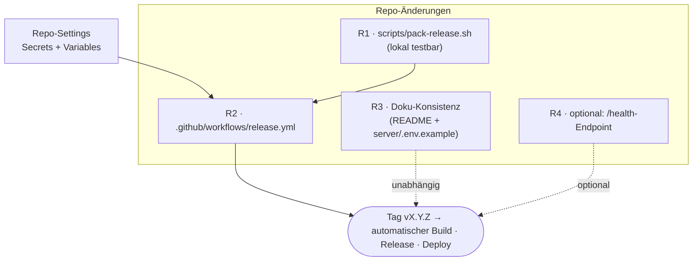

# Umsetzungsplan: Deployment-Fähigkeit im Repo

Dieser Plan beschreibt **alle Änderungen am Repository selbst**, damit ein Git-Tag automatisch ein
deploybares Release erzeugt und ausliefert. Das **Konzept** steht in [`deployment.md`](deployment.md),
die **Server-Einrichtung** in [`server-setup.md`](server-setup.md). Dieses Dokument ist die
**Arbeitsliste für das Repo**.

> Konvention: Tasks sind mit `R1…R4` nummeriert, jeweils mit Datei, Zweck, Akzeptanzkriterium und
> Scope-Grenze. Reihenfolge = Abhängigkeit (siehe Graph).



---

## Status quo (verifiziert)

| Vorhanden                                                                            | Fehlt für Deployment                                              |
| ------------------------------------------------------------------------------------ | ----------------------------------------------------------------- |
| `ci.yml` (install · format · lint · build · test) als Qualitäts-Gate                 | **kein** Release-/Deploy-Workflow                                 |
| `pnpm -r build` erzeugt `frontend/dist` + `server/dist` (Entry `dist/index.js`, ESM) | **kein** Pack-Skript, das ein Deploy-Tarball schnürt              |
| `server/.env.example` (dokumentiert die meisten Env-Variablen)                       | `DB_SEED` fehlt dort; README-Env-Tabelle unvollständig            |
| Deploy-Schlüsselpaar `gh_deploy`/`gh_deploy.pub` erzeugt, gitignored                 | Schlüssel/Host noch nicht als GitHub-Secrets/Variables hinterlegt |
| Release ist **tag-getrieben** (keine `version`-Felder in `package.json`)             | — (so gewollt; Tag = Single Source of Truth)                      |

---

## R1 · Pack-Skript `scripts/pack-release.sh`

**Zweck:** Das Schnüren des Release-Tarballs aus dem Monorepo lokal **und** in CI reproduzierbar
machen (statt es im Workflow-YAML zu verstecken). Verfeinert [`deployment.md` §3](deployment.md), wo
das Packen noch inline im Workflow steht.

**Datei:** `scripts/pack-release.sh` (neu, ausführbar)

```bash
#!/usr/bin/env bash
# Baut Frontend + Backend und schnürt ein Deploy-Tarball.
# Nutzung:  scripts/pack-release.sh <version>     z. B. scripts/pack-release.sh v1.2.3
set -euo pipefail

VERSION="${1:?Usage: pack-release.sh <vX.Y.Z>}"
ROOT="$(cd "$(dirname "$0")/.." && pwd)"
cd "$ROOT"

STAGE="$(mktemp -d)"; DEPLOY="$(mktemp -d)"
trap 'rm -rf "$STAGE" "$DEPLOY"' EXIT

echo "==> Build (client -> frontend -> server)"
pnpm install --frozen-lockfile
pnpm -r build

echo "==> Server-Prod-Bundle (nur Prod-Deps, inkl. native sqlite3)"
# pnpm deploy erzeugt ein eigenstaendiges Verzeichnis ohne Store-Symlinks (tarball-tauglich).
# --legacy je nach pnpm-Konfiguration noetig; alternativ Prod-Deps auf dem Host installieren.
pnpm --filter server --prod deploy --legacy "$DEPLOY"

echo "==> Release-Baum zusammenstellen"
mkdir -p "$STAGE/server"
cp -r frontend/dist          "$STAGE/dist"          # SPA      -> Caddy file_server
cp -r "$DEPLOY/dist"         "$STAGE/server/dist"    # Backend  -> node dist/index.js
cp    "$DEPLOY/package.json" "$STAGE/server/package.json"
cp -r "$DEPLOY/node_modules" "$STAGE/server/node_modules"

OUT="$ROOT/priority-pilot-${VERSION}.tar.gz"
tar -czf "$OUT" -C "$STAGE" .
echo "==> Fertig: $OUT"
```

**Akzeptanzkriterium:**

```bash
bash scripts/pack-release.sh v0.0.0-test
mkdir -p /tmp/rel && tar -xzf priority-pilot-v0.0.0-test.tar.gz -C /tmp/rel
test -f /tmp/rel/dist/index.html                 # SPA vorhanden
DATABASE_STORAGE=/tmp/rel/test.sqlite DB_SEED=false \
  node /tmp/rel/server/dist/index.js &           # Backend startet aus der Release-Struktur
curl -fsS localhost:3000/next && kill %1         # API erreichbar
```

**Scope-Grenze:** kein Aufräumen alter Tarballs, kein Upload (das macht R2).

**Entscheidung (zu treffen):** Prod-`node_modules` in CI bauen (Annahme: Host = x64-Linux + Node 22,
passt zum CI-Runner) **oder** auf dem Host installieren. Standard hier: in CI bauen. Weicht die
Host-Architektur ab → in `deploy.sh` ein `pnpm install --prod` nach dem Entpacken ergänzen (siehe
[`server-setup.md`](server-setup.md)) und diesen `node_modules`-Kopierschritt im Pack-Skript entfernen.

---

## R2 · Release-Workflow `.github/workflows/release.yml`

**Zweck:** Tag `vX.Y.Z` → Build → GitHub Release mit Tarball → SSH-Deploy auslösen.

**Datei:** `.github/workflows/release.yml` (neu)

```yaml
name: Release
on:
  push:
    tags: ['v*.*.*']

permissions:
  contents: write # gh release create

jobs:
  release:
    runs-on: ubuntu-latest
    steps:
      - uses: actions/checkout@v4
      - uses: pnpm/action-setup@v4
      - uses: actions/setup-node@v4
        with:
          node-version: 22 # MUSS zur Node-Major-Version des Hosts passen (native sqlite3)
          cache: pnpm

      - name: Pack release
        run: bash scripts/pack-release.sh "${GITHUB_REF_NAME}"

      - name: GitHub Release
        env:
          GH_TOKEN: ${{ github.token }}
        run: gh release create "${GITHUB_REF_NAME}" "priority-pilot-${GITHUB_REF_NAME}.tar.gz" --generate-notes

      - name: Deploy auslösen
        env:
          SSH_KEY: ${{ secrets.DEPLOY_SSH_KEY }}
          DEPLOY_HOST: ${{ vars.DEPLOY_HOST }}
          DEPLOY_USER: ${{ vars.DEPLOY_USER }}
        run: |
          install -m600 <(printf '%s\n' "$SSH_KEY") /tmp/deploy_key
          ssh -i /tmp/deploy_key -o StrictHostKeyChecking=accept-new \
            "${DEPLOY_USER}@${DEPLOY_HOST}" "deploy priority-pilot ${GITHUB_REF_NAME}"
```

**Akzeptanzkriterium:** `git tag v0.0.1 && git push origin v0.0.1` → grüner Run; ein GitHub Release
`v0.0.1` mit Asset `priority-pilot-v0.0.1.tar.gz` existiert; der Deploy-Step bricht (erwartbar) nur ab,
solange der Server noch nicht eingerichtet ist.

**Scope-Grenze:** kein Pre-Release-/Changelog-Tooling, keine Multi-App-Matrix (eine App = ein Repo).

### R2-Settings · GitHub Repo-Konfiguration (kein Code)

Unter **Settings → Secrets and variables → Actions** anlegen:

| Name             | Typ      | Wert                                               |
| ---------------- | -------- | -------------------------------------------------- |
| `DEPLOY_SSH_KEY` | Secret   | Inhalt des **privaten** Schlüssels `gh_deploy`     |
| `DEPLOY_HOST`    | Variable | z. B. `priority-pilot.example.de` (oder Server-IP) |
| `DEPLOY_USER`    | Variable | `gh-deploy`                                         |

**Akzeptanzkriterium:** Alle drei vorhanden; der private Schlüssel liegt **nur** hier + in
`authorized_keys` des Servers, nie im Repo (ist gitignored).

---

## R3 · Doku-Konsistenz (Findings aus dem Konzept-Lauf)

Stille Abweichung Code ↔ Doku = Critical laut team4-Prinzip. Zwei Stellen sind unvollständig:

**R3.1 — `server/.env.example`:** `DB_SEED` ergänzen (Code liest `process.env.DB_SEED !== 'false'`,
seedet sonst Demo-Daten in eine leere DB):

```bash
# Demo-Daten beim ersten Start in eine leere DB säen. Default: an. In Produktion auf false setzen.
# DB_SEED=false
```

**R3.2 — `README.md` → „Umgebungsvariablen (Server)":** Tabelle um die tatsächlich gelesenen
Variablen erweitern (aktuell nur `PORT`, `DB_RESET`):

| Variable           | Default                | Wirkung                                                                                              |
| ------------------ | ---------------------- | ---------------------------------------------------------------------------------------------------- |
| `PORT`             | `3000`                 | Port des Express-Servers.                                                                            |
| `DATABASE_STORAGE` | `./database.sqlite`    | Pfad der SQLite-DB (`:memory:` = flüchtig). In Produktion **absolut** + außerhalb des Release-Baums. |
| `DB_SEED`          | `true`                 | Seedet Demo-Daten in eine leere DB. In Produktion `false`.                                           |
| `DB_RESET`         | `false`                | `true` verwirft die DB beim Start (**Datenverlust!**).                                               |
| `MISTRAL_API_KEY`  | –                      | Pflicht für `POST /tasks/suggest-pillars` (sonst HTTP 503).                                          |
| `MISTRAL_MODEL`    | `mistral-small-latest` | Optionales Mistral-Modell.                                                                           |

**Akzeptanzkriterium:** `grep -rho 'process.env.[A-Z_]*' server/src | sort -u` enthält keine Variable,
die in README **und** `server/.env.example` fehlt. `pnpm exec prettier --check README.md server/.env.example` grün.

**Scope-Grenze:** nur diese beiden Dateien; keine inhaltliche README-Umstrukturierung.

---

## R4 · Optional: `/health`-Endpoint (empfohlen, nicht zwingend)

**Zweck:** Ein dedizierter, billiger Liveness-Check für Post-Deploy-Verifikation und ggf. ein
systemd-`ExecStartPost`-/Monitoring-Hook — robuster als der fachliche `GET /next`.

**Datei:** `server/src/express/index.ts` (+ Route), `openapi.yml` (Vertrag), 1 Test.

```ts
app.get('/health', (_req, res) => res.json({ status: 'ok' }));
```

**Akzeptanzkriterium:** `curl -fsS localhost:3001/health` → `{"status":"ok"}`; im Vertrag dokumentiert;
**Caddy-`@api`-Matcher** um `/health*` ergänzt (siehe [`deployment.md` §7](deployment.md)).

**Scope-Grenze:** echtes Feature, daher **separat** von R1–R3 umsetzen (eigener PR). Solange offen,
dient `GET /next` als Smoke-Test.

---

## Reihenfolge & Abschluss

1. **R3** zuerst (risikolos, schließt die Doku-Findings) — kann unabhängig laufen.
2. **R1** (Pack-Skript lokal grün) → **R2-Settings** → **R2** (Workflow).
3. Erst-Deploy gegen den nach [`server-setup.md`](server-setup.md) eingerichteten Host.
4. **R4** optional als Folge-PR.

**Definition of Done:** Ein Tag-Push erzeugt ohne manuelle Schritte ein GitHub Release **und** einen
laufenden, neu gestarteten Dienst auf dem Host; Rollback per Symlink-Switch ist möglich
([`deployment.md` §10](deployment.md)).

## Außerhalb des Scopes

- Zero-Downtime/Blue-Green (der `systemctl restart` hat eine kurze Lücke; für den Prototyp akzeptabel).
- Mehrere Apps in diesem Repo (Multi-App-Layout ist serverseitig vorbereitet, hier aber eine App).
- DB-Schema-Migrationen (Sequelize `sync`; echte Migrationswerkzeuge sind ein eigenes Thema).
