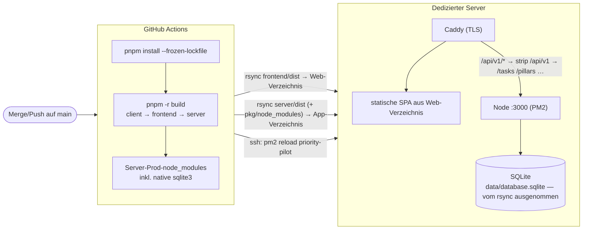

# Deployment auf einen dedizierten Server

Dieses Dokument beschreibt **Konzept und Ablauf** des Deployments von Priority Pilot auf einen
eigenen (dedizierten) Linux-Server. Es ist die operative Single Source of Truth für Releases.

> **Status (seit #152): vereinfachtes Deployment.** Der Ablauf ist **Merge auf `main` → Build
> in GitHub Actions → `rsync` der `dist`-Verzeichnisse auf den Server → Backend via PM2**. Es gibt
> **kein** Git-Tag, **kein** Tarball, **kein** GitHub Release, **kein** `deploy.sh`/Forced-Command
> und **keinen** systemd-Symlink-Switch mehr.

---

## 1. Überblick & Zielbild

Priority Pilot ist eine **Full-Stack-App im pnpm-Monorepo** (siehe [README](../README.md)):

- **Frontend** (`frontend/`): React 19 + KoliBri, gebaut mit Vite → statische SPA (PWA) in `frontend/dist`.
- **Backend** (`server/`): Node.js + Express 5 + Sequelize über **SQLite** → kompiliert nach `server/dist`,
  Entry-Point `server/dist/index.js` (ESM).
- **Client** (`client/`): aus `openapi.yml` generierte API-Typen, nur Build-Zeit-Abhängigkeit des Frontends.

Frontend und Backend werden **gemeinsam** ausgeliefert, aber **ohne Versions-Tag/Release-Artefakt**:
Jeder **Merge auf `main`** löst in GitHub Actions einen Build aus; die gebauten `dist`-Verzeichnisse
werden per **`rsync`** direkt in die Zielverzeichnisse auf dem Server gespiegelt. Das **Frontend** ist
eine statische SPA und liegt danach einfach im Web-Verzeichnis. Das **Backend** läuft unter **PM2** und
wird nach dem `rsync` **genau einmal** neu gestartet. Kein Tarball, kein GitHub Release, kein
Symlink-Switch, kein `deploy.sh`/Forced-Command.



### Zielverzeichnisse auf dem Server

Statt eines versionierten Release-Baums mit Symlink-Switch gibt es nur noch **zwei feste
Zielverzeichnisse**, in die `rsync` spiegelt:

- **Web-Verzeichnis** (`vars.DEPLOY_WEB_DIR`): die statische SPA aus `frontend/dist`, von Caddy als
  `file_server` ausgeliefert.
- **App-Verzeichnis** (`vars.DEPLOY_APP_DIR`): `server/dist` + Prod-`package.json` +
  Prod-`node_modules` + `.env`, gestartet als `node dist/index.js` unter PM2.

Die **persistente SQLite-DB** (`data/`) liegt **außerhalb** dieser Pfade und wird vom `rsync`
zusätzlich per `--exclude` geschützt — sie bleibt über Deploys hinweg unverändert.

### Warum PM2 statt systemd?

Frühere Stände dieser Doku setzten bewusst auf systemd (kein zweiter Supervisor, journald,
Sandboxing). Issue #152 dreht diese Entscheidung **bewusst zugunsten von PM2** — Ziel ist hier
**maximale Einfachheit** des Deploy-Pfads:

- **Kein Privileg-/sudoers-Tanz:** Der Deploy-User braucht nur Schreibrecht auf die zwei
  Zielverzeichnisse und darf `pm2 reload` aufrufen — kein `systemctl`/Forced-Command.
- **Ein-Schritt-Neustart:** Nach dem `rsync` genügt ein `pm2 reload priority-pilot`
  (idempotent: `pm2 start …`, falls der Prozess noch nicht existiert) — das Backend startet **genau
  einmal** mit den neuen Sourcen neu.
- **Bewusst akzeptiertes Risiko:** Kein atomarer Switch / 1-Zeilen-Rollback mehr. Der kurze Moment
  teilgespiegelter Dateien wird zugunsten der Einfachheit in Kauf genommen.

PM2-Autostart nach Server-Reboot wird einmalig über `pm2 startup` + `pm2 save` eingerichtet (siehe
[server-setup.md](server-setup.md)).

---

## 2. Konfiguration (Env-Datei)

Die Env-Datei liegt als **`.env` im App-Verzeichnis** (chmod 600, enthält Secrets) und wird vom
`rsync` per `--exclude '.env'` geschützt — sie überlebt jedes Deploy. Der Server lädt sie beim Start
via dotenv (`server/src/index.ts`).

```bash
# <DEPLOY_APP_DIR>/.env
NODE_ENV=production
PORT=3000                                                  # Default des Backends (server/src/express/index.ts)

# DB-Pfad ABSOLUT und außerhalb der gespiegelten Verzeichnisse.
DATABASE_STORAGE=/var/www/gh-deploy/priority-pilot/data/database.sqlite

# DB-Lebenszyklus — in Produktion bewusst gesetzt:
DB_SEED=false           # KEINE Demo-Daten bei jedem Start (Default würde seeden)
# DB_RESET   absichtlich NICHT gesetzt — "true" LEERT die DB bei jedem Start!

# Mistral-Integration (Säulen-Vorschläge). Fehlt der Key, antwortet /tasks/suggest-pillars mit 503.
MISTRAL_API_KEY=...
# MISTRAL_MODEL=mistral-small-latest                       # optional, Default mistral-small-latest
```

Ausführliche Anleitung zu LLM-Provider-Konfiguration (Mistral + OpenRouter): [docs/llm-providers.md](llm-providers.md).

Quellen der Variablen: `server/src/index.ts` (`DB_RESET`, `DB_SEED`, dotenv-Load),
`server/src/database.ts` (`DATABASE_STORAGE`), `server/src/express/index.ts` (`PORT`),
`server/src/llm/llm.ts` (`MISTRAL_API_KEY`, `MISTRAL_MODEL`).

---

## 3. Build & Deploy (GitHub-Actions-Workflow)

Das Deployment läuft im Workflow **[`.github/workflows/deploy.yml`](../.github/workflows/deploy.yml)**
(Trigger: `push` auf `main`; `ci.yml` dient auf `main`/PRs als Qualitäts-Gate davor). Der Ablauf:

1. **Install + Build:** `pnpm install --frozen-lockfile`, `pnpm -r build` (client → frontend →
   server; `build:api` regeneriert die Vertragstypen aus `openapi.yml` und type-checkt dagegen —
   API-Drift kann so nicht in ein Release gelangen). Node-Version zentral aus `.nvmrc`.
2. **Server-Prod-Deps bündeln:** `pnpm --filter ./server --prod deploy --legacy server/deploy`
   erzeugt ein eigenständiges Verzeichnis mit nur den Produktions-Dependencies. Der Server hat keine
   Workspace-Dependencies zur Laufzeit (`client` ist nur Abhängigkeit des Frontends), daher ist das
   Bundle sauber.
3. **SSH-Key bereitstellen:** `secrets.DEPLOY_SSH_KEY` (privater Deploy-Key des `gh-deploy`-Users).
4. **rsync Frontend:** `frontend/dist/` → `vars.DEPLOY_WEB_DIR` (`--delete`).
5. **rsync Backend:** `server/dist/` → `vars.DEPLOY_APP_DIR/dist/`; `package.json` +
   `node_modules/` aus dem Prod-Bundle; `data/`, `*.sqlite` und `.env` per `--exclude` geschützt.
6. **PM2-Reload:** `pm2 reload priority-pilot --update-env || pm2 start <APP_DIR>/dist/index.js
--name priority-pilot` — das Backend startet genau einmal mit den neuen Sourcen neu.
7. **Patch-Bump (#286):** Nach dem Deploy committet ein App-Token einen `chore(release):
v<version> [skip ci]`-Bump-Commit auf `main` (App-Token nötig, da `GITHUB_TOKEN` keine
   Folge-Workflows auslöst; `[skip ci]` verhindert die Deploy-Endlosschleife).

**Benötigte Repo-Konfiguration:** Secret `DEPLOY_SSH_KEY` sowie die Variablen `DEPLOY_HOST`,
`DEPLOY_USER`, `DEPLOY_WEB_DIR`, `DEPLOY_APP_DIR`. Das Schlüsselpaar (`gh_deploy`/`gh_deploy.pub`,
beide **gitignored** — private Schlüssel sind Secrets) liegt im Projekt-Setup vor; Einrichtung des
Hosts siehe [server-setup.md](server-setup.md).

**Caddy** terminiert TLS davor und reverse-proxyt `/api/v1/*` (Präfix-Strip) und `/auth/*` ans
Backend — Konfiguration und Pfad-Tabelle: [caddy-setup.md](caddy-setup.md).

---

## 4. Rollback

Es gibt **keinen** atomaren Symlink-Switch mehr. Rollback = **Revert-Commit mergen** → `deploy.yml`
deployt den alten Stand automatisch neu. Die DB in `data/` ist davon nicht betroffen.

Achtung bei **Schema-Migrationen**: Ein Rollback der App passt nicht automatisch zum DB-Schema einer
neueren Version — vor Schema-ändernden Releases ein `data/database.sqlite`-Backup ziehen (siehe
[Sicherheit & Betrieb](#5-sicherheit--betrieb)).

---

## 5. Sicherheit & Betrieb

- **Deploy-Key:** `gh_deploy`/`gh_deploy.pub` sind **gitignored**; der private Key liegt nur als
  GitHub-Actions-Secret (`DEPLOY_SSH_KEY`) und in `authorized_keys` des `gh-deploy`-Users vor.
- **Least Privilege:** Der `gh-deploy`-User braucht nur Schreibrecht auf die zwei Zielverzeichnisse
  sowie `pm2 reload`/`pm2 start` — kein sudo, kein systemd.
- **Secrets** (`MISTRAL_API_KEY`) nur in der `.env` im App-Verzeichnis (chmod 600), nie im Repo.
- **DB-Backup:** [`maintenance.sh`](../maintenance.sh) per Cron nightly ausführen (sichert
  `data/database.sqlite` via SQLite `.backup` mit 30-Tage-Retention — Einrichtung siehe
  [server-setup.md](server-setup.md)), besonders **vor** Schema-ändernden Releases.

---

## Offene Entscheidungen

- **API-Präfix `/api/v1`:** Seit #171 ruft das Frontend die Endpunkte unter `/api/v1/*` auf; Caddy und
  der Vite-Proxy streifen das Präfix ab, das Backend mountet weiterhin an der Wurzel (`/tasks`, …).
  Ändert sich das Präfix, müssen `frontend/src/api.ts` (`VITE_API_BASE_URL`), `frontend/vite.config.ts`
  und der Caddy-`handle /api/v1/*`-Block gemeinsam angepasst werden.
- **Arch-/Node-Matching:** Das Bundle enthält native `sqlite3`-Binärdateien, gebaut auf
  `ubuntu-latest` (x64) mit der Node-Version aus `.nvmrc` (26). Läuft der Host ebenfalls als x64-Linux
  mit Node 26, passt das Prebuild. Bei abweichender Arch/Node-Version: Prod-Deps **auf dem Host**
  installieren (`pnpm install --prod` im App-Verzeichnis) statt im Bundle mitliefern.
- **Hostname/Domain:** `example.de` ist Platzhalter (vgl. Kommentar im Deploy-Pubkey) und beim Einrichten
  durch die echte Domain zu ersetzen.
