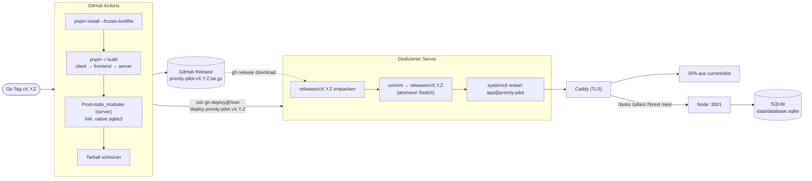
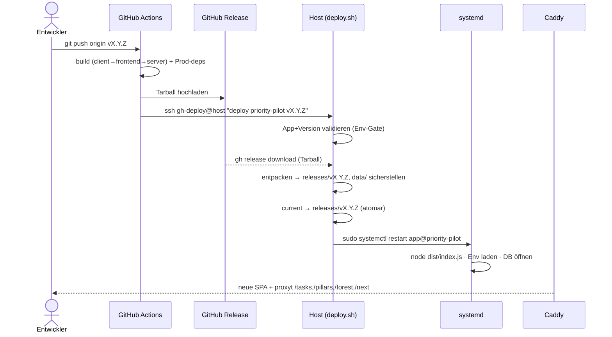

# Deployment auf einen dedizierten Server

Dieses Dokument beschreibt **Konzept und Ablauf** des Deployments von Priority Pilot auf einen
eigenen (dedizierten) Linux-Server. Es ist die operative Single Source of Truth für Releases.

> **Status:** Zielarchitektur + Referenz-Konfiguration. Die Server-Bausteine (systemd-Unit,
> Caddy-Block, `deploy.sh`, Release-Workflow) sind hier vollständig spezifiziert; beim erstmaligen
> Einrichten gegen die echten Hostnamen/Pfade prüfen. Siehe [Offene Entscheidungen](#offene-entscheidungen).

---

## 1. Überblick & Zielbild

Priority Pilot ist eine **Full-Stack-App im pnpm-Monorepo** (siehe [README](../README.md)):

- **Frontend** (`frontend/`): React 19 + KoliBri, gebaut mit Vite → statische SPA (PWA) in `frontend/dist`.
- **Backend** (`server/`): Node.js + Express 5 + Sequelize über **SQLite** → kompiliert nach `server/dist`,
  Entry-Point `server/dist/index.js` (ESM).
- **Client** (`client/`): aus `openapi.yml` generierte API-Typen, nur Build-Zeit-Abhängigkeit des Frontends.

Frontend und Backend werden **gemeinsam und versioniert** ausgeliefert: Ein Git-Tag (`vX.Y.Z`) löst in
GitHub Actions einen Build aus, das Ergebnis wird als **ein Tarball** (SPA + Backend + Prod-Dependencies)
zu einem GitHub Release gebündelt. Der Server zieht dieses Release, schaltet per Symlink um und startet
den Dienst neu.



### Multi-App-Layout

Der Server ist als **Multi-App-Host** ausgelegt: Jede App bekommt ihren eigenen Release-Baum, eigenen
Port und einen eigenen Service über **eine** systemd-Template-Unit. Eine neue App braucht **keine** neue
Unit — nur Verzeichnis, Env-Datei, Caddy-Block, sudoers-Zeile und `systemctl enable` (siehe
[Checkliste neue App](#8-checkliste-neue-app)).

### Warum systemd statt PM2?

Die Frage „ggf. PM2" ist berechtigt, aber für diesen Host nicht nötig:

- **systemd ist bereits da** — kein zusätzlicher Daemon, kein Node-Prozess, der andere Node-Prozesse
  überwacht.
- **Boot-Autostart, Restart-Policy, Logging (journald)** und **Prozess-Sandboxing**
  (`NoNewPrivileges`, `ProtectSystem=strict`, `PrivateTmp`) kommen nativ aus systemd.
- Eine **Template-Unit** (`[email protected]`) deckt beliebig viele Apps ab.

PM2 ginge auch, würde aber einen zweiten Supervisor auf bereits systemd-verwaltete Prozesse setzen —
redundant. Diese Doku setzt daher auf systemd.

---

## 2. Was genau wird ausgeliefert (Release-Artefakt)

Aus dem Monorepo entsteht **ein** Tarball mit dieser Struktur:

```
priority-pilot-vX.Y.Z.tar.gz   (entpackt im Release-Verzeichnis)
  dist/                  # Frontend-SPA  → von Caddy als file_server ausgeliefert
  server/
    dist/index.js        # Backend-Entry-Point (ESM)  → von Node gestartet
    dist/**              # restliche kompilierte Backend-Module
    package.json
    node_modules/        # PRODUKTIONS-Dependencies, inkl. native sqlite3-Binärdatei
```

Drei Punkte, die aus der Repo-Realität folgen und im Konzept leicht übersehen werden:

1. **Entry-Point ist `server/dist/index.js`** (nicht `server.js`). Quelle: `server/nodemon.json`
   (`node dist/index.js`) und `server/tsconfig.json` (`outDir: ./dist`). Das Backend ist ESM
   (`"type": "module"` in `server/package.json`).
2. **Das Backend braucht `node_modules` zur Laufzeit** — `express`, `sequelize`, `sqlite3`. `sqlite3`
   ist ein **natives Modul** (siehe Build-Allowlist `onlyBuiltDependencies` in `pnpm-workspace.yaml`); die
   kompilierte Binärdatei muss zur **Architektur und Node-ABI des Hosts** passen.
   → CI baut auf `ubuntu-latest` (x64) mit **Node 26**. Läuft der Host ebenfalls als x64-Linux mit
   Node 26, passt das Prebuild. Bei abweichender Arch/Node-Version: Prod-Deps **auf dem Host**
   installieren (`pnpm install --prod` im `server/`-Verzeichnis) statt im Tarball mitliefern.
3. **Die SQLite-Datenbank gehört NICHT in den Tarball / Release-Baum** — sie ist Laufzeitzustand und
   lebt in einem persistenten Daten-Verzeichnis (siehe [Abschnitt 4](#4-host-verzeichnislayout)).

---

## 3. Build (GitHub Actions Release-Workflow)

Es existiert bereits ein CI-Workflow (`.github/workflows/ci.yml`: install → format → lint → build →
test), der auf `main` und PRs läuft und als Qualitäts-Gate dient. Das **Release** ist ein separater
Workflow, der auf Tags reagiert. Referenz-Implementierung (`.github/workflows/release.yml`):

```yaml
name: Release
on:
  push:
    tags: ['v*.*.*']

jobs:
  release:
    runs-on: ubuntu-latest
    permissions:
      contents: write # für gh release create
    steps:
      - uses: actions/checkout@v4
      - uses: pnpm/action-setup@v4
      - uses: actions/setup-node@v4
        with:
          node-version: 26 # MUSS zur Node-Major-Version des Hosts passen (native sqlite3)
          cache: pnpm

      - name: Install
        run: pnpm install --frozen-lockfile
      - name: Build (client → frontend → server)
        run: pnpm -r build

      # Self-contained Prod-Bundle des Servers inkl. Prod-node_modules (native sqlite3 für linux-x64).
      - name: Server-Prod-Bundle
        run: pnpm --filter server deploy --prod --legacy /tmp/server

      - name: Tarball schnüren
        run: |
          mkdir -p release/server
          cp -r frontend/dist            release/dist
          cp -r /tmp/server/dist         release/server/dist
          cp    /tmp/server/package.json release/server/package.json
          cp -r /tmp/server/node_modules release/server/node_modules
          tar -czf "priority-pilot-${GITHUB_REF_NAME}.tar.gz" -C release .

      - name: GitHub Release anlegen
        env:
          GH_TOKEN: ${{ github.token }}
        run: gh release create "${GITHUB_REF_NAME}" "priority-pilot-${GITHUB_REF_NAME}.tar.gz" --generate-notes

      # Deployment anstoßen (Pull-Modell: der Host zieht das Release selbst, siehe Abschnitt 6).
      - name: Deploy auslösen
        env:
          SSH_KEY: ${{ secrets.DEPLOY_SSH_KEY }}
        run: |
          install -m600 <(printf '%s\n' "$SSH_KEY") /tmp/deploy_key
          ssh -i /tmp/deploy_key -o StrictHostKeyChecking=accept-new \
            gh-deploy@example.de "deploy priority-pilot ${GITHUB_REF_NAME}"
```

Hinweise:

- **`pnpm --filter server deploy --prod`** erzeugt ein eigenständiges Verzeichnis mit nur den
  Produktions-Dependencies. Der Server hat keine Workspace-Dependencies zur Laufzeit (`client` ist nur
  Abhängigkeit des Frontends), daher ist das Bundle sauber.
- **`DEPLOY_SSH_KEY`** ist der private Deploy-Key als GitHub-Actions-Secret. Das Schlüsselpaar liegt
  bereits im Projekt-Setup vor (`gh_deploy` / `gh_deploy.pub`, beide **gitignored** —
  private Schlüssel sind Secrets und gehören **nie** ins Repo, siehe `.gitignore`).
- **`build:api`** (Teil von `pnpm -r build`) regeneriert die Vertragstypen frisch aus `openapi.yml` und
  type-checkt dagegen — API-Drift kann so nicht in ein Release gelangen.

---

## 4. Host: Verzeichnislayout

```
/var/www/gh-deploy/
  priority-pilot/
    releases/
      vX.Y.Z/
        dist/            # SPA            → Caddy file_server
        server/          # Backend        → systemd / Node
    current -> releases/vX.Y.Z            # atomarer Symlink-Switch
    data/                                 # PERSISTENT, release-unabhängig
      database.sqlite                     # SQLite-DB überlebt jeden Deploy
  naechste-app/
    releases/…
    current -> …
    data/…
```

**Wichtig — DB-Persistenz:** Der Server liest den DB-Pfad aus `DATABASE_STORAGE` und fällt sonst auf
`./database.sqlite` **relativ zum Arbeitsverzeichnis** zurück (`server/src/database.ts`). Das
Arbeitsverzeichnis ist der `current`-Symlink — läge die DB dort, wäre sie **bei jedem Deploy verloren**.
Deshalb zeigt `DATABASE_STORAGE` auf einen **absoluten Pfad im `data/`-Verzeichnis** außerhalb des
Release-Baums (siehe Env-Datei unten). Nur `data/` ist für den Dienst beschreibbar; die Release-Bäume
bleiben unveränderlich.

---

## 5. Konfiguration (Env-Datei pro App)

Pro App eine Env-Datei unter `/etc/gh-deploy/<app>.env`, **chmod 600** (enthält Secrets). Diese Datei
ist zugleich das **Registrierungs-Gate**: deploybar ist nur, wofür eine Env-Datei existiert (siehe
`deploy.sh`).

```bash
# /etc/gh-deploy/priority-pilot.env
NODE_ENV=production
PORT=3001                                                  # Port-Konvention: 3001, 3002, …

# DB-Pfad ABSOLUT und außerhalb des Release-Baums (siehe Abschnitt 4).
DATABASE_STORAGE=/var/www/gh-deploy/priority-pilot/data/database.sqlite

# DB-Lebenszyklus — in Produktion bewusst gesetzt:
DB_SEED=false           # KEINE Demo-Daten bei jedem Start (Default würde seeden)
# DB_RESET   absichtlich NICHT gesetzt — "true" LEERT die DB bei jedem Start!

# Mistral-Integration (Säulen-Vorschläge). Fehlt der Key, antwortet /tasks/suggest-pillars mit 503.
MISTRAL_API_KEY=...
# MISTRAL_MODEL=mistral-small-latest                       # optional, Default mistral-small-latest
```

Quellen der Variablen: `server/src/index.ts` (`DB_RESET`, `DB_SEED`), `server/src/database.ts`
(`DATABASE_STORAGE`), `server/src/express/index.ts` (`PORT`), `server/src/llm/mistral.ts`
(`MISTRAL_API_KEY`, `MISTRAL_MODEL`).

**Port-Konvention:** `priority-pilot=3001`, nächste App `3002` usw. Jede App lauscht nur auf
`localhost:<port>`; Caddy terminiert TLS davor.

---

## 6. systemd: Template-Unit

Einmal anlegen, gilt für **alle** Apps. `%i` ist der App-Name. Datei
`/etc/systemd/system/[email protected]`:

```ini
[Unit]
Description=gh-deploy app %i
After=network.target

[Service]
Type=simple
User=gh-deploy
Group=gh-deploy
WorkingDirectory=/var/www/gh-deploy/%i/current/server
EnvironmentFile=/etc/gh-deploy/%i.env
ExecStart=/usr/bin/node dist/index.js
Restart=on-failure
RestartSec=5

NoNewPrivileges=true
ProtectSystem=strict
ProtectHome=true
PrivateTmp=true
ReadWritePaths=/var/www/gh-deploy/%i/data

[Install]
WantedBy=multi-user.target
```

Gegenüber dem Ausgangskonzept angepasst: `WorkingDirectory` zeigt auf `current/server`, `ExecStart`
startet `dist/index.js`, und **nur `data/` ist beschreibbar** (`ReadWritePaths`) — die Release-Bäume
bleiben unter `ProtectSystem=strict` schreibgeschützt.

Boot-Autostart aktivieren (ohne `--now` — gestartet wird erst beim ersten Deploy, vorher gibt es kein
`current`):

```bash
sudo systemctl daemon-reload
sudo systemctl enable app@priority-pilot
```

---

## 7. Caddy: ein Block pro App

Reverse-Proxy + TLS. Eigene Subdomain ist am saubersten (kein Base-Path im Frontend nötig;
`VITE_API_BASE_URL` bleibt leer → SPA spricht dieselbe Origin an).

```caddyfile
priority-pilot.example.de {
    encode zstd gzip
    root * /var/www/gh-deploy/priority-pilot/current/dist

    # API-Wurzelpfade an das Backend — MÜSSEN mit den echten Vertragspfaden übereinstimmen.
    @api path /tasks* /pillars* /forest* /next* /health*
    handle @api {
        reverse_proxy localhost:3001
    }

    # Statische Assets dürfen lange gecacht werden (hash-versioniert von Vite).
    @assets path /assets/*
    handle @assets {
        header Cache-Control "public, max-age=31536000, immutable"
        file_server
    }

    # SPA-Fallback. index.html / Service-Worker NICHT lange cachen, sonst sehen
    # Clients neue Deploys nie (PWA, vite-plugin-pwa registerType autoUpdate).
    handle {
        header /index.html Cache-Control "no-cache"
        header /sw.js Cache-Control "no-cache"
        try_files {path} /index.html
        file_server
    }
}
```

> **Korrektur gegenüber dem ersten Entwurf:** Die SPA ruft die API **nicht** unter `/api/*` auf,
> sondern direkt unter den Vertrags-Wurzelpfaden `/tasks`, `/pillars`, `/forest`, `/next`
> (plus `/tasks/suggest-pillars`). Belegt durch die Dev-Proxy-Allowlist in `frontend/vite.config.ts`
> (`^/(tasks|pillars|forest|next)`) und `openapi.yml`. Ein `handle /api/*` würde jeden API-Call 404en.
> **Pflege-Kopplung:** Kommt im Vertrag ein neuer Wurzelpfad hinzu, muss er **sowohl** in
> `vite.config.ts` **als auch** im `@api`-Matcher hier ergänzt werden.

Pfad-basiertes Routing (`example.de/priority-pilot/*`) ginge auch, macht aber SPA-Routing und Base-Path
komplizierter — bei eigener Subdomain bleibt das Frontend unverändert.

---

## 8. `deploy.sh` (Forced Command auf dem Host)

Liegt beim `gh-deploy`-User und wird über die SSH-`authorized_keys`-`command=`-Option fest an den
Deploy-Key gebunden (Forced Command), sodass der Key **nur** dieses Skript ausführen kann. App und
Version kommen als Klartext über die Leitung und werden **strikt validiert**.

```bash
#!/usr/bin/env bash
set -euo pipefail

read -r CMD APP VERSION <<< "${SSH_ORIGINAL_COMMAND:-}"

[[ "$CMD" == "deploy" ]]                       || { echo "unbekanntes Kommando" >&2; exit 1; }
[[ "$APP" =~ ^[a-z][a-z0-9-]+$ ]]              || { echo "ungueltiger App-Name" >&2; exit 1; }
[[ "$VERSION" =~ ^v[0-9]+\.[0-9]+\.[0-9]+$ ]]  || { echo "ungueltige Version" >&2; exit 1; }
[[ -f "/etc/gh-deploy/$APP.env" ]]             || { echo "unbekannte App: $APP" >&2; exit 1; }

REPO="deleonio/$APP"          # falls Repo-Name != App-Name: hier mappen
BASE="/var/www/gh-deploy/$APP"
REL="$BASE/releases/$VERSION"

source /home/gh-deploy/.deploy-token   # export GH_TOKEN=...

mkdir -p "$BASE/data"               # Persistentes DB-Verzeichnis sicherstellen (idempotent)

if [[ ! -d "$REL" ]]; then
  mkdir -p "$REL"
  gh release download "$VERSION" -R "$REPO" -p '*.tar.gz' -O - | tar -xz -C "$REL"
fi

ln -sfn "$REL" "$BASE/current"      # atomarer Switch
sudo systemctl restart "app@$APP"
echo "deployed $APP $VERSION"
```

- Der Check `-f /etc/gh-deploy/$APP.env` ist das **Registrierungs-Gate**: Ein durchgereichter Tippfehler
  oder `../` läuft ins Leere statt ins Dateisystem.
- **Pull-Modell:** Der Host zieht das Release selbst per `gh release download` (benötigt `gh` CLI + Token
  in `/home/gh-deploy/.deploy-token`). Alternativ Push-Modell — der Workflow `scp`t den Tarball direkt;
  dann braucht der Host kein GH-Token, aber der Workflow Schreibrechte ins Release-Verzeichnis.

### sudoers (eine enge Zeile pro App)

`sudo visudo -f /etc/sudoers.d/gh-deploy`:

```
gh-deploy ALL=(root) NOPASSWD: /usr/bin/systemctl restart app@priority-pilot
```

Bewusst **kein** `app@*`-Wildcard: sudo matcht per `fnmatch` großzügiger als erwartet. Eine Zeile pro App
ist enger und passt dazu, dass je neuer App ohnehin Env, Caddy-Block und `enable` angefasst werden.

---

## 9. Ablauf eines Deployments (End-to-End)



1. **Release taggen:** `git tag vX.Y.Z && git push origin vX.Y.Z`.
2. **CI-Gate** auf `main`/PR ist grün (Lint, Build, Tests) — Voraussetzung für ein sauberes Release.
3. **Release-Workflow** baut client→frontend→server, schnürt den Tarball (SPA + Backend +
   Prod-`node_modules`), legt das GitHub Release an.
4. **SSH-Trigger:** Workflow ruft `ssh gh-deploy@host "deploy priority-pilot vX.Y.Z"`.
5. **Host** validiert App+Version, lädt den Tarball (falls noch nicht vorhanden) nach
   `releases/vX.Y.Z/`, stellt `data/` sicher.
6. **Atomarer Switch:** `current` → `releases/vX.Y.Z`.
7. **Restart:** `sudo systemctl restart app@priority-pilot`. Der Dienst startet `dist/index.js`, liest
   die Env-Datei, öffnet die **persistente** DB unter `DATABASE_STORAGE`.
8. **Caddy** liefert die neue SPA aus `current/dist` und proxyt API-Pfade an `localhost:3001`.

Verifikation nach dem Deploy:

```bash
systemctl status app@priority-pilot
journalctl -u app@priority-pilot -n 50 --no-pager
curl -fsS https://priority-pilot.example.de/next   # API erreichbar?
```

---

## 10. Rollback

Einzeiler, app-spezifisch (vorheriges Release muss noch unter `releases/` liegen):

```bash
ln -sfn /var/www/gh-deploy/priority-pilot/releases/vX.Y.(Z-1) \
        /var/www/gh-deploy/priority-pilot/current \
  && sudo systemctl restart app@priority-pilot
```

Die DB liegt außerhalb des Release-Baums und ist von einem Rollback **nicht** betroffen. Achtung bei
**Schema-Migrationen**: Ein Rollback der App passt nicht automatisch zum DB-Schema einer neueren Version —
vor Schema-ändernden Releases ein `data/database.sqlite`-Backup ziehen (siehe unten).

---

## 11. Checkliste: neue App

Eine neue App braucht **keine** neue systemd-Unit. Nur:

```bash
APP=priority-pilot           # bzw. neuer Name
PORT=3001                    # nächster freier Port

# 1. Verzeichnis + Eigentümer
sudo mkdir -p /var/www/gh-deploy/$APP/releases /var/www/gh-deploy/$APP/data
sudo chown -R gh-deploy:gh-deploy /var/www/gh-deploy/$APP

# 2. Env-Datei (Registrierungs-Gate) — Secrets ergänzen!
sudo mkdir -p /etc/gh-deploy
sudo tee /etc/gh-deploy/$APP.env >/dev/null <<EOF
NODE_ENV=production
PORT=$PORT
DATABASE_STORAGE=/var/www/gh-deploy/$APP/data/database.sqlite
DB_SEED=false
MISTRAL_API_KEY=...
EOF
sudo chmod 600 /etc/gh-deploy/$APP.env

# 3. Boot-Autostart
sudo systemctl enable app@$APP

# 4. Caddy-Block ergänzen (eigener Port + echte API-Pfade) und neu laden
sudo systemctl reload caddy

# 5. sudoers-Zeile (eng gefasst, kein Wildcard)
echo "gh-deploy ALL=(root) NOPASSWD: /usr/bin/systemctl restart app@$APP" \
  | sudo tee /etc/sudoers.d/gh-deploy-$APP
```

Danach läuft jedes Deploy nur noch über `deploy <app> <version>`.

---

## 12. Sicherheit & Betrieb

- **Deploy-Key:** `gh_deploy`/`gh_deploy.pub` sind **gitignored**; der private Key liegt nur als
  GitHub-Actions-Secret (`DEPLOY_SSH_KEY`) und in `authorized_keys` des `gh-deploy`-Users vor — gebunden an
  ein **Forced Command** (`command="…/deploy.sh"`), idealerweise mit
  `no-port-forwarding,no-pty`.
- **Least Privilege:** `gh-deploy`-User darf per sudo **nur** den jeweiligen Service neu starten; die
  systemd-Sandbox (`ProtectSystem=strict`, `NoNewPrivileges`, `PrivateTmp`) begrenzt den Dienst selbst.
- **Secrets** (`MISTRAL_API_KEY`) nur in `/etc/gh-deploy/*.env` (chmod 600), nie im Repo/Tarball.
- **DB-Backup:** `data/database.sqlite` regelmäßig sichern (z. B. `sqlite3 … ".backup"` per cron),
  besonders **vor** Schema-ändernden Releases.
- **Aufräumen:** alte `releases/v*` periodisch beschneiden (z. B. die letzten 5 behalten), um Platz zu
  sparen, ohne die Rollback-Fähigkeit zu verlieren.

---

## Offene Entscheidungen

- **API-Präfix `/api`:** Aktuell liegen die Endpunkte an der Wurzel (`/tasks`, …). Falls perspektivisch
  ein `/api`-Präfix gewünscht ist, müssten Express-Routen, `vite.config.ts`-Proxy, `VITE_API_BASE_URL`
  und der Caddy-`@api`-Matcher gemeinsam angepasst werden. Bis dahin gelten die Wurzelpfade.
- **Arch-/Node-Matching:** Diese Doku nimmt x64-Linux + Node 26 auf dem Host an (passend zur CI). Weicht
  der Host ab, Prod-Deps auf dem Host installieren statt im Tarball mitliefern.
- **Hostname/Domain:** `example.de` ist Platzhalter (vgl. Kommentar im Deploy-Pubkey) und beim Einrichten
  durch die echte Domain zu ersetzen.
