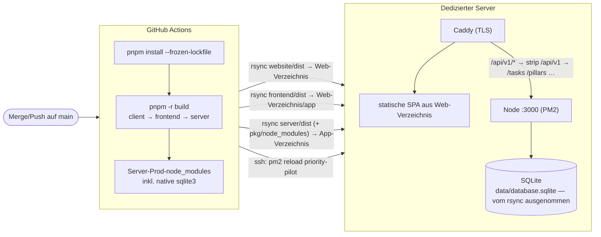

# Deployment auf einen dedizierten Server

Dieses Dokument beschreibt **Konzept und Ablauf** des Deployments von Balamentum auf einen
eigenen (dedizierten) Linux-Server. Es ist die operative Single Source of Truth für Releases.

> **Status (seit #152): vereinfachtes Deployment.** Der Ablauf ist **Merge auf `main` → Build
> in GitHub Actions → `rsync` der `dist`-Verzeichnisse auf den Server → Backend via PM2**. Es gibt
> **kein** Git-Tag, **kein** Tarball, **kein** GitHub Release, **kein** `deploy.sh`/Forced-Command
> und **keinen** systemd-Symlink-Switch mehr.

---

## 1. Überblick & Zielbild

Balamentum ist eine **Full-Stack-App im pnpm-Monorepo** (siehe [README](../README.md)):

- **Frontend** (`frontend/`): React 19 + KoliBri, gebaut mit Vite → statische SPA (PWA) in `frontend/dist`,
  ausgeliefert unter `/app/`.
- **Website** (`website/`): öffentliche, statisch vorgerenderte Landingpage (de an `/`, en unter `/en/`)
  in `website/dist`, ausgeliefert an der Wurzel ([ADR 0015](adr/0015-oeffentliche-website-und-app-unter-app.md)).
- **Backend** (`server/`): Node.js + Express 5 + Sequelize über **SQLite** → kompiliert nach `server/dist`,
  Entry-Point `server/dist/index.js` (ESM).
- **Client** (`client/`): aus `openapi.yml` generierte API-Typen, nur Build-Zeit-Abhängigkeit des Frontends.

Frontend und Backend werden **gemeinsam** ausgeliefert, aber **ohne Versions-Tag/Release-Artefakt**:
Jeder **Merge auf `main`** löst in GitHub Actions einen Build aus; die gebauten `dist`-Verzeichnisse
werden per **`rsync`** direkt in die Zielverzeichnisse auf dem Server gespiegelt. Das **Frontend** ist
eine statische SPA und liegt danach einfach im Web-Verzeichnis. Das **Backend** läuft unter **PM2** und
wird nach dem `rsync` **genau einmal** neu gestartet. Kein Tarball, kein GitHub Release, kein
Symlink-Switch, kein `deploy.sh`/Forced-Command.



### Zielverzeichnisse auf dem Server

Statt eines versionierten Release-Baums mit Symlink-Switch gibt es nur noch **zwei feste
Zielverzeichnisse**, in die `rsync` spiegelt:

- **Web-Verzeichnis** (`vars.DEPLOY_WEB_DIR`): die Website aus `website/dist` an der Wurzel und die
  statische SPA aus `frontend/dist` im Unterverzeichnis `app/`, von Caddy als `file_server` ausgeliefert.
- **App-Verzeichnis** (`vars.DEPLOY_APP_DIR`): `server/dist` + Prod-`package.json` +
  Prod-`node_modules` + `.env`, gestartet als `node dist/index.js` unter PM2.

Die **persistente SQLite-DB** (`data/`) liegt **außerhalb** dieser Pfade und wird vom `rsync`
zusätzlich per `--exclude` geschützt — sie bleibt über Deploys hinweg unverändert.

### Warum PM2 statt systemd?

Frühere Stände dieser Doku setzten bewusst auf systemd (kein zweiter Supervisor, journald,
Sandboxing). Issue #152 dreht diese Entscheidung **bewusst zugunsten von PM2** — Ziel ist hier
**maximale Einfachheit** des Deploy-Pfads:

- **Kein Privileg-/sudoers-Tanz:** Der Deploy-User braucht nur Schreibrecht auf die zwei
  Zielverzeichnisse und darf `pm2 reload` aufrufen — kein `systemctl`/Forced-Command.
- **Ein-Schritt-Neustart:** Nach dem `rsync` genügt ein `pm2 reload priority-pilot`
  (idempotent: `pm2 start …`, falls der Prozess noch nicht existiert) — das Backend startet **genau
  einmal** mit den neuen Sourcen neu.
- **Bewusst akzeptiertes Risiko:** Kein atomarer Switch / 1-Zeilen-Rollback mehr. Der kurze Moment
  teilgespiegelter Dateien wird zugunsten der Einfachheit in Kauf genommen.

PM2-Autostart nach Server-Reboot wird einmalig über `pm2 startup` + `pm2 save` eingerichtet (siehe
[server-setup.md](server-setup.md)).

---

## 2. Konfiguration (Env-Datei)

Die Env-Datei liegt als **`.env` im App-Verzeichnis** (chmod 600, enthält Secrets) und wird vom
`rsync` per `--exclude '.env'` geschützt — sie überlebt jedes Deploy. Der Server lädt sie beim Start
via dotenv (`server/src/index.ts`).

```bash
# <DEPLOY_APP_DIR>/.env
NODE_ENV=production
PORT=3000                                                  # Default des Backends (server/src/express/index.ts)

# DB-Pfad ABSOLUT und außerhalb der gespiegelten Verzeichnisse.
DATABASE_STORAGE=/var/www/gh-deploy/priority-pilot/data/database.sqlite

# DB-Lebenszyklus — in Produktion bewusst gesetzt:
DB_SEED=false           # KEINE Demo-Daten bei jedem Start (Default würde seeden)
# DB_RESET   absichtlich NICHT gesetzt — "true" LEERT die DB bei jedem Start!

# LLM: Fixe Built-ins Mistral/OpenRouter — Key liegt IMMER im ENV (siehe server/.env.example).
# Ist kein Custom-Provider aktiv, übernimmt der Fallback: Mistral (wenn Key gesetzt), sonst
# OpenRouter. Custom-Provider (Name, URL, Token) werden zur Laufzeit in der App konfiguriert
# (Einstellungen → Tab „KI-Provider“ bzw. /llm-providers-API).
MISTRAL_API_KEY=
# OPENROUTER_API_KEY=
# MISTRAL_MODEL=mistral-medium-latest
# OPENROUTER_MODEL=openrouter/free

# Anmeldung — alle fünf Pflicht in Produktion, sonst startet das Backend nicht bzw. der
# Google-Login ist nicht registriert. Konten entstehen erst beim ersten erlaubten Login.
SESSION_SECRET=
GOOGLE_CLIENT_ID=
GOOGLE_CLIENT_SECRET=
GOOGLE_CALLBACK_URL=https://priority-pilot.example.de/auth/google/callback
GOOGLE_ALLOWED_EMAILS=          # freigeschaltete Adressen, Komma-getrennt
ADMIN_EMAILS=                   # davon: Administratoren

# Feedback-Formular (Hilfe → Feedback, #1435): PAT mit Contents-Schreibrecht auf dem Vault-Repo.
# Fehlt er, antwortet POST /feedback mit 503 und das Formular meldet „Feedback ist aktuell nicht
# konfiguriert" — die Einreichung geht dann verloren.
FEEDBACK_GITHUB_TOKEN=
# FEEDBACK_GITHUB_REPO=deleonio/Obsidian    # Default, siehe server/src/express/routes/feedback.ts
# FEEDBACK_GITHUB_BRANCH=app-feedback       # Default; wird bei Bedarf von main abgezweigt
# FEEDBACK_GITHUB_DIR=Feedback              # Default-Ablageordner im Repo

# Android-App (ADR 0016/0017): Schlüsseldateien von Google-Service-Accounts, außerhalb des
# App-Verzeichnisses und chmod 600. Ohne FCM gehen Benachrichtigungen nur per Web-Push raus,
# ohne Play-Zugang lassen sich Käufe aus der App nicht prüfen (siehe server/.env.example).
# FCM_SERVICE_ACCOUNT_FILE=/var/www/gh-deploy/priority-pilot/secrets/fcm-service-account.json
# GOOGLE_PLAY_SERVICE_ACCOUNT_FILE=/var/www/gh-deploy/priority-pilot/secrets/play-service-account.json
# GOOGLE_RTDN_AUDIENCE=https://priority-pilot.example.de/api/v1/billing/google/rtdn   # Push-Endpunkt = Zielgruppe der Pub/Sub-Subscription
```

**Anmeldung und Zugang:** Nur Adressen aus `GOOGLE_ALLOWED_EMAILS` können sich anmelden; ihr Konto
legt die App beim ersten erfolgreichen Google-Login an. Neue Personen werden über die Env-Datei
plus `pm2 reload priority-pilot --update-env` freigeschaltet, nicht in der App. Mit
`OPEN_SIGNUP=true` ist die Registrierung offen: Dann darf sich jedes Google-Konto anmelden, die
Allowlist ist nicht mehr nötig (Voraussetzung für die öffentliche Website). Einrichtung des
OAuth-Clients, Login-Ablauf und Fehlerbilder: [docs/auth-setup.md](auth-setup.md).

**Provider-Strategie:** Genau EIN effektiv aktiver Provider pro Instanz — explizit per Radio in
der Settings-UI (`/settings` → Tab „KI-Provider“) gewählt, sonst der Built-in-Fallback (Mistral
vor OpenRouter, nach ENV-Key-Präsenz). Die Built-in-Keys (Mistral/OpenRouter) liegen im ENV,
Custom-Provider-Keys write-only in der DB. Ein Update-Deploy braucht außer den ENV-Keys keinen
weiteren Handgriff; alte `/llm-config`-Keys aus #640 sind mit dem Provider-System entfallen.

Ausführliche Anleitung zu LLM-Provider-Konfiguration (Mistral + OpenRouter): [docs/llm-providers.md](llm-providers.md).

Quellen der Variablen: `server/src/index.ts` (`DB_RESET`, `DB_SEED`, dotenv-Load),
`server/src/database.ts` (`DATABASE_STORAGE`), `server/src/express/index.ts` (`PORT`,
`SESSION_SECRET`, `GOOGLE_*`), `server/src/logics/allowedEmails.ts` (`GOOGLE_ALLOWED_EMAILS`, `OPEN_SIGNUP`),
`server/src/logics/adminEmails.ts` (`ADMIN_EMAILS`), `server/src/express/routes/feedback.ts` und
`server/src/logics/obsidianFeedback.ts` (`FEEDBACK_GITHUB_*`).

---

## 3. Build & Deploy (GitHub-Actions-Workflow)

Das Deployment läuft im Workflow **[`.github/workflows/deploy.yml`](../.github/workflows/deploy.yml)**
(Trigger: `push` auf `main`; `ci.yml` dient auf `main`/PRs als Qualitäts-Gate davor). Der Ablauf:

0. **Patch-Bump lokal (#286):** `npm version patch` + `chore(release): v<version> [skip ci]`-Commit,
   noch **ohne** Push. Der Bump läuft vor dem Build, weil `vite.config.ts` die Version aus
   `package.json` als `__APP_VERSION__` ins Frontend-Bundle backt (Footer) — sonst zeigte die
   App immer die Vorgängerversion des neuesten Changelog-Eintrags.
1. **Install + Build:** `pnpm install --frozen-lockfile`, `pnpm -r build` (client → frontend →
   server; `build:api` regeneriert die Vertragstypen aus `openapi.yml` und type-checkt dagegen —
   API-Drift kann so nicht in ein Release gelangen). Node-Version zentral aus `.nvmrc`.
2. **Server-Prod-Deps bündeln:** `pnpm --filter ./server --prod deploy --legacy server/deploy`
   erzeugt ein eigenständiges Verzeichnis mit nur den Produktions-Dependencies. Der Server hat keine
   Workspace-Dependencies zur Laufzeit (`client` ist nur Abhängigkeit des Frontends), daher ist das
   Bundle sauber.
3. **SSH-Key bereitstellen:** `secrets.DEPLOY_SSH_KEY` (privater Deploy-Key des `gh-deploy`-Users).
4. **rsync Website und Frontend:** `website/dist/` → `vars.DEPLOY_WEB_DIR` (`--delete`, `app/`
   ausgenommen), danach `frontend/dist/` → `vars.DEPLOY_WEB_DIR/app/` (`--delete`).
5. **rsync Backend:** `server/dist/` → `vars.DEPLOY_APP_DIR/dist/`; `package.json` +
   `node_modules/` aus dem Prod-Bundle; `data/`, `*.sqlite` und `.env` per `--exclude` geschützt.
6. **PM2-Reload:** `pm2 reload priority-pilot --update-env || pm2 start <APP_DIR>/dist/index.js
--name priority-pilot` — das Backend startet genau einmal mit den neuen Sourcen neu.
7. **Release-Commit pushen:** Erst nach erfolgreichem Deploy pusht ein App-Token den Bump-Commit
   aus Schritt 0 auf `main` (App-Token nötig, da `GITHUB_TOKEN` keine Folge-Workflows auslöst;
   `[skip ci]` verhindert die Deploy-Endlosschleife). Danach Tag `v<version>`, GitHub-Release und
   `CHANGELOG.md`. Ein roter Build hinterlässt so keine nie ausgelieferte Version auf `main`.

**Redeploy ohne Bump:** `deploy.yml` lässt sich per `workflow_dispatch` starten — dann entfallen
Bump, Push und Release. `cron.daily-version.yml` nutzt das nach seinem täglichen Minor-Bump, damit
die neue Version auch im ausgelieferten Bundle ankommt.

**Benötigte Repo-Konfiguration:** Secret `DEPLOY_SSH_KEY` sowie die Variablen `DEPLOY_HOST`,
`DEPLOY_USER`, `DEPLOY_WEB_DIR`, `DEPLOY_APP_DIR`. `SITE_URL` (z. B.
`https://priority-pilot.example.de`) ist seit dem `demo.apk`-Bau Pflicht — der Capacitor-Sync des
APK-Builds bricht ohne sie ab; für den Website-Build schreibt sie absolute canonical- und
hreflang-Links und eine `sitemap.xml`. Optional `ANDROID_PACKAGE_ID` (`de.balamentum.app`) und
`ANDROID_CERT_SHA256` (SHA-256-Fingerprints von App-Signing- und Upload-Key, durch Komma getrennt):
Damit erzeugt der Website-Build `/.well-known/assetlinks.json` für die App Links der Android-App
([ADR 0016](adr/0016-nativer-wrapper-capacitor-remote-modus.md)). Secret
`ANDROID_DEBUG_KEYSTORE_B64` (Debug-Keystore als Base64): Das Deploy baut die Debug-APK und legt
sie als `demo.apk` ins Web-Root — der Runner-Keystore wäre je Lauf neu und würde die App-Link-Verifizierung
brechen. Optional Secret `ANDROID_GOOGLE_SERVICES_JSON` (bei Build und `demo.apk` gleich): Fehlt
es, baut die APK ohne FCM-Push. Das Schlüsselpaar (`gh_deploy`/`gh_deploy.pub`,
beide **gitignored** — private Schlüssel sind Secrets) liegt im Projekt-Setup vor; Einrichtung des
Hosts siehe [server-setup.md](server-setup.md).

**Caddy** terminiert TLS davor und reverse-proxyt `/api/v1/*` (Präfix-Strip) und `/auth/*` ans
Backend — Konfiguration und Pfad-Tabelle: [server-setup.md § 7](server-setup.md#7-caddy-block--dns).

---

## 4. Rollback

Es gibt **keinen** atomaren Symlink-Switch mehr. Rollback = **Revert-Commit mergen** → `deploy.yml`
deployt den alten Stand automatisch neu. Die DB in `data/` ist davon nicht betroffen.

Achtung bei **Schema-Migrationen**: Ein Rollback der App passt nicht automatisch zum DB-Schema einer
neueren Version — vor Schema-ändernden Releases ein `data/database.sqlite`-Backup ziehen (siehe
[Sicherheit & Betrieb](#5-sicherheit--betrieb)).

---

## 5. Sicherheit & Betrieb

- **Deploy-Key:** `gh_deploy`/`gh_deploy.pub` sind **gitignored**; der private Key liegt nur als
  GitHub-Actions-Secret (`DEPLOY_SSH_KEY`) und in `authorized_keys` des `gh-deploy`-Users vor.
- **Least Privilege:** Der `gh-deploy`-User braucht nur Schreibrecht auf die zwei Zielverzeichnisse
  sowie `pm2 reload`/`pm2 start` — kein sudo, kein systemd.
- API-Keys der LLM-Provider liegen ausschließlich (write-only) in der Datenbank — nie in Env-Dateien oder im Repo (#951).
- **DB-Backup:** [`maintenance.sh`](../maintenance.sh) per Cron nightly ausführen (sichert
  `data/database.sqlite` via SQLite `.backup` mit 30-Tage-Retention — Einrichtung siehe
  [server-setup.md](server-setup.md)), besonders **vor** Schema-ändernden Releases.

---

## 6. Local-Betrieb und Cloud↔Local-Wechsel

Neben dem Cloud-Betrieb läuft Balamentum lokal: Entwicklung per `pnpm dev` (Befehle:
[project.md](../.ai-knowledge/project.md)), dauerhaftes Selbsthosting per `pnpm build` +
`node server/dist/index.js` (Autostart analog PM2, Schritt 6 in
[server-setup.md](server-setup.md)). Die App ist eine **Single-User-Anwendung** — Kapazitätsgrenzen
sind SQLite (Festplatte; alte Aufgaben archivieren ab ~100 MB, ab ~500 MB PostgreSQL erwägen) und die
LLM-Provider-Quota.

**Cloud → Local (Daten mitnehmen):**

```bash
sqlite3 <APP_DIR>/data/database.sqlite ".backup '/tmp/backup.sqlite'"   # konsistentes Backup auf dem Server
scp gh-deploy@<cloud-host>:/tmp/backup.sqlite ./database.sqlite           # lokal übernehmen
```

**Local → Cloud (Rollback):** DB zurückkopieren — auf dem Server `pm2 stop priority-pilot`, die
`database.sqlite` tauschen, `pm2 start priority-pilot`. Die Cloud-App selbst deployt weiterhin jeder
Merge auf `main` neu.

**Env-Unterschiede:** Cloud nutzt absolute Pfade (`DATABASE_STORAGE`, `DB_SEED=false`), lokal gelten
die Defaults (`./database.sqlite`, Seeding nur in leere DB). Das Frontend ruft die API in beiden
Betriebsarten unter `/api/v1/*` auf — in Produktion streift Caddy das Präfix, lokal der Vite-Dev-Proxy
(derselbe Rewrite, siehe [server-setup.md § 7](server-setup.md#7-caddy-block--dns)).

---

## 7. Übergangs-Setzung vor dem Launch (#1463)

Bestandskonten mit `plan = 'free'`, die vor einem Stichtag angelegt wurden, bekommen einmalig das
Übergangs-Tier `ultimate` und behalten so alle Funktionen. Die Setzung läuft **nicht** beim
Serverstart (`migrate.ts`), sondern nur als manueller Lauf — ein später bewusst auf `free`
zurückgesetztes Konto bleibt dadurch unberührt. Reihenfolge verbindlich:

1. **Backup** ziehen (`maintenance.sh`, siehe [Sicherheit & Betrieb](#5-sicherheit--betrieb)).
2. **Setzung** im Server-Verzeichnis (`.env` mit `DATABASE_STORAGE` wird automatisch geladen):
   `GRANDFATHER_CUTOFF=2026-10-01T00:00:00Z node dist/cli/grandfatherPlans.js`. Fehlt der Stichtag
   oder ist er ungültig, bricht das Skript ohne DB-Zugriff mit Exit-Code 1 ab. Ein zweiter Lauf mit
   gleichem Stichtag ändert 0 Konten.
3. **Prüfen:** Das Skript gibt die Anzahl geänderter Konten und die Paketverteilung aus
   (`{"free":…,"pro":…,"max":…,"ultimate":…}`). `free` darf nur noch Konten ab dem Stichtag enthalten.
4. **Schalter an:** `MONETIZATION_ENFORCED=true` in die Env-Datei, `pm2 reload` — der Wert wird pro
   Aufruf gelesen, kein Deploy nötig.

**Rückweg:** `MONETIZATION_ENFORCED` entfernen (oder `false`) und `pm2 reload` — Gating und
Kontingente sind sofort wieder aus, ebenfalls ohne Deploy. Die gesetzten Pläne bleiben bestehen.

---

## Offene Entscheidungen

- **API-Präfix `/api/v1`:** Seit #171 ruft das Frontend die Endpunkte unter `/api/v1/*` auf; Caddy und
  der Vite-Proxy streifen das Präfix ab, das Backend mountet weiterhin an der Wurzel (`/tasks`, …).
  Ändert sich das Präfix, müssen `frontend/src/api.ts` (`VITE_API_BASE_URL`), `frontend/vite.config.ts`
  und der Caddy-`handle /api/v1/*`-Block gemeinsam angepasst werden.
- **Arch-/Node-Matching:** Das Bundle enthält native `sqlite3`-Binärdateien, gebaut auf
  `ubuntu-latest` (x64) mit der Node-Version aus `.nvmrc` (26). Läuft der Host ebenfalls als x64-Linux
  mit Node 26, passt das Prebuild. Bei abweichender Arch/Node-Version: Prod-Deps **auf dem Host**
  installieren (`pnpm install --prod` im App-Verzeichnis) statt im Bundle mitliefern.
- **Hostname/Domain:** `example.de` ist Platzhalter (vgl. Kommentar im Deploy-Pubkey) und beim Einrichten
  durch die echte Domain zu ersetzen.
