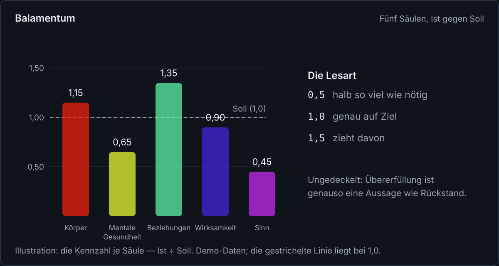
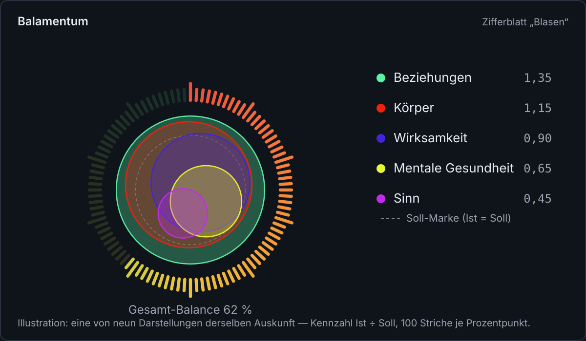
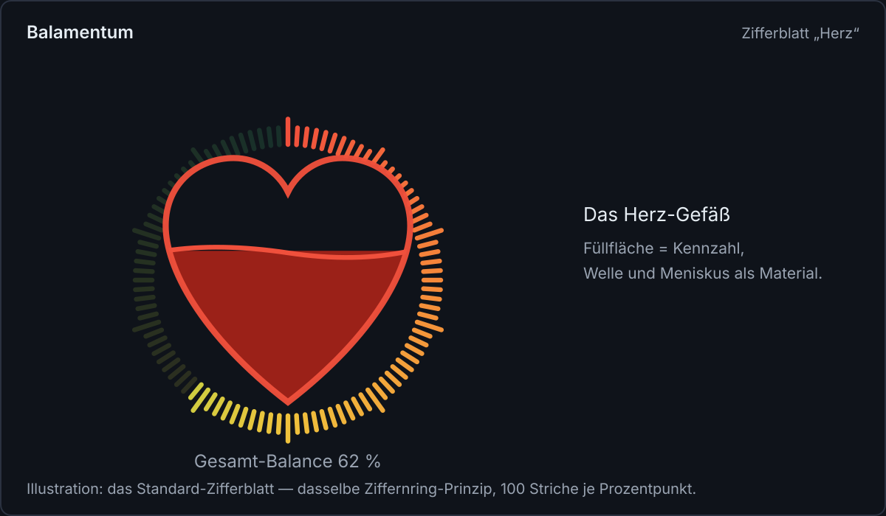
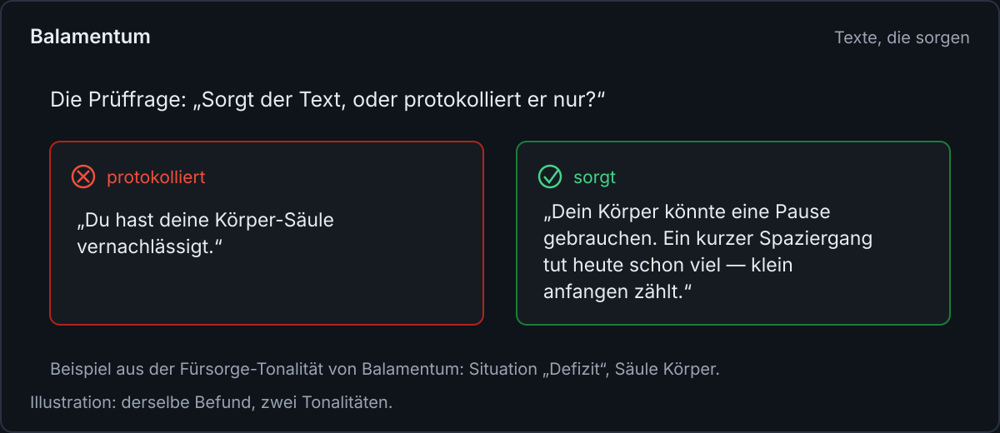

<!--
Medium-Fachartikel — Fokus-Thema: „Lebensbalance sichtbar machen“
Titel:      Wie ausgewogen ist dein Tag?
Untertitel: Eine Methode mit fünf Säulen, einer Kennzahl und einer Frage an jeden Text
Tags:       Selbstmanagement, Psychologie, Produktivität, Achtsamkeit, Work-Life-Balance
Bilder:     images/*.svg (SVG, 1200 px breit; vor dem Veröffentlichen bei Medium hochladen und
            an den Bildmarkern einsetzen). Demo-Daten sind als Illustration gekennzeichnet.
Genre:      Fachartikel — das Fachthema steht im Vordergrund; Balamentum tritt als
            Praxisbeispiel auf (keine Code- oder Architekturbezüge).
Schwesterartikel: webdev.md (englisch, technische Grundsätze für web.dev) — am Ende verlinken.
-->

# Wie ausgewogen ist dein Tag?

_Eine Methode mit fünf Säulen, einer Kennzahl und einer Frage an jeden Text_

Eine To-do-Liste ist ein Bestandsverzeichnis. Sie sagt, was offen ist, was überfällig ist und was
sich seit Wochen nicht bewegt hat. Was sie nicht sagt: wo die eigene Energie in dieser Woche
hingegangen ist. Wer jeden Tag viel erledigt und trotzdem erschöpft ist, liest aus einer Liste
ohne Inhalt den Grund dafür heraus.

Der Grund liegt meist nicht in der Menge der Aufgaben, sondern in ihrer Verteilung. Genau dort
setzt der Blick auf Lebensbalance an: Was habe ich für meinen Körper getan, für meinen Kopf, für
meine Beziehungen, für meine Wirksamkeit, für meinen Sinn? Diese Frage lässt sich methodisch
beantworten, mit fünf Säulen, einem Zielwert je Säule und einer Kennzahl, die ehrlich bleibt,
gerade dann, wenn sie unangenehm ist. Balamentum, eine Web-App zur Aufgabenpriorisierung, setzt
diese Methode um; die Schritte funktionieren aber genauso mit Papier und zehn Minuten
Wochenrückblick.

## Fünf Säulen und ein Zielwert

Balamentum startet mit fünf Säulen, angelehnt an Hilarion Petzolds Konzept der Identität:
Körper, mentale Gesundheit, Beziehungen, Wirksamkeit und Sinn. Die Säulen sind persönlich:
Jemand kann sie umbenennen, erweitern oder kürzen. Ein Musiker führt vielleicht eine Säule
„Proben“, eine Mutter eine Säule „Familienzeit“.

Wichtiger als die Namen ist der zweite Schritt: Für jede Säule ein Zielwert festlegen, in
Prozent der aufgewandten Zeit oder Aufmerksamkeit. Dieses Soll ist eine Absichtserklärung, keine
Norm. Wer Arbeit 30 Prozent zumisst und Beziehungen 20, sagt damit etwas über das Leben, das er
führen will, und nicht über das, das andere für richtig halten.

## Die Kennzahl: Ist durch Soll

Gemessen wird das Verhältnis von geleisteter Investition zu Zielwert. Zehn Prozent Aufwand bei
einem Soll von 20 ergeben 0,5: halb so viel wie nötig. Genau auf Ziel liegt 1,0. Dreißig Prozent
bei einem Soll von 20 ergeben 1,5: Die Säule zieht davon.

Der Wert wird bewusst nicht bei 1,0 abgeschnitten. Für die Gesamtrechnung ist ein Deckel
richtig: Mehr zu leisten, als das Soll verlangt, macht die Verteilung nicht besser. Für die
Anzeige wäre der Deckel eine Fälschung. Wer sein Beziehungs-Soll um die Hälfte übererfüllt, der
hat das vermutlich aus einem Grund getan, und die Anzeige soll diesen Grund sichtbar halten.
Rückstand und Übererfüllung sind beide Aussagen.

Die Gesamt-Balance aus allen Säulen rechnet streng. Sie misst doppelt, einmal gegen die
Zielgewichte und einmal ohne Gewichtung, und der niedrigere der beiden Werte zählt. Der Grund:
Eine Säule, die auf null steht, kann sich hinter ihrem kleinen Zielgewicht verstecken. Verteilt
jemand 60/0/10/10/10 bei den Gewichten 60/10/10/10/10, kommt die gewichtete Rechnung auf 0,67 und
würde als „gut in Balance“ durchgehen. Die ungewichtete Prüfung zieht denselben Fall auf 0,55, in
die leichte Schieflage. Eine leere Säule fällt immer auf.

## Sichtbarkeit braucht Form

Eine Zahl pro Säule genügt dem Kopf, dem Bauch nicht. Sichtbarkeit braucht Form, und die Form
folgt einer einzigen Regel: Die Säule mit dem größten Verhältnis bekommt die größte Form. Beim
Herz-Gefäß ist das die Füllfläche, bei Blasen der Radius, bei Strahlen die Länge.

Dazu gehört eine Soll-Marke, die Stelle, an der 1,0 läge. Eine Form ohne Bezugsgröße ist
Dekoration; erst die Marke macht aus dem Bild eine Auskunft. Und die Gesamt-Balance bekommt eine
gemeinsame Skala, einen Ring aus 100 Strichen, einer je Prozentpunkt, der sich nie bewegt, während
die Figuren in der Mitte atmen.

Balamentum liefert dafür neun Darstellungen, vom sich füllenden Herz über Blasen und Ringe bis zu
einer Blüte, deren Silhouette aus den Säulenwerten entsteht. Rechnen tun alle dasselbe. Das
Auswählen ist kein Accessoire, sondern Teil der Methode: Wer sein Gleichgewicht täglich ansieht,
sollte die Form wählen, die er ohne zu übersetzen liest.

## Rückmeldung ohne Druck

Die Figur bewegt sich. Ihr Ruhepuls dauert zwischen 1,5 und 2,6 Sekunden, und er wird ruhiger, je
ausgewogener die Balance steht. Die Anzeige atmet mit, sie mahnt nicht. Das ist eine bewusste
Entscheidung gegen die Streak-Logik vieler Gewohnheits-Apps, die Treppen zählen und beim Auslassen
mit einem zerbrochenen Ketten-Icon Reue produzieren.

Aus demselben Grund lässt sich die Bewegung abbestellen, über einen Schalter in der App und über
die Systemeinstellung für reduzierte Bewegung. Wichtig ist, was dann angezeigt wird: dasselbe
vollständige Bild, nur still. Wer Animationen ablehnt, bekommt weniger Bewegung, aber nicht
weniger Inhalt.

## Sorgt der Text oder protokolliert er nur?

Sichtbarkeit allein genügt nicht. Sobald eine Säule deutlich unter ihrem Soll liegt, spricht die
App den Menschen an, und jeder solche Text steht vor einer Frage: Sorgt er, oder protokolliert er
nur?

„Du hast deine Körper-Säule vernachlässigt“ ist eine Protokollzeile mit Anklage. „Dein Körper
könnte eine Pause gebrauchen. Ein kurzer Spaziergang oder etwas früher ins Bett tut heute schon
viel“ sorgt: Es bietet heute etwas an, es ist klein genug, um es zu tun, und es urteilt nicht.
Ein niedriger Stand ist eine Beobachtung, kein Fehlverhalten. Dasselbe gilt in der Überlast, wo
der Text die Erlaubnis gibt, zu kürzen, und bei erfülltem Soll, wo Anerkennung sichtbar macht,
was wirkt.

## Die Methode, auch ohne App

In fünf Schritten lässt sich das Verfahren ohne Werkzeug nachvollziehen:

1. Drei bis fünf Säulen festlegen, die Namen wählen, die im eigenen Leben passen.
2. Für jede Säule ein Soll in Prozent der Zeit oder Aufmerksamkeit setzen, als Absicht, nicht
   als Anspruch.
3. Einmal in der Woche das Ist schätzen, grob reicht.
4. Die Verhältnisse lesen, Rückstand und Übererfüllung gleichermaßen, und die leere Säule
   ernst nehmen, egal wie klein ihr Soll ist.
5. Einen kleinen, heute möglichen Schritt für die am weitesten zurückliegende Säule planen.

Und über jedem Text, den man sich dabei schreibt, steht dieselbe Prüffrage wie in der App: Sorgt
dieser Satz, oder protokolliert er nur.

## Verteilung statt Menge

Balance entsteht nicht durch besser sortierte Listen, sondern durch den Blick auf die
Verteilung. Fünf Säulen, ein Zielwert, eine ehrliche Kennzahl und ein Text, der sorgt, reichen
dafür als Werkzeug. Balamentum rechnet diese Methode täglich, als Web-App unter
balamentum.modevel.de und als Android-App. Für Web-Teams, die ähnliche Rückmeldungen bauen, zeigt
der Schwesterartikel auf web.dev die technischen Grundsätze dahinter: Bewegung, die man abbestellt,
Farbe, die man rechnet, und Kennzahlen, die bei der Wahrheit bleiben.
