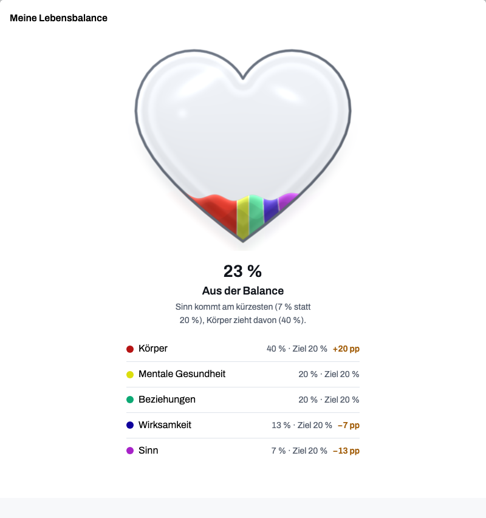
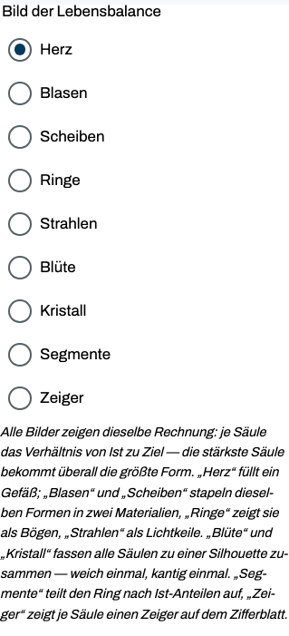
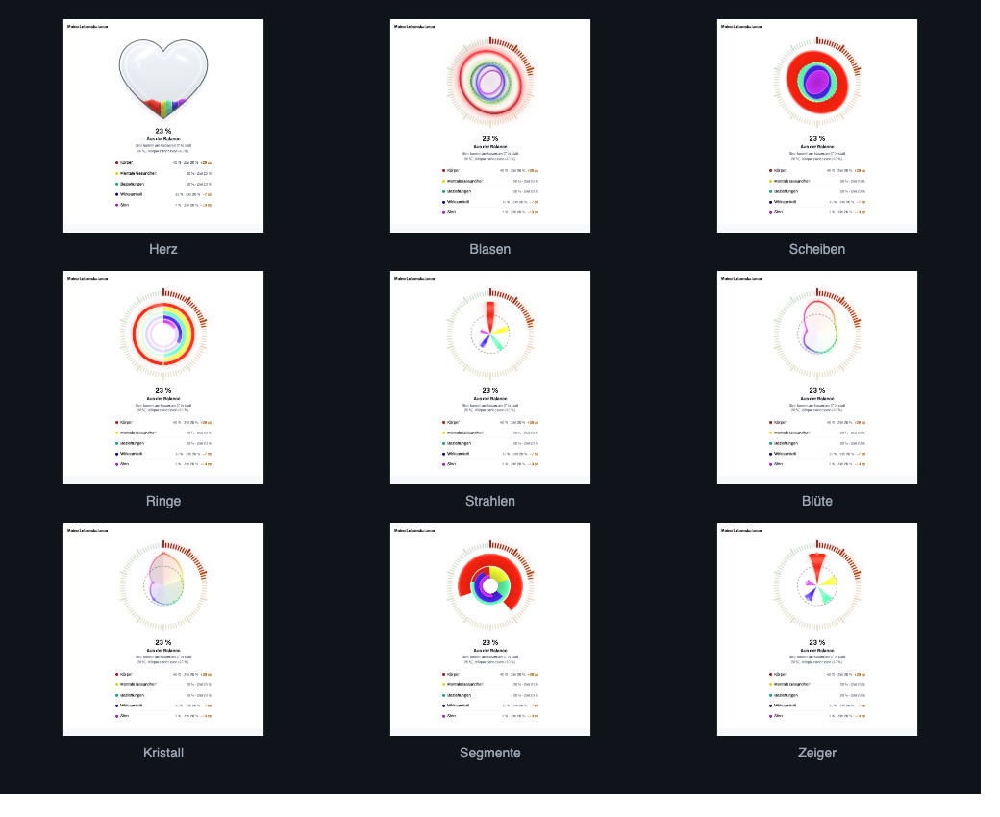
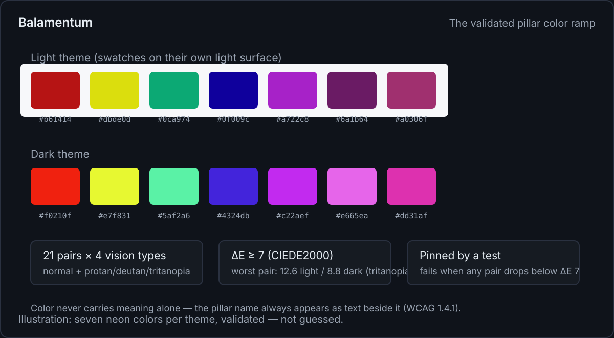
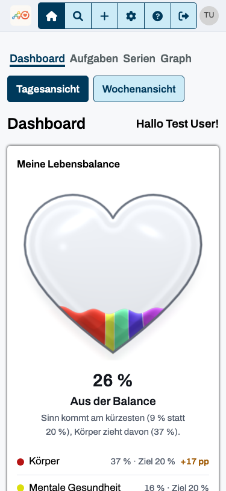

<!--
web.dev Fachartikel — Fokus-Thema: „Das Zifferblatt der Lebensbalance“ (Rendering, Farbe, Metrik)
Genre: Fachartikel für Web-Profis — allgemeine Web-Plattform-Techniken; Balamentums
Lebensbalance-Zifferblatt läuft als durchgängiges Fallbeispiel (echte App-Screenshots,
deutschsprachige UI mit Übersetzungshilfe in den Bildunterschriften). Kein Quellcode-Walkthrough:
keine Dateinamen, keine Repo-Pfade; Snippets sind allgemeine Muster. Eigenständiger Artikel ohne
Plattform-Verweise.
Bilder: images/ (Screenshots + eine SVG zur Farb-Rampe, Generator im Ordner).
-->

# One answer, nine faces: rules for an honest balance dial

_By Martin Oppitz · Balamentum_

**TL;DR:** Five rules worth stealing from the Balamentum dashboard, which draws life balance as
a dial in nine visual variants: display the unclamped ratio per pillar, cap only the aggregate,
share one geometry between two renderers, drive entrance motion from a uniform instead of the
shader clock, and validate every color pair with CIEDE2000 before it ships.



_The heart fills to 23% “aus der Balance” (“out of balance”) — demo data. The legend shows
actual versus target per pillar; “+20 pp” reads as twenty percentage points above target,
and overshoot stays visible._

## Display the unclamped ratio; cap only the aggregate

Each pillar's display metric is the ratio of actual effort to target: 12% of effort against a
20% target shows as 0.6, exceeding the target shows above 1.0. The clamp lives in the aggregate
score, not in the picture. Balamentum's overall balance is the minimum of a weighted and an
unweighted deviation measure — an empty pillar cannot hide behind its small target weight — and
it clamps at 1.0, because exceeding a target does not make a distribution better.

A worked example shows why the minimum matters. Distribute effort 60/0/10/10/10 across pillars
weighted 60/10/10/10/10: the weighted measure scores 0.67, which would pass as "well balanced";
the unweighted measure pulls the same case down to 0.55, into "slightly skewed". Display and
score answer different questions; collapsing them into one number deletes information from
both.

Normalization ends the display scale at the largest ratio present, at least 1.0, so the dashed
target mark stays inside the picture even when every pillar sits below its goal.

## Nine faces, one answer

Every variant follows a single rule — the largest ratio gets the largest form — and differs only
in material: soap-film bubbles with a Fresnel rim, hard-edged discs, faceted crystals, iridescent
petals. "Bubbles" and "discs" are the same stack in two materials; "flower" and "crystal" are the
same silhouette, smoothed once and fractured once. Users pick their dial in the settings; the
choice is stored per device.



_The picker lists all nine variants, each with its own reading guide (German UI; captions translate)._



_The full set — heart, bubbles, discs, rings, rays, flower, crystal, segments, pointers —
one answer in nine materials._

## One geometry, two renderers

Every variant draws from one geometry layer in a 100×100 field: figures top out at radius 33
plus a swing reserve below the tick ring at 40, a minimum radius keeps a pillar without a target
visible, and figures are ordered by strength with the pillar id as tie-breaker, so re-sorting
the legend never re-rolls the picture. There is a trap pinned by tests: when every pillar sits
exactly on target, all ratios are equal — without a per-pillar phase (a golden-angle offset) and
a per-pillar period, equal shapes would coincide and the best possible state would render as a
single bubble.

The WebGL shader carries the material; an SVG branch draws the same geometry without the glow.
Both consume one geometry source, so a change to the metric changes both renderings identically —
the fallback is a full-value rendering, not a degraded one.

Entrance motion must not hang on the shader clock. The render loop pauses in background tabs,
and a still frame at `u_time = 0` renders the picture empty instead of finished — the dashboard
was reopened from a background tab when this bit. Progress arrives as a uniform, and a still
frame simply passes 1.0.

```glsl
// sketch: entrance progress must not hang on the shader clock
// wrong:  float rise = clamp(u_time / 1.4, 0.0, 1.0); // still frames stand at 0
float rise = u_rise; // right: a uniform, passed in by the component
```

## Measure every color pair

Each theme defines a ramp of seven neon colors, one per pillar rank — seven ranks, not seven
pillars: users define their own pillars, and past the last rank the color goes neutral
instead of cycling. Every pair must stay distinguishable under normal vision and three
simulated color-vision deficiencies (protanopia, deuteranopia, tritanopia — a mathematical
simulation, not user testing), so the whole matrix is validated with CIEDE2000 and pinned by a
test: any pair below a ΔE of 7 fails the build. The ramp ships with its worst pairs measured —
12.6 (light) and 8.8 (dark), both under tritanopia, against the threshold of 7. Where contrast
to the background falls short, the pillar name always appears as text beside the color.



_Seven neon colors per theme — the test guards all 21 pairs across four vision types._

A detail worth borrowing for any web-components app: the component library behind Balamentum
resolves its own palette through `light-dark()` against `color-scheme`. Since `color-scheme`
inherits across the shadow boundary, the application owns the mode switch by setting both
`data-theme` and `color-scheme` on the root element. Setting only one of the two produces a
mixed state — half your palette, half the component's.

## Small screens, quiet motion

The reference viewport is 375 px; wider layouts are added with `min-width` queries, never the
reverse. Interactive elements keep 44 px touch targets by default because the accessibility-
first buttons they use enforce it, and the team's rule asks for an end-to-end test at 375×812
with every user-visible change, asserting the core content stays readable without horizontal
overflow. Motion uses two duration tokens (120 and 200 ms) that collapse under
`prefers-reduced-motion`, and the dial's heartbeat follows the fill level — the slower the
beat, the fuller the vessel — between 1.5 and 2.6 seconds. When motion is declined, the picture
stays complete, just
still.



_The dial survives the reference width; screenshots show the German UI, captions translate._

## Key takeaways

- Display the unclamped ratio per pillar; cap only the aggregate, and keep the two honest by
  separation.
- Share one geometry source between renderers; a fallback that draws different data is not a
  fallback.
- Drive entrance animation from a uniform instead of the shader clock, or background tabs render
  empty stills.
- Validate categorical color ramps with CIEDE2000 across vision types and pin the matrix in a
  test; let the name stand beside the color where contrast fails.
- Build mobile-first at your narrowest reference width and prove it with a test, not a
  screenshot.

The dial, the picker and the color matrix all run on demo data — open
[balamentum.modevel.de](https://balamentum.modevel.de) and every one of the nine dials is one
setting away.
