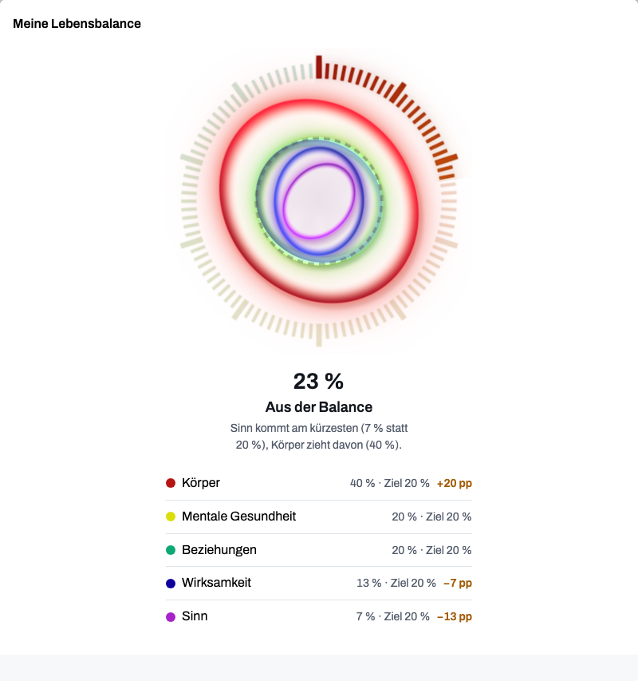

<!--
web.dev Fachartikel (1–2-Seiter) — Fokus-Thema: „Das Zifferblatt der Lebensbalance“ (Rendering, Farbe, Metrik)
Genre: Fachartikel für Web-Profis — allgemeine Web-Plattform-Techniken; Balamentums
Lebensbalance-Zifferblatt läuft als durchgängiges Fallbeispiel (echte App-Screenshots, deutschsprachige
UI mit Übersetzungshilfe in den Bildunterschriften). Kein Quellcode-Walkthrough: keine Dateinamen,
keine Repo-Pfade; Snippets sind allgemeine Muster.
Bilder: images/ (Screenshots + eine SVG zur Farb-Rampe, Generator im Ordner).
Schwesterartikel: medium.md (deutsch, Methode) — am Ende verlinken.
-->

# One answer, nine faces: rules for an honest balance dial

_By Martin Oppitz · Balamentum_

**TL;DR:** Five rules worth stealing from the Balamentum dashboard, which draws life balance as
a dial in nine visual variants: display the unclamped ratio per pillar, cap only the aggregate,
share one geometry between two renderers, drive entrance motion from a uniform instead of the
shader clock, and validate every color pair with CIEDE2000 before it ships.


_The heart fills to 23% “aus der Balance” (“out of balance”) — demo data. The legend shows
actual versus target per pillar; “+20 pp” reads as twenty percentage points above target,
and overshoot stays visible._

## Display the unclamped ratio; cap only the aggregate

Each pillar's display metric is the ratio of actual effort to target: 12% of effort against a
20% target shows as 0.6, exceeding the target shows above 1.0. The cap lives in the aggregate
score, not in the picture. Balamentum's overall balance is the minimum of a weighted and an
unweighted deviation measure — an empty pillar cannot hide behind its small target weight — and
it clamps at 1.0, because exceeding a target does not make a distribution better. Display and
score answer different questions; collapsing them into one number deletes information from both.

Normalization ends the display scale at the largest ratio present, at least 1.0, so the dashed
target mark stays inside the picture even when every pillar sits below its goal.

## Nine faces, one answer

Every variant follows a single rule — the largest ratio gets the largest form — and differs only
in material: soap-film bubbles, hard-edged discs, faceted crystals. Users pick their dial in the
settings; the choice is stored per device.


_The picker lists all nine variants; each carries its own reading guide._

## One geometry, two renderers

The WebGL shader carries the material; an SVG branch draws the same geometry without the glow.
Both consume one geometry source, so a change to the metric changes both renderings identically —
the fallback is a full-value rendering, not a degraded one.

Entrance motion must not hang on the shader clock. The render loop pauses in background tabs,
and a still frame at `u_time = 0` renders the picture empty instead of finished — the dashboard
was reopened from a background tab when this bit. Progress arrives as a uniform, and a still
frame simply passes 1.0.

```glsl
// sketch: entrance progress must not hang on the shader clock
float rise = clamp(u_time / 1.4, 0.0, 1.0); // wrong: still frames stand at 0
float rise = u_rise;                        // right: uniform from the component
```



_The bubbles variant as the material layer: thin-tinted fill, bright rim, same data as the heart._

## Measure every color pair

Each theme defines a ramp of seven neon colors, one per pillar rank. Every pair must stay
distinguishable under normal vision, protanopia, deuteranopia and tritanopia, so the whole
matrix is validated with CIEDE2000 and pinned by a test: any pair below a ΔE of 7 fails the
build. The ramp ships with its worst pairs measured — 12.6 (light) and 8.8 (dark), both under
tritanopia, against the threshold of 7. Where contrast to the background falls short, the pillar
name always appears as text beside the color.


_Seven neon colors per theme — the test guards all 21 pairs across four vision types._

## Small screens, quiet motion

The reference viewport is 375 px; wider layouts are added with `min-width` queries. Motion runs
through two duration tokens (120 and 200 ms) that collapse under `prefers-reduced-motion`, and
the dial's resting heartbeat is tied to the fill level: the fuller the heart, the slower the
beat, between 1.5 and 2.6 seconds. When motion is declined, the picture stays complete, just
still.


_The dial survives the reference width; screenshots show the German UI, captions translate._

Balamentum is a young app — what it ships today is construction and tests, not a measurement
story. The method behind the dial is the subject of the German companion article on Medium; the
app itself runs at [balamentum.modevel.de](https://balamentum.modevel.de).
