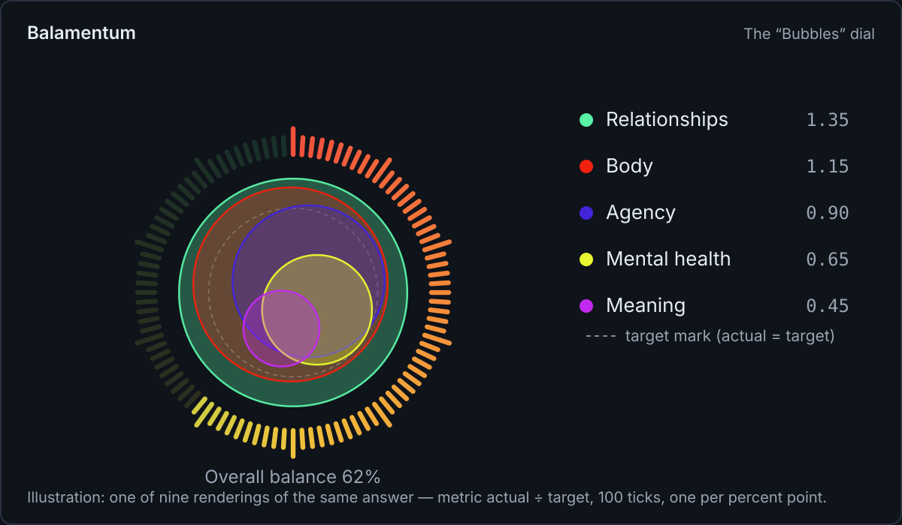

<!--
web.dev Fachartikel — Fokus-Thema: „Accessible animated data widgets“ (Motion, Farbe, ehrliche Kennzahlen)
Genre: Fachartikel für Web-Profis — allgemeine Web-Plattform-Techniken; Balamentums
Lebensbalance-Zifferblatt läuft als durchgängiges Fallbeispiel. Kein Quellcode-Walkthrough:
keine Dateinamen, keine Repo-Pfade; die Snippets sind allgemeine Muster.
Bilder: images/*.svg (SVG, 1200 px breit). Demo-Daten sind als Illustration gekennzeichnet.
Schwesterartikel (deutsch, Methode + Produkt): medium.md — am Ende verlinken.
-->

# Accessible animated data widgets: motion, color, and honest metrics

_By Martin Oppitz · Balamentum_

**TL;DR:** Data widgets carry three kinds of risk beyond the data itself: motion that hurts,
color that excludes, and numbers that flatter. This article walks through four practices that
hold up in production, drawn from a life-balance dashboard widget: treat reduced motion as a
completeness requirement, keep animation state in your app instead of the GPU clock, validate
color ramps with CIEDE2000 instead of eyeballing them, and separate the display metric from the
scoring metric.

## A running example

The example throughout is the life-balance dial on the Balamentum dashboard. It shows how evenly
a user's effort maps onto self-defined life pillars: a ring of 100 ticks, one per percent point
of overall balance, and a set of shapes in the middle, one per pillar, sized by the ratio of
actual effort to target. Nine visual variants exist, from a filling heart to an iridescent
flower; they all read from the same numbers.



The widget must survive constraints that most dashboards dodge: a 375 px phone, WebGL and no
WebGL, light and dark themes, users who see color and users who don't, and users who decline
animation entirely. Each practice below exists because one of those constraints shaped it.

## Motion you can decline

Two levels of motion support keep things honest. The general one: all interface animation runs
through duration tokens that collapse under `prefers-reduced-motion`.

```css
:root {
	--motion-fast: 120ms;
	--motion-base: 200ms;
}
@media (prefers-reduced-motion: reduce) {
	:root {
		--motion-fast: 1ms;
		--motion-base: 1ms;
	}
}
```

The specific one: a data widget that animates needs a second, in-product switch, because people
who are fine with reduced motion system-wide may still want a calm dashboard, and the other way
around. In the dial, animation is opt-out at three levels (a master switch, a per-widget switch,
and the system setting), and the fallback is a **complete, still picture**. A reduced-motion
fallback that removes content is a bug in this design, not a compromise.

The motion itself can carry meaning instead of decoration: the dial's resting heartbeat runs at
1.5–2.6 seconds and slows down as the balance improves. Feedback that calms with good states
reads differently than feedback that punishes streaks.

## Animation state belongs to the app, not the GPU clock

WebGL animations commonly derive progress from the shader clock `u_time`. That breaks the moment
the frame is rendered without a running loop: when the tab is backgrounded, or the element is
offscreen. Time stands at zero, and a picture that depends on an entrance animation renders
empty instead of finished. This is not hypothetical; it is what the dashboard looked like when
reopened from a background tab.

The fix is to move progress out of the shader and pass it in as a uniform:

```glsl
// sketch: entrance progress must not hang on the shader clock
float rise = clamp(u_time / 1.4, 0.0, 1.0); // wrong: still frames stand at 0
float rise = u_rise;                        // right: uniform from the component
```

The component sets `u_rise` to 1.0 for any still frame, so animated and static rendering share
one code path. The general rule: anything the frame needs in order to be correct must not depend
on the assumption that frames keep coming.

## Color ramps you can measure

Categorical ramps fail quietly. Two colors look distinct to you and collapse for a person with
deuteranopia. The dial's pillar ramp is therefore measured, per theme, against every color pair
under normal vision, protanopia, deuteranopia and tritanopia, using CIEDE2000 with a minimum ΔE
of 7. The worst pair in production measures 12.6 (light theme) and 8.8 (dark theme), both under
tritanopia, and a unit test fails if any pair drops below the threshold.

```ts
// sketch: any CIEDE2000 implementation works; the point is the test, not the library
for (const [a, b] of allPairs(ramp)) {
	expect(ciede2000(a, b)).toBeGreaterThanOrEqual(7);
}
```


Measurement is only half of it. Where colors sit below a 3:1 contrast against their background,
as light-theme accents often do, color must never carry meaning alone: the pillar name is always
rendered as text beside the color, which satisfies WCAG 1.4.1.

A related detail for any web-components app: component libraries that own their palette, like
KoliBri, resolve it through `light-dark()` against `color-scheme`. Since `color-scheme`
inherits across the shadow boundary, the application owns the mode switch by setting both
`data-theme` and `color-scheme` on `<html>`. Setting only one of the two produces a mixed state,
half your palette and half the component's.

## Metrics that stay honest

Data widgets inherit a scoring metric and are tempted to display it. Keep the two apart. The
dial's _scoring_ caps the ratio of actual to target at 1.0, because exceeding a target does not
improve the distribution. The _display_ keeps the ratio unclamped: 10% of effort against a 20%
target shows as 0.5, and 30% shows as 1.5. Overshooting is information, and a clamped display
silently deletes it.

Two more choices keep the aggregate honest. Normalization: the scale ends at the largest ratio
present (at least 1.0), so the target mark stays inside the picture even when every value sits
below its goal. Strictness: the overall balance is the minimum of a weighted and an unweighted
deviation measure, so an empty pillar cannot hide behind a small target weight. A distribution
of 60/0/10/10/10 against weights of 60/10/10/10/10 scores 0.67 weighted, which passes as
"well balanced"; the unweighted component pulls it to 0.55, into "slightly skewed".

## Key takeaways

- Treat `prefers-reduced-motion` as a completeness requirement: the fallback is a full, still
  rendering, not a stripped one. Add an in-product switch for widgets people stare at.
- Never derive frame correctness from the shader clock. Pass animation progress in as a uniform
  and set it to 1.0 for still frames.
- Validate categorical color ramps with CIEDE2000 across vision types and pin the matrix in a
  test. Where contrast fails, let the name stand next to the color (WCAG 1.4.1).
- Display the unclamped metric; keep caps in the scoring. An honest widget shows overshoot.
- With `light-dark()`-based component palettes, set `data-theme` **and** `color-scheme` on the
  root element, or you ship a mixed state.

The method behind the widget, five life pillars, actual versus target, and texts that care
instead of logging, is the subject of the companion article on Medium (German).
