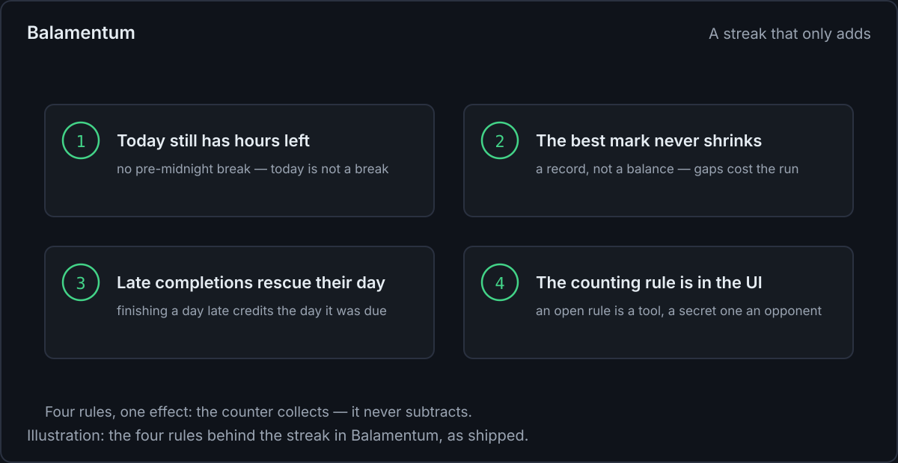
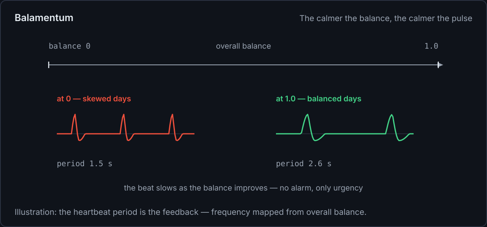
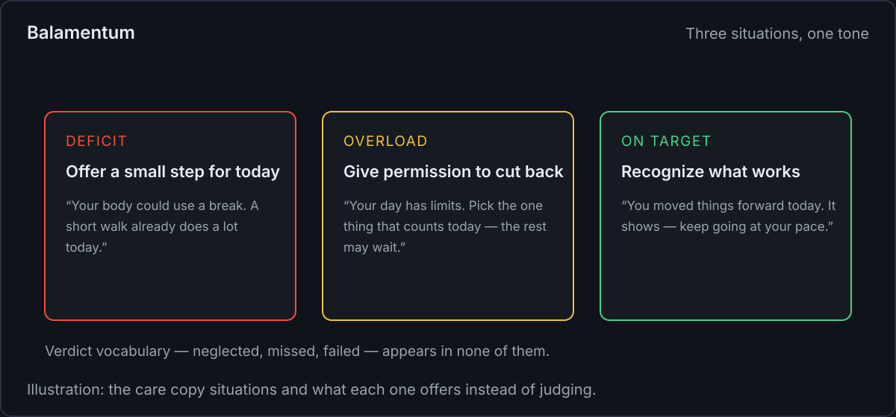
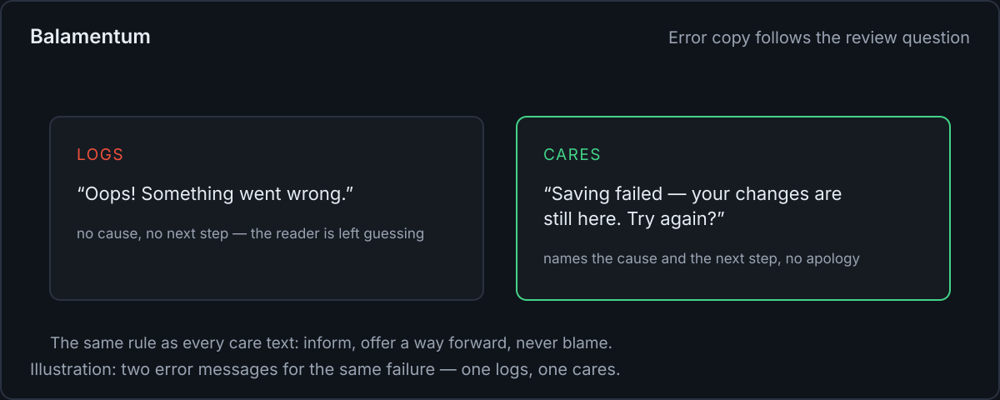

<!--
dev.to-Feldbericht — Fokus-Thema: „Rückmeldungen ohne Druck“ (Streak-Regeln, Puls, Texte, Zustände)
Genre: Entwickler-Feldbericht, erste Person, praktisch — allgemeine Muster mit kurzen Skizzen,
keine Repo-Auszüge (Dateinamen und Pfade bleiben draußen; Zahlen stammen aus dem Produkt, Snippets
sind als „sketch“ markiert).
Bilder: images/*.svg (SVG, 1200 px breit). Illustrationen, keine Screenshots.
Schwesterartikel: medium.md (deutsch, Methode, Medium) und webdev.md (englisch, web.dev).
-->

# My app has a streak — I designed it so it can never take anything away

Streaks have a reputation. The chain breaks, the counter resets to zero, and the app you opened
every day becomes the app you avoid. Most advice about this ends with "don't build streaks".

I shipped one anyway. Balamentum, my prioritization app, counts calendar days with at least one
completed task. What makes it work is not the counting — it's four rules that make sure the
counter can never take anything away. Here they are, plus the pulse, the copy gate, and the
state design around them.



## Rule 1: today still has hours left

The obvious implementation breaks the chain whenever today has no completion yet. That punishes
people for the time of day. My version keeps the visible chain standing while it reaches
yesterday — a day only counts as broken when there's a real gap up to yesterday.

```ts
// sketch: the current chain ignores an unfinished today
const current = chainEndingAt(isDayOver ? today : yesterday);
```

One line, no grace periods to configure, and the 11 pm check-in stops feeling like a deadline.

## Rule 2: the best mark is a record, not a balance

The longest chain ever achieved stays achieved. It never shrinks, it never expires. A gap costs
the current run, nothing else.

```ts
const best = Math.max(previousBest, current); // records only grow
```

That's the whole design. The number on the screen is a floor, not a debt account: the worst thing
tomorrow can do is leave it unchanged.

## Rule 3: a late completion rescues the deadline day

If a task is completed a day after its deadline, the day it _was due_ still counts as active. I
feed both timestamps — completion and, when late, the deadline — into the day set. Being human
deletes no progress.

## Rule 4: the counting rule is written in the UI

A disclosure next to the counter explains exactly how it's counted. This sounds like a footnote
and is the most important rule of the four. A counter with secret rules feels like an opponent
that punishes on its own authority. A counter with open rules is a tool — you can argue with a
tool, you can only fear an opponent.

Milestones attach to the counter and stay reached once earned, and a quiet "day done" note marks
the empty evening. No sirens.

## The pulse: feedback that calms

Beside the streak, the dashboard shows a balance figure that answers "how evenly is my effort
distributed?" It pulses with a resting heartbeat between 1.5 and 2.6 seconds — and the frequency
is the feedback: the more balanced the effort, the calmer the pulse. No alarm at a skewed state,
just a slightly more urgent beat.

```css
/* sketch: one custom property drives the beat; the app sets it from balance */
.heart {
	animation: beat var(--heartbeat) infinite ease-in-out;
}
```

The motion is declinable (in-app switch plus `prefers-reduced-motion`), and the fallback is the
complete still rendering — less motion, never less content.



One more anti-pressure decision hides in the math: the balance score caps the actual/target ratio
at 1.0. Exceeding a target doesn't improve your balance, so the widget cannot be won through
overwork. Overload pays nothing into the number.

## The copy gate: does it care, or does it just log?

Every care text has to pass one review question: _does the text care, or does it just log?_ A
logging text states a number and implies a verdict. A caring text offers something for today.

"Your body has been neglected" logs. "Your body could use a break. A short walk or an earlier
night already does a lot today — starting small counts" cares: one small step, doable today, no
verdict. Three situations cover everything — deficit gets a small step, overload gets permission
to cut back, a met target gets recognition. Words like "neglected", "missed" or "failed" don't
appear in any of them.



## The four states

The same thinking goes into the plumbing. Every view that loads data gets four designed states —
loading, empty, error, success. Empty is an invitation, not a blank rectangle. Errors name the
cause and the next step ("Saving failed — your changes are still here. Try again?"), no
apologies, no bare codes. Feedback on input lands in under 100 ms, a skeleton beats a bare
spinner, and a toast is never the only home for an error.



## What that buys

The feedback never becomes a debt account. Opening the app is never a confrontation: the streak
can't have collapsed overnight, the best mark survived, the pulse is calm when things are good
and only slightly more urgent when they aren't, and every text offers instead of judges. The
truth is still there — a low pillar shows up clearly — but nothing in the loop subtracts.

If you want to poke at it: the app runs at [balamentum.modevel.de](https://balamentum.modevel.de)
(web + Android). The German companion article on Medium covers the method behind these decisions,
and the web.dev piece condenses them into general practices for the web platform.
