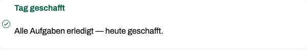

<!--
dev.to-Feldbericht — Fokus-Thema: „Rückmeldungen ohne Druck“ (die vier Streak-Regeln)
Genre: Entwickler-Feldbericht, erste Person, praktisch — allgemeine Muster mit kurzen Skizzen,
keine Repo-Auszüge (Dateinamen und Pfade bleiben draußen; Zahlen stammen aus dem Produkt, Snippets
sind als „sketch“ markiert und im Text als Skizzen erkennbar). Eigenständiger Artikel ohne
Plattform-Verweise.
Bilder: images/ (echte App-Screenshots, deutschsprachige UI mit Übersetzungshilfe).
-->

# My streak can't take anything away — four rules, one timezone trap

Streaks have a reputation: the chain breaks, the counter resets, the app becomes the thing you
avoid. I ship one anyway. Balamentum, my prioritization app, counts calendar days with at least
one completed task. What makes it work is not the counting — it's four rules that make sure the
counter never takes anything away from what you did — the only removal is a deletion, and that
one is on you. Same trigger as every guilt mechanic; a different outcome by construction,
because nothing in the loop subtracts.

The setting in one paragraph: Balamentum ships five fixed life-balance pillars; completed tasks
pay into them; and the streak answers one question per calendar day — did anything get done at
all?
Multiple completions on the same day count once. Everything below is about making that question
safe to answer.


_Demo data, German UI: „1 Tag in Folge erledigt, 1 Tag Bestmarke“ — current run and best mark
differ only once a gap happened. The disclosure link (“So zählt der Streak”, "how the streak is
counted") is part of the card._

## Rule 1: today still has hours left

The obvious implementation breaks the chain whenever today has no completion yet. That punishes
people for the time of day. My version is blunter: the visible chain simply ends at yesterday or
today — never further back.

```ts
// sketch: the chain runs up to today or yesterday, never further back
const current = chainEndingAt(latestActiveDayOrYesterday);
```

A day in between breaks it; an unfinished today never does. The evening belongs to whoever
still has it.

## Rule 2: the best mark is a record, not a balance

The longest chain ever achieved stays achieved. It never shrinks, it never expires.

```ts
// sketch: derive the record from the day set — nothing stored, nothing to forget
const best = Math.max(...runLengths(daySet));
```

Why derive it instead of storing it as a field? Because the day set is the single source of
truth: a correction or a backdated entry updates the chain automatically, and the record follows.
The number on the screen is a floor, not a debt account: the worst thing tomorrow can do is leave
it unchanged.

## Rule 3: a late completion rescues the day it was due

If a task is completed after its deadline — a day later, ten days later, doesn't matter — the
day it _was due_ still counts as active. I feed both timestamps, completion and deadline, into
the day set. Being human deletes no progress.

The trap I nearly stepped in lives one level deeper: what counts as "a day"? The server lives in
UTC; the user lives in Berlin. A completion shortly after midnight German time falls on the
_previous_ day's UTC date — in summer as in winter, only the hour differs. Count the day
server-side and the hidden midnight sits in every German's early morning: the task you finished
at 00:30 belongs to the evening you already said goodnight to. So the day boundary is computed
per user timezone, not per server:

```ts
// sketch: a calendar day is a user-local fact — so is isDayOver
const dayOf = (timestamp: Date) => localCalendarDate(timestamp, userTimezone);
```

One honesty footnote: when no valid timezone arrives, the implementation falls back to server
time instead of guessing. The fallback is documented; the rule above is the normal path.

Two more traps surfaced once the counter met real calendars. Daylight saving time: distances
are measured in calendar days, not in hours, so the 23-hour spring night and its 25-hour
autumn sibling never split a chain — a gap is a missing date, not a missing number of hours.
And volume: a day is a set member, not a counter, and ten completions buy the same active day
as one. My first instinct was to reward the heavy days; the counter refuses, on principle. It
tracks that someone showed up, not how much they carried.

## Rule 4: the counting rule is written in the UI

A disclosure next to the counter explains exactly how it's counted. This is the most important
rule of the four: a counter with secret rules feels like an opponent that punishes on its own
authority. A counter with open rules is a tool — you can argue with a tool, you can only fear an
opponent.

One honest limit: my rules protect the count against the calendar, not against the trash can.
Delete the last completion of a day and that day drops out of the set — the count follows what
stands. That's
intended, and it belongs in the article.

## Around the counter

Two neighbors share the dashboard and the same design rule. The balance figure pulses at
1.5–2.6 seconds, and the beat slows as the vessel fills. Declinable, complete as a still picture
when motion is off. And every care text passes one review question — _does the text help the
reader today, or does it just keep records?_ — including the empty case, where the
card admits it has nothing to offer:


_„Gerade gibt es keinen Vorschlag für dich. Mach in deinem Tempo weiter.“ — "There's no
suggestion for you right now. Continue at your pace."_

The display shows what the score hides: the per-pillar ratio stays unclamped, so overshoot
stays visible; the aggregate refuses to reward it. Pushing past a target changes
nothing about your balance — overwork is not a strategy the number understands. And when
everything is done, the dashboard says so quietly:



_„Tag geschafft“ — "day done": a note, not a siren._

## The mobile view carries it all

The same dashboard on the reference width — 375 px — with the balance heart and the beat intact.
Feedback that only works on desktop isn't feedback for the pocket.


_Mobile view, another demo state (26%) — the heart at the reference width; the pillar legend
continues below the fold._

## What I can and can't claim

I can't show you retention numbers yet — the feature is young. What I can show is the
construction: nothing in the loop subtracts, every rule is disclosed, and the day boundary is a
user-local fact. Whether that keeps people opening the app is a question for data I don't have;
that it never turns progress into a debt is a question the design answers.

Try it at [balamentum.modevel.de](https://balamentum.modevel.de) (web + Android).

If you're building a counter of your own: what does yours subtract? I'd like to hear the edge
cases I haven't hit yet — the timezone trap came from a reviewer, the next one might come from
this post.
