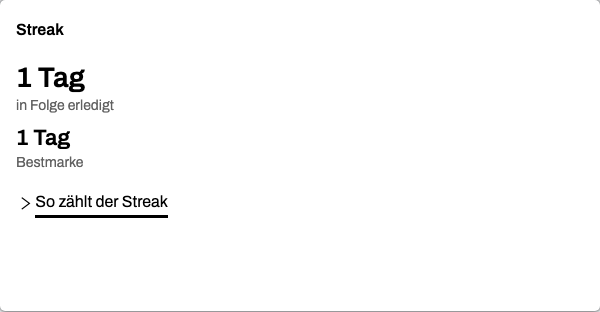

<!--
Medium-Fachartikel — Fokus-Thema: „Rückmeldungen ohne Druck“
Titel:      Ein Streak, der nichts nehmen kann
Untertitel: Wie Balamentum Fortschritt zählt, ohne Schulden zu erzeugen — und was dabei an Grenzen bleibt
Tags:       Produkt-Design, Gewohnheiten, Psychologie, UX-Design, Motivation
Bilder:     images/ (echte App-Screenshots aus der laufenden App mit Demo-Daten; vor dem
            Veröffentlichen bei Medium hochladen und an den Bildmarkern einsetzen).
Genre:      Fachartikel — Balamentum tritt als Praxisbeispiel auf, eigenständig ohne
            Plattform-Verweise.
-->

# Ein Streak, der nichts nehmen kann

_Wie Balamentum Fortschritt zählt, ohne Schulden zu erzeugen — und was dabei an Grenzen bleibt_

Kennst du das? Die Kette hält seit drei Wochen, du öffnest die App jeden Abend — und dann
passiert ein Tag. Krankheit, Überstunden, ein Umzug, was auch immer. Am nächsten Morgen
zeigt dir dieselbe App einen auf null gefallenen Zähler, und der Grund, warum du die App
installiert hattest, fühlt sich plötzlich wie eine Schuld an. Manche Menschen deinstallieren an
genau diesem Punkt; der Zähler, der sie täglich abholte, sieht plötzlich wie ein Gläubiger aus.

Das Problem ist nicht der Zähler. Es ist, dass er nimmt. Balamentum, eine Web-App zur
Aufgabenpriorisierung, führt trotzdem einen Streak — gebaut nach vier Regeln, die ihn zum reinen
Sammeln machen. Der Unterschied zu einer gängigen Bauart zeigt sich nicht am Auslöser; er zeigt
sich daran, was der Zähler mit einem leeren Tag macht.

_Demo-Stand aus der laufenden App: „1 Tag in Folge erledigt, 1 Tag Bestmarke“ — laufende Folge
und Bestmarke unterscheiden sich erst, wenn eine Lücke lag; die Card legt offen, wie gezählt
wird._

## Die vier Regeln

**1. Der laufende Tag zählt noch nicht als Bruch.** Reicht die Folge bis gestern, bleibt sie
stehen — der Abend gehört dem, der ihn noch hat. Erst eine echte Lücke setzt den Zähler sichtbar
auf null. Eine gängige Bauart bricht die Kette schon, wenn heute noch nichts abgehakt wurde,
und verwandelt die Tageszeit in ein Urteil: Wer um 23 Uhr öffnet, hat denselben Tag wie wer um
9 Uhr öffnet.

**2. Die Bestmarke überdauert jede Lücke.** Sie ist ein Rekord, kein Guthaben, das verfällt.
Eine Lücke kostet die laufende Folge, niemals den Rekord. Dreißig zusammenhängende Tage bleiben
dreißig, auch wenn die aktuelle Folge längst neu beginnt — der Bildschirm bewahrt, was du
geleistet hast.

**3. Eine verspätete Erledigung rettet den Fälligkeitstag.** Wird eine Aufgabe nach ihrer
Fälligkeit abgehakt — egal wie viel später —, zählt auch der vorgesehene Tag als erfüllt.
Nachreichen löscht keinen Fortschritt. Und der Tag selbst gehört der Person: Der Zähler rechnet
in ihrer Zeitzone, nicht in der des Servers. Wer kurz nach Mitternacht deutscher Zeit abhakt,
darf nicht ins Vortages-Datum des Servers rutschen.

**4. Die Zählregel steht in der App.** Aufklappbar hinter „So zählt der Streak“. Ein Zähler mit
offener Regel ist ein Werkzeug; ein Zähler mit geheimer Regel wirkt wie ein Gegner, der nach
eigenem Ermessen straft. Transparenz ist die eigentliche Gegenmaßnahme gegen Schuld.

Diese Regeln schützen gegen den Kalender, nicht gegen den Papierkorb: Wer eine Erledigung
löscht, nimmt den Tag aus der Zählung. Das ist gewollt — die Zählung folgt dem, was steht — aber
es gehört zur Ehrlichkeit des Designs dazu.

## Rückmeldung, die mit der Balance ruhiger wird

Neben dem Streak zeigt das Dashboard die Lebensbalance als Herz-Gefäß. Sein Ruhepuls dauert
zwischen 1,5 und 2,6 Sekunden, und mit vollerem Herzen schlägt es langsamer. Kein Alarm bei
Schieflage, kein rot blinkendes Symbol.

Die Rechnung dahinter kann nicht durch Überarbeitung gewonnen werden: Wer das Soll einer Säule
übererfüllt, verbessert die Gesamt-Balance dadurch nicht — die Anzeige zeigt die Übererfüllung
trotzdem deutlich, nur der Gesamtwert zahlt nichts darauf ein. Überlast ist keine Strategie für
den Zähler.

_Demo-Stand: 13 erledigt, 3 offen — und eine Fürsorge-Karte, die auch dann etwas anbietet, wenn
sie nichts vorzuschlagen hat._

## Die Prüffrage für jeden Text

Jeder Hinweis der App muss eine Frage bestehen: Sorgt der Text, oder protokolliert er nur? Ein
protokollierender Text stellt fest und klagt an („Du hast deine Körper-Säule vernachlässigt“).
Ein sorgender Text bietet heute etwas an, klein genug, um es zu tun, und urteilt nicht. Drei
Situationen decken alles ab: Bei Defizit kommt ein kleiner, heute möglicher Schritt. Bei
Überlast gibt der Text die Erlaubnis, kürzer zu treten — „dein Kopf darf Auszeit haben“. Bei
erfülltem Soll anerkennt er, was wirkt.

Auch die Leere passiert diese Prüfung. Wenn die App nichts vorzuschlagen hat, steht es genau so
da — und die Krisen-Zeile, die immer mit an Bord ist, gehört zum Ton: sie begleitet, sie
alarmiert nicht.

_„Gerade gibt es keinen Vorschlag für dich. Mach in deinem Tempo weiter.“ — das Leere-Beispiel
aus der laufenden App._

Die Wortsperre ist Teil der Prüffrage: „vernachlässigt“, „verschlafen“, „verpasst“ kommen in
diesen Texten nicht vor. Ein niedriger Stand ist eine Beobachtung, kein Fehlverhalten.

## Auch die Technik darf nicht drücken

Rückmeldung ohne Druck endet nicht bei Wortwahl und Puls. Die Regel für jede Ansicht, die Daten
lädt: vier gestaltete Zustände — Laden, Leer, Fehler, Erfolg. Der Leerzustand lädt zum Handeln
ein. Der Fehlerzustand nennt, was passiert ist, und wie es weitergeht, ohne Entschuldigungsläufe
und ohne nackten Fehlercode. Rückmeldung auf eine Eingabe soll in unter 100 Millisekunden
kommen, mindestens als Press-Zustand; bei bekannter Struktur gibt es ein Skeleton statt eines
Spinners. Und nichts blinkt oder pulsiert dauerhaft — die eine dauerhafte Bewegung des
Dashboards, die Figur, ist die, die sich abbestellen lässt.

## Drei Entscheidungen zum Mitnehmen

Diese lassen sich ohne die App nachbauen:

1. Zähle Fortschritt additiv: Beste Folge als Rekord führen, den laufenden Tag nicht vorzeitig
   als Bruch werten, nachgereichte Erledigungen für ihren geplanten Tag zählen lassen — gerechnet
   in der Zeitzone der Person.
2. Miss jede Rückmeldung an einer Frage: Beobachtet sie, oder urteilt sie? Zu jedem Befund gehört
   ein kleiner, heute möglicher Schritt.
3. Markiere Erfolg leise und immer abbestellbar — eine Notiz statt einer Sirene.

Ob das Verhalten nutzerwirksam ist, dazu habe ich noch keine Zahlen. Belegbar ist der Bau: Die
laufende Folge darf auf null fallen, die Bestmarke nicht, und keine Rückmeldung ruft den
Misserfolg.

Balamentum läuft als [Web-App](https://balamentum.modevel.de), dazu als Android-App. Wer die
vier Regeln im Detail nachbauen möchte, findet sie genau so, wie sie hier stehen — inklusive der
offen einsehbaren Zählregel.
