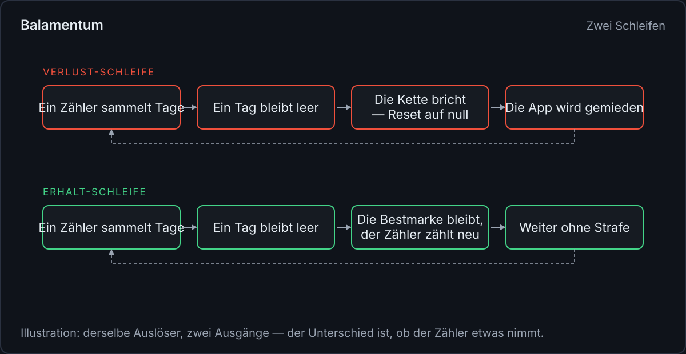
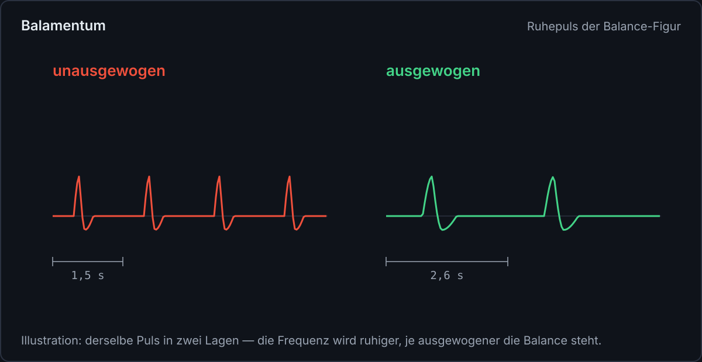
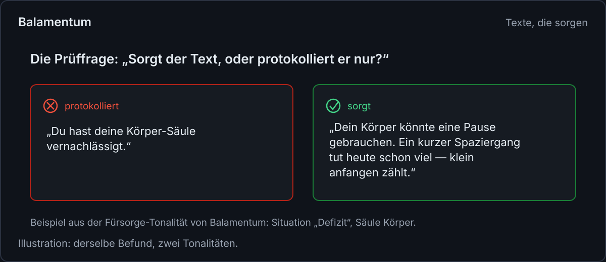

<!--
Medium-Fachartikel — Fokus-Thema: „Rückmeldungen ohne Druck“
Titel:      Rückmeldungen ohne Druck
Untertitel: Wie ein Streak zählt, ohne zu nehmen — und was eine Figur, ein Text und vier Zustände damit zu tun haben
Tags:       Produkt-Design, Gewohnheiten, Psychologie, UX-Design, Motivation
Bilder:     images/*.svg (SVG, 1200 px breit; vor dem Veröffentlichen bei Medium hochladen und an den
            Bildmarkern einsetzen). Illustrationen mit Demo-Daten, keine Screenshots.
Genre:      Fachartikel — das Fachthema steht im Vordergrund; Balamentum tritt als Praxisbeispiel auf.
Schwesterartikel: webdev.md (englisch, web.dev) und devto.md (englisch, dev.to) — am Ende verlinken.
-->

# Rückmeldungen ohne Druck

_Wie ein Streak zählt, ohne zu nehmen — und was eine Figur, ein Text und vier Zustände damit zu tun haben_

Sprach-Apps feiern ihre Feuer-Icons, Schrittzähler belohnen Serien, manche Kalender färben sich,
wenn ein Tag ungenutzt blieb. Diese Rückmeldungen funktionieren, kurzfristig. Wer eine Kette von
dreiundzwanzig Tagen hält, geht abends noch einmal an die App, um nicht vierundzwanzig zu sagen.

Dann passiert das, was Ketten tun: Sie reißen. Und die Rückmeldung, die vorher Antrieb war, wird
zur Anklage. Der nächste Blick auf die App ist ein Blick auf das, was man verloren hat. Viel zu
viele solcher Blicke, und die App wird gemieden — gerade von den Leuten, die sie am nötigsten
bräuchten.

Dieser Artikel fragt, wie Rückmeldung gestaltet sein muss, damit sie informiert, ohne zu drücken:
ein Zähler, der nichts nimmt, eine Figur, die ruhiger wird, je besser es dem Menschen geht, Texte,
die sorgen statt zu protokollieren, und Zustände, die niemanden anfahren. Als Praxisbeispiel
dient Balamentum, eine Web-App zur Aufgabenpriorisierung. Sie führt einen Streak — und ist
bewusst so gebaut, dass dieser Streak nichts nehmen kann.

## Was eine Kette anrichtet

Die klassische Streak-Mechanik belohnt Wiederholung, nicht Wirkung. Ein einziger leerer Tag
stellt den Zähler auf null, gleichgültig ob der Grund Krankheit, Urlaub oder Überlast war. Damit
wird die Rückmeldung ein Verlustkonto: Jeder Zählerstand ist zugleich die Erinnerung an das, was
einmal mehr dastand.

Die Schleife, die dabei entsteht, hat vier Schritte. Ein Zähler sammelt Tage, ein Tag bleibt
leer, die Kette bricht und der Zähler fällt auf null, die App wird gemieden. Der Auslöser ist
derselbe wie in jeder anderen App auch. Der Unterschied liegt im Ausgang — und der liegt daran,
ob der Zähler etwas nimmt.

## Zähler, die nur hinzufügen

Der Streak in Balamentum zählt Kalendertage mit mindestens einer Erledigung. Mehrere Erledigungen
am selben Tag zählen einmal; es geht um die Frage, ob an diesem Tag überhaupt etwas abgehakt
wurde. Um diese Frage schuldarm zu beantworten, folgen vier Regeln.

Erstens zählt der laufende Tag noch nicht als Bruch. Reicht die Folge bis gestern, bleibt sie
stehen, auch wenn heute noch nichts erledigt ist. Der Tag ist ja nicht vorbei; erst eine echte
Lücke setzt den Zähler sichtbar auf null.

Zweitens überdauert die Bestmarke jede Lücke. Sie ist ein Rekord, kein Guthaben, das verfällt.
Wer einmal dreißig Tage in Folge erledigt hat, liest diese dreißig auch dann noch, wenn die
laufende Folge längst neu begonnen hat.

Drittens rettet eine verspätete Erledigung den Fälligkeitstag. Wird eine Aufgabe einen Tag nach
ihrer Fälligkeit abgehakt, zählt auch der vorgesehene Tag als erfüllt. Menschliche
Unpünktlichkeit löscht keinen Fortschritt.

Viertens steht die Zählregel in der App. Ein aufklappbarer Hinweis „So zählt der Streak“
erklärt, wie gerechnet wird. Das klingt nach Kleinigkeit, ist aber die wichtigste der vier
Regeln: Ein Zähler, dessen Regeln niemand kennt, wirkt wie ein Gegner, der auf eigene Faust
straft. Ein Zähler mit offener Regel ist ein Werkzeug.

Dazu kommen Meilensteine für Streak und Punkte, deren erreichte Stufen bleiben, und ein kurzer
Hinweis „Tag geschafft“, wenn keine Aufgabe mehr offen ist. Erfolg wird hier leise markiert, als
Anerkennung, nicht als Sirene.

## Eine Figur, die ruhiger wird, je besser es steht

Die zweite Rückmeldung von Balamentum ist kein Zähler, sondern ein Bild: die Balance-Figur auf
dem Dashboard, eine runde Darstellung mit 100 Strichen und einer Form in der Mitte, die zeigt, wie
ausgewogen der eigene Aufwand über die Lebensbereiche verteilt ist.

Diese Figur pulsiert. Ihr Ruhepuls dauert zwischen 1,5 und 2,6 Sekunden, und die Frequenz ist
selbst die Rückmeldung: je ausgewogener die Balance steht, desto ruhiger pulsiert die Figur. Es
gibt keinen Alarm bei Schieflage, kein rot blinkendes Symbol. Der Puls wird höchstens etwas
dringlicher.

Die Rechnung hinter dem Bild trägt außerdem einen Deckel: Wer das Soll einer Säule übererfüllt,
verbessert die Gesamt-Balance dadurch nicht. Mehr zu leisten, als geplant war, macht die
Verteilung nicht ausgewogener. Das schließt eine ganze Klasse von Fehlanreizen aus: Die Balance
lässt sich nicht durch Überarbeitung gewinnen, Überlast zahlt auf die Kennzahl nichts ein, und
die Figur für die eigene Selbstsorge ist kein Highscore.

Wer keine Bewegung mag, stellt sie ab — über einen Schalter in der App oder über die
Systemeinstellung für reduzierte Bewegung. Wichtig ist, was dann gezeigt wird: dasselbe
vollständige Bild, nur still. Weniger Bewegung, aber nicht weniger Inhalt.

## Sorgt der Text oder protokolliert er nur?

Die dritte Rückmeldung sind Texte: Hinweise auf dem Dashboard und Vorschläge, sobald eine Säule
deutlich unter ihrem Soll liegt. Jeder dieser Texte muss eine Prüffrage bestehen: Sorgt er, oder
protokolliert er nur?

„Du hast deine Körper-Säule vernachlässigt“ protokolliert und klagt an. „Dein Körper könnte eine
Pause gebrauchen. Ein kurzer Spaziergang oder etwas früher ins Bett tut heute schon viel“ sorgt:
Es bietet heute etwas an, es ist klein genug, um es zu tun, und es urteilt nicht. Ein niedriger
Stand ist in dieser Tonalität eine Beobachtung, kein Fehlverhalten. Wörter wie „vernachlässigt“,
„verschlafen“ oder „verpasst“ kommen in solchen Texten nicht vor.

Dasselbe Muster gilt in der Überlast, wo der Text die Erlaubnis gibt, etwas kürzer zu treten, und
bei erfülltem Soll, wo er anerkennt, was wirkt. Drei Situationen, eine Haltung: Die App begleitet,
sie predigt nicht.

## Auch die Technik darf nicht drücken

Rückmeldung ohne Druck endet nicht bei Wortwahl und Puls. Sie setzt sich fort in den Zuständen,
in denen jede Ansicht landen kann. In Balamentum ist dafür eine Regel verankert: Jede Ansicht,
die Daten lädt, entwirft vier Zustände — Laden, Leer, Fehler, Erfolg.

Der Leerzustand ist eine Einladung zum Handeln, kein weißes Blatt. Der Fehlerzustand nennt, was
passiert ist, und wie es weitergeht, ohne Entschuldigungsläufe und ohne nackten Fehlercode.
Rückmeldung auf eine Eingabe kommt in unter 100 Millisekunden, mindestens als Press-Zustand. Und
nichts blinkt oder pulsiert dauerhaft — die eine dauerhafte Bewegung des Dashboards, die Figur,
ist die, die sich abbestellen lässt.

## Die Methode, auch ohne App

Die Grundsätze lassen sich auf jede App, jeden Tracker und jeden Wochenrückblick übertragen:

1. Zähler so bauen, dass sie nur hinzufügen: Beste Folge als Rekord führen, niemals streichen;
   den laufenden Tag nicht vorzeitig als Bruch werten.
2. Jede Rückmeldung an der Frage messen: Beobachtet sie, oder urteilt sie?
3. Zu jedem Befund einen kleinen, heute möglichen Schritt anbieten statt einer Diagnose.
4. Erfolg leise markieren, Misserfolg gar nicht rufen.
5. Dauerhafte Bewegung nur dort, wo sie Bedeutung trägt, und immer abbestellbar halten.

## Zähler, die Freund bleiben

Rückmeldung ohne Druck ist keine Rückmeldung ohne Wahrheit. Die Anzeige zeigt Rückstand deutlich,
die leere Säule fällt in der Rechnung auf, die Kennzahl lässt sich nicht schönrechnen. Der
Unterschied liegt darin, was die Rückmeldung mit dieser Wahrheit tut: Sie bietet an, wo andere
Appelle senden, und sie sammelt, wo andere streichen.

Balamentum setzt diese Grundsätze als Web-App unter balamentum.modevel.de um, dazu als
Android-App. Für Web-Teams, die ähnliche Rückmeldungen bauen, zeigt der Schwesterartikel auf
web.dev die technischen Grundsätze dahinter; auf dev.to gibt es den Umsetzungsfeldbericht mit
den vier Streak-Regeln im Detail.
