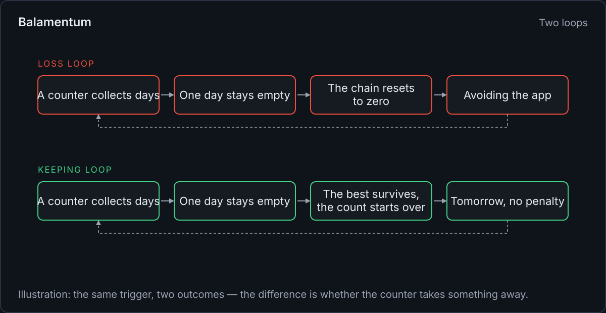
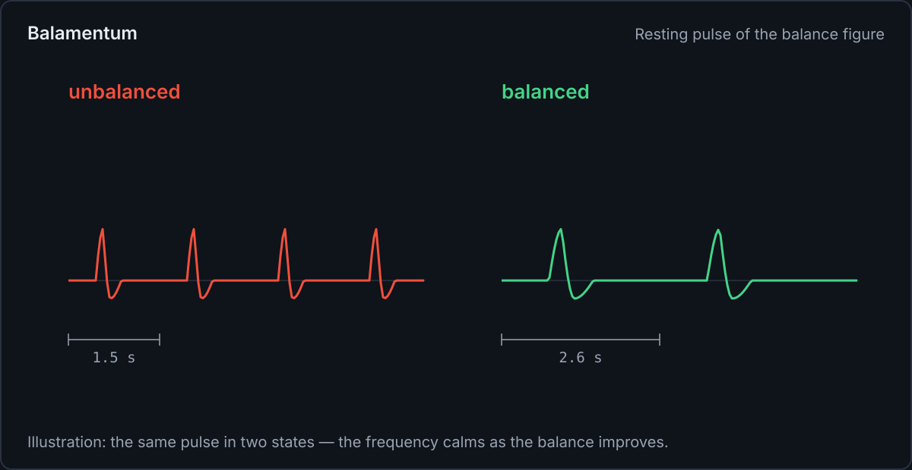
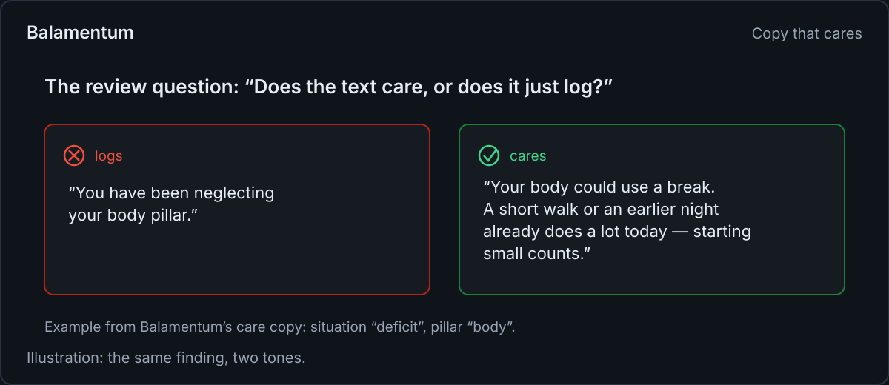

<!--
web.dev Fachartikel — Fokus-Thema: „Calm feedback“ (Zähler, Zustände, Bewegung, Texte)
Genre: Fachartikel für Web-Profis — allgemeine Gestaltungs- und Plattform-Praktiken; Balamentum
läuft als durchgängiges Fallbeispiel. Kein Quellcode-Walkthrough: keine Dateinamen, keine
Repo-Pfade; die Snippets sind allgemeine Muster (als „sketch“ markiert).
Bilder: images/*.svg (SVG, 1200 px breit). Illustrationen, keine Screenshots.
Schwesterartikel: medium.md (deutsch, Methode) und devto.md (englisch, dev.to-Feldbericht).
-->

# Calm feedback: counters that never take, states that don't scold

_By Martin Oppitz · Balamentum_

**TL;DR:** Feedback is where an app shows its character. This article collects four practices for
feedback that informs without pressure: build counters that only ever add, design every state a
view can land in, let motion de-escalate instead of alarm, and write copy that offers a step
instead of rendering a verdict. The running case study is the feedback system of Balamentum, a
prioritization app that ships a streak, a pulsing balance figure, and care copy — without a
single guilt mechanic.

## Feedback is a conversation

A dashboard is not a report; it is a daily conversation. Every element that reacts to the user —
a streak counter, a progress figure, an empty list, an error banner — says something about how
the product sees its user. Pressure is a design decision, and so is calm.

The case study here is Balamentum, whose dashboard answers two questions a day: what to work on
next, and how balanced the underlying effort is. It ships a streak, a pulsing figure, and
suggestion texts, which makes it a good specimen: the classic guilt mechanics were all
available, and each one was shaped until it stopped pressing.

## Counters that only add

Streaks reward repetition with a number that resets to zero the first time life gets in the way.
Balamentum ships a streak anyway — a count of calendar days with at least one completed task —
under four rules that turn it into a pure collector:

1. **Today still has hours left.** The visible chain stands while it reaches yesterday; a day
   only counts as broken when there is a real gap up to yesterday. No pre-midnight punishment.
2. **The best mark is a record, not a balance.** The longest chain ever achieved stays achieved;
   it never shrinks and never expires.
3. **A late completion rescues the deadline day.** Finishing a task a day late credits the day
   it was due, so being human deletes no progress.
4. **The counting rule is written in the UI.** An explainer discloses exactly how the streak is
   counted. A counter with secret rules feels like an opponent; a counter with open rules is a
   tool.

```ts
// sketch: a streak that only ever adds
const current = chainEndingAt(todayStillHasHours ? yesterday : today);
const best = Math.max(previousBest, current); // a record, not a balance
```

Milestones attach to the counter and stay reached, and a quiet "day done" note marks the empty
evening. Nothing in the loop subtracts; the counter collects, and tomorrow starts fresh.



## Design every state, not just success

Every view that loads data can land in four states, and all four are designed: loading, empty,
error, success. An empty state is an invitation to act, not a blank rectangle. Feedback on input
arrives in under 100 ms, at minimum as a pressed state. When the structure of incoming content
is known, a skeleton beats a bare spinner. And a toast is never the only home for an error —
anything dismissible by a timer is too easy to miss.

The error state carries the rule people notice most: it names what happened and what to do next,
without apologies and without bare error codes.

```html
<!-- async feedback lives in the DOM, not only in a toast -->
<p role="status" aria-live="polite">Saved</p>
```


## Motion that de-escalates

Motion is feedback, and its default job is to explain, not to excite: transitions of 150–250 ms,
`ease-out` for what appears, `ease-in` for what disappears. Nothing blinks or pulses forever.
Under `prefers-reduced-motion: reduce`, movement drops back to opacity only, as WCAG 2.3.3
suggests.

The deliberate exception is ambient motion that carries meaning. The balance figure pulses with
a resting heartbeat between 1.5 and 2.6 seconds, and the frequency is the message: the more
balanced the effort, the calmer the pulse. There is no alarm at a skewed state; the beat only
turns slightly more urgent. That motion can be declined — an in-app switch and the system
setting both turn it off — and the fallback is a complete, still rendering. Less motion, but
never less content.



## Copy that offers instead of judges

Every care text in the app has to pass one review question: _does the text care, or does it just
log?_ A text that only states a number logs; a text that cares offers the reader something for
today — a small step, a permission, or real recognition.

The vocabulary follows from that. Words like "neglected", "missed" or "failed" don't appear in
these texts; a low value is an observation, not an offense. Three situations cover the cases: a
deficit gets a small, today-possible step ("Your body could use a break. A short walk or an
earlier night already does a lot today — starting small counts."), an overload gets permission to
cut back, and a met target gets recognition for what is working.

The same rule shapes error copy: name the cause and the next step, skip the apology. "Saving
failed — your changes are still here. Try again?" informs; "Oops! Something went wrong." logs a
failure without helping anyone.



## A metric that can't be gamed by overdoing

Calm feedback also needs a metric that doesn't reward panic. The balance figure's score caps the
ratio of actual to target effort at 1.0: exceeding a target does not improve the balance,
because overdoing doesn't make a distribution better. There is no way to win the widget through
overwork — overload pays nothing into the number. The per-pillar display stays honest and
unclamped, so overshoot is still visible; the cap lives in the aggregate, where it prevents
self-care from turning into optimization.

## Key takeaways

- Build counters that only add: grace for the running day, a best mark that never shrinks, late
  completions that rescue their day, and a counting rule written into the UI.
- Design all four states — loading, empty, error, success — with empty as an invitation and
  errors that name cause plus next step, without apologies or bare codes.
- Keep motion explanatory: 150–250 ms, `ease-out` in, `ease-in` out, opacity only under
  `prefers-reduced-motion`. Ambient motion must carry meaning and stay declinable, with a
  complete still fallback.
- Hold every feedback text to one question: does it care, or does it just log? Offer a small
  step; never render a verdict.
- Cap aggregate metrics so overdoing can't win, while the per-item display stays honest.

The German companion article on Medium covers the method behind these decisions; the field
report with the implementation details is on dev.to. The app itself runs at
balamentum.modevel.de.
