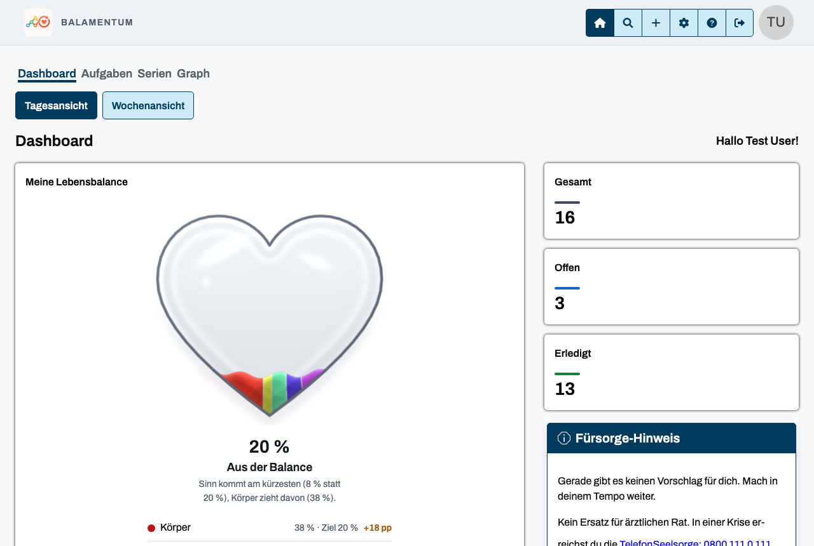
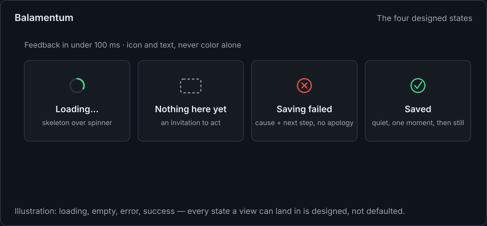
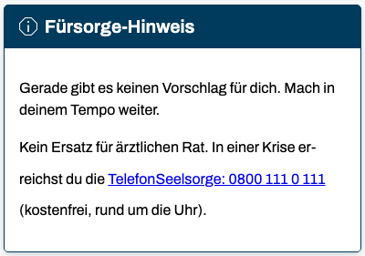

<!--
web.dev Fachartikel — Fokus-Thema: „Calm feedback“ (gestaltete Zustände, Texte, Bewegung, Zähler)
Genre: Fachartikel für Web-Profis — allgemeine Gestaltungs- und Plattform-Praktiken; Balamentum
läuft als Fallbeispiel (echte App-Screenshots, deutschsprachige UI mit Übersetzungshilfe). Kein
Quellcode-Walkthrough: keine Dateinamen, keine Repo-Pfade; Snippets sind allgemeine Muster.
Eigenständiger Artikel ohne Plattform-Verweise.
Bilder: images/ (Screenshots + eine SVG als Diagramm, Generator im Ordner).
-->

# Calm feedback: four practices from Balamentum's dashboard

_By Martin Oppitz · Balamentum — all screenshots below run on demo data._

**TL;DR:** Four practices, one per section, taken from the feedback system of Balamentum and
shown in screenshots plus one diagram: design every state a view can land in, hold every text to
the care-or-log question, let ambient motion carry meaning while staying declinable, and count
the day where the user lives.



_Demo data: 13 done, 3 open. The care card continues below the fold — the next section quotes
it in full._

## Design every state a view can land in

Every view that loads data is held to the same rule: four designed states — loading, empty,
error, success. An empty state invites action instead of showing a blank rectangle. Feedback on
input aims for under 100 ms as a general rule — at minimum a pressed state. When the structure
of incoming content is known, a skeleton beats a bare spinner. And a toast is not the only home
for an error: whatever a self-dismissing toast hides, the reader may never see.

The error state carries the rule people notice most: name what happened and what to do next,
without apologies and without bare error codes. "Oops! Something went wrong." logs a failure;
"Saving failed — your changes are still here. Try again?" helps the reader.

```html
<!-- async feedback lives in the DOM, not only in a toast -->
<p role="status" aria-live="polite">Saved</p>
```

The pattern, drawn as a diagram:



_Loading, empty, error, success — the diagram shows the pattern; the care card above shows the
empty state as it ships, in German UI._

## Hold every text to the care-or-log question

Every care text has to pass one review question: _does the text care, or does it just log?_ A
logging text states a number and implies a verdict; a caring text offers something for today — a
small step, a permission, or real recognition. Three situations cover everything: a deficit gets
a small, today-possible step ("Your body could use a break. A short walk or an earlier night
already does a lot today — starting small counts."); an overload gets permission to cut back
("Your day has limits. Pick the one thing that counts today."); a met target gets recognition
for what works.

The empty case passes the question too, and it is the card visible in full here:



_"Gerade gibt es keinen Vorschlag für dich. Mach in deinem Tempo weiter." — "There's no
suggestion for you right now. Continue at your pace." Even the crisis line ("In a crisis you
reach the TelefonSeelsorge, 0800 111 0 111, free of charge, around the clock") is written to
accompany, not to warn. Words like "neglected", "missed" or "failed" don't appear anywhere in
these texts._

The same rule shapes error copy: name the cause and the next step, skip the apology. The verb
vocabulary of the care texts — no "neglected", no "missed", no "failed" — is the writing-side
twin of the state rule: both refuse to turn a status into a verdict. (The error copy above is
allowed to say "failed"; the rule covers the care texts.)

## Let motion carry meaning — and stay declinable

Transitions run through two duration tokens, 120 and 200 ms, with `ease-out` for what appears
and `ease-in` for what disappears. Nothing blinks or pulses forever. The deliberate exception is
ambient motion that carries meaning: the balance figure pulses with a resting heartbeat of
1.5–2.6 seconds, and the beat is tied to the fill level — the fuller the heart, the calmer the
pulse. No alarm at a skewed state, just a slightly more urgent beat.

That motion can be declined through an in-app switch and the system setting, and the fallback is
the complete, still rendering: less motion, never less content. Under
`prefers-reduced-motion: reduce`, the two tokens collapse to 1 ms and anything beyond opacity —
transforms, the dial's swing — is switched off.

```css
@media (prefers-reduced-motion: reduce) {
	:root {
		--motion-fast: 1ms;
		--motion-base: 1ms;
	}
}
```

## Count the day where the user lives

The most subtle guilt mechanic hides in the calendar, not in the counter. Balamentum's streak
counts calendar days with at least one completion — and a "day" is a user-local fact. The
server lives in UTC; the user lives in Berlin. A completion shortly after midnight German time
falls on the _previous_ day's UTC date, whether the clock says summer or winter time. Counting
days server-side puts a hidden midnight into every German's early morning: the task you finished
at 00:30 would be credited to the day you already said goodnight to.

The streak therefore follows four rules that make it a pure collector: the running day doesn't
count as broken, the best mark never shrinks, late completions rescue the day they were due, and
the counting rule is disclosed in the UI. As long as completions stand, the counter only ever
adds — deleting one takes its day out of the set, which is the intended behavior and part of the
honesty here.

A dated example shows the rescue rule at work. A task due on the 1st gets ticked on the 6th —
five days late, no excuses asked. Both dates enter the day set: the 1st counts as an active
day even though nothing else happened near it, and the completion date does double duty as an
ordinary active day. Nothing about the task itself changes — its estimate, its pillar — yet
the day it stood for stops being a hole.

The whole counter is a view over that set. Current run and best mark are both derivations of
the same calendar days; nothing is stored per counter, so the numbers re-derive from the day
set on every read and cannot drift out of sync with what actually happened. It also means the
streak has no state of its own to lose: a re-import or a corrected timestamp simply recomputes
the next read from the completions that exist. Distances are
measured in calendar days rather than elapsed hours, so the night daylight saving time steals
— and the one it gives back — still count as one civil step between neighbors. And the
boundary degrades gracefully: with no usable timezone, the counter falls back to the server
clock, a documented cost rather than a guess.

What the number does not measure is volume. A day is a set member, not a tally — a heavy day
and a light one leave the same mark. The streak answers "was someone at it?" and deliberately
stays silent on how much it took.

The math around it stays honest by separation: the per-pillar display keeps the unclamped
actual-to-target ratio (overshoot stays visible), while the aggregate balance caps at 1.0 —
overwork is not a winning strategy for the widget. Success is marked quietly: a short note
appears on the dashboard when the day is done, no siren.

## Checklist

For your next dashboard, in one place:

- Four states per data view; empty invites, errors name cause plus next step.
- One review question per text: does it care, or does it just log?
- Ambient motion only where it means something — and always with a complete still fallback.
- Counters add; the day belongs to the user's timezone, and only the aggregate caps.

Explore the dashboard yourself at [balamentum.modevel.de](https://balamentum.modevel.de)
(web and Android).
