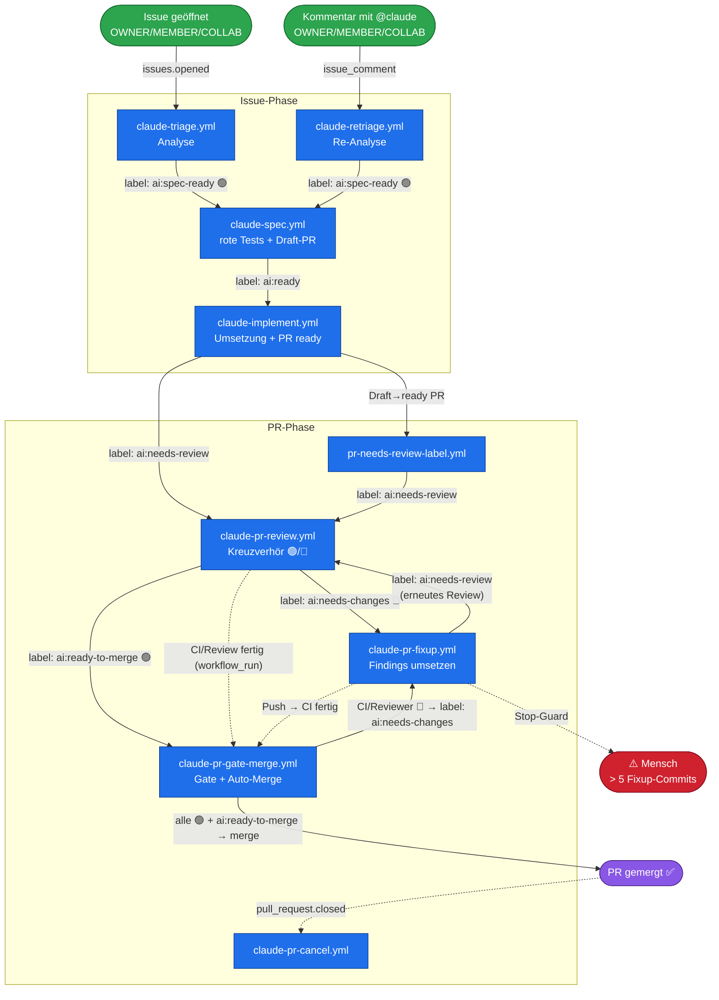

# KI-Pipeline: Label-getriebener Ticket-Flow

Dieser Überblick zeigt, wie ein Ticket von der Analyse bis zum Merge durch die GitHub-Actions-
Workflows läuft. **Kanten = Trigger**, **fett = Label-Events**, gestrichelt = `workflow_run`/sonstige
Events. Stand: Gate + Auto-Merge sind zu **einem** Workflow (`claude-pr-gate-merge.yml`)
zusammengelegt.

## Die Label-Kette in einer Zeile

`ai:spec-ready` → **spec** → `ai:ready` → **implement** → `ai:needs-review` → **review** →
( `ai:needs-changes` → **fixup** → `ai:needs-review` → **review** )\* → `ai:ready-to-merge` →
**gate-merge** → ✅

## Label-Referenz

| Label               | Gesetzt von                                 | Triggert                       |
| ------------------- | ------------------------------------------- | ------------------------------ |
| `ai:analyzed`       | triage / retriage                           | _(Vorbedingung, kein Trigger)_ |
| `ai:spec-ready`     | triage / retriage (bei 🟢)                  | `claude-spec.yml`              |
| `ai:ready`          | spec                                        | `claude-implement.yml`         |
| `ai:needs-review`   | implement, pr-needs-review-label, **fixup** | `claude-pr-review.yml`         |
| `ai:needs-changes`  | review (🔴), **gate-merge**                 | `claude-pr-fixup.yml`          |
| `ai:ready-to-merge` | review (🟢)                                 | `claude-pr-gate-merge.yml`     |

## Schlüsselmechanik

- **Labels werden mit GitHub-App-Token gesetzt** (nicht `GITHUB_TOKEN`) — nur so lösen sie die
  Folge-Workflows aus. Das ist der Motor der Kette. (Ausnahme: Timeout-Cleanups nutzen
  `GITHUB_TOKEN`, damit das Entfernen von `ai:ready`/`ai:spec-ready` nach einem Timeout **nicht**
  kaskadiert.)
- **`ai:analyzed`** ist Vorbedingung (kein Trigger): triage/retriage setzen es; spec/implement
  prüfen es per `contains(...)`.
- **review ↔ fixup** ist die einzige beabsichtigte Schleife, gedeckelt durch den Stop-Guard
  (> 5 Fixup-Commits mit offenen Findings → `ai:needs-changes` bleibt, Mensch wird getaggt).
- **gate-merge** wacht zusätzlich deterministisch per `workflow_run` (CI/Review fertig): ist mind.
  ein Allowlist-Check (CI / Reviewer) rot → `ai:needs-changes` (stößt fixup an); sind beide grün
  und `ai:ready-to-merge` gesetzt → Merge. Dieser eine Workflow ersetzt die früheren zwei
  (Gate + Auto-Merge).
- **cancel** beendet laufende review/fixup-Runs beim PR-Close (`pull_request.closed`) — die Kette
  endet, kein Folge-Trigger.

## Eintrittspunkte

- **Neues Issue** (`issues.opened`) von OWNER/MEMBER/COLLABORATOR → `claude-triage.yml`.
- **`@claude`-Kommentar** an einem Issue (`issue_comment`) von OWNER/MEMBER/COLLABORATOR →
  `claude-retriage.yml`. (Der einzige `@claude`-gesteuerte Workflow; die PR-Seite wird ausschließlich
  über Labels gesteuert, um Event-Kaskaden zu vermeiden.)
