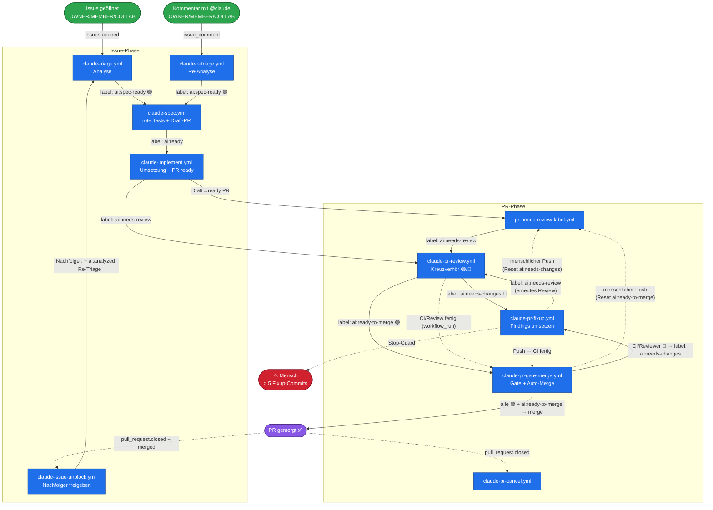

# KI-Pipeline: Label-getriebener Ticket-Flow

Dieser Überblick zeigt, wie ein Ticket von der Analyse bis zum Merge durch die GitHub-Actions-
Workflows läuft. **Kanten = Trigger**, **fett = Label-Events**, gestrichelt = `workflow_run`/sonstige
Events. Stand: Gate + Auto-Merge sind zu **einem** Workflow (`claude-pr-gate-merge.yml`)
zusammengelegt.

## Die Label-Kette in einer Zeile

`ai:spec-ready` → **spec** → `ai:ready` → **implement** → `ai:needs-review` → **review** →
( `ai:needs-changes` → **fixup** → `ai:needs-review` → **review** )\* → `ai:ready-to-merge` →
**gate-merge** → ✅

## Label-Referenz

| Label               | Gesetzt von                                 | Entfernt von                                           | Triggert                                                             |
| ------------------- | ------------------------------------------- | ------------------------------------------------------ | -------------------------------------------------------------------- |
| `ai:analyzed`       | triage / retriage                           | **claude-issue-unblock** (Merge des Blockers), manuell | _Setzen:_ Vorbedingung; _Entfernen:_ `claude-triage.yml` (Re-Triage) |
| `ai:spec-ready`     | triage / retriage (bei 🟢)                  | _(kein automatisches Entfernen)_                       | `claude-spec.yml`                                                    |
| `ai:ready`          | spec                                        | _(kein automatisches Entfernen)_                       | `claude-implement.yml`                                               |
| `ai:needs-review`   | implement, pr-needs-review-label, **fixup** | review, gate-merge                                     | `claude-pr-review.yml`                                               |
| `ai:needs-changes`  | review (🔴), **gate-merge**                 | **pr-needs-review-label** (bei Push)                   | `claude-pr-fixup.yml`                                                |
| `ai:ready-to-merge` | review (🟢)                                 | **pr-needs-review-label** (bei Push)                   | `claude-pr-gate-merge.yml`                                           |

## Schlüsselmechanik

- **Labels werden mit GitHub-App-Token gesetzt** (nicht `GITHUB_TOKEN`) — nur so lösen sie die
  Folge-Workflows aus. Das ist der Motor der Kette. (Ausnahme: Timeout-Cleanups nutzen
  `GITHUB_TOKEN`, damit das Entfernen von `ai:ready`/`ai:spec-ready` nach einem Timeout **nicht**
  kaskadiert.)
- **`ai:analyzed`** ist Vorbedingung (kein Trigger): triage/retriage setzen es; spec/implement
  prüfen es per `contains(...)`.
- **Push-Reset-Mechanik:** Jeder menschliche Push auf den PR-Branch (`synchronize`-Event) löst
  `pr-needs-review-label.yml` aus. Dieser entfernt die alten Ergebnis-Labels (`ai:needs-changes`,
  `ai:ready-to-merge`) und setzt `ai:needs-review` neu — der PR geht damit bei jedem Push wieder
  in den Review. Bot-Pushes (Fixup, Implement-Spec) werden ignoriert (Actor-Filter), um
  Race-Conditions mit nebenläufigen Label-Switches zu vermeiden. Das bedeutet: **`ai:ready-to-merge`
  ist nicht terminal** — ein menschlicher Push nach grünem Review setzt den PR zurück in den
  Review-Zustand. Soll ein PR mergen bleiben, muss er ohne weitere Pushes grün bleiben.
- **review ↔ fixup** ist die einzige beabsichtigte Schleife, gedeckelt durch den Stop-Guard
  (> 10 PR-Commits → `ai:needs-changes` bleibt, der PR-Autor wird getaggt). Der Stop-Guard ist ein
  **deterministischer Shell-Step** (zählt PR-Commits via `gh pr view --json commits`; eine
  semantische Trennung nur nach Fixup-Commits ist ohne unzuverlässige `ready_for_review`-Timeline
  nicht robust machbar — daher Heuristik alle PR-Commits, Schwelle > 10). **Hinweis:** ein
  0-Commit-Loop (Fixup findet keine Findings und committet nichts) wird davon nicht gebremst — die
  H1-Post-Assertion im Review alarmiert in dem Fall per PR-Kommentar.
- **gate-merge** wacht zusätzlich deterministisch per `workflow_run` (CI/Review fertig): ist mind.
  ein Allowlist-Check (CI / Reviewer) rot → `ai:needs-changes` (stößt fixup an); sind beide grün
  und `ai:ready-to-merge` gesetzt → Merge. Dieser eine Workflow ersetzt die früheren zwei
  (Gate + Auto-Merge).
- **cancel** beendet laufende review/fixup-Runs beim PR-Close (`pull_request.closed`).
- **unblock** (`claude-issue-unblock.yml`) reagiert auf den **Merge** eines PRs (`pull_request.closed`
  - `merged == true`): Blockt das gemergte Issue nativ (GitHub-Issue-Dependencies) Nachfolge-Issues
    und sind dadurch **alle** deren Blocker geschlossen (Fan-in-Gate, autoritativ per Blocker-`state`),
    entfernt der Workflow deren `ai:analyzed` **per App-Token** → das re-triggert `claude-triage.yml`,
    die den Nachfolger gegen den nun gemergten Code-Stand **neu analysiert** (🟢 → `ai:spec-ready`,
    🟡/🔴 → nur `ai:analyzed` + Hinweise). So laufen aufeinander aufbauende Sub-Issues Glied für Glied.
    Bewusst **kein** direktes `ai:spec-ready` — die erneute Machbarkeitsprüfung ist der Kern des
    Ansatzes. Guards: nur offene Kandidaten mit `ai:analyzed`, ohne `ai:spec-ready`/`ai:ready`,
    Sammelknoten (`ai:to-big-issue`) übersprungen.
- **Deterministische Gates statt LLM-Vertrauen:** Kritische Zustandsübergänge sind deterministisch
  erzwungen, nicht dem LLM anvertraut (Prinzip „Gate statt Erinnerung"). Jedes Gate ist durch
  Vertragstests (`.github/workflows/pipeline-hardening.test.ts`) gespiegelt und kann nicht still
  entfernt werden:
  - **Agent-Secret-Pre-Flight** (alle 6 KI-Workflows): fehlt das zum aktiven `AI_AGENT`-Pfad
    gehörende Secret (`CLAUDE_CODE_OAUTH_TOKEN`/`ZAI_API_KEY`/`MISTRAL_API_KEY`), bricht der Lauf
    deterministisch mit `::error::` ab — kein stiller Skip (AGENTS.md: „bewusstes Opt-in"). Bei
    triage/retriage/spec/implement wird zusätzlich `ai:to-big-issue` gesetzt (Issue-Signal); bei
    review/fixup (die kein `ai:to-big-issue` vergeben, s. u.) stattdessen ein PR-Kommentar.
  - **Stop-Guard** (fixup): > 10 PR-Commits → Loop stoppt hart (s. o.).
  - **Label-Post-Assertion** (review): vergisst der Agent die Label-Umschaltung, setzt der Step
    den Safe-Default `ai:needs-changes` (statt stiller PR-Stalle).
  - **Doppel-Run-Guard** (spec/implement): existiert schon ein PR/ready-PR mit `Closes #N`, wird
    kein zweiter Branch erzeugt (Race bei schnell aufeinanderfolgenden Label-Events).
  - **Timeout-Alarm** (review/fixup): PR-Workflows vergeben kein `ai:to-big-issue` (AGENTS.md) —
    stattdessen postet dieser Step bei Timeout einen sichtbaren PR-Kommentar, sonst staute der PR
    unsichtbar.
- **Label-Reihenfolge-Prinzip:** Labels sind der Trigger für Folge-Workflows (App-Token-Events lösen
  sofort den nächsten Lauf aus). Sie werden daher IMMER erst als allerletzter Schritt einer Rolle
  gesetzt/entfernt — NIE bevor Issue-Beschreibung, Kommentar, Commit/Push oder PR vollständig
  geschrieben sind. Nachtrag nach einem beobachteten Vorfall (2026-07-01): der Analyse-Workflow
  hatte `ai:spec-ready` gesetzt, bevor die Issue-Beschreibung aktualisiert war — der Spec-Workflow
  startete daraufhin mit veraltetem Ticket-Inhalt. Alle sechs Prompt-Flows (triage/retriage/spec/
  implement/fixup/review) instruieren die Label-Umschaltung jetzt explizit als "ALLERLETZTEN
  Schritt, NIE davor"; per Vertragstest (`pipeline-hardening.test.ts`) abgesichert (Content-Schreiben
  muss textlich vor der Label-Anweisung stehen). Da dies eine Prompt-Anweisung bleibt (kein
  Shell-Gate möglich, da der Analyseinhalt vom LLM selbst erzeugt wird), ist es defense-in-depth,
  keine harte Garantie — sollte das Problem erneut auftreten, ist ein deterministischer
  Post-Schritt (Label wird von einem separaten Workflow-Step nach Verifikation der Beschreibung
  gesetzt, analog zur Label-Post-Assertion im Review) der nächste Härtungsschritt.

## Eintrittspunkte

- **Neues Issue** (`issues.opened`) von OWNER/MEMBER/COLLABORATOR → `claude-triage.yml`.
- **`@claude`-Kommentar** an einem Issue (`issue_comment`) von OWNER/MEMBER/COLLABORATOR →
  `claude-retriage.yml`. (Der einzige `@claude`-gesteuerte Workflow; die PR-Seite wird ausschließlich
  über Labels gesteuert, um Event-Kaskaden zu vermeiden.)
