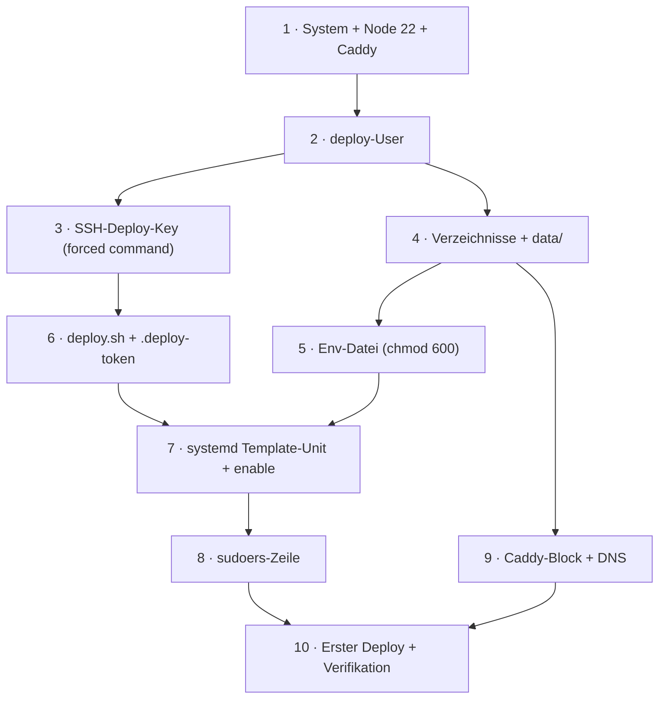
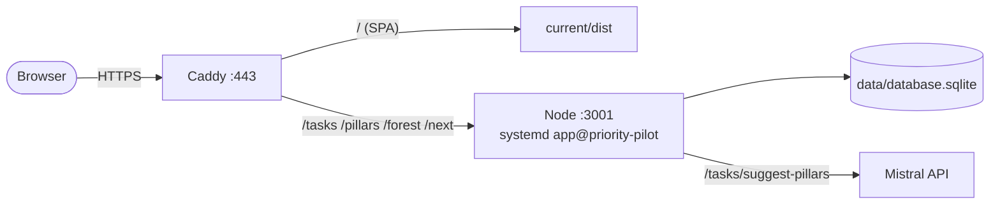

# Server-Einrichtung: Schritt für Schritt

Runbook für die **einmalige** Einrichtung eines frischen Linux-Servers, damit Priority Pilot per
Git-Tag automatisch dorthin deployt werden kann. Konzept dahinter: [`deployment.md`](deployment.md);
die Repo-Seite: [`deployment-repo-plan.md`](deployment-repo-plan.md).

> **Annahmen:** Debian 12 / Ubuntu 22.04+, **x64**, root- bzw. `sudo`-Zugriff, eine Domain, deren
> A-Record (Schritt 9) auf den Server zeigt. Platzhalter `priority-pilot.example.de` und
> `deploy@host` durch echte Werte ersetzen. Node-Major-Version **22** (muss zur CI passen — native
> `sqlite3`).



Laufzeit-Bild nach der Einrichtung:



---

## 1. System vorbereiten

```bash
sudo apt update && sudo apt -y upgrade

# Node.js 22 (NodeSource)
curl -fsSL https://deb.nodesource.com/setup_22.x | sudo -E bash -
sudo apt install -y nodejs git

# pnpm (zum optionalen Prod-Install auf dem Host; sonst nicht zwingend nötig)
sudo npm install -g pnpm@10

# GitHub CLI (für das Pull-Modell in deploy.sh)
sudo apt install -y gh

# Caddy (offizielles APT-Repo)
sudo apt install -y debian-keyring debian-archive-keyring apt-transport-https curl
curl -1sLf 'https://dl.cloudsmith.io/public/caddy/stable/gpg.key' \
  | sudo gpg --dearmor -o /usr/share/keyrings/caddy-stable-archive-keyring.gpg
curl -1sLf 'https://dl.cloudsmith.io/public/caddy/stable/debian.deb.txt' \
  | sudo tee /etc/apt/sources.list.d/caddy-stable.list
sudo apt update && sudo apt install -y caddy
```

**Prüfen:** `node -v` zeigt `v22.*`, `caddy version` und `gh --version` laufen.

---

## 2. Deploy-User anlegen

```bash
sudo adduser --disabled-password --gecos "" deploy
```

Der `deploy`-User braucht **kein** Passwort — Zugriff nur per SSH-Key (Schritt 3) und Service-Betrieb
per systemd (Schritt 7).

---

## 3. SSH-Deploy-Key (Forced Command)

Das Schlüsselpaar `gh_deploy`/`gh_deploy.pub` liegt bereits im Projekt-Setup vor. Der **private**
Schlüssel gehört als GitHub-Secret `DEPLOY_SSH_KEY` ins Repo (siehe
[`deployment-repo-plan.md`](deployment-repo-plan.md) R2-Settings) — **nie** auf den Server kopieren.
Auf den Server kommt nur der **öffentliche** Schlüssel, gebunden an ein Forced Command, sodass dieser
Key ausschließlich `deploy.sh` ausführen kann:

```bash
sudo -u deploy mkdir -p /home/deploy/.ssh && sudo -u deploy chmod 700 /home/deploy/.ssh

# Inhalt von gh_deploy.pub einsetzen ↓ (ein langer ssh-ed25519-String)
sudo -u deploy tee /home/deploy/.ssh/authorized_keys >/dev/null <<'EOF'
command="/home/deploy/deploy.sh",no-port-forwarding,no-agent-forwarding,no-X11-forwarding,no-pty ssh-ed25519 AAAA…github-deploy@example.de
EOF
sudo -u deploy chmod 600 /home/deploy/.ssh/authorized_keys
```

**Prüfen (nach Schritt 6):** `ssh deploy@host "irgendwas"` führt nur `deploy.sh` aus und lehnt
ungültige Kommandos ab — ein Shell-Login ist nicht möglich.

---

## 4. Verzeichnisse + persistentes Daten-Verzeichnis

```bash
APP=priority-pilot
sudo mkdir -p /var/www/gh-deploy/$APP/releases /var/www/gh-deploy/$APP/data
sudo chown -R deploy:deploy /var/www/gh-deploy/$APP
```

`data/` ist **release-unabhängig** — hier lebt `database.sqlite` und überlebt jedes Deploy. Niemals
in `releases/` legen (würde beim Symlink-Switch verloren gehen — siehe [`deployment.md` §4](deployment.md)).

---

## 5. Env-Datei (chmod 600)

```bash
APP=priority-pilot
sudo mkdir -p /etc/gh-deploy
sudo tee /etc/gh-deploy/$APP.env >/dev/null <<EOF
NODE_ENV=production
PORT=3001
DATABASE_STORAGE=/var/www/gh-deploy/$APP/data/database.sqlite
DB_SEED=false
MISTRAL_API_KEY=DEIN_KEY_HIER
# MISTRAL_MODEL=mistral-small-latest
EOF
sudo chmod 600 /etc/gh-deploy/$APP.env
```

Diese Datei ist zugleich das **Registrierungs-Gate**: `deploy.sh` deployt nur Apps, für die hier eine
`.env` existiert. `DB_RESET` bewusst **nicht** setzen (`true` würde die DB bei jedem Start leeren).
`DATABASE_STORAGE` **absolut** und in `data/` (Schritt 4). `MISTRAL_API_KEY` von
<https://console.mistral.ai>; fehlt er, antwortet nur `POST /tasks/suggest-pillars` mit 503, der Rest
läuft.

---

## 6. `deploy.sh` + GitHub-Token

```bash
# GH-Token für das Pull-Modell (Releases herunterladen). Bei PRIVATEM Repo erforderlich;
# bei öffentlichem Repo kann der Token-Teil entfallen.
sudo -u deploy tee /home/deploy/.deploy-token >/dev/null <<'EOF'
export GH_TOKEN=ghp_DEIN_TOKEN
EOF
sudo -u deploy chmod 600 /home/deploy/.deploy-token

# Das Deploy-Skript
sudo -u deploy tee /home/deploy/deploy.sh >/dev/null <<'EOF'
#!/usr/bin/env bash
set -euo pipefail

read -r CMD APP VERSION <<< "${SSH_ORIGINAL_COMMAND:-}"

[[ "$CMD" == "deploy" ]]                       || { echo "unbekanntes Kommando" >&2; exit 1; }
[[ "$APP" =~ ^[a-z][a-z0-9-]+$ ]]              || { echo "ungueltiger App-Name" >&2; exit 1; }
[[ "$VERSION" =~ ^v[0-9]+\.[0-9]+\.[0-9]+$ ]]  || { echo "ungueltige Version" >&2; exit 1; }
[[ -f "/etc/gh-deploy/$APP.env" ]]             || { echo "unbekannte App: $APP" >&2; exit 1; }

REPO="deleonio/$APP"          # falls Repo-Name != App-Name: hier mappen
BASE="/var/www/gh-deploy/$APP"
REL="$BASE/releases/$VERSION"

source /home/deploy/.deploy-token   # export GH_TOKEN=...
mkdir -p "$BASE/data"

if [[ ! -d "$REL" ]]; then
  mkdir -p "$REL"
  gh release download "$VERSION" -R "$REPO" -p '*.tar.gz' -O - | tar -xz -C "$REL"
fi

ln -sfn "$REL" "$BASE/current"
sudo systemctl restart "app@$APP"
echo "deployed $APP $VERSION"
EOF
sudo -u deploy chmod +x /home/deploy/deploy.sh
```

> **Variante Host-Install** (nur falls die Host-Architektur **nicht** x64-Linux/Node 22 ist und das
> Tarball daher **ohne** `node_modules` gebaut wird): nach dem `tar`-Schritt ergänzen:
> `( cd "$REL/server" && pnpm install --prod )`. Siehe [`deployment-repo-plan.md`](deployment-repo-plan.md) R1.

---

## 7. systemd-Template-Unit

Eine Unit für **alle** Apps (`%i` = App-Name):

```bash
sudo tee /etc/systemd/system/[email protected] >/dev/null <<'EOF'
[Unit]
Description=gh-deploy app %i
After=network.target

[Service]
Type=simple
User=deploy
Group=deploy
WorkingDirectory=/var/www/gh-deploy/%i/current/server
EnvironmentFile=/etc/gh-deploy/%i.env
ExecStart=/usr/bin/node dist/index.js
Restart=on-failure
RestartSec=5

NoNewPrivileges=true
ProtectSystem=strict
ProtectHome=true
PrivateTmp=true
ReadWritePaths=/var/www/gh-deploy/%i/data

[Install]
WantedBy=multi-user.target
EOF

sudo systemctl daemon-reload
sudo systemctl enable app@priority-pilot   # ohne --now: Start erst beim ersten Deploy (current fehlt noch)
```

`ExecStart` startet `dist/index.js` relativ zu `WorkingDirectory` (`current/server`). Nur `data/` ist
schreibbar; die Release-Bäume bleiben unter `ProtectSystem=strict` read-only.

---

## 8. sudoers-Zeile (eng gefasst)

Damit der `deploy`-User **nur** diesen einen Service neu starten darf:

```bash
echo 'deploy ALL=(root) NOPASSWD: /usr/bin/systemctl restart app@priority-pilot' \
  | sudo tee /etc/sudoers.d/deploy-priority-pilot
sudo chmod 440 /etc/sudoers.d/deploy-priority-pilot
sudo visudo -cf /etc/sudoers.d/deploy-priority-pilot   # Syntax prüfen
```

Bewusst **kein** `app@*`-Wildcard (sudo `fnmatch` matcht großzügiger als erwartet) — eine Zeile pro App.

---

## 9. Caddy-Block + DNS

**DNS zuerst:** A-Record `priority-pilot.example.de` → Server-IP setzen (sonst scheitert die
TLS-Ausstellung). Dann:

```bash
sudo tee -a /etc/caddy/Caddyfile >/dev/null <<'EOF'

priority-pilot.example.de {
    encode zstd gzip
    root * /var/www/gh-deploy/priority-pilot/current/dist

    # API-Wurzelpfade ans Backend — MÜSSEN mit den Vertragspfaden übereinstimmen
    # (frontend/vite.config.ts: ^/(tasks|pillars|forest|next), openapi.yml).
    @api path /tasks* /pillars* /forest* /next*
    handle @api {
        reverse_proxy localhost:3001
    }

    @assets path /assets/*
    handle @assets {
        header Cache-Control "public, max-age=31536000, immutable"
        file_server
    }

    handle {
        header /index.html Cache-Control "no-cache"
        header /sw.js Cache-Control "no-cache"
        try_files {path} /index.html
        file_server
    }
}
EOF

sudo caddy validate --config /etc/caddy/Caddyfile
sudo systemctl reload caddy
```

Caddy holt das TLS-Zertifikat automatisch (Let's Encrypt). **Wichtig:** Die API liegt an der Wurzel
(`/tasks`, …), **nicht** unter `/api/*` — ein `/api/*`-Block würde alle API-Calls 404en.

---

## 10. Erster Deploy + Verifikation

Ein Tag-Push löst den Release-Workflow aus (siehe [`deployment-repo-plan.md`](deployment-repo-plan.md));
dieser ruft am Ende `ssh deploy@host "deploy priority-pilot vX.Y.Z"`. Manuell antesten:

```bash
# Vom Entwickler-Rechner mit dem privaten Deploy-Key:
ssh -i gh_deploy deploy@priority-pilot.example.de "deploy priority-pilot v0.0.1"
```

**Verifizieren (auf dem Server):**

```bash
systemctl status app@priority-pilot
journalctl -u app@priority-pilot -n 50 --no-pager        # "Server läuft auf http://localhost:3001"
ls -l /var/www/gh-deploy/priority-pilot/current          # → releases/v0.0.1
curl -fsS https://priority-pilot.example.de/next         # API über Caddy erreichbar?
```

Im Browser `https://priority-pilot.example.de` öffnen — die SPA lädt und spricht die API gleichorigin an.

---

## 11. Rollback

```bash
ln -sfn /var/www/gh-deploy/priority-pilot/releases/v0.0.0 \
        /var/www/gh-deploy/priority-pilot/current \
  && sudo systemctl restart app@priority-pilot
```

Die DB in `data/` ist davon **nicht** betroffen. Bei Schema-ändernden Releases vorher ein Backup ziehen
(Schritt 12).

---

## 12. Backups

```bash
# Konsistentes SQLite-Backup (auch im laufenden Betrieb sicher) – z. B. täglich per cron:
sudo -u deploy sqlite3 /var/www/gh-deploy/priority-pilot/data/database.sqlite \
  ".backup '/var/www/gh-deploy/priority-pilot/data/backup-$(date +%F).sqlite'"
```

`sqlite3` ggf. via `sudo apt install -y sqlite3`. Backups regelmäßig vom Server wegsichern.

---

## 13. Troubleshooting

| Symptom | Wahrscheinliche Ursache | Prüfen / Fix |
| --- | --- | --- |
| `systemctl status` zeigt `failed` | `node_modules`/`sqlite3`-ABI passt nicht zum Host | `journalctl -u app@priority-pilot`; ggf. Host-Install (Schritt 6, Variante) |
| API-Calls 404 | Caddy proxyt `/api/*` statt der Wurzelpfade | `@api`-Matcher prüfen (Schritt 9) |
| Daten weg nach Deploy | `DATABASE_STORAGE` zeigt in den Release-Baum | absoluten `data/`-Pfad setzen (Schritt 5) |
| Demo-Daten erscheinen in Prod | `DB_SEED` nicht auf `false` | Env-Datei korrigieren, neu starten |
| `/tasks/suggest-pillars` → 503 | `MISTRAL_API_KEY` fehlt | Key in Env-Datei eintragen |
| TLS schlägt fehl | DNS-A-Record fehlt/falsch | A-Record auf Server-IP, dann `systemctl reload caddy` |
| Deploy bricht mit „unbekannte App" ab | Env-Datei fehlt | `/etc/gh-deploy/<app>.env` anlegen (Schritt 5) |

---

## Checkliste „weitere App auf demselben Host"

Keine neue systemd-Unit nötig — nur: Verzeichnis + `data/` + `chown` (4), Env-Datei mit **freiem Port**
(5), `deploy.sh` ist generisch (6), `systemctl enable app@<name>` (7), sudoers-Zeile (8), Caddy-Block
(9). Siehe auch [`deployment.md` §11](deployment.md).
