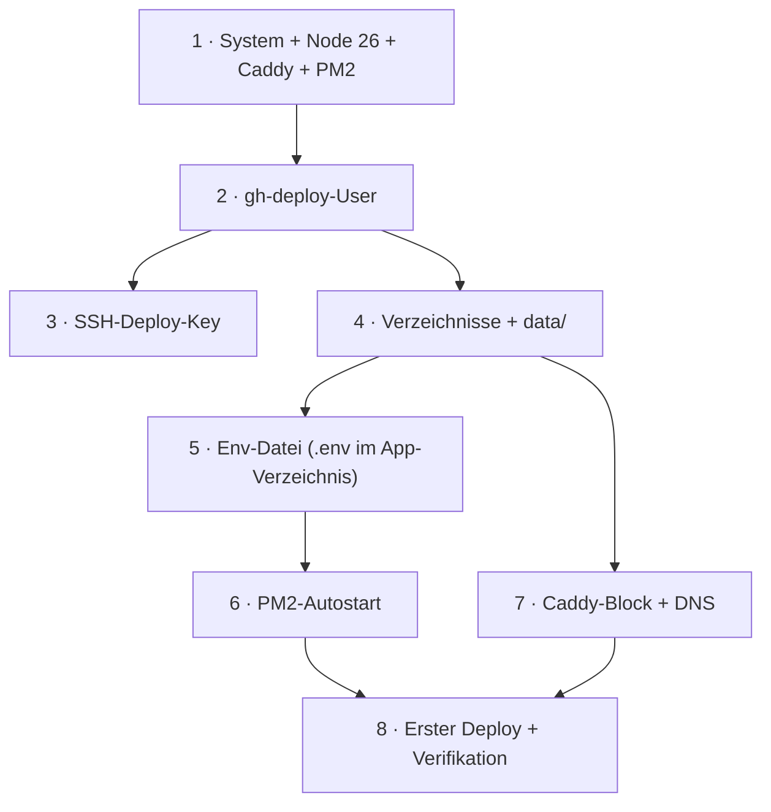
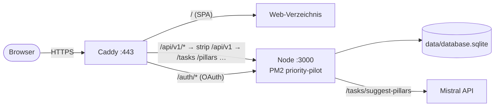

# Server-Einrichtung: Schritt für Schritt

Runbook für die **einmalige** Einrichtung eines frischen Linux-Servers, damit Priority Pilot per
Merge auf `main` automatisch dorthin deployt wird (rsync + PM2, siehe
[`deployment.md`](deployment.md)). Host-Layout: Web-Verzeichnis (statische SPA) + App-Verzeichnis
(Backend unter PM2) + persistentes `data/`-Verzeichnis für die SQLite-DB.

> **Annahmen:** Debian 12 / Ubuntu 22.04+, **x64**, root- bzw. `sudo`-Zugriff, eine Domain, deren
> A-Record (Schritt 7) auf den Server zeigt. Platzhalter `priority-pilot.example.de` und
> `gh-deploy@host` durch echte Werte ersetzen. Node-Major-Version **26** (muss zur CI passen — native
> `sqlite3`, siehe `.nvmrc`).



Laufzeit-Bild nach der Einrichtung:



---

## 1. System vorbereiten

```bash
sudo apt update && sudo -y upgrade

# Node.js 26 (NodeSource)
curl -fsSL https://deb.nodesource.com/setup_26.x | sudo -E bash -
sudo apt install -y nodejs git

# pnpm (zum optionalen Prod-Install auf dem Host; sonst nicht zwingend nötig)
sudo npm install -g pnpm@11

# PM2 (Prozess-Manager fürs Backend)
sudo npm install -g pm2

# Caddy (offizielles APT-Repo)
sudo apt install -y debian-keyring debian-archive-keyring apt-transport-https curl
curl -1sLf 'https://dl.cloudsmith.io/public/caddy/stable/gpg.key' \
  | sudo gpg --dearmor -o /usr/share/keyrings/caddy-stable-archive-keyring.gpg
curl -1sLf 'https://dl.cloudsmith.io/public/caddy/stable/debian.deb.txt' \
  | sudo tee /etc/apt/sources.list.d/caddy-stable.list
sudo apt update && sudo apt install -y caddy
```

**Prüfen:** `node -v` zeigt `v26.*`, `pm2 --version` und `caddy version` laufen.

---

## 2. gh-deploy-User anlegen

```bash
sudo adduser --disabled-password --gecos "" gh-deploy
```

Der `gh-deploy`-User braucht **kein** Passwort — Zugriff nur per SSH-Key (Schritt 3); er betreibt
das Backend unter PM2 **ohne** sudo (kein systemd, keine sudoers-Zeile mehr).

---

## 3. SSH-Deploy-Key

Das Schlüsselpaar `gh_deploy`/`gh_deploy.pub` liegt bereits im Projekt-Setup vor. Der **private**
Schlüssel gehört als GitHub-Secret `DEPLOY_SSH_KEY` ins Repo — **nie** auf den Server kopieren. Auf
den Server kommt nur der **öffentliche** Schlüssel; der Deploy-Workflow nutzt ihn für `rsync` und
`ssh … pm2 reload` (kein Forced Command mehr):

```bash
sudo -u gh-deploy mkdir -p /home/gh-deploy/.ssh && sudo -u gh-deploy chmod 700 /home/gh-deploy/.ssh

# Inhalt von gh_deploy.pub einsetzen ↓ (ein langer ssh-ed25519-String)
sudo -u gh-deploy tee /home/gh-deploy/.ssh/authorized_keys >/dev/null <<'EOF'
ssh-ed25519 AAAA…github-deploy@example.de
EOF
sudo -u gh-deploy chmod 600 /home/gh-deploy/.ssh/authorized_keys
```

---

## 4. Verzeichnisse + persistentes Daten-Verzeichnis

Zielverzeichnisse, in die der Workflow per `rsync` spiegelt (Pfade = `vars.DEPLOY_WEB_DIR` /
`vars.DEPLOY_APP_DIR`):

```bash
APP=priority-pilot
sudo mkdir -p /var/www/gh-deploy/$APP/frontend /var/www/gh-deploy/$APP/app /var/www/gh-deploy/$APP/data
sudo chown -R gh-deploy:gh-deploy /var/www/gh-deploy/$APP
```

- `frontend/` — Web-Verzeichnis: statische SPA aus `frontend/dist` (Caddy `file_server`).
- `app/` — App-Verzeichnis: `dist/` + `package.json` + `node_modules/` + `.env`; PM2 startet
  `app/dist/index.js`.
- `data/` ist **deploy-unabhängig** — hier lebt `database.sqlite` und überlebt jedes Deploy. Der
  Workflow schützt es zusätzlich per `rsync --exclude 'data/' --exclude '*.sqlite'`.

---

## 5. Env-Datei (chmod 600)

Die Env-Datei liegt als **`.env` im App-Verzeichnis** und wird vom `rsync` ausgenommen — sie
überlebt jedes Deploy (Variablen-Referenz: [`deployment.md` §2](deployment.md)):

```bash
APP=priority-pilot
sudo -u gh-deploy tee /var/www/gh-deploy/$APP/app/.env >/dev/null <<EOF
NODE_ENV=production
DATABASE_STORAGE=/var/www/gh-deploy/$APP/data/database.sqlite
DB_SEED=false
MISTRAL_API_KEY=DEIN_KEY_HIER
# MISTRAL_MODEL=mistral-medium-latest
# Optional — zweite Kaskaden-Stufe (Verfeinerung):
# OPENROUTER_API_KEY=sk-or-v1-DEIN_KEY_HIER
# OPENROUTER_MODEL=openrouter/free
EOF
sudo -u gh-deploy chmod 600 /var/www/gh-deploy/$APP/app/.env
```

`DB_RESET` bewusst **nicht** setzen (`true` würde die DB bei jedem Start leeren).
`DATABASE_STORAGE` **absolut** und in `data/` (Schritt 4). `PORT` ist nicht gesetzt → Backend
lauscht auf `localhost:3000` (Default).

**LLM-Provider:** Die LLM-Funktionen laufen als **Kaskade** — Mistral generiert, OpenRouter
verfeinert. Beide Keys sind einzeln optional: Es genügt **einer** von `MISTRAL_API_KEY`
(<https://console.mistral.ai>) und `OPENROUTER_API_KEY` (<https://openrouter.ai/keys>), der
jeweils andere Provider wird dann übersprungen. Erst wenn **kein** Key gesetzt ist, antworten die
LLM-Endpunkte (`/tasks/suggest-pillars`, `/tasks/parse-text`, `/pillars/advisor`) mit 503 — der
Rest der App läuft weiter. Keys lassen sich alternativ zur Env-Datei über die Settings-UI
persistieren (Tab „LLM"), die dann Vorrang hat. Details:
[llm-providers.md](llm-providers.md).

---

## 6. PM2-Autostart

Damit das Backend nach einem Server-Reboot wieder hochkommt, **als `gh-deploy`-User** einmalig:

```bash
sudo -u gh-deploy bash -c 'pm2 startup systemd -u gh-deploy --hp /home/gh-deploy'
# Die ausgegebene sudo-Zeile ausführen (aktiviert die pm2-Systemd-Unit für den Boot).
```

`pm2 save` läuft automatisch nach dem ersten vom Workflow gestarteten Prozess bzw. kann manuell nach
dem ersten Deploy ausgeführt werden — es friert die Prozessliste für den Boot ein.

---

## 7. Caddy-Block + DNS

**DNS zuerst:** A-Record `priority-pilot.example.de` → Server-IP setzen (sonst scheitert die
TLS-Ausstellung). Die vollständige Caddyfile mit Erläuterungen
(`/api/v1/*`-Präfix-Strip, `/auth/*`-OAuth-Proxy, SPA-Fallback, Pfad-Tabelle) steht in
[`caddy-setup.md`](caddy-setup.md). Einrichten:

```bash
sudo tee -a /etc/caddy/Caddyfile >/dev/null <<'EOF'

priority-pilot.example.de {
    # … Block aus caddy-setup.md: handle /api/v1/*, handle /auth/*, SPA-Fallback …
}
EOF

sudo caddy validate --config /etc/caddy/Caddyfile
sudo systemctl reload caddy
```

Caddy holt das TLS-Zertifikat automatisch (Let's Encrypt). **Wichtig (seit #171):** Das Frontend ruft
die API unter `/api/v1/*` auf; Caddy streift das Präfix ab und reicht z. B. `/api/v1/pillars` als
`/pillars` an das Backend weiter, das seine Router an der Wurzel mountet (`app.use(pillarsRouter)`).

---

## 8. Erster Deploy + Verifikation

Ein **Merge auf `main`** stößt `.github/workflows/deploy.yml` an: Build → `rsync` →
`pm2 reload` (oder erster `pm2 start`), danach Patch-Bump auf `main`. Die benötigten Secrets/Vars
(`DEPLOY_SSH_KEY`, `DEPLOY_HOST`, `DEPLOY_USER`, `DEPLOY_WEB_DIR`, `DEPLOY_APP_DIR`) müssen im Repo
konfiguriert sein.

**Verifizieren (auf dem Server):**

```bash
pm2 status                                                  # Prozess "priority-pilot" online
pm2 logs priority-pilot --lines 50                          # "Server läuft auf http://localhost:3000"
ls -l /var/www/gh-deploy/priority-pilot/frontend            # SPA-Dateien (index.html, assets/)
curl -fsS https://priority-pilot.example.de/next            # API über Caddy erreichbar?
```

Im Browser `https://priority-pilot.example.de` öffnen — die SPA lädt und spricht die API
gleichorigin an.

---

## 9. Backups

Das Repo bringt [`maintenance.sh`](../maintenance.sh) mit: ein Backup-Skript, das die DB via
SQLite `.backup` sichert (konsistent auch im laufenden Betrieb), Backups mit Zeitstempel in
`backups/` legt und automatisch Backups älter als 30 Tage löscht. Das Deploy-Bundle enthält das
Skript **nicht** (es wird nur `dist/`, `package.json` und `node_modules` rsynct) — daher einmalig
auf den Server kopieren:

```bash
# lokal vom Repo-Root:
scp maintenance.sh gh-deploy@<host>:/var/www/gh-deploy/priority-pilot/
```

Dann als `gh-deploy`-User einen Cron-Job einrichten (`crontab -u gh-deploy -e`), der das Skript
nightly mit dem Prod-DB-Pfad aufruft:

```cron
0 2 * * * DATABASE_STORAGE=/var/www/gh-deploy/priority-pilot/data/database.sqlite /var/www/gh-deploy/priority-pilot/maintenance.sh
```

Backups landen in `/var/www/gh-deploy/priority-pilot/backups/` — außerhalb von `dist/` und `data/`,
Deploys löschen sie nicht. `sqlite3` ggf. via `sudo apt install -y sqlite3`. Backups regelmäßig
vom Server wegsichern.

---

## 10. Troubleshooting

| Symptom                               | Wahrscheinliche Ursache                                                                      | Prüfen / Fix                                                                                      |
| ------------------------------------- | -------------------------------------------------------------------------------------------- | ------------------------------------------------------------------------------------------------- |
| `pm2 status` zeigt `errored`/restarts | `node_modules`/`sqlite3`-ABI passt nicht zum Host                                            | `pm2 logs priority-pilot`; ggf. Host-Install (`pnpm install --prod` im App-Verzeichnis)           |
| API-Calls liefern HTML/404            | Caddy kennt `/api/v1/*` nicht (SPA-Fallback greift)                                          | `handle /api/v1/*`-Block + `strip_prefix` prüfen ([caddy-setup.md](caddy-setup.md))               |
| Daten weg nach Deploy                 | `DATABASE_STORAGE` zeigt in gespiegeltes Verzeichnis                                         | absoluten `data/`-Pfad setzen (Schritt 5)                                                         |
| Demo-Daten erscheinen in Prod         | `DB_SEED` nicht auf `false`                                                                  | Env-Datei korrigieren, `pm2 reload priority-pilot --update-env`                                   |
| LLM-Endpunkte → 503                   | **kein** LLM-Key gesetzt (weder DB noch Env)                                                 | `MISTRAL_API_KEY` **oder** `OPENROUTER_API_KEY` setzen ([llm-providers.md](llm-providers.md))     |
| LLM-Endpunkte → 502                   | alle **konfigurierten** Provider-Calls fehlgeschlagen (Key ungültig/Quota/Netz/Timeout 30 s) | Key + Quota beim Provider prüfen; 502-Response-Body auslesen (Server loggt zu diesem Fall nichts) |
| TLS schlägt fehl                      | DNS-A-Record fehlt/falsch                                                                    | A-Record auf Server-IP, dann `sudo systemctl reload caddy`                                        |
| Backend nach Reboot weg               | `pm2 startup`/`pm2 save` nie eingerichtet                                                    | Schritt 6 nachholen                                                                               |

---

## Checkliste „weitere App auf demselben Host"

Nur: Verzeichnisse + `data/` + `chown` (4), Env-Datei mit freiem `PORT` (5), PM2-Prozessname im
Workflow, Caddy-Block mit eigenem Port (7). Kein systemd, keine sudoers-Zeile.
