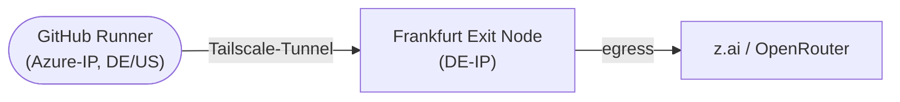

# Tailscale Exit Node: CI-Traffic über Frankfurt routen

Anleitung, um einen GitHub-Actions-Runner über einen eigenen Frankfurter Server als
**Tailscale-Exit-Node** zu routen — sodass ausgehende CI-Requests (z. B. an z.ai/OpenRouter) mit der
deutschen IP des Servers ankommen. Manuell anstoßbar via
[`tailscale-test.yml`](../.github/workflows/tailscale-test.yml).

> **Status:** Nur ein **manueller Test-Workflow** (`workflow_dispatch`). Die produktiven
> Claude-Phasen-Workflows (01–06) routen **nicht** durch Frankfurt — siehe [Grenzen](#grenzen).
>
> **Weiterführend:** [`server-setup.md`](server-setup.md) (Host-Einrichtung),
> [`ci-architecture.md`](ci-architecture.md) (Provider/Modell-Architektur).

## Architektur



Ohne Tailscale läuft der gesamte Runner-Traffic über Microsoft-Azure-IPs; nach
`tailscale up --exit-node` geht er durch den Frankfurter Server.

## Voraussetzungen

- Ein eigener Linux-Server in Frankfurt (Debian/Ubuntu, root bzw. `sudo`).
- Zugriff auf die [Tailscale-Admin-Console](https://login.tailscale.com/admin/machines).

## 1. Frankfurter Server als Exit Node einrichten

Einmalig auf dem Server (SSH):

```bash
# Tailscale installieren
curl -fsSL https://tailscale.com/install.sh | sh

# IP-Forwarding aktivieren (Pflicht für Exit Nodes)
echo 'net.ipv4.ip_forward = 1' | sudo tee -a /etc/sysctl.d/99-tailscale.conf
echo 'net.ipv6.conf.all.forwarding = 1' | sudo tee -a /etc/sysctl.d/99-tailscale.conf
sudo sysctl -p /etc/sysctl.d/99-tailscale.conf

# Tailscale starten und als Exit Node ankündigen
sudo tailscale up --advertise-exit-node
```

Danach in der **Admin-Console** den Exit Node freischalten:

1. Server in der Maschinen-Liste suchen.
2. `…` → **Edit route settings**.
3. Häkchen bei **Use as exit node** setzen und speichern.

> **Forwarding vor dem Anbieten aktivieren:** IP-Forwarding muss gelten, _bevor_ der Knoten als Exit
> Node ankündigt. Wurde es nachträglich gesetzt: `sudo systemctl restart tailscaled` und neu
> ankündigen (`sudo tailscale up --advertise-exit-node`). Sonst ist der Exit Node zwar verbunden,
> leitet aber keine Pakete weiter (Symptom: `curl`-Timeout).

## 2. Auth-Key für GitHub Actions erzeugen

In der Admin-Console unter **Settings → Keys → Generate auth key**:

- **Reusable:** ja (mehrere Workflow-Runs nutzen denselben Key).
- **Ephemeral:** ja (der temporäre Runner-Knoten wird nach Run-Ende automatisch entfernt).
- **Tags:** ein Tag vergeben, z. B. `tag:ci`.

Generierten Schlüssel (`tskey-auth-…`) kopieren.

> **Hinweis — Auth-Key vs. OAuth-Client:** Die GitHub-Action (`tailscale/github-action`) empfiehlt
> mittlerweile einen **OAuth-Client** (`oauth-client-id` + `oauth-secret`); der `authkey`-Input ist
> dort als _deprecated_ markiert, funktioniert aber weiterhin. Diese Anleitung nutzt bewusst den
> Auth-Key (einfacher, ein Secret). Ein späterer Wechsel auf OAuth ist möglich.

## 3. GitHub konfigurieren

Im Repo unter **Settings → Secrets and variables → Actions** zwei **Repository Secrets** anlegen:

| Name                  | Wert                                                                        |
| --------------------- | --------------------------------------------------------------------------- |
| `TAILSCALE_AUTH_KEY`  | Der generierte Auth-Key (`tskey-auth-…`).                                   |
| `TAILSCALE_EXIT_NODE` | Tailscale-Name oder `100.x.y.z`-IP des Frankfurter Servers (Admin-Console). |

## 4. Workflow

Der Workflow
[`tailscale-test.yml`](../.github/workflows/tailscale-test.yml) (`workflow_dispatch`) prüft in fünf
Schritten:

1. **IP davor** — originale Runner-IP (`ifconfig.me`).
2. **Tailscale verbinden** — `tailscale up --exit-node=…`.
3. **DNS-Fix** — öffentlichen Resolver setzen (sonst bricht die Runner-DNS durchs Tunnel, siehe
   [Troubleshooting](#troubleshooting)).
4. **IP danach** — Frankfurter IP + Geo-Daten (`ipapi.co`).
5. **OpenRouter-Test** — Request über die Frankfurter IP.

## 5. Testen & verifizieren

1. Im Repo-Tab **Actions** den Workflow _Test Tailscale Exit Node Route_ öffnen.
2. **Run workflow** klicken.
3. Im Job prüfen:
   - _Check IP (Before)_ → Azure/Microsoft-IP (US/EU).
   - _Check IP (After)_ → Frankfurter IP, Geo „Frankfurt am Main / Germany".

## Sicherheitshinweise

- **`--exit-node-allow-lan-access`:** Der Workflow setzt dieses Flag (erlaubt Zugriff auf das LAN
  des Exit-Nodes). Für reinen Egress ist es nicht nötig — für eine striktere Trennung entfernen.
- **Ephemeral-Keys** räumen den Runner-Knoten nach Run-Ende automatisch ab (keine Leichen im Tailnet).
- **ACLs:** Getaggte CI-Knoten (`tag:ci`) per ACL nur zum Exit-Node zulassen (Least Privilege).
- **Rotation:** Auth-Key regelmäßig rotieren; bei Bedarf auf OAuth-Client umsteigen.

## Troubleshooting

- **`curl` scheitert mit exit 28 (Timeout), Verbindung steht aber:** Fast immer **DNS**. Durch den
  Exit Node ist die Azure-Standard-DNS des Runners nicht mehr erreichbar → Hosts lassen sich nicht
  auflösen. Der Workflow setzt darum nach dem Verbinden `1.1.1.1`/`8.8.8.8` als Resolver. Tritt der
  Fehler trotzdem auf, den Output des DNS-Steps (`getent hosts`) prüfen. Siehe auch
  [tailscale/tailscale#12403](https://github.com/tailscale/tailscale/issues/12403).
- **Exit Node verbunden, aber gar kein Traffic durch:** IP-Forwarding auf dem Frankfurter Server
  fehlt/inaktiv (`sysctl net.ipv4.ip_forward` muss `1` sein) — danach `tailscaled` neu starten.
- **`tailscale up`-Schritt rot:** Meist ist der Exit Node im Admin-Console nicht freigeschaltet oder
  `TAILSCALE_EXIT_NODE` zeigt auf den falschen Knoten.

## Grenzen

Dieser Workflow ist **rein diagnostisch** und wird manuell ausgelöst. Die produktiven
Pipeline-Workflows ([01–06](../.github/workflows/)) routen ihren LLM-Traffic **nicht** durch
Frankfurt — eine spätere Anbindung wäre ein eigener, größerer Schritt (neue Abhängigkeit pro Lauf).
