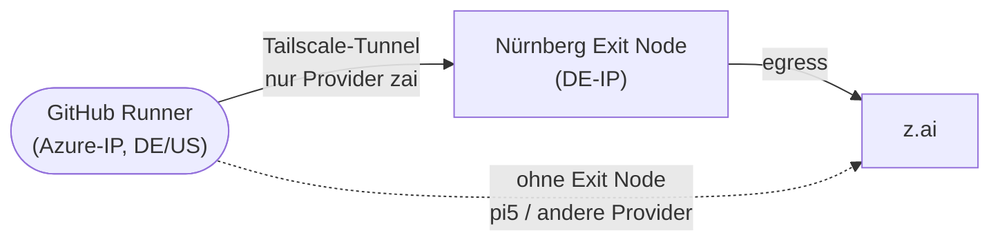

# Tailscale Exit Node: CI-Traffic über Nürnberg routen

Anleitung, um einen GitHub-Actions-Runner über einen eigenen Nürnberger Server als
**Tailscale-Exit-Node** zu routen — sodass ausgehende CI-Requests an z.ai mit der deutschen IP des
Servers ankommen. Verifizieren lässt sich das Routing über einen echten Pipeline-Lauf, siehe
[Verifizieren](#4-verifizieren).

> **Status:** Der Exit Node ist nur für den Fall gedacht, dass der LLM-Provider **z.ai** ist und der
> Lauf auf einem **gehosteten GitHub-Runner** (Azure-IP) stattfindet — z.ai blockt Azure-IPs. Die
> Tailscale-Schritte hängen zentral in
> [`setup-agent`](../.github/actions/setup-agent/action.yml) und greifen nur bei
> `llm-provider == 'zai' && runner.name != 'pi5'`. Ein **pi5-Selbst-Runner** sitzt im Heimnetz
> (deutsche IP, kein tailscaled/TUN im Container) und überspringt den Exit Node; andere Provider
> (Claude API, OpenRouter) haben kein IP-Block-Problem und laufen ebenfalls direkt. Aktiviert wird
> zusätzlich über die Variable `TAILSCALE_EXIT_NODE` (Kill-Switch), siehe
> [Grenzen](#grenzen--betriebsverhalten).
>
> **Verifiziert (2026-08-14):** Phase 04 (Review) und 05 (Fixup) egressierten belegt über
> `167.233.90.149` (Nuremberg, DE) — Log-Zeile `Exit-Node aktiv — IP … (Nuremberg, DE)` im
> Step _DNS fixen + Egress-IP protokollieren_.
>
> **Weiterführend:** [`server-setup.md`](server-setup.md) (Host-Einrichtung),
> [`ci-architecture.md`](ci-architecture.md) (Provider/Modell-Architektur).

## Architektur


```mermaid
flowchart LR
    gh(["GitHub Runner<br/>(Azure-IP, DE/US)"]) -->|Tailscale-Tunnel<br/>nur Provider zai| exit["Nürnberg Exit Node<br/>(DE-IP)"]
    exit -->|egress| api["z.ai"]
    gh -.->|ohne Exit Node<br/>pi5 / andere Provider| api
```

Gehostete Runner egressieren über Microsoft-Azure-IPs; nach `tailscale up --exit-node` geht der
LLM-Traffic durch den Nürnberger Server. Auf pi5 (Heimnetz, bereits deutsche IP) und bei
Providern ohne IP-Block bleibt es beim direkten Weg.

## Voraussetzungen

- Ein eigener Linux-Server in Nürnberg (Debian/Ubuntu, root bzw. `sudo`).
- Zugriff auf die [Tailscale-Admin-Console](https://login.tailscale.com/admin/machines).

## 1. Nürnberger Server als Exit Node einrichten

Einmalig auf dem Server (SSH):

```bash
# Tailscale installieren
curl -fsSL https://tailscale.com/install.sh | sh

# IP-Forwarding aktivieren (Pflicht für Exit Nodes)
echo 'net.ipv4.ip_forward = 1' | sudo tee -a /etc/sysctl.d/99-tailscale.conf
echo 'net.ipv6.conf.all.forwarding = 1' | sudo tee -a /etc/sysctl.d/99-tailscale.conf
sudo sysctl -p /etc/sysctl.d/99-tailscale.conf

# Tailscale starten und als Exit Node ankündigen
sudo tailscale up --advertise-exit-node
```

Danach in der **Admin-Console** den Exit Node freischalten:

1. Server in der Maschinen-Liste suchen.
2. `…` → **Edit route settings**.
3. Häkchen bei **Use as exit node** setzen und speichern.

> **Forwarding vor dem Anbieten aktivieren:** IP-Forwarding muss gelten, _bevor_ der Knoten als Exit
> Node ankündigt. Wurde es nachträglich gesetzt: `sudo systemctl restart tailscaled` und neu
> ankündigen (`sudo tailscale up --advertise-exit-node`). Sonst ist der Exit Node zwar verbunden,
> leitet aber keine Pakete weiter (Symptom: `curl`-Timeout).

## 2. Auth-Key für GitHub Actions erzeugen

In der Admin-Console unter **Settings → Keys → Generate auth key**:

- **Reusable:** ja (mehrere Workflow-Runs nutzen denselben Key).
- **Ephemeral:** ja (der temporäre Runner-Knoten wird nach Run-Ende automatisch entfernt).
- **Tags:** ein Tag vergeben, z. B. `tag:ci`.

Generierten Schlüssel (`tskey-auth-…`) kopieren.

### Bevorzugt: OAuth-Client statt Auth-Key (#2102)

Die GitHub-Action (`tailscale/github-action`) markiert `authkey` als _deprecated_ — Auth-Keys
laufen nach spätestens 90 Tagen ab und müssen von Hand erneuert werden. Die Pipeline verbindet
deshalb **bevorzugt per OAuth-Client** (Admin-Console → **Settings → OAuth clients**, Generate
client, Tag `tag:ci`) und nutzt den Auth-Key nur noch als **Fallback**, solange die
OAuth-Secrets fehlen (der Preflight verwirnt das im Log):

| Art        | Name                        | Wert                                                   |
| ---------- | --------------------------- | ------------------------------------------------------ |
| **Secret** | `TAILSCALE_OAUTH_CLIENT_ID` | Client-ID (`k123…`) des OAuth-Clients.                 |
| **Secret** | `TAILSCALE_OAUTH_SECRET`    | Client-Secret (nur beim Erstellen sichtbar). Maskiert. |

Sind beide gesetzt, verbindet der OAuth-Step (`--advertise-tags=tag:ci`); fehlen beide OAuth-
Secrets UND der Auth-Key, bricht der Lauf fail-closed ab. Nur der Auth-Key gesetzt → Warnung
im Log und Verbindung per Auth-Key (Übergang).

## 3. GitHub konfigurieren

Im Repo unter **Settings → Secrets and variables → Actions** anlegen:

| Art          | Name                                                   | Wert                                                                       |
| ------------ | ------------------------------------------------------ | -------------------------------------------------------------------------- |
| **Secret**   | `TAILSCALE_OAUTH_CLIENT_ID` / `TAILSCALE_OAUTH_SECRET` | OAuth-Client (bevorzugt, #2102) — siehe Abschnitt 2.                       |
| **Secret**   | `TAILSCALE_AUTH_KEY`                                   | Auth-Key (`tskey-auth-…`) — nur noch Fallback, wenn OAuth fehlt (#2102).   |
| **Variable** | `TAILSCALE_EXIT_NODE`                                  | Tailscale-Name oder `100.x.y.z`-IP des Nürnberger Servers (Admin-Console). |

> **Warum die Variable als `vars.` und nicht als Secret?** Eine **leere Variable deaktiviert das
> gesamte Routing** (Kill-Switch): in `setup-agent` prüft die `if:`-Bedingung
> `inputs.tailscale-exit-node != ''` — leer → Tailscale-Schritte übersprungen → exakt heutiges
> Verhalten. Secrets eignen sich dafür nicht (ein leeres Secret ist nicht sauber abfragbar und
> maskiert Werte unnötig, die nicht sensitiv sind).

## 4. Verifizieren

Ein eigener Test-Workflow existiert nicht mehr (`test-tailscale.yml` wurde mit Commit `2094313d`
entfernt) — verifizieren lässt sich das Routing nur über einen echten Pipeline-Lauf mit Provider
`zai` auf einem gehosteten Runner: `setup-agent` verbindet dort den Exit Node und protokolliert die
Egress-IP im Step _DNS fixen + Egress-IP protokollieren_ — die Log-Zeile
`Exit-Node aktiv — IP … (Nuremberg, DE)` heißt, das Routing steht.

## Sicherheitshinweise

- **`--exit-node-allow-lan-access`:** `setup-agent` setzt dieses Flag (erlaubt Zugriff auf das LAN
  des Exit-Nodes). Für reinen Egress ist es nicht nötig — für eine striktere Trennung entfernen.
- **Ephemeral-Keys** räumen den Runner-Knoten nach Run-Ende automatisch ab (keine Leichen im Tailnet).
- **ACLs:** Getaggte CI-Knoten (`tag:ci`) per ACL nur zum Exit-Node zulassen (Least Privilege).
- **Rotation:** Auth-Key regelmäßig rotieren; bei Bedarf auf OAuth-Client umsteigen.

## Troubleshooting

- **`curl` scheitert mit exit 28 (Timeout), Verbindung steht aber:** Fast immer **DNS**. Durch den
  Exit Node ist die Azure-Standard-DNS des Runners nicht mehr erreichbar → Hosts lassen sich nicht
  auflösen. `setup-agent` setzt darum nach dem Verbinden `1.1.1.1`/`8.8.8.8` als Resolver. Tritt der
  Fehler trotzdem auf, den Output des DNS-Steps (`getent hosts`) prüfen. Siehe auch
  [tailscale/tailscale#12403](https://github.com/tailscale/tailscale/issues/12403).
- **Exit Node verbunden, aber gar kein Traffic durch:** IP-Forwarding auf dem Nürnberger Server
  fehlt/inaktiv (`sysctl net.ipv4.ip_forward` muss `1` sein) — danach `tailscaled` neu starten.
- **`tailscale up`-Schritt rot:** Meist ist der Exit Node im Admin-Console nicht freigeschaltet oder
  `TAILSCALE_EXIT_NODE` zeigt auf den falschen Knoten.

## Grenzen & Betriebsverhalten

- **Pipeline angebunden (bedingt):** Alle 6 Phasen (01–06) verbinden sich im
  [`setup-agent`](../.github/actions/setup-agent/action.yml)-Composite mit dem Exit Node, **bevor**
  der Agenten-Lauf startet — aber nur wenn Provider `zai` ist **und** der Runner kein pi5 ist
  (`llm-provider == 'zai' && runner.name != 'pi5'`). Nur dieser LLM-Traffic egressiert über die
  Nürnberger IP; pre-LLM-Setup (App-Token, Cache, `npm install`) bleibt bewusst direkt (keine
  Exit-Node-Last für GitHub/npm).
- **Kill-Switch (`vars.TAILSCALE_EXIT_NODE`):** Variable vorhanden → Routing aktiv. Variable leer
  bzw. gelöscht → Tailscale-Schritte werden übersprungen, die Pipeline läuft wie ohne Exit Node.
  Globaler Aus-Schalter ohne Code-Änderung (z. B. bei einer Nürnberg-Störung).
- **Fail-closed:** Ist die Variable gesetzt, der Connect scheitert aber (Nürnberg down / Key
  falsch), wird `setup-agent` rot → der Agenten-Lauf wird übersprungen. Besser gar nicht
  laufen als LLM direkt von einer Azure-IP und wieder als „Account geteilt" geflaggt werden.
  Gleiches gilt für einen **fehlenden `TAILSCALE_AUTH_KEY`**: ein vorgelagerter Preflight-Step
  scheitert hart, statt die Tailscale-Schritte still zu überspringen (das wäre fail-open).
  Escape: Variable `TAILSCALE_EXIT_NODE` löschen.
- **Zuverlässigkeitsabhängigkeit:** Solange das Routing aktiv ist (zai + gehosteter Runner), hängt
  jeder z.ai-Lauf an Nürnberg + Tailscale. Ein Ausfall stoppt diese Läufe (fail-closed),
  beschädigt aber nichts — nach Wiederherstellung laufen die Phasen normal weiter.
- **Merge-Ref-Staleness bei PR-Phasen (04/05/06):** `pull_request`-Workflows checken den
  _Merge-Ref_ (PR-Head + `main`) aus, den GitHub beim Trigger-Event berechnet — nicht den
  aktuellen `main`. Der Ref kann Stunden alt sein: Am 2026-08-14 lief der Review von PR #652
  mit einem Merge-Ref von 07:18 UTC und damit **ohne** den um 08:29 UTC gemergten
  systemd-resolved-Fix. Konsequenz: `setup-agent`-Änderungen greifen für offene PRs erst nach
  Branch-Update (merge/rebase mit `main`). Konfig-Verhalten (Secrets/`vars.`, Kill-Switch) ist
  davon nicht betroffen — das wird zur Laufzeit injiziert.
